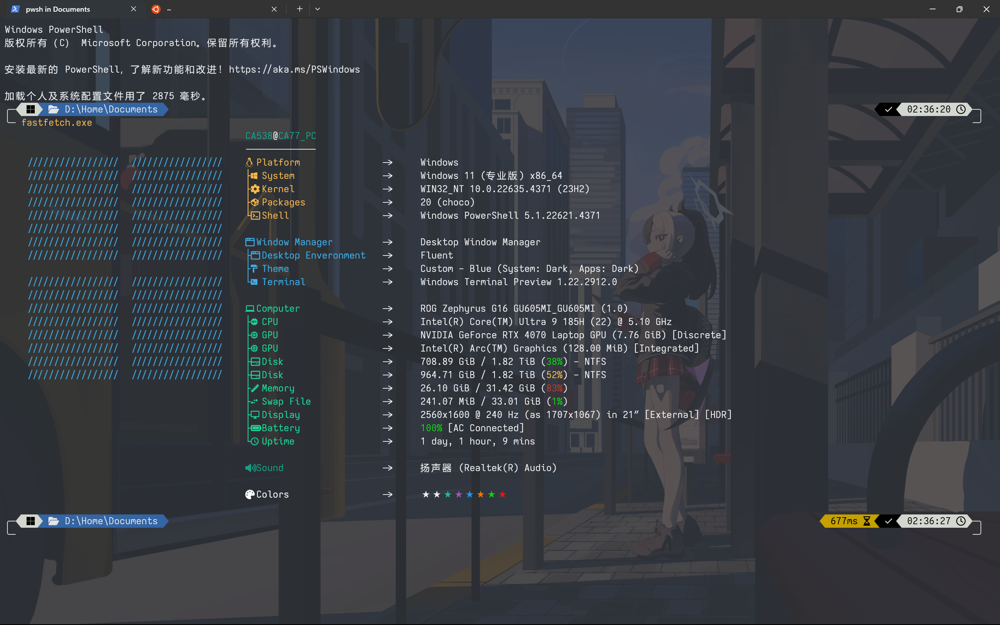
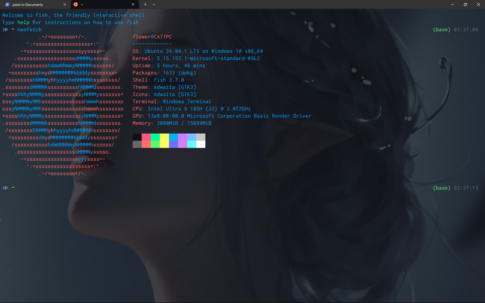

## Welcome to my github site 👋

_Organization: [Huazhong University of Science and Technology](https://hust.edu.cn/), [School of Physics](https://phys.hust.edu.cn/)_

_Position: graduate student_

-   🔭 I’m currently working on **AI4Phys** (Artificial Intelligence For Physics)
-   🌱 I’m currently learning CS basic subject (my undergraduate degree is physics not CS)

### 1. My open-source contribution

_i'm freshman in CS_

### 2. My frequently-used language

_statistical data graph powered by [anuraghazra](https://github.com/anuraghazra)_

### 3. Learning | Using

#### 3.1 Environment

Windows + Ubuntu 24.04(WSL)

#### 3.2 Developing Software Stack

  
    
Windows

  
  <svg width=50 viewBox="0 0 128 128"> <path fill="#0078d4" d="M67.328 67.331h60.669V128H67.328zm-67.325 0h60.669V128H.003zM67.328 0h60.669v60.669H67.328zM.003 0h60.669v60.669H.003z"></path> </svg>

  
    
C++

  
    <svg width=50 viewBox="0 0 128 128"> <path fill="#00599c" d="M118.766 95.82c.89-1.543 1.441-3.28 1.441-4.843V36.78c0-1.558-.55-3.297-1.441-4.84l-55.32 31.94Zm0 0"></path> <path fill="#004482" d="m68.36 126.586 46.933-27.094c1.352-.781 2.582-2.129 3.473-3.672l-55.32-31.94L8.12 95.82c.89 1.543 2.121 2.89 3.473 3.672l46.933 27.094c2.703 1.562 7.13 1.562 9.832 0Zm0 0"></path> <path fill="#659ad2" d="M118.766 31.941c-.891-1.546-2.121-2.894-3.473-3.671L68.359 1.172c-2.703-1.563-7.129-1.563-9.832 0L11.594 28.27C8.89 29.828 6.68 33.66 6.68 36.78v54.196c0 1.562.55 3.3 1.441 4.843L63.445 63.88Zm0 0"></path> <path fill="#fff" d="M63.445 26.035c-20.867 0-37.843 16.977-37.843 37.844s16.976 37.844 37.843 37.844c13.465 0 26.024-7.247 32.77-18.91L79.84 73.335c-3.38 5.84-9.66 9.465-16.395 9.465-10.433 0-18.922-8.488-18.922-18.922 0-10.434 8.49-18.922 18.922-18.922 6.73 0 13.017 3.629 16.39 9.465l16.38-9.477c-6.75-11.664-19.305-18.91-32.77-18.91zM92.88 57.57v4.207h-4.207v4.203h4.207v4.207h4.203V65.98h4.203v-4.203h-4.203V57.57H92.88zm15.766 0v4.207h-4.204v4.203h4.204v4.207h4.207V65.98h4.203v-4.203h-4.203V57.57h-4.207z"></path> </svg>

  
    
Visual Studio 2022

  
  <svg width=50 viewBox="0 0 128 128"> <defs><linearGradient id="a" x1="48" x2="48" y1="97.75" y2="2.25" gradientTransform="matrix(1 0 0 -1 0 97.75)" gradientUnits="userSpaceOnUse"><stop offset="0" stop-color="#fff"></stop><stop offset="1" stop-color="#fff" stop-opacity="0"></stop></linearGradient></defs><path fill="#52218a" d="M14.39 26.295a5.333 5.333 0 0 0-1.417.373l-9.694 4A5.333 5.333 0 0 0 0 35.561v56.88a5.333 5.333 0 0 0 3.28 4.893l9.693 4.066a5.333 5.333 0 0 0 5.521-.865l2.172-1.867a2.947 2.947 0 0 1-4.666-2.4V31.734a2.947 2.947 0 0 1 4.666-2.4l-2.172-1.799a5.333 5.333 0 0 0-4.103-1.24z"></path><path fill="#6c33af" d="M94.75.416A8 8 0 0 0 88 2.668l-82.666 91.4A3.08 3.08 0 0 1 0 92.002v.44a5.333 5.333 0 0 0 3.28 4.892l9.693 4.066a5.333 5.333 0 0 0 5.521-.865l2.172-1.867 99.08-81.24A5.053 5.053 0 0 1 128 21.334v-.307a8 8 0 0 0-4.533-7.213L97.094 1.121A8 8 0 0 0 94.75.416Z"></path><path fill="#854cc7" d="M14.871 26.238a5.333 5.333 0 0 0-1.898.43l-9.694 4A5.333 5.333 0 0 0 0 35.561v.441a3.08 3.08 0 0 1 5.334-2.066L88 125.334a8 8 0 0 0 9.094 1.547l26.373-12.694a8 8 0 0 0 4.533-7.212v-.307a5.053 5.053 0 0 1-8.254 3.906l-99.08-81.24-2.172-1.865a5.333 5.333 0 0 0-3.623-1.23z"></path><path fill="#b179f1" d="M94.75.416a8 8 0 0 0-5.674 1.469A4.693 4.693 0 0 1 96 6.015v116a4.693 4.693 0 0 1-8 3.319 8 8 0 0 0 9.094 1.547l26.373-12.68a8 8 0 0 0 4.533-7.213V21.016a8 8 0 0 0-4.533-7.215L97.094 1.12A8 8 0 0 0 94.75.416Zm-5.674 1.469A4.693 4.693 0 0 0 88 2.668a8 8 0 0 1 1.076-.783Z"></path><path fill="url(#a)" fill-rule="evenodd" d="M94.145.348a8 8 0 0 0-3.026.386A8 8 0 0 0 88 2.668L45.494 49.682 20.666 29.334l-2.172-1.865a5.333 5.333 0 0 0-4.814-1.108 3.4 3.4 0 0 0-.707.24l-9.694 4.067A5.333 5.333 0 0 0 0 35.162v57.679a5.333 5.333 0 0 0 3.28 4.493l9.693 4a3.4 3.4 0 0 0 .707.24 5.333 5.333 0 0 0 4.814-1.105l2.172-1.801 24.828-20.346L88 125.334a8 8 0 0 0 3.854 2.135 8 8 0 0 0 5.24-.588l26.373-12.68a8 8 0 0 0 4.533-7.213V21.016a8 8 0 0 0-4.533-7.215L97.094 1.12a8 8 0 0 0-2.95-.773ZM96 36.908v54.186L62.947 64.002Zm-80 8.787 16.547 18.307L16 82.309Z" opacity=".25"></path> </svg>

  
    
C#

  
  <svg viewBox="0 0 128 128" width=50><path fill="#9B4F96" d="M115.4 30.7L67.1 2.9c-.8-.5-1.9-.7-3.1-.7-1.2 0-2.3.3-3.1.7l-48 27.9c-1.7 1-2.9 3.5-2.9 5.4v55.7c0 1.1.2 2.4 1 3.5l106.8-62c-.6-1.2-1.5-2.1-2.4-2.7z"></path><path fill="#68217A" d="M10.7 95.3c.5.8 1.2 1.5 1.9 1.9l48.2 27.9c.8.5 1.9.7 3.1.7 1.2 0 2.3-.3 3.1-.7l48-27.9c1.7-1 2.9-3.5 2.9-5.4V36.1c0-.9-.1-1.9-.6-2.8l-106.6 62z"></path><path fill="#fff" d="M85.3 76.1C81.1 83.5 73.1 88.5 64 88.5c-13.5 0-24.5-11-24.5-24.5s11-24.5 24.5-24.5c9.1 0 17.1 5 21.3 12.5l13-7.5c-6.8-11.9-19.6-20-34.3-20-21.8 0-39.5 17.7-39.5 39.5s17.7 39.5 39.5 39.5c14.6 0 27.4-8 34.2-19.8l-12.9-7.6zM97 66.2l.9-4.3h-4.2v-4.7h5.1L100 51h4.9l-1.2 6.1h3.8l1.2-6.1h4.8l-1.2 6.1h2.4v4.7h-3.3l-.9 4.3h4.2v4.7h-5.1l-1.2 6h-4.9l1.2-6h-3.8l-1.2 6h-4.8l1.2-6h-2.4v-4.7H97zm4.8 0h3.8l.9-4.3h-3.8l-.9 4.3z"></path></svg>

  
    
Visual Studio Code + dotnet SDK

  
  <svg width=50 viewBox="0 0 128 128"> <mask id="a" width="128" height="128" x="0" y="0" maskUnits="userSpaceOnUse" style="mask-type:alpha"><path fill="#fff" fill-rule="evenodd" d="M90.767 127.126a7.968 7.968 0 0 0 6.35-.244l26.353-12.681a8 8 0 0 0 4.53-7.209V21.009a8 8 0 0 0-4.53-7.21L97.117 1.12a7.97 7.97 0 0 0-9.093 1.548l-50.45 46.026L15.6 32.013a5.328 5.328 0 0 0-6.807.302l-7.048 6.411a5.335 5.335 0 0 0-.006 7.888L20.796 64 1.74 81.387a5.336 5.336 0 0 0 .006 7.887l7.048 6.411a5.327 5.327 0 0 0 6.807.303l21.974-16.68 50.45 46.025a7.96 7.96 0 0 0 2.743 1.793Zm5.252-92.183L57.74 64l38.28 29.058V34.943Z" clip-rule="evenodd"></path></mask><g mask="url(#a)"><path fill="#0065A9" d="M123.471 13.82 97.097 1.12A7.973 7.973 0 0 0 88 2.668L1.662 81.387a5.333 5.333 0 0 0 .006 7.887l7.052 6.411a5.333 5.333 0 0 0 6.811.303l103.971-78.875c3.488-2.646 8.498-.158 8.498 4.22v-.306a8.001 8.001 0 0 0-4.529-7.208Z"></path><g filter="url(#b)"><path fill="#007ACC" d="m123.471 114.181-26.374 12.698A7.973 7.973 0 0 1 88 125.333L1.662 46.613a5.333 5.333 0 0 1 .006-7.887l7.052-6.411a5.333 5.333 0 0 1 6.811-.303l103.971 78.874c3.488 2.647 8.498.159 8.498-4.219v.306a8.001 8.001 0 0 1-4.529 7.208Z"></path></g><g filter="url(#c)"><path fill="#1F9CF0" d="M97.098 126.882A7.977 7.977 0 0 1 88 125.333c2.952 2.952 8 .861 8-3.314V5.98c0-4.175-5.048-6.266-8-3.313a7.977 7.977 0 0 1 9.098-1.549L123.467 13.8A8 8 0 0 1 128 21.01v85.982a8 8 0 0 1-4.533 7.21l-26.369 12.681Z"></path></g><path fill="url(#d)" fill-rule="evenodd" d="M90.69 127.126a7.968 7.968 0 0 0 6.349-.244l26.353-12.681a8 8 0 0 0 4.53-7.21V21.009a8 8 0 0 0-4.53-7.21L97.039 1.12a7.97 7.97 0 0 0-9.093 1.548l-50.45 46.026-21.974-16.68a5.328 5.328 0 0 0-6.807.302l-7.048 6.411a5.336 5.336 0 0 0-.006 7.888L20.718 64 1.662 81.386a5.335 5.335 0 0 0 .006 7.888l7.048 6.411a5.328 5.328 0 0 0 6.807.303l21.975-16.681 50.45 46.026a7.959 7.959 0 0 0 2.742 1.793Zm5.252-92.184L57.662 64l38.28 29.057V34.943Z" clip-rule="evenodd" opacity="0.25" style="mix-blend-mode:overlay"></path></g><defs><filter id="b" width="144.744" height="113.408" x="-8.41115" y="22.5944" color-interpolation-filters="sRGB" filterUnits="userSpaceOnUse"><feFlood flood-opacity="0" result="BackgroundImageFix"></feFlood><feColorMatrix in="SourceAlpha" result="hardAlpha" values="0 0 0 0 0 0 0 0 0 0 0 0 0 0 0 0 0 0 127 0"></feColorMatrix><feOffset></feOffset><feGaussianBlur stdDeviation="4.16667"></feGaussianBlur><feColorMatrix values="0 0 0 0 0 0 0 0 0 0 0 0 0 0 0 0 0 0 0.25 0"></feColorMatrix><feBlend in2="BackgroundImageFix" mode="overlay" result="effect1_dropShadow_1_36"></feBlend><feBlend in="SourceGraphic" in2="effect1_dropShadow_1_36" result="shape"></feBlend></filter><filter id="c" width="56.6667" height="144.007" x="79.6667" y="-8.0035" color-interpolation-filters="sRGB" filterUnits="userSpaceOnUse"><feFlood flood-opacity="0" result="BackgroundImageFix"></feFlood><feColorMatrix in="SourceAlpha" result="hardAlpha" values="0 0 0 0 0 0 0 0 0 0 0 0 0 0 0 0 0 0 127 0"></feColorMatrix><feOffset></feOffset><feGaussianBlur stdDeviation="4.16667"></feGaussianBlur><feColorMatrix values="0 0 0 0 0 0 0 0 0 0 0 0 0 0 0 0 0 0 0.25 0"></feColorMatrix><feBlend in2="BackgroundImageFix" mode="overlay" result="effect1_dropShadow_1_36"></feBlend><feBlend in="SourceGraphic" in2="effect1_dropShadow_1_36" result="shape"></feBlend></filter><linearGradient id="d" x1="63.9222" x2="63.9222" y1="0.329902" y2="127.67" gradientUnits="userSpaceOnUse"><stop stop-color="#fff"></stop><stop offset="1" stop-color="#fff" stop-opacity="0"></stop></linearGradient></defs> </svg>
  &nbsp;&nbsp;&nbsp;&nbsp;&nbsp;
  <svg viewBox="0 0 128 128" width=50> <path d="M30.762 77.907h-1.74v-9.963c0-.787.051-1.745.144-2.875h-.039c-.164.661-.313 1.14-.444 1.436l-5.061 11.402h-.848l-5.071-11.319c-.142-.316-.292-.825-.443-1.519h-.038c.054.594.084 1.558.084 2.895v9.943h-1.679V63.07h2.296l4.552 10.347c.343.779.565 1.372.673 1.776h.071c.298-.811.534-1.42.711-1.82l4.651-10.303h2.179v14.837h.002zM36.118 77.907h-1.692V67.312h1.692v10.595zm.292-14.394c0 .313-.11.573-.328.787a1.074 1.074 0 01-.788.322c-.303 0-.566-.104-.782-.311-.216-.208-.322-.473-.322-.799 0-.306.106-.567.322-.779.216-.212.479-.314.782-.314.31 0 .575.103.788.314.218.213.328.474.328.78M46.691 77.417c-.812.499-1.781.746-2.902.746-1.52 0-2.742-.504-3.676-1.511-.908-.978-1.364-2.24-1.364-3.786 0-1.736.496-3.141 1.497-4.209.996-1.069 2.334-1.603 4.018-1.603.92 0 1.737.18 2.452.538v1.741c-.791-.555-1.627-.831-2.525-.831-1.079 0-1.957.377-2.637 1.128-.709.77-1.068 1.798-1.068 3.082 0 1.232.328 2.209.979 2.929.653.717 1.523 1.076 2.621 1.076.926 0 1.794-.305 2.606-.911v1.611h-.001zM54.786 69.031c-.299-.23-.729-.341-1.296-.341-.689 0-1.269.308-1.737.93-.532.694-.796 1.656-.796 2.886v5.401H49.26V67.311h1.697v2.185h.041c.249-.773.634-1.368 1.148-1.79a2.535 2.535 0 011.623-.58c.452 0 .787.049 1.016.145v1.759l.001.001zM64.237 72.628c0-1.356-.306-2.393-.918-3.103-.594-.683-1.425-1.024-2.495-1.024-1.054 0-1.9.345-2.533 1.036-.668.739-1.002 1.781-1.002 3.134 0 1.268.317 2.263.96 2.973.638.714 1.497 1.072 2.575 1.072 1.115 0 1.969-.364 2.554-1.085.573-.708.859-1.707.859-3.003m1.739-.059c0 1.688-.477 3.045-1.427 4.061-.954 1.021-2.237 1.531-3.852 1.531-1.59 0-2.856-.51-3.784-1.531-.91-.983-1.366-2.283-1.366-3.898 0-1.844.516-3.264 1.552-4.273.958-.936 2.24-1.407 3.846-1.407 1.58 0 2.814.493 3.704 1.469.882.98 1.327 2.33 1.327 4.048M74.387 75.073c0 .868-.323 1.585-.973 2.159-.709.62-1.683.93-2.908.93-1.002 0-1.881-.21-2.628-.638V75.7c.83.675 1.748 1.015 2.754 1.015 1.343 0 2.016-.495 2.016-1.48a1.31 1.31 0 00-.445-1.023c-.298-.271-.878-.594-1.739-.974-.887-.388-1.52-.787-1.893-1.2-.448-.491-.673-1.129-.673-1.915 0-.879.352-1.611 1.046-2.194.697-.585 1.592-.877 2.691-.877.842 0 1.596.164 2.266.497v1.707c-.699-.504-1.498-.755-2.405-.755-.562 0-1.013.14-1.349.412a1.32 1.32 0 00-.51 1.068c0 .469.142.834.425 1.096.252.241.786.536 1.591.879.904.379 1.558.772 1.956 1.174.517.508.778 1.156.778 1.943M84.753 72.628c0-1.356-.307-2.393-.92-3.103-.594-.683-1.426-1.024-2.494-1.024-1.055 0-1.9.345-2.536 1.036-.667.739-1 1.781-1 3.134 0 1.268.319 2.263.954 2.973.646.714 1.506 1.072 2.582 1.072 1.117 0 1.968-.364 2.554-1.085.572-.708.86-1.707.86-3.003m1.742-.059c0 1.688-.481 3.045-1.433 4.061-.95 1.021-2.233 1.531-3.848 1.531-1.592 0-2.857-.51-3.786-1.531-.909-.983-1.366-2.283-1.366-3.898 0-1.844.521-3.264 1.551-4.273.958-.936 2.241-1.407 3.849-1.407 1.581 0 2.813.493 3.7 1.469.883.98 1.333 2.33 1.333 4.048M93.968 63.711a2.278 2.278 0 00-1.126-.278c-1.188 0-1.777.747-1.777 2.245v1.633h2.483v1.438h-2.483v9.158h-1.698v-9.158h-1.802v-1.438h1.802v-1.717c0-1.166.357-2.081 1.084-2.74.622-.573 1.383-.857 2.289-.857.524 0 .932.063 1.228.184v1.53zM100.662 77.801c-.4.229-.934.343-1.593.343-1.85 0-2.774-1.042-2.774-3.128V68.75h-1.818v-1.439h1.818v-2.585c.542-.171 1.105-.357 1.7-.55v3.135h2.667v1.439h-2.667v5.979c0 .71.116 1.218.359 1.513.245.305.646.454 1.211.454.423 0 .788-.113 1.097-.342v1.447zM8.978 119.262c0 .831-.295 1.548-.895 2.155a2.939 2.939 0 01-2.17.909 2.823 2.823 0 01-2.116-.909 3.009 3.009 0 01-.868-2.155c0-.854.289-1.575.868-2.171a2.832 2.832 0 012.116-.896c.85 0 1.574.301 2.17.907.6.607.895 1.327.895 2.16M46.953 121.702h-5.532L21.342 90.694a14.226 14.226 0 01-1.217-2.442h-.165c.144.831.216 2.613.216 5.343v28.107h-4.559V82.799h5.918l19.478 30.52c.775 1.211 1.306 2.079 1.575 2.601h.108c-.18-1.119-.274-3.027-.274-5.72V82.8h4.532v38.902h-.001zM76.186 121.702H55.567V82.799h19.724v4.123H60.123v12.941h14.054v4.124H60.123v13.591h16.063v4.124zM107.46 86.922H96.254v34.781h-4.558V86.922H80.468v-4.125h26.992v4.125z"></path><linearGradient id="dot-net-original-wordmark-a" gradientUnits="userSpaceOnUse" x1="62.394" y1="415.348" x2="62.782" y2="415.348" gradientTransform="matrix(0 149.735 149.735 0 -62135.543 -9336.014)"><stop offset="0" stop-color="#0994DC"></stop><stop offset=".35" stop-color="#66CEF5"></stop><stop offset=".35" stop-color="#66CEF5"></stop><stop offset=".846" stop-color="#127BCA"></stop><stop offset=".846" stop-color="#127BCA"></stop><stop offset="1" stop-color="#127BCA"></stop></linearGradient><path fill="url(#dot-net-original-wordmark-a)" d="M45.407 15.604c4.399 13.452 6.064 37.449 18.928 37.449.979 0 1.969-.095 2.962-.285-11.693-2.727-13.079-26.462-20.214-38.754a59.736 59.736 0 00-1.676 1.59"></path><linearGradient id="dot-net-original-wordmark-b" gradientUnits="userSpaceOnUse" x1="62.447" y1="415.34" x2="62.836" y2="415.34" gradientTransform="matrix(0 153.551 153.551 0 -63717.234 -9583.969)"><stop offset="0" stop-color="#0E76BC"></stop><stop offset=".36" stop-color="#36AEE8"></stop><stop offset=".36" stop-color="#36AEE8"></stop><stop offset=".846" stop-color="#00ADEF"></stop><stop offset=".846" stop-color="#00ADEF"></stop><stop offset="1" stop-color="#00ADEF"></stop></linearGradient><path fill="url(#dot-net-original-wordmark-b)" d="M47.083 14.014c7.135 12.292 8.521 36.027 20.214 38.754a18.54 18.54 0 002.762-.746c-10.496-5.143-13.397-28.192-21.5-39.289-.491.41-.984.837-1.476 1.281"></path><path fill="#14559A" d="M57.364 6.704c-.977 0-1.969.096-2.964.285-2.603.491-5.247 1.611-7.913 3.308a19.648 19.648 0 012.073 2.438c2.711-2.249 5.404-3.911 8.087-4.911a18.1 18.1 0 013.017-.838 9.23 9.23 0 00-2.3-.282"></path><linearGradient id="dot-net-original-wordmark-c" gradientUnits="userSpaceOnUse" x1="66.554" y1="416.985" x2="66.942" y2="416.985" gradientTransform="matrix(0 -122.178 -122.178 0 51016.945 8183.043)"><stop offset="0" stop-color="#1C63B7"></stop><stop offset=".5" stop-color="#33BDF2"></stop><stop offset="1" stop-color="#33BDF2" stop-opacity=".42"></stop></linearGradient><path fill="url(#dot-net-original-wordmark-c)" d="M78.251 47.282a47.07 47.07 0 003.228-2.829c-4.47-13.389-6.07-37.729-19.023-37.729-.926 0-1.861.086-2.792.259 11.798 2.934 13.309 28.605 18.587 40.299"></path><path fill="#3092C4" d="M59.664 6.984a9.28 9.28 0 00-2.301-.281l5.094.019c-.927 0-1.861.086-2.793.262"></path><path fill="#1969BC" d="M78.026 50.126a19.144 19.144 0 01-1.46-1.579c-2.179 1.543-4.351 2.713-6.507 3.475.767.375 1.572.653 2.426.826a10.22 10.22 0 002.067.205c2.421 0 4.334-.286 5.963-1.068-.897-.485-1.72-1.112-2.489-1.859"></path><linearGradient id="dot-net-original-wordmark-d" gradientUnits="userSpaceOnUse" x1="62.568" y1="415.281" x2="62.957" y2="415.281" gradientTransform="matrix(0 159.425 159.425 0 -66138.813 -9976.116)"><stop offset="0" stop-color="#166AB8"></stop><stop offset=".4" stop-color="#36AEE8"></stop><stop offset=".4" stop-color="#36AEE8"></stop><stop offset=".846" stop-color="#0798DD"></stop><stop offset=".846" stop-color="#0798DD"></stop><stop offset="1" stop-color="#0798DD"></stop></linearGradient><path fill="url(#dot-net-original-wordmark-d)" d="M56.646 7.825c10.569 5.528 11.487 30.56 19.92 40.723.565-.398 1.125-.82 1.684-1.265-5.279-11.695-6.788-37.368-18.585-40.3a18.21 18.21 0 00-3.019.842"></path><linearGradient id="dot-net-original-wordmark-e" gradientUnits="userSpaceOnUse" x1="62.648" y1="415.368" x2="63.037" y2="415.368" gradientTransform="matrix(0 169.528 169.528 0 -70353.656 -10621.372)"><stop offset="0" stop-color="#124379"></stop><stop offset=".39" stop-color="#1487CB"></stop><stop offset=".39" stop-color="#1487CB"></stop><stop offset=".78" stop-color="#165197"></stop><stop offset=".78" stop-color="#165197"></stop><stop offset="1" stop-color="#165197"></stop></linearGradient><path fill="url(#dot-net-original-wordmark-e)" d="M48.559 12.734c8.103 11.097 11.004 34.146 21.5 39.289 2.158-.762 4.328-1.932 6.507-3.475-8.433-10.163-9.352-35.195-19.92-40.723-2.683.998-5.376 2.66-8.087 4.909"></path><linearGradient id="dot-net-original-wordmark-f" gradientUnits="userSpaceOnUse" x1="1006.493" y1="-1588.315" x2="1008.801" y2="-1588.315" gradientTransform="matrix(4.038 0 0 -4.038 -4028.633 -6394.98)"><stop offset="0" stop-color="#33BDF2" stop-opacity=".698"></stop><stop offset="1" stop-color="#1DACD8"></stop></linearGradient><path fill="url(#dot-net-original-wordmark-f)" d="M40.222 15.28c-1.271 2.872-2.568 6.646-4.136 11.574 3.118-4.395 6.228-8.181 9.32-11.25a33.912 33.912 0 00-1.376-3.592 46.51 46.51 0 00-3.808 3.268"></path><path fill="#2B74B1" d="M45.157 11.184c-.373.267-.749.54-1.125.828a33.784 33.784 0 011.375 3.592 65.928 65.928 0 011.677-1.59 22.658 22.658 0 00-1.927-2.83"></path><path fill="#125A9E" d="M46.486 10.296c-.443.281-.884.577-1.331.887a22.376 22.376 0 011.928 2.833c.493-.446.985-.875 1.476-1.282a19.563 19.563 0 00-2.073-2.438"></path><linearGradient id="dot-net-original-wordmark-g" gradientUnits="userSpaceOnUse" x1="66.607" y1="417.481" x2="66.996" y2="417.481" gradientTransform="matrix(0 -119.018 -119.018 0 49793.875 7977.832)"><stop offset="0" stop-color="#136AB4"></stop><stop offset=".6" stop-color="#59CAF5" stop-opacity=".549"></stop><stop offset="1" stop-color="#59CAF5" stop-opacity=".235"></stop></linearGradient><path fill="url(#dot-net-original-wordmark-g)" d="M118.572 5.68c-5.977 23.05-18.461 41.565-28.927 46.232h-.021l-.565.241-.068.027-.161.062-.072.03-.261.092-.108.038-.13.043-.126.044-.112.037-.223.068-.095.025-.151.041-.102.028-.164.042-.201.044c.473.175.966.263 1.497.263 9.924 0 19.932-17.786 36.489-47.363h-6.501l.002.006z"></path><linearGradient id="dot-net-original-wordmark-h" gradientUnits="userSpaceOnUse" x1="998.304" y1="-1591.054" x2="1006.863" y2="-1591.054" gradientTransform="matrix(4.038 0 0 -4.038 -4028.633 -6394.98)"><stop offset="0" stop-color="#05A1E6" stop-opacity=".247"></stop><stop offset="1" stop-color="#05A1E6"></stop></linearGradient><path fill="url(#dot-net-original-wordmark-h)" d="M33.931 7.64l.018-.017.023-.015h.013l.161-.062.032-.016.041-.018.173-.062h.009l.381-.133.056-.015.164-.049.075-.024.164-.049.063-.016.545-.142.075-.017.159-.031.079-.024.16-.03h.037l.332-.062h.066l.153-.026.086-.016.146-.022.082-.015.357-.032a11.398 11.398 0 00-1.057-.054c-11.177 0-26.576 20.738-33.513 47.594h1.337a388.226 388.226 0 006.037-11.22c4.859-19.022 14.754-31.996 23.544-35.433"></path><path fill="#0D82CA" d="M40.222 15.28a46.677 46.677 0 013.808-3.268 17.903 17.903 0 00-.907-1.753c-1.022 1.241-1.956 2.877-2.901 5.021M41.141 7.797c.73.611 1.383 1.454 1.982 2.462a9.1 9.1 0 01.578-.646A11.294 11.294 0 0041 7.724l.119.057.022.016"></path><linearGradient id="dot-net-original-wordmark-i" gradientUnits="userSpaceOnUse" x1="66.556" y1="416.357" x2="66.944" y2="416.357" gradientTransform="matrix(0 -121.865 -121.865 0 50761.691 8162.488)"><stop offset="0" stop-color="#318ED5"></stop><stop offset="1" stop-color="#38A7E4"></stop></linearGradient><path fill="url(#dot-net-original-wordmark-i)" d="M10.388 43.072c10.191-19.64 15.02-32.069 23.544-35.433-8.789 3.439-18.686 16.412-23.544 35.433"></path><path fill="#127BCA" d="M43.7 9.614c-.199.203-.387.415-.578.646.32.536.618 1.119.909 1.753.376-.289.752-.561 1.125-.829a15.339 15.339 0 00-1.456-1.57"></path><linearGradient id="dot-net-original-wordmark-j" gradientUnits="userSpaceOnUse" x1="66.632" y1="416.408" x2="67.021" y2="416.408" gradientTransform="matrix(0 -118.46 -118.46 0 49352.684 7945.017)"><stop offset="0" stop-color="#05A1E6"></stop><stop offset="1" stop-color="#05A1E6" stop-opacity=".549"></stop></linearGradient><path fill="url(#dot-net-original-wordmark-j)" d="M15.015 54.203l-.185.022h-.035l-.157.016h-.026l-.374.025h-.039c10.314-.289 15.03-5.453 17.37-12.944 1.777-5.678 3.238-10.462 4.518-14.476-4.32 6.081-8.661 13.33-13.024 21.451-2.104 3.914-5.304 5.549-8.048 5.898"></path><linearGradient id="dot-net-original-wordmark-k" gradientUnits="userSpaceOnUse" x1="67.153" y1="416.523" x2="67.542" y2="416.523" gradientTransform="matrix(0 -100.1 -100.1 0 41721.719 6776.301)"><stop offset="0" stop-color="#1959A6"></stop><stop offset=".5" stop-color="#05A1E6"></stop><stop offset=".5" stop-color="#05A1E6"></stop><stop offset=".918" stop-color="#7EC5EA"></stop><stop offset="1" stop-color="#7EC5EA"></stop></linearGradient><path fill="url(#dot-net-original-wordmark-k)" d="M15.015 54.199c2.744-.35 5.944-1.983 8.048-5.899 4.363-8.118 8.706-15.369 13.022-21.451 1.571-4.929 2.866-8.701 4.138-11.573-8.604 8.189-17.24 21.806-25.208 38.919"></path><path fill="#05A1E6" d="M10.388 43.072a389.833 389.833 0 01-6.039 11.22h3.889a94.927 94.927 0 012.149-11.218"></path><linearGradient id="dot-net-original-wordmark-l" gradientUnits="userSpaceOnUse" x1="66.874" y1="415.998" x2="67.262" y2="415.998" gradientTransform="scale(-110.211 110.211) rotate(-80 -214.299 248.239)"><stop offset="0" stop-color="#165096"></stop><stop offset="1" stop-color="#0D82CA"></stop></linearGradient><path fill="url(#dot-net-original-wordmark-l)" d="M37.225 6.791l-.083.016-.146.021-.085.015-.153.027-.066.016-.332.058h-.037l-.162.032-.081.021-.157.031-.074.018-.546.142-.063.019-.165.049-.075.019-.163.048-.06.016-.379.133-.172.06-.072.03-.16.06-.053.026c-8.523 3.364-13.352 15.793-23.543 35.432a94.598 94.598 0 00-2.15 11.218h.546l3.739-.016h1.714l.374-.025h.024l.157-.016h.038l.185-.022c7.967-17.112 16.604-30.729 25.208-38.918.945-2.144 1.878-3.781 2.898-5.02-.597-1.008-1.25-1.853-1.98-2.465L41.13 7.8l-.122-.059-.12-.061-.117-.057-.138-.058-.108-.047-.226-.094-.096-.037-.168-.067-.091-.03-.234-.08h-.019l-.271-.077-.061-.019-.228-.064-.053-.015a6.956 6.956 0 00-.567-.124l-.059-.016-.246-.04-.048-.015-.291-.038h-.051l-.224-.025-.357.033"></path><linearGradient id="dot-net-original-wordmark-m" gradientUnits="userSpaceOnUse" x1="68.837" y1="418.884" x2="69.226" y2="418.884" gradientTransform="matrix(0 -56.721 -56.721 0 23857.477 3932.282)"><stop offset="0" stop-color="#05A1E6"></stop><stop offset=".874" stop-color="#0495D6"></stop><stop offset="1" stop-color="#0495D6"></stop></linearGradient><path fill="url(#dot-net-original-wordmark-m)" d="M95.226 18.441c-1.961 6.281-3.549 11.463-4.931 15.727 5.381-7.404 10.68-16.718 15.728-27.467-5.889 1.849-9.029 6.081-10.797 11.74"></path><linearGradient id="dot-net-original-wordmark-n" gradientUnits="userSpaceOnUse" x1="62.48" y1="414.361" x2="62.868" y2="414.361" gradientTransform="scale(-132.813 132.813) rotate(80 277.722 169.477)"><stop offset="0" stop-color="#38A7E4" stop-opacity=".329"></stop><stop offset=".962" stop-color="#0E88D3"></stop><stop offset=".962" stop-color="#0E88D3"></stop><stop offset="1" stop-color="#0E88D3"></stop></linearGradient><path fill="url(#dot-net-original-wordmark-n)" d="M90.465 51.52c-.274.14-.55.272-.82.393 10.466-4.668 22.951-23.183 28.927-46.233h-1.211c-13.733 24.53-18.149 40.952-26.896 45.84"></path><path fill="#079AE1" d="M83.631 49.459c2.277-2.779 4.132-7.504 6.665-15.292-2.921 4.012-5.861 7.462-8.804 10.274l-.015.025c.642 1.923 1.346 3.622 2.149 4.992"></path><path fill="#1969BC" d="M83.631 49.459c-.775.946-1.596 1.666-2.509 2.2-.2.117-.402.227-.608.326.964.52 2.016.868 3.193 1.007l.522.046h.031l.251.016h.852l.096-.016.188-.016h.091l.205-.022h.015l.063-.015.218-.034h.064l.245-.041h.039l.489-.104c-1.351-.493-2.481-1.66-3.455-3.32"></path><path fill="#1E5CB3" d="M64.335 53.053c.979 0 1.968-.096 2.961-.287.919-.167 1.84-.422 2.762-.744a10.093 10.093 0 004.494 1.031H64.335zM74.552 53.053c2.419 0 4.334-.287 5.962-1.068a8.8 8.8 0 003.193 1.007l.522.045h.031l.251.016h.301-10.26z"></path><path fill="#1D60B5" d="M84.812 53.053h.559l.096-.016.19-.016h.093l.203-.022h.017l.062-.015.218-.033.066-.015.246-.04h.039l.489-.104a4.28 4.28 0 001.498.263l-3.773.016-.003-.018z"></path><path fill="#175FAB" d="M81.482 44.467v-.016a46.856 46.856 0 01-3.228 2.83c-.561.445-1.12.867-1.686 1.265a19.14 19.14 0 001.461 1.579c.77.746 1.591 1.374 2.488 1.859.205-.1.408-.21.607-.326.915-.534 1.734-1.254 2.51-2.2-.803-1.37-1.507-3.069-2.148-4.992"></path><linearGradient id="dot-net-original-wordmark-o" gradientUnits="userSpaceOnUse" x1="62.071" y1="414.653" x2="62.459" y2="414.653" gradientTransform="matrix(0 123.742 123.742 0 -51209.754 -7675.189)"><stop offset="0" stop-color="#168CD4"></stop><stop offset=".5" stop-color="#1C87CC"></stop><stop offset="1" stop-color="#154B8D"></stop></linearGradient><path fill="url(#dot-net-original-wordmark-o)" d="M113.525 5.68h-6.096l-.966.047-.45.962c-5.046 10.749-10.346 20.063-15.727 27.468-2.53 7.786-4.387 12.511-6.664 15.291.973 1.661 2.106 2.829 3.452 3.324l.106-.023h.022l.074-.017.169-.042.1-.029.151-.04.094-.026.224-.068.112-.037.126-.046.129-.041.105-.04.263-.092.073-.027.161-.063.069-.025.565-.241h.019c.271-.12.546-.253.819-.393 8.75-4.888 13.166-21.31 26.898-45.84h-3.835l.007-.002z"></path><path fill="#7DCBEC" d="M37.583 6.758l.063.016.159.017h.054l.29.037.05.016.245.041.061.015.566.125.051.016.227.064.063.019.269.077.02.016.236.081.09.029.169.069.096.034.224.094.11.047.135.059.12.056.119.062a11.284 11.284 0 012.702 1.89c.305-.322.625-.61.958-.87-1.815-1.288-3.874-2.022-6.246-2.022-.275 0-.549.016-.829.037"></path><path fill="#5EC5ED" d="M43.7 9.614c.508.473.995 1.001 1.456 1.57.445-.31.887-.608 1.331-.887a13.917 13.917 0 00-1.831-1.553 8.418 8.418 0 00-.956.87"></path><g transform="matrix(5.048 0 0 -5.048 -9064.26 2270.61)"><linearGradient id="dot-net-original-wordmark-p" gradientUnits="userSpaceOnUse" x1="1807.241" y1="366.152" x2="1807.63" y2="366.152" gradientTransform="scale(30.857 -30.857) rotate(22.527 1888.666 -4214.769)"><stop offset="0" stop-color="#97D6EE"></stop><stop offset=".703" stop-color="#55C1EA"></stop><stop offset="1" stop-color="#55C1EA"></stop></linearGradient><path fill="url(#dot-net-original-wordmark-p)" d="M1803.007 448.452l.164.007c.47 0 .878-.145 1.237-.4.38.299.838.404 1.476.404h-3.086l.209-.011"></path></g><g transform="matrix(5.048 0 0 -5.048 -9064.26 2270.61)"><linearGradient id="dot-net-original-wordmark-q" gradientUnits="userSpaceOnUse" x1="1808.472" y1="365.322" x2="1808.861" y2="365.322" gradientTransform="scale(24.717 -24.717) rotate(-24.385 53.536 4189.483)"><stop offset="0" stop-color="#7ACCEC"></stop><stop offset="1" stop-color="#3FB7ED"></stop></linearGradient><path fill="url(#dot-net-original-wordmark-q)" d="M1805.884 448.463c-.637 0-1.096-.105-1.476-.404.126-.089.247-.192.362-.307.528.336 1.052.558 1.568.656.197.037.393.056.587.056h-1.041v-.001z"></path></g><linearGradient id="dot-net-original-wordmark-r" gradientUnits="userSpaceOnUse" x1="61.991" y1="414.706" x2="62.38" y2="414.706" gradientTransform="matrix(0 121.032 121.032 0 -50098.906 -7494.747)"><stop offset="0" stop-color="#1DA7E7"></stop><stop offset="1" stop-color="#37ABE7" stop-opacity="0"></stop></linearGradient><path fill="url(#dot-net-original-wordmark-r)" d="M90.295 34.172c1.384-4.267 2.968-9.447 4.933-15.73 1.771-5.661 4.905-9.894 10.792-11.741l.454-.962c-9.597.575-14.082 5.457-16.339 12.687-3.947 12.622-6.339 20.803-8.641 26.017 2.94-2.812 5.88-6.263 8.801-10.271"></path></svg>

  
    
Visual Studio 2022

  
  <svg width=50 viewBox="0 0 128 128"> <defs><linearGradient id="a" x1="48" x2="48" y1="97.75" y2="2.25" gradientTransform="matrix(1 0 0 -1 0 97.75)" gradientUnits="userSpaceOnUse"><stop offset="0" stop-color="#fff"></stop><stop offset="1" stop-color="#fff" stop-opacity="0"></stop></linearGradient></defs><path fill="#52218a" d="M14.39 26.295a5.333 5.333 0 0 0-1.417.373l-9.694 4A5.333 5.333 0 0 0 0 35.561v56.88a5.333 5.333 0 0 0 3.28 4.893l9.693 4.066a5.333 5.333 0 0 0 5.521-.865l2.172-1.867a2.947 2.947 0 0 1-4.666-2.4V31.734a2.947 2.947 0 0 1 4.666-2.4l-2.172-1.799a5.333 5.333 0 0 0-4.103-1.24z"></path><path fill="#6c33af" d="M94.75.416A8 8 0 0 0 88 2.668l-82.666 91.4A3.08 3.08 0 0 1 0 92.002v.44a5.333 5.333 0 0 0 3.28 4.892l9.693 4.066a5.333 5.333 0 0 0 5.521-.865l2.172-1.867 99.08-81.24A5.053 5.053 0 0 1 128 21.334v-.307a8 8 0 0 0-4.533-7.213L97.094 1.121A8 8 0 0 0 94.75.416Z"></path><path fill="#854cc7" d="M14.871 26.238a5.333 5.333 0 0 0-1.898.43l-9.694 4A5.333 5.333 0 0 0 0 35.561v.441a3.08 3.08 0 0 1 5.334-2.066L88 125.334a8 8 0 0 0 9.094 1.547l26.373-12.694a8 8 0 0 0 4.533-7.212v-.307a5.053 5.053 0 0 1-8.254 3.906l-99.08-81.24-2.172-1.865a5.333 5.333 0 0 0-3.623-1.23z"></path><path fill="#b179f1" d="M94.75.416a8 8 0 0 0-5.674 1.469A4.693 4.693 0 0 1 96 6.015v116a4.693 4.693 0 0 1-8 3.319 8 8 0 0 0 9.094 1.547l26.373-12.68a8 8 0 0 0 4.533-7.213V21.016a8 8 0 0 0-4.533-7.215L97.094 1.12A8 8 0 0 0 94.75.416Zm-5.674 1.469A4.693 4.693 0 0 0 88 2.668a8 8 0 0 1 1.076-.783Z"></path><path fill="url(#a)" fill-rule="evenodd" d="M94.145.348a8 8 0 0 0-3.026.386A8 8 0 0 0 88 2.668L45.494 49.682 20.666 29.334l-2.172-1.865a5.333 5.333 0 0 0-4.814-1.108 3.4 3.4 0 0 0-.707.24l-9.694 4.067A5.333 5.333 0 0 0 0 35.162v57.679a5.333 5.333 0 0 0 3.28 4.493l9.693 4a3.4 3.4 0 0 0 .707.24 5.333 5.333 0 0 0 4.814-1.105l2.172-1.801 24.828-20.346L88 125.334a8 8 0 0 0 3.854 2.135 8 8 0 0 0 5.24-.588l26.373-12.68a8 8 0 0 0 4.533-7.213V21.016a8 8 0 0 0-4.533-7.215L97.094 1.12a8 8 0 0 0-2.95-.773ZM96 36.908v54.186L62.947 64.002Zm-80 8.787 16.547 18.307L16 82.309Z" opacity=".25"></path> </svg>

  
    
Java

   
  <svg viewBox="0 0 128 128" width=50> <path fill="#0074BD" d="M47.617 98.12s-4.767 2.774 3.397 3.71c9.892 1.13 14.947.968 25.845-1.092 0 0 2.871 1.795 6.873 3.351-24.439 10.47-55.308-.607-36.115-5.969zm-2.988-13.665s-5.348 3.959 2.823 4.805c10.567 1.091 18.91 1.18 33.354-1.6 0 0 1.993 2.025 5.132 3.131-29.542 8.64-62.446.68-41.309-6.336z"></path><path fill="#EA2D2E" d="M69.802 61.271c6.025 6.935-1.58 13.17-1.58 13.17s15.289-7.891 8.269-17.777c-6.559-9.215-11.587-13.792 15.635-29.58 0 .001-42.731 10.67-22.324 34.187z"></path><path fill="#0074BD" d="M102.123 108.229s3.529 2.91-3.888 5.159c-14.102 4.272-58.706 5.56-71.094.171-4.451-1.938 3.899-4.625 6.526-5.192 2.739-.593 4.303-.485 4.303-.485-4.953-3.487-32.013 6.85-13.743 9.815 49.821 8.076 90.817-3.637 77.896-9.468zM49.912 70.294s-22.686 5.389-8.033 7.348c6.188.828 18.518.638 30.011-.326 9.39-.789 18.813-2.474 18.813-2.474s-3.308 1.419-5.704 3.053c-23.042 6.061-67.544 3.238-54.731-2.958 10.832-5.239 19.644-4.643 19.644-4.643zm40.697 22.747c23.421-12.167 12.591-23.86 5.032-22.285-1.848.385-2.677.72-2.677.72s.688-1.079 2-1.543c14.953-5.255 26.451 15.503-4.823 23.725 0-.002.359-.327.468-.617z"></path><path fill="#EA2D2E" d="M76.491 1.587S89.459 14.563 64.188 34.51c-20.266 16.006-4.621 25.13-.007 35.559-11.831-10.673-20.509-20.07-14.688-28.815C58.041 28.42 81.722 22.195 76.491 1.587z"></path><path fill="#0074BD" d="M52.214 126.021c22.476 1.437 57-.8 57.817-11.436 0 0-1.571 4.032-18.577 7.231-19.186 3.612-42.854 3.191-56.887.874 0 .001 2.875 2.381 17.647 3.331z"></path> </svg>

  
    
Jetbrains IntelliJ IDEA

  
  <svg viewBox="0 0 128 128" width=50> <defs> <linearGradient id="a" gradientUnits="userSpaceOnUse" x1="11.16" y1="59.21" x2="58.94" y2="56.78" gradientTransform="rotate(.104) scale(1.21905)"> <stop offset=".09" stop-color="#fc801d"></stop> <stop offset=".23" stop-color="#b07f61"></stop> <stop offset=".41" stop-color="#577db3"></stop> <stop offset=".53" stop-color="#1e7ce6"></stop> <stop offset=".59" stop-color="#087cfa"></stop> </linearGradient> <linearGradient id="b" gradientUnits="userSpaceOnUse" x1="89.05" y1="54.12" x2="73.12" y2="6.52" gradientTransform="rotate(.104) scale(1.21905)"> <stop offset="0" stop-color="#fe2857"></stop> <stop offset=".08" stop-color="#cb3979"></stop> <stop offset=".16" stop-color="#9e4997"></stop> <stop offset=".25" stop-color="#7557b2"></stop> <stop offset=".34" stop-color="#5362c8"></stop> <stop offset=".44" stop-color="#386cda"></stop>  <stop offset=".54" stop-color="#2373e8"></stop> <stop offset=".66" stop-color="#1478f2"></stop> <stop offset=".79" stop-color="#0b7bf8"></stop> <stop offset="1" stop-color="#087cfa"></stop> </linearGradient> <linearGradient id="c" gradientUnits="userSpaceOnUse" x1="18.72" y1="26.61" x2="78.8" y2="125.99" gradientTransform="rotate(.104) scale(1.21905)"> <stop offset="0" stop-color="#fe2857"></stop> <stop offset=".08" stop-color="#fe295f"></stop> <stop offset=".21" stop-color="#ff2d76"></stop> <stop offset=".3" stop-color="#ff318c"></stop> <stop offset=".38" stop-color="#ea3896"></stop>  <stop offset=".55" stop-color="#b248ae"></stop> <stop offset=".79" stop-color="#5a63d6"></stop> <stop offset="1" stop-color="#087cfa"></stop> </linearGradient> </defs> <path fill="url(#a)" d="M23.492 88.027 6.277 74.434 16.41 55.676l15.223 5.094Zm0 0"></path> <path fill="#087cfa" d="m121.988 36.68-2.105 67.78L74.8 122.517l-24.55-15.849Zm0 0"></path> <path fill="url(#b)" d="M121.988 36.68 99.68 58.44 71.035 23.297l14.14-15.899Zm0 0"></path> <path fill="url(#c)" d="m50.25 106.668-35.852 12.957 7.508-26.293 9.727-32.562L4.96 51.848 21.906 5.484l38.301 4.524L99.68 58.44Zm0 0"></path> <path fill="#000" d="M27.43 27.43h73.14v73.14H27.43Zm0 0"></path> <path fill="#fff" d="M36.547 86.746h27.43v4.574h-27.43Zm13.691-45.152v-4.996h-13.64v4.996h3.824v17.261h-3.824v5h13.64v-5h-3.816V41.594Zm13.078 22.648a10.802 10.802 0 0 1-5.351-1.219 12.299 12.299 0 0 1-3.559-2.875l3.766-4.207c.687.778 1.484 1.45 2.367 2a4.849 4.849 0 0 0 2.621.73 3.46 3.46 0 0 0 2.668-1.058 5.07 5.07 0 0 0 .977-3.449V36.57h6.093v17.86a12.384 12.384 0 0 1-.668 4.254 7.919 7.919 0 0 1-4.964 4.879 12.097 12.097 0 0 1-4.036.632"></path></svg>
  

  
    
Python 3.13

  <svg viewBox="0 0 128 128" width=50><linearGradient id="python-original-a" gradientUnits="userSpaceOnUse" x1="70.252" y1="1237.476" x2="170.659" y2="1151.089" gradientTransform="matrix(.563 0 0 -.568 -29.215 707.817)"><stop offset="0" stop-color="#5A9FD4"></stop><stop offset="1" stop-color="#306998"></stop></linearGradient><linearGradient id="python-original-b" gradientUnits="userSpaceOnUse" x1="209.474" y1="1098.811" x2="173.62" y2="1149.537" gradientTransform="matrix(.563 0 0 -.568 -29.215 707.817)"><stop offset="0" stop-color="#FFD43B"></stop><stop offset="1" stop-color="#FFE873"></stop></linearGradient><path fill="url(#python-original-a)" d="M63.391 1.988c-4.222.02-8.252.379-11.8 1.007-10.45 1.846-12.346 5.71-12.346 12.837v9.411h24.693v3.137H29.977c-7.176 0-13.46 4.313-15.426 12.521-2.268 9.405-2.368 15.275 0 25.096 1.755 7.311 5.947 12.519 13.124 12.519h8.491V67.234c0-8.151 7.051-15.34 15.426-15.34h24.665c6.866 0 12.346-5.654 12.346-12.548V15.833c0-6.693-5.646-11.72-12.346-12.837-4.244-.706-8.645-1.027-12.866-1.008zM50.037 9.557c2.55 0 4.634 2.117 4.634 4.721 0 2.593-2.083 4.69-4.634 4.69-2.56 0-4.633-2.097-4.633-4.69-.001-2.604 2.073-4.721 4.633-4.721z" transform="translate(0 10.26)"></path><path fill="url(#python-original-b)" d="M91.682 28.38v10.966c0 8.5-7.208 15.655-15.426 15.655H51.591c-6.756 0-12.346 5.783-12.346 12.549v23.515c0 6.691 5.818 10.628 12.346 12.547 7.816 2.297 15.312 2.713 24.665 0 6.216-1.801 12.346-5.423 12.346-12.547v-9.412H63.938v-3.138h37.012c7.176 0 9.852-5.005 12.348-12.519 2.578-7.735 2.467-15.174 0-25.096-1.774-7.145-5.161-12.521-12.348-12.521h-9.268zM77.809 87.927c2.561 0 4.634 2.097 4.634 4.692 0 2.602-2.074 4.719-4.634 4.719-2.55 0-4.633-2.117-4.633-4.719 0-2.595 2.083-4.692 4.633-4.692z" transform="translate(0 10.26)"></path><radialGradient id="python-original-c" cx="1825.678" cy="444.45" r="26.743" gradientTransform="matrix(0 -.24 -1.055 0 532.979 557.576)" gradientUnits="userSpaceOnUse"><stop offset="0" stop-color="#B8B8B8" stop-opacity=".498"></stop><stop offset="1" stop-color="#7F7F7F" stop-opacity="0"></stop></radialGradient><path opacity=".444" fill="url(#python-original-c)" d="M97.309 119.597c0 3.543-14.816 6.416-33.091 6.416-18.276 0-33.092-2.873-33.092-6.416 0-3.544 14.815-6.417 33.092-6.417 18.275 0 33.091 2.872 33.091 6.417z"></path> </svg>
  

  
    
Powershell

  <svg viewBox="0 0 128 128" width=50><linearGradient id="a" x1="96.306" x2="25.454" y1="35.144" y2="98.431" gradientTransform="matrix(1 0 0 -1 0 128)" gradientUnits="userSpaceOnUse"><stop offset="0" stop-color="#a9c8ff"></stop><stop offset="1" stop-color="#c7e6ff"></stop></linearGradient><path fill="url(#a)" fill-rule="evenodd" d="M7.2 110.5c-1.7 0-3.1-.7-4.1-1.9-1-1.2-1.3-2.9-.9-4.6l18.6-80.5c.8-3.4 4-6 7.4-6h92.6c1.7 0 3.1.7 4.1 1.9 1 1.2 1.3 2.9.9 4.6l-18.6 80.5c-.8 3.4-4 6-7.4 6H7.2z" clip-rule="evenodd" opacity=".8"></path><linearGradient id="b" x1="25.336" x2="94.569" y1="98.33" y2="36.847" gradientTransform="matrix(1 0 0 -1 0 128)" gradientUnits="userSpaceOnUse"><stop offset="0" stop-color="#2d4664"></stop><stop offset=".169" stop-color="#29405b"></stop><stop offset=".445" stop-color="#1e2f43"></stop><stop offset=".79" stop-color="#0c131b"></stop><stop offset="1"></stop></linearGradient><path fill="url(#b)" fill-rule="evenodd" d="M120.3 18.5H28.5c-2.9 0-5.7 2.3-6.4 5.2L3.7 104.3c-.7 2.9 1.1 5.2 4 5.2h91.8c2.9 0 5.7-2.3 6.4-5.2l18.4-80.5c.7-2.9-1.1-5.3-4-5.3z" clip-rule="evenodd"></path><path fill="#2C5591" fill-rule="evenodd" d="M64.2 88.3h22.3c2.6 0 4.7 2.2 4.7 4.9s-2.1 4.9-4.7 4.9H64.2c-2.6 0-4.7-2.2-4.7-4.9s2.1-4.9 4.7-4.9zM78.7 66.5c-.4.8-1.2 1.6-2.6 2.6L34.6 98.9c-2.3 1.6-5.5 1-7.3-1.4-1.7-2.4-1.3-5.7.9-7.3l37.4-27.1v-.6l-23.5-25c-1.9-2-1.7-5.3.4-7.4 2.2-2 5.5-2 7.4 0l28.2 30c1.7 1.9 1.8 4.5.6 6.4z" clip-rule="evenodd"></path><path fill="#FFF" fill-rule="evenodd" d="M77.6 65.5c-.4.8-1.2 1.6-2.6 2.6L33.6 97.9c-2.3 1.6-5.5 1-7.3-1.4-1.7-2.4-1.3-5.7.9-7.3l37.4-27.1v-.6l-23.5-25c-1.9-2-1.7-5.3.4-7.4 2.2-2 5.5-2 7.4 0l28.2 30c1.7 1.8 1.8 4.4.5 6.4zM63.5 87.8h22.3c2.6 0 4.7 2.1 4.7 4.6 0 2.6-2.1 4.6-4.7 4.6H63.5c-2.6 0-4.7-2.1-4.7-4.6 0-2.6 2.1-4.6 4.7-4.6z" clip-rule="evenodd"></path> </svg>
  

  

  
    
Visual Studio Code + Miniconda

  
  <svg width=50 viewBox="0 0 128 128"> <mask id="a" width="128" height="128" x="0" y="0" maskUnits="userSpaceOnUse" style="mask-type:alpha"><path fill="#fff" fill-rule="evenodd" d="M90.767 127.126a7.968 7.968 0 0 0 6.35-.244l26.353-12.681a8 8 0 0 0 4.53-7.209V21.009a8 8 0 0 0-4.53-7.21L97.117 1.12a7.97 7.97 0 0 0-9.093 1.548l-50.45 46.026L15.6 32.013a5.328 5.328 0 0 0-6.807.302l-7.048 6.411a5.335 5.335 0 0 0-.006 7.888L20.796 64 1.74 81.387a5.336 5.336 0 0 0 .006 7.887l7.048 6.411a5.327 5.327 0 0 0 6.807.303l21.974-16.68 50.45 46.025a7.96 7.96 0 0 0 2.743 1.793Zm5.252-92.183L57.74 64l38.28 29.058V34.943Z" clip-rule="evenodd"></path></mask><g mask="url(#a)"><path fill="#0065A9" d="M123.471 13.82 97.097 1.12A7.973 7.973 0 0 0 88 2.668L1.662 81.387a5.333 5.333 0 0 0 .006 7.887l7.052 6.411a5.333 5.333 0 0 0 6.811.303l103.971-78.875c3.488-2.646 8.498-.158 8.498 4.22v-.306a8.001 8.001 0 0 0-4.529-7.208Z"></path><g filter="url(#b)"><path fill="#007ACC" d="m123.471 114.181-26.374 12.698A7.973 7.973 0 0 1 88 125.333L1.662 46.613a5.333 5.333 0 0 1 .006-7.887l7.052-6.411a5.333 5.333 0 0 1 6.811-.303l103.971 78.874c3.488 2.647 8.498.159 8.498-4.219v.306a8.001 8.001 0 0 1-4.529 7.208Z"></path></g><g filter="url(#c)"><path fill="#1F9CF0" d="M97.098 126.882A7.977 7.977 0 0 1 88 125.333c2.952 2.952 8 .861 8-3.314V5.98c0-4.175-5.048-6.266-8-3.313a7.977 7.977 0 0 1 9.098-1.549L123.467 13.8A8 8 0 0 1 128 21.01v85.982a8 8 0 0 1-4.533 7.21l-26.369 12.681Z"></path></g><path fill="url(#d)" fill-rule="evenodd" d="M90.69 127.126a7.968 7.968 0 0 0 6.349-.244l26.353-12.681a8 8 0 0 0 4.53-7.21V21.009a8 8 0 0 0-4.53-7.21L97.039 1.12a7.97 7.97 0 0 0-9.093 1.548l-50.45 46.026-21.974-16.68a5.328 5.328 0 0 0-6.807.302l-7.048 6.411a5.336 5.336 0 0 0-.006 7.888L20.718 64 1.662 81.386a5.335 5.335 0 0 0 .006 7.888l7.048 6.411a5.328 5.328 0 0 0 6.807.303l21.975-16.681 50.45 46.026a7.959 7.959 0 0 0 2.742 1.793Zm5.252-92.184L57.662 64l38.28 29.057V34.943Z" clip-rule="evenodd" opacity="0.25" style="mix-blend-mode:overlay"></path></g><defs><filter id="b" width="144.744" height="113.408" x="-8.41115" y="22.5944" color-interpolation-filters="sRGB" filterUnits="userSpaceOnUse"><feFlood flood-opacity="0" result="BackgroundImageFix"></feFlood><feColorMatrix in="SourceAlpha" result="hardAlpha" values="0 0 0 0 0 0 0 0 0 0 0 0 0 0 0 0 0 0 127 0"></feColorMatrix><feOffset></feOffset><feGaussianBlur stdDeviation="4.16667"></feGaussianBlur><feColorMatrix values="0 0 0 0 0 0 0 0 0 0 0 0 0 0 0 0 0 0 0.25 0"></feColorMatrix><feBlend in2="BackgroundImageFix" mode="overlay" result="effect1_dropShadow_1_36"></feBlend><feBlend in="SourceGraphic" in2="effect1_dropShadow_1_36" result="shape"></feBlend></filter><filter id="c" width="56.6667" height="144.007" x="79.6667" y="-8.0035" color-interpolation-filters="sRGB" filterUnits="userSpaceOnUse"><feFlood flood-opacity="0" result="BackgroundImageFix"></feFlood><feColorMatrix in="SourceAlpha" result="hardAlpha" values="0 0 0 0 0 0 0 0 0 0 0 0 0 0 0 0 0 0 127 0"></feColorMatrix><feOffset></feOffset><feGaussianBlur stdDeviation="4.16667"></feGaussianBlur><feColorMatrix values="0 0 0 0 0 0 0 0 0 0 0 0 0 0 0 0 0 0 0.25 0"></feColorMatrix><feBlend in2="BackgroundImageFix" mode="overlay" result="effect1_dropShadow_1_36"></feBlend><feBlend in="SourceGraphic" in2="effect1_dropShadow_1_36" result="shape"></feBlend></filter><linearGradient id="d" x1="63.9222" x2="63.9222" y1="0.329902" y2="127.67" gradientUnits="userSpaceOnUse"><stop stop-color="#fff"></stop><stop offset="1" stop-color="#fff" stop-opacity="0"></stop></linearGradient></defs> </svg>
  &nbsp;&nbsp;&nbsp;&nbsp;&nbsp;
  <svg viewBox="0 0 128 128" width=50> <path d="M59.3 127.602c-11.206-1.075-21.253-4.403-29.288-9.7l-1.688-1.113-.406-3.133c-.45-3.488-.922-9.035-.918-10.86v-1.19l5.242-.043c2.883-.024 6.117-.133 7.188-.25 1.699-.18 2.035-.149 2.652.238 5.715 3.586 14.445 5.965 21.871 5.957 11.899-.008 22.414-4.395 30.902-12.89 3.754-3.759 5.817-6.583 8.07-11.06 6.188-12.273 6.321-26.316.372-38.601-5.89-12.16-17.375-21.094-30.5-23.719-3.383-.68-8.043-1.039-10.828-.84l-2.27.165.574-.813c.32-.445 2.426-2.7 4.684-5.008l4.106-4.195-1.688-1.57C64.988 6.75 61.691 4 59.219 2.168L57.102.602l.796-.188C59.473.043 68.664.156 71.953.586c27.024 3.531 48.594 23.16 54.45 49.555 1.917 8.629 1.956 18.187.117 27.117-2.325 11.27-8.235 22.383-16.442 30.91A64.013 64.013 0 0169.906 127.5c-2.547.238-8.594.293-10.605.102zm-39.987-18.344c-3.622-3.617-8.516-9.492-8.184-9.824.062-.063 1.43.156 3.035.48 2.438.496 7.922 1.328 8.75 1.328.125 0 .23 1.035.234 2.352.004 2.156.23 5.246.618 8.437.109.899.07 1.266-.13 1.266-.156 0-2.105-1.817-4.323-4.04zM27 96.336c0-1.941.504-7.723.691-7.926.09-.094.852.738 1.696 1.852.84 1.117 2.746 3.23 4.234 4.695l2.703 2.672H27zm-4.945.887c-4.032-.496-12.22-2.07-12.871-2.473-.2-.125.039-1.094.84-3.41 1.058-3.047 3.554-9.035 3.945-9.453.097-.102 1.414.457 2.926 1.246 1.515.789 3.71 1.844 4.886 2.351l2.133.914-.148 1.102c-.34 2.57-.614 6.047-.618 7.898-.003 1.094-.09 1.973-.187 1.954-.102-.02-.508-.079-.906-.13zM4.527 86.852a68.035 68.035 0 01-3.082-10.657C.7 72.5.723 72.473 3.02 74.285c1.062.84 3.097 2.32 4.52 3.285 1.42.97 2.585 1.801 2.585 1.844 0 .047-.445 1.047-.988 2.219a109.642 109.642 0 00-2.075 4.906c-.597 1.523-1.164 2.86-1.265 2.965-.098.105-.668-1.09-1.27-2.652zm17.34-6.235c-1.851-.851-5.21-2.566-5.668-2.89-.094-.067 2.383-4.149 3.645-6.004l.988-1.457.172.726c1.105 4.625 1.77 6.977 2.457 8.688.45 1.12.805 2.035.793 2.035-.016-.004-1.09-.496-2.387-1.098zM9.25 73.38c-2.602-1.817-6.95-5.238-7.223-5.68-.257-.418 8.602-9.004 9.293-9.004.114 0 1.075 1.14 2.133 2.532 1.063 1.394 2.48 3.164 3.156 3.933.676.77 1.23 1.45 1.23 1.512 0 .062-.85 1.387-1.894 2.941-1.039 1.551-2.246 3.45-2.675 4.211-.43.762-.918 1.387-1.09 1.387-.168 0-1.489-.824-2.93-1.832zM.242 61.824c.035-3.027 1.055-9.922 2.055-13.883.992-3.921.797-3.894 2.598-.332.867 1.723 2.058 3.934 2.64 4.918l1.059 1.782-1.828 1.566c-1.004.86-2.883 2.605-4.176 3.875C1.297 61.023.242 61.957.242 61.824zm19.38-.793c-1.903-2.27-4.177-5.422-4.056-5.617.164-.266 2.973-2.172 5.258-3.57 1.531-.938 1.649-.973 1.496-.457-.562 1.925-1.36 5.972-1.582 8.02-.144 1.316-.285 2.421-.316 2.452-.031.032-.39-.343-.8-.828zm-8.364-12.07c-2.5-4.356-5.387-10.586-5.051-10.895.54-.504 9.703-3.07 12.41-3.476l1.055-.16.531 3.215c.29 1.77.777 4.253 1.086 5.523l.559 2.312-1.98 1.125c-1.09.622-3.177 1.926-4.634 2.899l-2.648 1.77zm14.805-9.977a161.737 161.737 0 01-.708-4.062l-.203-1.36 1.23-.144c.68-.078 2.532-.215 4.118-.3l2.887-.153-.989 1.055c-1.632 1.742-3.488 4.082-4.695 5.93l-1.137 1.737zm-16.16-8.816c1.648-2.793 6.855-9.422 8.62-10.98l.52-.461v10.132l-2.11.41c-1.835.356-5.757 1.313-7.152 1.743-.426.133-.418.062.121-.844zm14.73-8.176c.043-3.324.14-6.105.219-6.183.27-.274 11.554 1.972 11.98 2.382.04.04-.3 1.301-.754 2.809-.457 1.512-1.02 3.57-1.254 4.574l-.426 1.836-3.398.15c-1.871.082-4.086.222-4.922.312l-1.523.164zm16.105 4.942c0-.11.957-3.567 1.465-5.286l.477-1.609 2.945 1.211c3.902 1.605 3.813 1.547 2.941 1.91-2.035.856-5.39 2.48-6.421 3.117-1.094.672-1.407.817-1.407.657zm10.848-9.688c-.863-.433-2.723-1.254-4.133-1.824l-2.566-1.035.25-.715c.316-.906 3.847-7.985 4.508-9.04l.496-.792 1.507 1.015c1.973 1.336 5.598 4.047 6.793 5.086l.95.825-2.52 2.875c-1.383 1.578-2.785 3.214-3.117 3.632l-.602.766zm-15.79-5.578a145.584 145.584 0 00-4.698-1.117l-1.57-.324 2.124-1.262a82.044 82.044 0 013.86-2.133c1.855-.937 7.449-3.242 7.57-3.121.04.039-.39.984-.96 2.098-.567 1.113-1.458 3-1.977 4.195-.52 1.191-1.004 2.234-1.079 2.312-.074.079-1.546-.214-3.27-.648zm0 0" fill="#3eb049"></path> </svg>
  

  
    
other ...

  <svg width=50 viewBox="0 0 128 128"> <mask id="a" width="128" height="128" x="0" y="0" maskUnits="userSpaceOnUse" style="mask-type:alpha"><path fill="#fff" fill-rule="evenodd" d="M90.767 127.126a7.968 7.968 0 0 0 6.35-.244l26.353-12.681a8 8 0 0 0 4.53-7.209V21.009a8 8 0 0 0-4.53-7.21L97.117 1.12a7.97 7.97 0 0 0-9.093 1.548l-50.45 46.026L15.6 32.013a5.328 5.328 0 0 0-6.807.302l-7.048 6.411a5.335 5.335 0 0 0-.006 7.888L20.796 64 1.74 81.387a5.336 5.336 0 0 0 .006 7.887l7.048 6.411a5.327 5.327 0 0 0 6.807.303l21.974-16.68 50.45 46.025a7.96 7.96 0 0 0 2.743 1.793Zm5.252-92.183L57.74 64l38.28 29.058V34.943Z" clip-rule="evenodd"></path></mask><g mask="url(#a)"><path fill="#0065A9" d="M123.471 13.82 97.097 1.12A7.973 7.973 0 0 0 88 2.668L1.662 81.387a5.333 5.333 0 0 0 .006 7.887l7.052 6.411a5.333 5.333 0 0 0 6.811.303l103.971-78.875c3.488-2.646 8.498-.158 8.498 4.22v-.306a8.001 8.001 0 0 0-4.529-7.208Z"></path><g filter="url(#b)"><path fill="#007ACC" d="m123.471 114.181-26.374 12.698A7.973 7.973 0 0 1 88 125.333L1.662 46.613a5.333 5.333 0 0 1 .006-7.887l7.052-6.411a5.333 5.333 0 0 1 6.811-.303l103.971 78.874c3.488 2.647 8.498.159 8.498-4.219v.306a8.001 8.001 0 0 1-4.529 7.208Z"></path></g><g filter="url(#c)"><path fill="#1F9CF0" d="M97.098 126.882A7.977 7.977 0 0 1 88 125.333c2.952 2.952 8 .861 8-3.314V5.98c0-4.175-5.048-6.266-8-3.313a7.977 7.977 0 0 1 9.098-1.549L123.467 13.8A8 8 0 0 1 128 21.01v85.982a8 8 0 0 1-4.533 7.21l-26.369 12.681Z"></path></g><path fill="url(#d)" fill-rule="evenodd" d="M90.69 127.126a7.968 7.968 0 0 0 6.349-.244l26.353-12.681a8 8 0 0 0 4.53-7.21V21.009a8 8 0 0 0-4.53-7.21L97.039 1.12a7.97 7.97 0 0 0-9.093 1.548l-50.45 46.026-21.974-16.68a5.328 5.328 0 0 0-6.807.302l-7.048 6.411a5.336 5.336 0 0 0-.006 7.888L20.718 64 1.662 81.386a5.335 5.335 0 0 0 .006 7.888l7.048 6.411a5.328 5.328 0 0 0 6.807.303l21.975-16.681 50.45 46.026a7.959 7.959 0 0 0 2.742 1.793Zm5.252-92.184L57.662 64l38.28 29.057V34.943Z" clip-rule="evenodd" opacity="0.25" style="mix-blend-mode:overlay"></path></g><defs><filter id="b" width="144.744" height="113.408" x="-8.41115" y="22.5944" color-interpolation-filters="sRGB" filterUnits="userSpaceOnUse"><feFlood flood-opacity="0" result="BackgroundImageFix"></feFlood><feColorMatrix in="SourceAlpha" result="hardAlpha" values="0 0 0 0 0 0 0 0 0 0 0 0 0 0 0 0 0 0 127 0"></feColorMatrix><feOffset></feOffset><feGaussianBlur stdDeviation="4.16667"></feGaussianBlur><feColorMatrix values="0 0 0 0 0 0 0 0 0 0 0 0 0 0 0 0 0 0 0.25 0"></feColorMatrix><feBlend in2="BackgroundImageFix" mode="overlay" result="effect1_dropShadow_1_36"></feBlend><feBlend in="SourceGraphic" in2="effect1_dropShadow_1_36" result="shape"></feBlend></filter><filter id="c" width="56.6667" height="144.007" x="79.6667" y="-8.0035" color-interpolation-filters="sRGB" filterUnits="userSpaceOnUse"><feFlood flood-opacity="0" result="BackgroundImageFix"></feFlood><feColorMatrix in="SourceAlpha" result="hardAlpha" values="0 0 0 0 0 0 0 0 0 0 0 0 0 0 0 0 0 0 127 0"></feColorMatrix><feOffset></feOffset><feGaussianBlur stdDeviation="4.16667"></feGaussianBlur><feColorMatrix values="0 0 0 0 0 0 0 0 0 0 0 0 0 0 0 0 0 0 0.25 0"></feColorMatrix><feBlend in2="BackgroundImageFix" mode="overlay" result="effect1_dropShadow_1_36"></feBlend><feBlend in="SourceGraphic" in2="effect1_dropShadow_1_36" result="shape"></feBlend></filter><linearGradient id="d" x1="63.9222" x2="63.9222" y1="0.329902" y2="127.67" gradientUnits="userSpaceOnUse"><stop stop-color="#fff"></stop><stop offset="1" stop-color="#fff" stop-opacity="0"></stop></linearGradient></defs> </svg>

  
    
Linux

  
  <svg viewBox="0 0 128 128" width = 50> <radialGradient id="linux-original-a" cx="-992.915" cy="-952.952" r="43.267" gradientTransform="matrix(.7 0 0 .35 782.303 444.575)" gradientUnits="userSpaceOnUse"><stop offset="0" stop-opacity=".502"></stop><stop offset="1" stop-opacity="0"></stop></radialGradient><path fill="url(#linux-original-a)" d="M117.641 111.137c0 8.362-13.557 15.14-30.28 15.14-16.722 0-30.279-6.778-30.279-15.14s13.556-15.14 30.278-15.14c16.723.001 30.281 6.779 30.281 15.14z"></path><radialGradient id="linux-original-b" cx="-770.661" cy="-951.636" r="43.267" gradientTransform="matrix(.719 0 0 .35 595.327 443.952)" gradientUnits="userSpaceOnUse"><stop offset="0" stop-opacity=".502"></stop><stop offset="1" stop-opacity="0"></stop></radialGradient><path fill="url(#linux-original-b)" d="M72.546 110.974c0 8.362-13.921 15.14-31.094 15.14s-31.093-6.778-31.093-15.14c0-8.361 13.921-15.14 31.093-15.14 17.173 0 31.094 6.779 31.094 15.14z"></path><path d="M108.095 81.343c-1.534 6.324-9.322 19.527-13.459 25.338-4.138 5.835-3.626 11.089-11.275 9.043-7.625-2.045-9.763-1.673-17.644-1.208-7.833.464-6.137-.233-11.042 1.976-4.882 2.208-21.27-26.78-22.595-32.173-1.301-5.393-1.93-4.743 1.464-10.577 3.395-5.834 3.883-11.6 8.368-18.667 4.487-7.09 9.671-10.693 9.299-16.109-1.464-20.108-2.626-30.15 6.301-34.8 8.507-4.417 15.621-1.79 18.434-.279 1.208.651 3.673 1.906 5.509 4.115 1.836 2.162 3.487 5.44 4.417 9.577 1.906 8.299-.791 5.556 1.371 15.064 2.139 9.484 6.485 14.133 11.787 21.642 5.299 7.508 10.832 19.898 9.065 27.058z"></path><path fill="#666" d="M57.644 32.088c1.394-.558 1.16-.632 2.089-2.655.744-1.557 1.398-2.227 1.375-4.598 0-2.325-.722-3.115-1.814-4.626-1.045-1.441-2.719-1.511-3.765-1.325-.604.093-1.395.86-1.93 2-.348.767-.628 1.744-.651 2.766-.07 2.743.163 3.79.791 5.649.743 2.185 2.556 3.325 3.905 2.789z"></path><path fill="#6D6D6D" d="M57.644 32.08c1.385-.554 1.15-.631 2.074-2.641.739-1.547 1.392-2.215 1.379-4.573.009-2.309-.698-3.133-1.771-4.585-1.065-1.403-2.705-1.456-3.743-1.276-.619.091-1.406.829-1.95 1.927a6.637 6.637 0 00-.673 2.755c-.068 2.724.176 3.775.794 5.624.732 2.173 2.55 3.3 3.89 2.769z"></path><path fill="#757575" d="M57.644 32.071c1.376-.551 1.141-.629 2.059-2.626.735-1.537 1.387-2.202 1.384-4.547.017-2.294-.676-3.15-1.731-4.544-1.082-1.364-2.688-1.401-3.719-1.227-.633.089-1.417.798-1.969 1.854-.401.725-.675 1.713-.698 2.745-.067 2.706.191 3.761.798 5.598.721 2.16 2.545 3.275 3.876 2.747z"></path><path fill="#7C7C7C" d="M57.644 32.063c1.367-.547 1.132-.628 2.044-2.611.729-1.528 1.381-2.191 1.389-4.522.026-2.278-.653-3.167-1.69-4.503-1.099-1.325-2.673-1.345-3.695-1.178-.648.088-1.429.769-1.989 1.783-.427.703-.697 1.697-.72 2.733-.066 2.687.205 3.747.802 5.573.707 2.147 2.537 3.248 3.859 2.725z"></path><path fill="#848484" d="M57.644 32.054c1.359-.544 1.123-.627 2.028-2.598.726-1.518 1.378-2.179 1.395-4.497.034-2.263-.629-3.185-1.649-4.462-1.117-1.287-2.658-1.29-3.672-1.129-.662.086-1.44.737-2.01 1.709-.453.683-.721 1.682-.744 2.723-.064 2.668.22 3.732.808 5.548.694 2.137 2.531 3.227 3.844 2.706z"></path><path fill="#8C8C8C" d="M57.644 32.046c1.35-.54 1.113-.626 2.013-2.583.721-1.507 1.373-2.167 1.4-4.472.043-2.248-.608-3.202-1.609-4.422-1.134-1.248-2.643-1.235-3.649-1.08-.676.085-1.45.707-2.029 1.637-.479.662-.744 1.667-.766 2.712-.063 2.65.233 3.718.81 5.522.683 2.125 2.526 3.203 3.83 2.686z"></path><path fill="#939393" d="M57.644 32.037c1.34-.536 1.104-.624 1.998-2.569.715-1.497 1.367-2.154 1.405-4.446.052-2.232-.584-3.22-1.567-4.381-1.152-1.209-2.625-1.18-3.625-1.032-.691.084-1.462.676-2.049 1.565-.505.641-.768 1.651-.791 2.702-.06 2.631.249 3.704.815 5.497.67 2.112 2.517 3.178 3.814 2.664z"></path><path fill="#9B9B9B" d="M57.644 32.028c1.333-.533 1.095-.624 1.983-2.554.71-1.488 1.361-2.143 1.41-4.421.061-2.217-.562-3.237-1.528-4.339-1.168-1.171-2.609-1.125-3.602-.983-.705.082-1.473.646-2.069 1.492-.531.619-.79 1.636-.813 2.691-.06 2.613.261 3.689.818 5.472.66 2.099 2.514 3.153 3.801 2.642z"></path><path fill="#A3A3A3" d="M57.644 32.02c1.323-.529 1.086-.622 1.968-2.54.706-1.478 1.356-2.13 1.415-4.396.069-2.202-.54-3.254-1.487-4.299-1.187-1.132-2.594-1.07-3.579-.934-.719.081-1.484.615-2.088 1.42-.557.598-.814 1.621-.836 2.681-.059 2.593.275 3.674.822 5.446.649 2.087 2.507 3.129 3.785 2.622z"></path><path fill="#aaa" d="M57.644 32.011c1.314-.525 1.077-.62 1.953-2.526.7-1.467 1.351-2.119 1.419-4.37.078-2.187-.516-3.272-1.445-4.258-1.205-1.094-2.58-1.015-3.556-.885-.733.079-1.496.584-2.109 1.347-.583.578-.837 1.606-.859 2.669-.057 2.576.289 3.661.826 5.422.638 2.075 2.5 3.105 3.771 2.601z"></path><path fill="#B2B2B2" d="M57.644 32.002c1.305-.522 1.067-.62 1.937-2.512.696-1.457 1.346-2.106 1.425-4.345.086-2.171-.493-3.29-1.404-4.217-1.223-1.055-2.563-.959-3.532-.836-.749.077-1.507.554-2.128 1.275-.61.556-.861 1.591-.883 2.659-.055 2.556.304 3.646.831 5.396.624 2.064 2.493 3.081 3.754 2.58z"></path><path fill="#BABABA" d="M57.644 31.994c1.296-.518 1.058-.618 1.922-2.497.692-1.448 1.341-2.095 1.43-4.32.096-2.156-.47-3.307-1.363-4.176-1.239-1.016-2.547-.903-3.508-.787-.763.075-1.518.522-2.148 1.202-.637.535-.885 1.576-.906 2.648-.054 2.538.317 3.632.834 5.371.611 2.051 2.486 3.055 3.739 2.559z"></path><path fill="#C1C1C1" d="M57.644 31.985c1.288-.515 1.049-.616 1.907-2.483.686-1.437 1.336-2.082 1.435-4.294.104-2.141-.448-3.324-1.322-4.135-1.257-.978-2.533-.849-3.486-.738-.776.074-1.529.492-2.168 1.13-.662.513-.907 1.56-.929 2.636-.052 2.519.333 3.618.839 5.346.599 2.039 2.481 3.031 3.724 2.538z"></path><path fill="#C9C9C9" d="M57.644 31.976c1.278-.511 1.04-.615 1.892-2.468.681-1.427 1.33-2.071 1.439-4.269.114-2.125-.424-3.342-1.281-4.094-1.274-.939-2.516-.794-3.462-.69-.79.072-1.54.462-2.188 1.058-.688.492-.931 1.544-.953 2.626-.05 2.5.346 3.603.843 5.32.588 2.027 2.475 3.007 3.71 2.517z"></path><path fill="#D1D1D1" d="M57.645 31.968c1.269-.508 1.029-.614 1.875-2.454.678-1.417 1.327-2.059 1.446-4.244.121-2.11-.402-3.359-1.241-4.053-1.292-.901-2.501-.739-3.438-.641-.806.07-1.552.431-2.208.985-.714.471-.955 1.529-.976 2.616-.049 2.481.36 3.588.847 5.295.575 2.014 2.467 2.983 3.695 2.496z"></path><path fill="#D8D8D8" d="M57.645 31.96c1.259-.504 1.02-.613 1.86-2.44.672-1.407 1.321-2.046 1.451-4.218.129-2.095-.38-3.376-1.199-4.013-1.311-.862-2.486-.683-3.416-.591-.819.069-1.563.399-2.228.913-.74.45-.978 1.514-.999 2.604-.048 2.463.374 3.575.851 5.27.565 2.001 2.462 2.957 3.68 2.475z"></path><path fill="#E0E0E0" d="M57.645 31.95c1.251-.5 1.011-.611 1.845-2.425.667-1.397 1.315-2.034 1.455-4.193.139-2.079-.356-3.395-1.159-3.972-1.327-.823-2.47-.628-3.392-.542-.833.067-1.573.369-2.247.841-.766.429-1.001 1.499-1.022 2.594-.047 2.445.389 3.561.855 5.245.553 1.988 2.455 2.932 3.665 2.452z"></path><path fill="#E8E8E8" d="M57.645 31.942c1.242-.497 1.002-.61 1.83-2.411.662-1.387 1.311-2.022 1.46-4.167.147-2.064-.334-3.412-1.118-3.931-1.345-.784-2.454-.573-3.369-.494a4.872 4.872 0 00-2.268.768c-.791.408-1.024 1.483-1.044 2.583-.045 2.426.403 3.546.858 5.219.541 1.978 2.45 2.909 3.651 2.433z"></path><path fill="#EFEFEF" d="M57.645 31.934c1.232-.494.992-.609 1.814-2.397.658-1.376 1.305-2.01 1.466-4.142.156-2.048-.312-3.429-1.077-3.89-1.362-.746-2.439-.518-3.345-.444a5.373 5.373 0 00-2.287.695c-.818.386-1.048 1.468-1.069 2.572-.044 2.408.417 3.532.863 5.194.528 1.965 2.442 2.884 3.635 2.412z"></path><path fill="#F7F7F7" d="M57.645 31.925c1.225-.49.984-.607 1.799-2.383.653-1.367 1.3-1.998 1.471-4.117.165-2.033-.289-3.447-1.036-3.849-1.38-.707-2.423-.462-3.322-.396a6.03 6.03 0 00-2.308.623c-.844.366-1.071 1.453-1.092 2.562-.042 2.388.431 3.518.868 5.168.516 1.954 2.436 2.861 3.62 2.392z"></path><path fill="#fff" d="M57.645 31.916c1.215-.486.974-.606 1.784-2.368.648-1.356 1.295-1.986 1.475-4.091.174-2.018-.266-3.464-.995-3.808-1.397-.669-2.407-.408-3.298-.348a6.878 6.878 0 00-2.326.551c-.871.344-1.095 1.438-1.116 2.551-.04 2.37.446 3.503.871 5.144.504 1.94 2.431 2.835 3.605 2.369z"></path><path d="M56.342 22.627c.698 0 1.581.465 1.999 1.092.442.628.767 1.511.767 2.511 0 1.488-.163 3.138-1.046 3.649-.279.163-.884.302-1.232.302-.79 0-.86-.512-1.604-1.279-.255-.279-1.023-1.627-1.023-2.743 0-.697-.163-1.697.441-2.581.42-.649.954-.951 1.698-.951zm-.186 1.247c.272-.421 1.363-.223 1.759.645.397.868.322 2.752.049 2.851-.718.223-.495-.818-1.115-1.76-.619-.892-.966-1.314-.693-1.736z"></path><path fill="#070707" d="M56.173 23.893c.269-.416 1.346-.22 1.737.636.392.856.318 2.717.049 2.814-.709.22-.489-.808-1.101-1.738-.611-.88-.954-1.296-.685-1.712z"></path><path fill="#0F0F0F" d="M56.191 23.91c.266-.411 1.329-.217 1.715.628.387.845.314 2.682.049 2.778-.701.217-.484-.797-1.088-1.715-.604-.869-.942-1.28-.676-1.691z"></path><path fill="#161616" d="M56.208 23.928c.263-.406 1.312-.215 1.692.62.382.834.311 2.647.048 2.742-.692.214-.477-.788-1.073-1.693-.595-.858-.929-1.263-.667-1.669z"></path><path fill="#1E1E1E" d="M56.226 23.945c.258-.399 1.293-.211 1.67.612.376.824.306 2.613.047 2.707-.683.211-.471-.776-1.059-1.67-.587-.848-.917-1.248-.658-1.649z"></path><path fill="#262626" d="M56.243 23.963c.255-.395 1.277-.208 1.648.604.371.812.301 2.577.046 2.67-.672.209-.464-.767-1.044-1.648-.58-.836-.905-1.231-.65-1.626z"></path><path fill="#2D2D2D" d="M56.26 23.981c.253-.39 1.26-.206 1.627.595.366.802.297 2.542.046 2.634-.665.206-.458-.756-1.031-1.627-.572-.823-.894-1.212-.642-1.602z"></path><path fill="#353535" d="M56.278 23.999c.249-.384 1.243-.203 1.604.587.361.791.293 2.507.046 2.598-.656.204-.452-.745-1.017-1.604-.565-.813-.882-1.197-.633-1.581z"></path><path fill="#3D3D3D" d="M56.295 24.017c.246-.378 1.226-.2 1.582.579.356.78.29 2.472.045 2.562-.646.201-.446-.735-1.002-1.581-.558-.802-.87-1.181-.625-1.56z"></path><path fill="#444" d="M56.313 24.034c.241-.373 1.208-.197 1.559.571.352.769.286 2.438.044 2.526-.637.198-.439-.725-.988-1.559-.549-.791-.857-1.164-.615-1.538z"></path><path fill="#4C4C4C" d="M56.33 24.052c.238-.368 1.19-.194 1.537.563.347.758.281 2.403.044 2.489-.628.195-.433-.714-.974-1.537-.543-.779-.845-1.147-.607-1.515z"></path><path fill="#545454" d="M56.347 24.07c.235-.362 1.174-.192 1.515.554.341.747.276 2.368.042 2.454-.619.191-.426-.705-.96-1.515-.533-.767-.831-1.13-.597-1.493z"></path><path fill="#5B5B5B" d="M56.365 24.088c.231-.357 1.157-.189 1.493.546.336.735.273 2.333.042 2.417-.609.189-.42-.694-.946-1.492-.526-.756-.82-1.114-.589-1.471z"></path><path fill="#636363" d="M56.383 24.106c.228-.352 1.139-.186 1.47.539.332.725.269 2.298.041 2.381-.6.187-.413-.684-.931-1.47-.518-.746-.808-1.098-.58-1.45z"></path><path fill="#6B6B6B" d="M56.4 24.124c.224-.347 1.122-.183 1.448.53.326.714.265 2.263.041 2.345-.591.184-.408-.673-.918-1.447-.51-.735-.795-1.082-.571-1.428z"></path><path fill="#727272" d="M56.417 24.141c.221-.341 1.104-.181 1.425.522.321.703.261 2.229.04 2.308-.582.181-.401-.663-.903-1.425-.502-.722-.783-1.064-.562-1.405z"></path><path fill="#7A7A7A" d="M56.434 24.159c.218-.336 1.087-.178 1.403.514.316.692.256 2.193.04 2.272-.574.178-.395-.653-.889-1.403-.494-.711-.771-1.047-.554-1.383z"></path><path fill="#828282" d="M56.452 24.177c.213-.331 1.07-.175 1.38.505.312.681.252 2.158.039 2.236-.564.175-.388-.642-.875-1.38-.486-.699-.758-1.031-.544-1.361z"></path><path fill="#898989" d="M56.47 24.194c.21-.325 1.053-.172 1.358.498.307.669.25 2.124.039 2.201-.555.172-.383-.632-.861-1.358-.479-.69-.746-1.015-.536-1.341z"></path><path fill="#919191" d="M56.487 24.212c.207-.32 1.035-.169 1.335.49.301.658.246 2.088.038 2.164-.546.17-.376-.621-.846-1.335-.471-.678-.734-.999-.527-1.319z"></path><path fill="#999" d="M56.504 24.23c.204-.314 1.018-.167 1.314.481.295.647.239 2.054.036 2.128-.536.167-.369-.611-.832-1.314-.462-.666-.721-.98-.518-1.295z"></path><path fill="#666" d="M72.056 32.391c3.487-.372 4.719-1.72 5.347-4.068.558-2.092.582-4.417-.976-7.137-1.465-2.603-2.301-3.022-4.417-3.185-3.254-.278-4.789 1.999-5.51 3.626-.767 1.767-.604 1.511-.558 3.743.047 2.348 1.37 3.002 2.185 4.467.813 1.442 3.534 2.577 3.929 2.554z"></path><path fill="#6D6D6D" d="M72.058 32.377c3.474-.365 4.719-1.729 5.332-4.058.549-2.106.576-4.419-.969-7.075-1.432-2.517-2.272-2.932-4.363-3.094-3.244-.278-4.824 1.896-5.547 3.511-.744 1.705-.606 1.523-.557 3.726.052 2.346 1.378 2.978 2.191 4.442.813 1.446 3.518 2.572 3.913 2.548z"></path><path fill="#757575" d="M72.059 32.364c3.461-.358 4.721-1.737 5.318-4.048.541-2.121.572-4.42-.962-7.013-1.398-2.431-2.243-2.842-4.308-3.002-3.235-.277-4.86 1.792-5.585 3.395-.719 1.643-.608 1.536-.556 3.708.057 2.346 1.385 2.953 2.196 4.419.813 1.449 3.503 2.565 3.897 2.541z"></path><path fill="#7C7C7C" d="M72.061 32.351c3.447-.352 4.721-1.745 5.303-4.038.532-2.136.567-4.423-.955-6.951-1.365-2.345-2.213-2.751-4.254-2.911-3.224-.275-4.894 1.69-5.622 3.28-.697 1.581-.611 1.548-.555 3.691.062 2.344 1.391 2.929 2.202 4.395.813 1.451 3.486 2.558 3.881 2.534z"></path><path fill="#848484" d="M72.063 32.337c3.434-.345 4.721-1.753 5.287-4.027.524-2.151.563-4.425-.947-6.889-1.333-2.259-2.186-2.661-4.201-2.819-3.214-.275-4.929 1.587-5.66 3.164-.672 1.518-.612 1.56-.554 3.674.068 2.343 1.399 2.904 2.209 4.37.815 1.455 3.471 2.552 3.866 2.527z"></path><path fill="#8C8C8C" d="M72.065 32.324c3.42-.338 4.721-1.762 5.272-4.018.516-2.165.558-4.426-.94-6.827-1.299-2.172-2.156-2.571-4.146-2.727-3.205-.273-4.964 1.484-5.697 3.048-.649 1.457-.615 1.573-.553 3.658.073 2.341 1.406 2.879 2.214 4.346.813 1.458 3.455 2.545 3.85 2.52z"></path><path fill="#939393" d="M72.066 32.311c3.407-.332 4.724-1.77 5.258-4.008.507-2.179.553-4.428-.934-6.765-1.266-2.086-2.125-2.48-4.09-2.636-3.194-.273-5 1.381-5.736 2.933-.625 1.394-.616 1.585-.552 3.64.078 2.34 1.413 2.855 2.221 4.322.813 1.461 3.439 2.538 3.833 2.514z"></path><path fill="#9B9B9B" d="M72.068 32.297c3.393-.326 4.723-1.778 5.243-3.998.498-2.194.547-4.43-.926-6.704-1.233-2-2.098-2.39-4.038-2.544-3.184-.271-5.034 1.277-5.773 2.817-.602 1.333-.619 1.598-.551 3.624.083 2.339 1.42 2.831 2.226 4.299.815 1.464 3.424 2.532 3.819 2.506z"></path><path fill="#A3A3A3" d="M72.069 32.284c3.381-.318 4.724-1.787 5.23-3.988.489-2.209.542-4.432-.921-6.641-1.2-1.914-2.068-2.301-3.982-2.453-3.174-.271-5.069 1.174-5.811 2.702-.579 1.269-.621 1.61-.551 3.606.089 2.337 1.427 2.805 2.233 4.274.815 1.468 3.408 2.525 3.802 2.5z"></path><path fill="#aaa" d="M72.072 32.27c3.366-.312 4.724-1.795 5.213-3.978.481-2.224.538-4.434-.912-6.58-1.167-1.828-2.04-2.209-3.929-2.361-3.164-.27-5.104 1.071-5.848 2.586-.555 1.208-.623 1.622-.549 3.589.093 2.336 1.433 2.781 2.239 4.25.814 1.473 3.39 2.52 3.786 2.494z"></path><path fill="#B2B2B2" d="M72.073 32.257c3.353-.305 4.725-1.803 5.199-3.967.472-2.238.533-4.436-.906-6.519-1.134-1.741-2.01-2.12-3.874-2.269-3.153-.269-5.138.968-5.886 2.47-.531 1.146-.625 1.635-.548 3.572.099 2.335 1.441 2.756 2.246 4.226.813 1.475 3.374 2.513 3.769 2.487z"></path><path fill="#BABABA" d="M72.075 32.243c3.34-.298 4.726-1.811 5.184-3.958.464-2.252.529-4.438-.898-6.456-1.101-1.656-1.981-2.03-3.82-2.178-3.144-.268-5.173.865-5.923 2.354-.507 1.084-.627 1.648-.547 3.555.104 2.334 1.448 2.732 2.251 4.202.813 1.48 3.358 2.508 3.753 2.481z"></path><path fill="#C1C1C1" d="M72.076 32.231c3.327-.292 4.727-1.82 5.17-3.948.455-2.268.524-4.439-.891-6.395-1.068-1.569-1.952-1.939-3.766-2.086-3.133-.267-5.21.761-5.962 2.239-.483 1.021-.627 1.66-.545 3.538.109 2.332 1.455 2.708 2.257 4.177.814 1.482 3.343 2.501 3.737 2.475z"></path><path fill="#C9C9C9" d="M72.078 32.217c3.313-.285 4.727-1.829 5.155-3.938.446-2.282.518-4.441-.884-6.332-1.035-1.483-1.922-1.849-3.711-1.995-3.124-.266-5.244.659-6 2.124-.46.959-.631 1.672-.545 3.521.115 2.331 1.461 2.682 2.263 4.153.814 1.485 3.327 2.494 3.722 2.467z"></path><path fill="#D1D1D1" d="M72.079 32.203c3.3-.278 4.728-1.836 5.141-3.928.438-2.296.513-4.443-.877-6.27-1.002-1.396-1.893-1.759-3.657-1.903-3.114-.265-5.279.555-6.037 2.008-.437.897-.633 1.685-.544 3.504.119 2.329 1.469 2.658 2.27 4.129.813 1.489 3.31 2.488 3.704 2.46z"></path><path fill="#D8D8D8" d="M72.081 32.19c3.286-.272 4.728-1.845 5.126-3.918.429-2.311.509-4.445-.87-6.208-.969-1.311-1.864-1.668-3.604-1.812-3.103-.263-5.314.453-6.074 1.893-.413.835-.634 1.697-.543 3.487.125 2.328 1.476 2.633 2.276 4.105.814 1.492 3.295 2.481 3.689 2.453z"></path><path fill="#E0E0E0" d="M72.083 32.176c3.273-.264 4.729-1.853 5.111-3.907.42-2.326.504-4.447-.863-6.147-.936-1.224-1.835-1.578-3.548-1.72-3.094-.262-5.349.349-6.112 1.776-.389.773-.637 1.709-.542 3.47.13 2.327 1.482 2.609 2.281 4.082.814 1.495 3.279 2.475 3.673 2.446z"></path><path fill="#E8E8E8" d="M72.085 32.164c3.259-.259 4.729-1.862 5.097-3.897.411-2.341.498-4.449-.856-6.084-.903-1.138-1.805-1.488-3.495-1.628-3.083-.262-5.384.246-6.149 1.661-.366.711-.639 1.722-.541 3.453.135 2.325 1.489 2.583 2.287 4.057.814 1.495 3.262 2.465 3.657 2.438z"></path><path fill="#EFEFEF" d="M72.086 32.149c3.247-.251 4.73-1.87 5.082-3.887.404-2.355.495-4.451-.848-6.022-.87-1.052-1.776-1.398-3.441-1.538-3.072-.26-5.418.143-6.187 1.545-.342.649-.641 1.734-.54 3.436.141 2.324 1.497 2.56 2.294 4.033.813 1.502 3.246 2.463 3.64 2.433z"></path><path fill="#F7F7F7" d="M72.088 32.136c3.233-.244 4.731-1.878 5.067-3.877.395-2.369.49-4.453-.841-5.96-.837-.965-1.748-1.308-3.386-1.445-3.062-.26-5.455.04-6.225 1.429-.318.587-.642 1.748-.539 3.419.146 2.323 1.504 2.535 2.3 4.009.813 1.504 3.23 2.455 3.624 2.425z"></path><path fill="#fff" d="M72.089 32.123c3.221-.238 4.732-1.887 5.053-3.868.386-2.384.485-4.455-.834-5.898-.803-.879-1.718-1.218-3.332-1.354-3.053-.258-5.488-.062-6.262 1.314-.295.524-.645 1.759-.538 3.402.151 2.321 1.511 2.51 2.306 3.985.813 1.507 3.213 2.448 3.607 2.419z"></path><path d="M71.778 22.534c1.743 0 2.766 1.558 3.114 3.557.14.907-.07 1.953-.627 2.674-.628.836-1.744 1.348-2.649 1.348-.86 0-1.837.14-2.348-.558-.511-.72-.628-2.325-.628-3.464 0-1.278.373-2.185 1.023-2.906.487-.535 1.37-.651 2.115-.651zm.111.718c.316-.211.843 0 1.45.685.658.738.948 1.317.158 1.739-.606.316-.79-.633-1.16-1.028-.579-.632-1.08-.975-.448-1.396z"></path><path fill="#070707" d="M71.901 23.271c.311-.209.832 0 1.428.675.648.727.925 1.298.156 1.712-.593.316-.776-.623-1.139-1.012-.57-.622-1.063-.957-.445-1.375z"></path><path fill="#0F0F0F" d="M71.914 23.29c.303-.209.818 0 1.407.665.637.715.901 1.278.152 1.687-.581.314-.761-.614-1.118-.997-.56-.612-1.047-.941-.441-1.355z"></path><path fill="#161616" d="M71.927 23.308c.296-.207.806 0 1.385.655.629.705.878 1.258.151 1.661-.568.314-.748-.604-1.097-.981-.554-.601-1.032-.924-.439-1.335z"></path><path fill="#1E1E1E" d="M71.94 23.327c.291-.206.793 0 1.363.645.62.693.855 1.239.148 1.635-.555.313-.732-.595-1.076-.966-.544-.591-1.014-.906-.435-1.314z"></path><path fill="#262626" d="M71.953 23.346c.283-.204.78 0 1.341.634.61.684.833 1.219.147 1.609-.543.312-.719-.584-1.055-.951-.536-.579-.999-.887-.433-1.292z"></path><path fill="#2D2D2D" d="M71.966 23.365c.277-.203.769 0 1.32.624.6.672.808 1.2.144 1.584-.53.31-.704-.576-1.034-.936-.528-.57-.984-.871-.43-1.272z"></path><path fill="#353535" d="M71.979 23.384c.271-.202.755 0 1.298.614.589.661.785 1.18.142 1.558-.517.309-.688-.567-1.013-.921-.518-.56-.968-.854-.427-1.251z"></path><path fill="#3D3D3D" d="M71.992 23.403c.264-.201.743 0 1.276.603.581.651.763 1.162.14 1.533-.504.309-.674-.557-.992-.905-.511-.55-.952-.837-.424-1.231z"></path><path fill="#444" d="M72.004 23.422c.258-.199.731 0 1.256.594.571.639.738 1.141.137 1.506-.492.308-.66-.548-.971-.89-.502-.539-.936-.819-.422-1.21z"></path><path fill="#4C4C4C" d="M72.017 23.441c.251-.198.719 0 1.234.583.561.628.716 1.122.135 1.481-.479.306-.646-.539-.95-.875-.494-.529-.92-.802-.419-1.189z"></path><path fill="#545454" d="M72.03 23.46c.245-.197.706 0 1.213.573.55.617.691 1.103.132 1.455-.466.305-.631-.529-.929-.86-.485-.518-.904-.785-.416-1.168z"></path><path fill="#5B5B5B" d="M72.043 23.479c.238-.196.694 0 1.192.563.541.606.667 1.083.129 1.429-.454.305-.617-.52-.908-.844-.477-.509-.888-.768-.413-1.148z"></path><path fill="#636363" d="M72.056 23.498c.231-.195.681 0 1.169.553.532.595.646 1.063.128 1.404-.44.303-.602-.511-.887-.83-.468-.498-.872-.751-.41-1.127z"></path><path fill="#6B6B6B" d="M72.069 23.517c.224-.193.668 0 1.148.542.521.585.622 1.044.125 1.378-.428.303-.586-.501-.866-.814-.46-.488-.856-.733-.407-1.106z"></path><path fill="#727272" d="M72.082 23.535c.218-.191.656 0 1.127.533.512.574.599 1.024.123 1.352-.416.302-.573-.492-.846-.798-.451-.478-.84-.717-.404-1.087z"></path><path fill="#7A7A7A" d="M72.095 23.555c.211-.19.643 0 1.104.522.502.563.576 1.004.121 1.326-.403.301-.559-.482-.825-.783-.441-.468-.823-.7-.4-1.065z"></path><path fill="#828282" d="M72.108 23.574c.205-.189.63 0 1.083.512.493.551.552.985.119 1.299-.39.3-.544-.472-.804-.767-.434-.457-.808-.682-.398-1.044z"></path><path fill="#898989" d="M72.121 23.592c.198-.188.618 0 1.062.502.482.541.528.965.116 1.274-.378.299-.53-.463-.784-.752-.425-.447-.792-.664-.394-1.024z"></path><path fill="#919191" d="M72.133 23.611c.193-.187.606 0 1.041.492.473.53.505.946.114 1.249-.364.298-.515-.454-.761-.737-.418-.437-.777-.648-.394-1.004z"></path><path fill="#999" d="M72.147 23.631c.185-.186.592 0 1.018.481.464.519.482.926.112 1.223-.353.297-.501-.444-.742-.722-.407-.426-.759-.631-.388-.982z"></path><path d="M63.141 24.293c.546-.211.972-.223 1.817.334 1.022.674.551 1.694-.251 1.485-.693-.179-.78-.22-1.417-.351-1.002-.207-1.175-1.071-.149-1.468z"></path><path fill="#050505" d="M63.162 24.335c.536-.204.96-.212 1.793.331.99.648.534 1.618-.26 1.415-.688-.177-.757-.212-1.383-.34-.986-.205-1.157-1.025-.15-1.406z"></path><path fill="#0A0A0A" d="M63.184 24.376c.524-.195.947-.201 1.77.328.957.623.517 1.543-.269 1.343-.684-.174-.733-.203-1.349-.329-.971-.2-1.14-.977-.152-1.342z"></path><path fill="#0F0F0F" d="M63.205 24.417c.512-.187.934-.189 1.746.324.924.598.5 1.468-.277 1.271-.679-.171-.71-.195-1.315-.317-.956-.194-1.122-.928-.154-1.278z"></path><path fill="#141414" d="M63.226 24.457c.501-.178.922-.178 1.721.321.893.572.484 1.393-.284 1.2-.676-.168-.688-.187-1.281-.306-.941-.19-1.106-.879-.156-1.215z"></path><path fill="#191919" d="M63.247 24.499c.491-.171.91-.168 1.697.317.86.546.468 1.317-.292 1.129-.671-.166-.666-.179-1.247-.295-.926-.186-1.088-.831-.158-1.151z"></path><path fill="#1E1E1E" d="M63.269 24.539c.478-.163.896-.156 1.672.314.828.521.451 1.242-.299 1.058-.667-.163-.643-.171-1.213-.285-.912-.179-1.072-.782-.16-1.087z"></path><path fill="#232323" d="M63.29 24.58c.467-.154.884-.145 1.649.312.795.496.434 1.167-.308.986-.664-.16-.62-.163-1.18-.273-.896-.176-1.053-.735-.161-1.025z"></path><path fill="#282828" d="M63.311 24.621c.456-.146.872-.135 1.625.308.762.47.417 1.091-.316.916-.659-.157-.596-.155-1.145-.263-.882-.171-1.036-.686-.164-.961z"></path><path fill="#2D2D2D" d="M63.332 24.662c.445-.139.86-.124 1.602.304.731.445.401 1.016-.325.843-.654-.154-.572-.146-1.11-.25-.867-.165-1.02-.638-.167-.897z"></path><path fill="#333" d="M63.354 24.703c.433-.13.847-.112 1.577.301.698.418.384.94-.333.772-.65-.152-.55-.138-1.077-.24-.852-.16-1.001-.589-.167-.833z"></path><path fill="#383838" d="M63.375 24.743c.422-.122.834-.101 1.553.298.667.394.368.865-.34.701-.646-.148-.527-.13-1.043-.229-.838-.156-.984-.54-.17-.77z"></path><path fill="#3D3D3D" d="M63.396 24.784c.411-.113.822-.09 1.53.295.633.368.352.791-.349.63-.642-.146-.504-.122-1.008-.218-.824-.152-.967-.492-.173-.707z"></path><path fill="#424242" d="M63.418 24.826c.399-.106.81-.08 1.505.291.601.343.334.715-.357.558-.638-.143-.481-.114-.974-.207-.809-.146-.951-.444-.174-.642z"></path><path fill="#474747" d="M63.439 24.866c.388-.098.796-.068 1.481.288.569.317.318.64-.365.487-.634-.14-.457-.105-.94-.196-.794-.141-.933-.395-.176-.579z"></path><path fill="#4C4C4C" d="M63.46 24.908c.377-.089.785-.057 1.457.284.536.292.302.564-.373.416-.629-.138-.434-.097-.905-.185-.78-.136-.916-.347-.179-.515z"></path><path fill="#515151" d="M63.482 24.948c.365-.081.771-.046 1.432.281.504.266.285.489-.381.345-.625-.135-.411-.089-.871-.174-.764-.131-.898-.298-.18-.452z"></path><path fill="#565656" d="M63.503 24.989c.354-.073.758-.035 1.408.278.472.241.269.414-.389.273-.621-.132-.388-.081-.837-.162-.749-.127-.881-.251-.182-.389z"></path><path fill="#5B5B5B" d="M63.524 25.03c.343-.065.747-.023 1.385.275.438.215.25.338-.398.202-.617-.129-.364-.073-.803-.151-.734-.123-.863-.203-.184-.326z"></path><path fill="#606060" d="M63.545 25.071c.332-.057.734-.013 1.361.271.407.189.235.263-.406.13-.612-.126-.341-.064-.769-.14-.719-.117-.846-.153-.186-.261z"></path><path fill="#666" d="M63.567 25.111c.32-.049.72-.001 1.336.268.375.164.219.188-.414.059-.607-.124-.318-.056-.734-.129-.705-.111-.829-.104-.188-.198zM61.363 43.13c-3.022.117-7.811-8.345-7.927-4.834-.093 2.975.07 2.929.07 5.811 0 1.93-.883 2.069-2.79 4.975-.977 1.535-1.743 3.185-2.348 4.858-.372 1-.72 2.046-1 3.069l-.441 1.557c-.953 3.51-4.347 7.835-5.137 11.345-.792 3.487-1.72 5.718-1.604 10.391.117 4.673.163 3.324 1.581 4.487 1.395 1.163 2.836 2.255 5.044 4.208 2.325 2.022 7.16 5.556 7.811 6.648.697 1.116.674 3.627.255 4.44-.418.79-4.068 1.232-4.045 1.232-.023 0 3.185 4.416 3.813 5.043.604.604 3.208 3.511 13.808 1.535 5.975-1.116 10.6-4.463 13.948-7.695 4.323-4.208 2.138-5.416 2.696-7.532.814-3.045 3.464-4.184 4.068-7.625.07-.488.232-.86.674-1.58.674-1.023.512-3.046.512-4.905 0-4.835-.559-9.763-1.674-13.389-1.023-3.395-2.649-5.765-4.045-8.834-2.789-6.114-2.649-8.857-5.137-12.762-2.836-4.51-1.441-7.508-5.207-7.323-4.696.255-8.485 6.694-12.925 6.88z"></path><path fill="#6D6D6D" d="M61.357 43.481c-2.996.114-7.666-8.237-7.827-4.901-.102 2.827.032 2.802.01 5.568-.049 1.895-.954 2.143-2.818 4.998-.972 1.538-1.703 3.168-2.257 4.804-.313 1.05-.504 2.073-.785 3.075-.135.53-.484 1.029-.706 1.628-1.051 3.481-4.374 7.807-5.153 11.261-.796 3.49-1.734 5.713-1.602 10.377.118 4.52.127 3.286 1.541 4.46 1.383 1.168 2.854 2.282 5.056 4.23 2.319 2.017 7.18 5.559 7.827 6.647.694 1.112.688 3.654.273 4.463-.416.787-4.062 1.251-4.039 1.251-.023 0 3.168 4.38 3.796 5.007.604.604 3.196 3.49 13.779 1.519 5.98-1.115 10.694-4.44 13.908-7.702 4.128-4.12 1.972-5.415 2.527-7.519.811-3.041 3.64-4.186 4.243-7.621.07-.487.243-.857.683-1.575.676-1.034.504-3.05.511-4.903.021-4.852-.551-9.762-1.667-13.377-1.023-3.384-2.648-5.752-4.04-8.816-2.785-6.104-2.654-8.852-5.146-12.745-2.771-4.395-1.485-7.291-5.169-7.1-4.637.269-8.512 6.787-12.945 6.971z"></path><path fill="#757575" d="M61.351 43.831c-2.971.111-7.522-8.128-7.726-4.967-.112 2.678-.006 2.675-.051 5.325-.097 1.861-1.023 2.217-2.845 5.022-.969 1.542-1.662 3.151-2.167 4.748-.253 1.101-.288 2.101-.57 3.083-.152.549-.641 1.012-.969 1.698-1.147 3.451-4.398 7.781-5.169 11.178-.801 3.493-1.747 5.708-1.599 10.362.12 4.368.092 3.248 1.501 4.437 1.37 1.172 2.871 2.31 5.069 4.252 2.313 2.012 7.199 5.561 7.844 6.646.691 1.108.701 3.681.288 4.486-.41.784-4.054 1.27-4.03 1.27-.023 0 3.153 4.343 3.779 4.97.603.603 3.186 3.469 13.75 1.502 5.988-1.115 10.789-4.417 13.869-7.709 3.935-4.034 1.805-5.415 2.357-7.509.809-3.034 3.818-4.185 4.419-7.615.069-.484.254-.854.69-1.567.679-1.044.497-3.055.51-4.9.043-4.868-.543-9.76-1.658-13.365-1.025-3.375-2.647-5.74-4.037-8.798-2.779-6.095-2.657-8.846-5.15-12.728-2.708-4.28-1.53-7.074-5.131-6.877-4.588.277-8.548 6.875-12.974 7.056z"></path><path fill="#7C7C7C" d="M61.346 44.182c-2.946.108-7.378-8.02-7.627-5.033-.119 2.529-.042 2.548-.11 5.083-.146 1.827-1.094 2.291-2.873 5.045a18.713 18.713 0 00-2.078 4.693c-.193 1.15-.07 2.128-.354 3.089-.17.567-.799.995-1.233 1.769-1.245 3.421-4.424 7.754-5.185 11.094-.807 3.496-1.76 5.702-1.598 10.349.123 4.216.057 3.209 1.462 4.41 1.359 1.178 2.89 2.338 5.083 4.276 2.307 2.007 7.218 5.563 7.86 6.645.688 1.104.715 3.71.305 4.51-.406.78-4.047 1.288-4.024 1.288-.023 0 3.137 4.307 3.762 4.931.603.603 3.174 3.449 13.721 1.488 5.994-1.115 10.882-4.394 13.83-7.717 3.74-3.946 1.638-5.415 2.188-7.498.806-3.029 3.996-4.184 4.594-7.61.069-.483.265-.85.698-1.561.681-1.057.489-3.061.509-4.899.065-4.883-.535-9.757-1.649-13.352-1.025-3.366-2.646-5.728-4.032-8.78-2.774-6.085-2.663-8.841-5.156-12.71-2.646-4.166-1.575-6.857-5.095-6.655-4.534.289-8.58 6.966-12.998 7.145z"></path><path fill="#848484" d="M61.34 44.532c-2.919.107-7.234-7.911-7.526-5.099-.128 2.381-.08 2.421-.17 4.84-.194 1.792-1.163 2.365-2.9 5.069a17.056 17.056 0 00-1.987 4.638c-.134 1.202.147 2.156-.14 3.097-.188.586-.957.977-1.498 1.839-1.341 3.391-4.45 7.728-5.199 11.011-.813 3.5-1.774 5.696-1.596 10.334.125 4.064.022 3.17 1.423 4.385 1.347 1.184 2.907 2.365 5.095 4.298 2.302 2.002 7.238 5.566 7.876 6.643.685 1.101.729 3.738.322 4.534-.403.777-4.042 1.307-4.019 1.307-.023 0 3.122 4.271 3.746 4.895.601.601 3.164 3.427 13.692 1.472 6-1.114 10.977-4.372 13.791-7.725 3.544-3.859 1.471-5.414 2.017-7.486.805-3.025 4.173-4.185 4.77-7.606.07-.481.276-.847.707-1.554.683-1.067.481-3.065.509-4.897.086-4.898-.529-9.755-1.643-13.339-1.027-3.357-2.645-5.715-4.028-8.763-2.769-6.076-2.667-8.835-5.163-12.692-2.581-4.051-1.619-6.64-5.057-6.432-4.479.298-8.61 7.055-13.022 7.231z"></path><path fill="#8C8C8C" d="M61.335 44.882c-2.894.104-7.091-7.802-7.427-5.164-.138 2.232-.118 2.293-.23 4.596-.242 1.758-1.233 2.439-2.929 5.094a15.58 15.58 0 00-1.896 4.583c-.076 1.252.363 2.184.075 3.104-.206.604-1.114.959-1.761 1.909-1.438 3.362-4.476 7.702-5.215 10.928-.818 3.502-1.787 5.69-1.593 10.319.127 3.912-.014 3.132 1.383 4.36 1.334 1.188 2.924 2.392 5.105 4.32 2.298 1.998 7.259 5.569 7.894 6.643.681 1.097.742 3.765.338 4.557-.398.773-4.035 1.325-4.012 1.325-.023 0 3.106 4.234 3.73 4.857.601.6 3.153 3.407 13.664 1.456 6.007-1.113 11.07-4.348 13.75-7.732 3.35-3.772 1.305-5.413 1.847-7.475.802-3.019 4.35-4.184 4.945-7.601.069-.479.288-.843.714-1.547.687-1.078.474-3.069.508-4.894.107-4.915-.52-9.753-1.635-13.327-1.027-3.349-2.643-5.703-4.022-8.745-2.765-6.066-2.671-8.831-5.17-12.675-2.517-3.937-1.663-6.423-5.019-6.21-4.425.31-8.64 7.146-13.044 7.319z"></path><path fill="#939393" d="M61.329 45.232c-2.869.102-6.947-7.694-7.326-5.23-.147 2.083-.155 2.166-.291 4.353-.292 1.724-1.304 2.513-2.957 5.117a14.206 14.206 0 00-1.806 4.527c-.016 1.303.581 2.212.291 3.111-.224.623-1.272.942-2.025 1.979-1.536 3.332-4.501 7.675-5.231 10.844-.825 3.505-1.801 5.685-1.591 10.306.128 3.759-.049 3.094 1.343 4.334 1.322 1.193 2.942 2.419 5.119 4.343 2.292 1.992 7.277 5.571 7.91 6.641.678 1.094.756 3.793.355 4.581-.396.771-4.029 1.344-4.005 1.344-.023 0 3.09 4.197 3.712 4.82.6.599 3.141 3.386 13.635 1.44 6.013-1.113 11.164-4.325 13.711-7.74 3.155-3.685 1.137-5.413 1.676-7.463.8-3.013 4.528-4.184 5.121-7.596.069-.478.298-.84.722-1.542.689-1.089.467-3.074.507-4.892.128-4.931-.512-9.751-1.626-13.314-1.028-3.339-2.643-5.69-4.019-8.727-2.759-6.057-2.675-8.825-5.176-12.658-2.454-3.821-1.708-6.206-4.981-5.987-4.371.323-8.671 7.239-13.068 7.409z"></path><path fill="#9B9B9B" d="M61.323 45.583c-2.842.1-6.802-7.585-7.226-5.295-.156 1.935-.192 2.039-.351 4.11-.34 1.689-1.373 2.587-2.984 5.14a12.977 12.977 0 00-1.716 4.473c.044 1.354.798 2.239.506 3.118-.242.641-1.43.925-2.289 2.049-1.633 3.303-4.527 7.648-5.247 10.761-.83 3.509-1.814 5.679-1.589 10.292.131 3.607-.083 3.056 1.305 4.309 1.31 1.199 2.959 2.447 5.131 4.365 2.287 1.988 7.297 5.575 7.926 6.642.676 1.088.771 3.82.372 4.602-.391.768-4.021 1.363-3.999 1.363-.023 0 3.076 4.161 3.697 4.783.599.598 3.129 3.365 13.605 1.424 6.019-1.113 11.258-4.302 13.671-7.748 2.962-3.598.971-5.412 1.508-7.452.798-3.008 4.705-4.185 5.295-7.592.07-.475.31-.835.731-1.533.692-1.101.459-3.08.507-4.89.149-4.948-.506-9.749-1.619-13.302-1.029-3.33-2.641-5.678-4.015-8.709-2.754-6.047-2.68-8.819-5.184-12.64-2.389-3.707-1.751-5.988-4.943-5.765-4.316.331-8.702 7.327-13.092 7.495z"></path><path fill="#A3A3A3" d="M61.318 45.933c-2.818.098-6.658-7.476-7.126-5.361-.165 1.786-.229 1.911-.41 3.867-.388 1.654-1.443 2.661-3.012 5.164-.948 1.563-1.418 3.051-1.625 4.417.102 1.405 1.014 2.267.719 3.125-.259.66-1.588.908-2.553 2.119-1.729 3.273-4.552 7.622-5.262 10.678-.836 3.512-1.828 5.674-1.586 10.278.134 3.454-.119 3.016 1.265 4.283 1.298 1.205 2.977 2.475 5.144 4.389 2.28 1.982 7.316 5.576 7.941 6.639.673 1.086.785 3.849.389 4.627-.387.763-4.015 1.381-3.992 1.381-.022 0 3.06 4.124 3.68 4.745.598.598 3.119 3.345 13.576 1.409 6.026-1.113 11.352-4.279 13.632-7.755 2.767-3.511.804-5.412 1.338-7.441.795-3.003 4.882-4.184 5.47-7.586.07-.474.32-.833.739-1.527.694-1.111.451-3.084.506-4.888.172-4.963-.498-9.747-1.61-13.289-1.029-3.32-2.639-5.666-4.01-8.691-2.75-6.038-2.684-8.814-5.189-12.623-2.326-3.592-1.796-5.771-4.906-5.542-4.264.342-8.736 7.416-13.118 7.582z"></path><path fill="#aaa" d="M61.312 46.283c-2.791.095-6.514-7.367-7.025-5.427l-.471 3.624c-.437 1.621-1.513 2.735-3.04 5.188-.944 1.566-1.376 3.034-1.536 4.361.162 1.456 1.231 2.295.936 3.133-.277.677-1.746.89-2.817 2.189-1.827 3.244-4.579 7.595-5.278 10.594-.841 3.515-1.841 5.668-1.585 10.263.136 3.303-.153 2.979 1.226 4.258 1.286 1.209 2.995 2.502 5.156 4.41 2.275 1.978 7.336 5.579 7.958 6.638.668 1.083.798 3.877.405 4.65-.383.76-4.008 1.4-3.985 1.4-.023 0 3.044 4.087 3.664 4.708.598.596 3.107 3.324 13.547 1.393 6.033-1.112 11.446-4.256 13.594-7.763 2.571-3.423.637-5.411 1.167-7.43.792-2.998 5.059-4.183 5.645-7.581.07-.472.332-.83.748-1.521.697-1.123.444-3.09.505-4.885.194-4.98-.49-9.746-1.603-13.276-1.03-3.312-2.638-5.654-4.005-8.674-2.745-6.028-2.689-8.809-5.197-12.605-2.262-3.478-1.84-5.555-4.868-5.32-4.209.356-8.765 7.511-13.141 7.673z"></path><path fill="#B2B2B2" d="M61.306 46.633c-2.766.092-6.37-7.259-6.925-5.493l-.531 3.381c-.486 1.586-1.584 2.809-3.068 5.211-.941 1.57-1.336 3.017-1.446 4.306.222 1.506 1.449 2.323 1.15 3.139-.295.697-1.904.874-3.081 2.26-1.924 3.213-4.604 7.569-5.294 10.51-.847 3.52-1.855 5.664-1.582 10.25.137 3.15-.189 2.94 1.186 4.233 1.274 1.215 3.013 2.529 5.168 4.433 2.271 1.972 7.356 5.581 7.976 6.637.665 1.077.812 3.904.421 4.672-.378.757-4.001 1.419-3.978 1.419-.023 0 3.029 4.052 3.647 4.67.596.597 3.097 3.304 13.518 1.378 6.04-1.112 11.54-4.233 13.554-7.77 2.376-3.336.47-5.411.997-7.418.791-2.992 5.237-4.184 5.822-7.578.069-.47.342-.825.755-1.514.699-1.132.436-3.094.504-4.883.216-4.996-.482-9.743-1.594-13.263-1.032-3.302-2.636-5.641-4.001-8.657-2.739-6.019-2.692-8.803-5.202-12.587-2.199-3.363-1.885-5.337-4.831-5.097-4.154.368-8.796 7.601-13.165 7.761z"></path><path fill="#BABABA" d="M61.302 46.983c-2.741.09-6.226-7.15-6.826-5.558l-.59 3.137c-.535 1.553-1.653 2.884-3.096 5.236-.936 1.573-1.294 3-1.354 4.25.279 1.558 1.665 2.351 1.365 3.147-.313.715-2.061.856-3.345 2.33-2.021 3.184-4.629 7.542-5.309 10.427-.854 3.521-1.868 5.657-1.58 10.234.14 2.998-.224 2.901 1.147 4.208 1.262 1.219 3.03 2.557 5.18 4.455 2.265 1.967 7.375 5.584 7.991 6.636.663 1.074.826 3.932.439 4.696-.375.753-3.995 1.438-3.972 1.438-.023 0 3.012 4.015 3.63 4.633.596.596 3.085 3.283 13.488 1.362 6.046-1.112 11.635-4.21 13.515-7.778 2.182-3.25.304-5.41.829-7.406.788-2.986 5.414-4.184 5.996-7.572.069-.469.353-.823.763-1.508.702-1.144.429-3.099.504-4.881.237-5.011-.475-9.741-1.585-13.25-1.033-3.293-2.636-5.628-3.997-8.639-2.735-6.009-2.697-8.797-5.21-12.57-2.134-3.248-1.929-5.12-4.793-4.875-4.103.378-8.831 7.691-13.19 7.848z"></path><path fill="#C1C1C1" d="M61.295 47.334c-2.714.088-6.081-7.042-6.725-5.624-.199 1.19-.379 1.403-.65 2.895-.584 1.518-1.724 2.958-3.124 5.26-.933 1.577-1.254 2.983-1.265 4.195.339 1.607 1.882 2.378 1.581 3.154-.332.733-2.22.839-3.609 2.4-2.118 3.154-4.656 7.516-5.324 10.344-.859 3.524-1.882 5.651-1.578 10.221.141 2.845-.26 2.862 1.106 4.182 1.25 1.225 3.048 2.584 5.193 4.479 2.258 1.962 7.395 5.586 8.007 6.634.659 1.07.84 3.96.455 4.719-.371.75-3.988 1.457-3.965 1.457-.023 0 2.997 3.979 3.615 4.596.594.595 3.074 3.263 13.459 1.346 6.052-1.111 11.729-4.187 13.475-7.786 1.987-3.161.137-5.409.658-7.395.787-2.982 5.591-4.183 6.172-7.567.069-.466.364-.818.772-1.5.704-1.155.421-3.104.503-4.878.257-5.028-.468-9.74-1.579-13.239-1.033-3.284-2.634-5.616-3.992-8.621-2.73-6-2.702-8.793-5.216-12.553-2.071-3.133-1.974-4.903-4.756-4.652-4.047.386-8.859 7.777-13.213 7.933z"></path><path fill="#C9C9C9" d="M61.29 47.684c-2.689.085-5.938-6.933-6.626-5.689-.209 1.041-.417 1.275-.71 2.651-.632 1.483-1.794 3.032-3.152 5.284-.929 1.58-1.212 2.966-1.174 4.14.399 1.658 2.1 2.406 1.796 3.162-.349.751-2.377.821-3.873 2.47-2.214 3.124-4.682 7.489-5.34 10.261-.864 3.528-1.896 5.646-1.576 10.206.144 2.693-.295 2.825 1.068 4.158 1.239 1.229 3.065 2.611 5.205 4.5 2.253 1.957 7.415 5.589 8.024 6.633.656 1.067.854 3.989.472 4.743-.367.747-3.981 1.475-3.959 1.475-.022 0 2.981 3.942 3.598 4.558.595.594 3.063 3.243 13.431 1.331 6.06-1.111 11.822-4.164 13.435-7.793 1.793-3.074-.03-5.408.489-7.384.785-2.976 5.768-4.183 6.347-7.562.069-.465.375-.816.779-1.495.707-1.166.414-3.108.503-4.876.279-5.043-.46-9.737-1.571-13.225-1.034-3.275-2.631-5.604-3.988-8.604-2.725-5.99-2.705-8.787-5.222-12.535-2.007-3.019-2.019-4.686-4.718-4.43-3.994.397-8.891 7.868-13.238 8.021z"></path><path fill="#D1D1D1" d="M61.285 48.035c-2.664.083-5.793-6.825-6.525-5.755-.218.893-.453 1.148-.771 2.408-.681 1.449-1.863 3.106-3.178 5.307-.927 1.584-1.173 2.95-1.085 4.085.458 1.708 2.316 2.434 2.011 3.167-.367.771-2.535.805-4.136 2.541-2.312 3.095-4.708 7.462-5.356 10.177-.87 3.532-1.909 5.641-1.574 10.192.146 2.541-.332 2.786 1.029 4.131 1.226 1.234 3.083 2.64 5.216 4.522 2.249 1.953 7.435 5.593 8.041 6.632.653 1.063.867 4.017.489 4.767-.364.744-3.975 1.493-3.952 1.493-.023 0 2.966 3.905 3.582 4.521.591.593 3.05 3.222 13.401 1.315 6.065-1.11 11.917-4.14 13.396-7.801 1.598-2.987-.197-5.408.317-7.372.783-2.972 5.946-4.183 6.523-7.558.069-.463.386-.812.788-1.487.708-1.177.406-3.114.502-4.875.3-5.059-.452-9.734-1.563-13.211-1.035-3.267-2.63-5.592-3.982-8.586-2.722-5.98-2.711-8.782-5.23-12.518-1.943-2.904-2.062-4.469-4.679-4.207-3.943.411-8.926 7.961-13.264 8.112z"></path><path fill="#D8D8D8" d="M61.279 48.385c-2.638.081-5.649-6.715-6.425-5.821-.227.743-.491 1.021-.831 2.165-.729 1.415-1.933 3.18-3.207 5.331-.922 1.588-1.131 2.933-.994 4.029.518 1.76 2.534 2.462 2.227 3.175-.385.789-2.693.788-4.401 2.611-2.409 3.065-4.733 7.436-5.372 10.093-.875 3.534-1.922 5.636-1.571 10.178.148 2.389-.366 2.748.989 4.106 1.213 1.241 3.1 2.667 5.229 4.546 2.243 1.947 7.455 5.594 8.057 6.631.65 1.059.881 4.043.505 4.789-.359.741-3.968 1.513-3.945 1.513-.023 0 2.95 3.868 3.564 4.483.592.593 3.041 3.201 13.372 1.299 6.072-1.109 12.011-4.117 13.357-7.808 1.403-2.9-.364-5.407.147-7.361.78-2.966 6.124-4.183 6.698-7.553.069-.462.397-.808.796-1.48.711-1.189.399-3.119.501-4.873.322-5.075-.445-9.733-1.555-13.2-1.036-3.257-2.63-5.58-3.979-8.568-2.715-5.972-2.714-8.777-5.235-12.5-1.879-2.79-2.108-4.251-4.644-3.985-3.883.422-8.951 8.052-13.283 8.2z"></path><path fill="#E0E0E0" d="M61.273 48.735c-2.612.078-5.505-6.606-6.325-5.886-.235.595-.529.893-.89 1.922-.778 1.381-2.004 3.253-3.235 5.354-.919 1.591-1.091 2.916-.904 3.974.577 1.811 2.75 2.49 2.441 3.183-.403.808-2.85.77-4.664 2.681-2.506 3.036-4.758 7.41-5.387 10.011-.882 3.537-1.936 5.63-1.569 10.164.15 2.237-.402 2.708.949 4.081 1.201 1.245 3.117 2.694 5.241 4.567 2.239 1.941 7.474 5.598 8.074 6.629.646 1.055.895 4.071.521 4.813-.354.737-3.96 1.531-3.938 1.531-.022 0 2.935 3.832 3.547 4.446.592.591 3.03 3.18 13.344 1.284 6.079-1.109 12.105-4.095 13.316-7.815 1.208-2.814-.531-5.407-.021-7.35.777-2.96 6.3-4.183 6.874-7.549.068-.459.408-.805.804-1.473.713-1.2.391-3.124.5-4.871.343-5.091-.437-9.73-1.548-13.187-1.036-3.247-2.627-5.566-3.974-8.55-2.71-5.962-2.719-8.771-5.242-12.483-1.815-2.674-2.152-4.034-4.604-3.762-3.831.432-8.986 8.14-13.31 8.286z"></path><path fill="#E8E8E8" d="M61.267 49.086c-2.586.075-5.361-6.499-6.224-5.953-.245.446-.567.766-.951 1.679-.826 1.346-2.073 3.328-3.262 5.378-.915 1.595-1.05 2.899-.813 3.919.636 1.861 2.967 2.517 2.655 3.19-.42.826-3.009.752-4.929 2.751-2.603 3.006-4.784 7.383-5.402 9.927-.888 3.542-1.95 5.624-1.567 10.15.152 2.084-.437 2.67.91 4.055 1.19 1.25 3.136 2.722 5.254 4.592 2.232 1.937 7.492 5.599 8.09 6.627.643 1.052.909 4.1.538 4.837-.35.733-3.954 1.549-3.931 1.549-.023 0 2.918 3.796 3.531 4.409.59.59 3.019 3.159 13.315 1.267 6.084-1.109 12.199-4.07 13.277-7.822 1.014-2.727-.697-5.406-.191-7.338.775-2.955 6.478-4.182 7.048-7.543.069-.457.419-.802.812-1.467.716-1.21.384-3.128.5-4.868.365-5.108-.43-9.729-1.539-13.175-1.038-3.238-2.626-5.554-3.97-8.532-2.706-5.953-2.723-8.766-5.249-12.465-1.751-2.561-2.196-3.817-4.567-3.539-3.778.44-9.017 8.228-13.335 8.372z"></path><path fill="#EFEFEF" d="M61.262 49.436c-2.562.073-5.217-6.39-6.125-6.019-.253.297-.604.639-1.011 1.436-.874 1.312-2.144 3.401-3.29 5.402-.911 1.598-1.009 2.882-.723 3.863.694 1.911 3.184 2.545 2.87 3.197-.438.844-3.167.735-5.192 2.821-2.7 2.977-4.809 7.356-5.417 9.844-.894 3.544-1.963 5.618-1.565 10.136.155 1.932-.472 2.633.87 4.03 1.178 1.255 3.153 2.749 5.266 4.613 2.228 1.932 7.513 5.603 8.107 6.627.64 1.047.922 4.127.555 4.86-.347.729-3.948 1.567-3.925 1.567-.023 0 2.903 3.758 3.515 4.371.59.59 3.008 3.139 13.285 1.252 6.092-1.108 12.293-4.047 13.239-7.831.819-2.639-.864-5.405-.361-7.326.773-2.95 6.655-4.183 7.224-7.539.069-.456.43-.798.82-1.461.719-1.221.376-3.133.499-4.865.386-5.124-.422-9.727-1.531-13.163-1.038-3.229-2.625-5.541-3.964-8.514-2.702-5.943-2.729-8.761-5.256-12.449-1.688-2.445-2.24-3.599-4.529-3.316-3.728.456-9.05 8.323-13.361 8.464z"></path><path fill="#F7F7F7" d="M61.257 49.786c-2.536.07-5.074-6.281-6.025-6.083-.262.148-.641.511-1.069 1.192-.924 1.278-2.215 3.476-3.319 5.426-.908 1.602-.968 2.865-.633 3.809.754 1.961 3.401 2.573 3.087 3.204-.457.863-3.325.718-5.457 2.891-2.797 2.947-4.836 7.33-5.434 9.761-.899 3.546-1.976 5.613-1.562 10.122.156 1.781-.507 2.593.831 4.004 1.165 1.262 3.17 2.777 5.279 4.635 2.222 1.927 7.532 5.605 8.124 6.626.635 1.044.935 4.155.571 4.883-.343.728-3.941 1.587-3.918 1.587-.023 0 2.887 3.722 3.498 4.333.59.588 2.997 3.118 13.257 1.237 6.099-1.109 12.387-4.025 13.199-7.839.625-2.551-1.032-5.404-.531-7.314.771-2.944 6.832-4.183 7.398-7.534.069-.453.441-.794.83-1.454.72-1.232.369-3.137.498-4.863.408-5.14-.415-9.725-1.523-13.149-1.039-3.22-2.624-5.53-3.961-8.497-2.695-5.934-2.732-8.756-5.262-12.431-1.624-2.331-2.284-3.383-4.492-3.095-3.675.464-9.084 8.411-13.386 8.549z"></path><path fill="#fff" d="M61.25 50.137c-2.51.068-4.93-6.173-5.924-6.15-.271 0-.678.385-1.131.95-.972 1.244-2.282 3.55-3.345 5.45-.905 1.605-.927 2.849-.543 3.753.813 2.012 3.618 2.601 3.301 3.211-.475.882-3.482.701-5.721 2.962-2.894 2.917-4.861 7.303-5.449 9.677-.905 3.55-1.99 5.607-1.561 10.107.159 1.628-.543 2.555.792 3.98 1.153 1.266 3.188 2.804 5.291 4.657 2.216 1.922 7.552 5.608 8.14 6.626.633 1.04.949 4.182.587 4.906-.339.723-3.934 1.605-3.912 1.605-.022 0 2.872 3.685 3.482 4.296.587.588 2.984 3.098 13.229 1.221 6.104-1.108 12.48-4.002 13.158-7.846.43-2.464-1.198-5.403-.7-7.303.768-2.939 7.009-4.183 7.574-7.53.068-.451.452-.791.837-1.446.723-1.244.361-3.143.497-4.862a33.816 33.816 0 00-1.515-13.137c-1.04-3.211-2.623-5.517-3.957-8.479-2.691-5.924-2.736-8.75-5.269-12.413-1.56-2.216-2.328-3.166-4.454-2.872-3.616.474-9.11 8.501-13.407 8.637z"></path><path fill="#995900" d="M62.967 27.183c1.697-.209 4.021.209 5.091 1 .999.745 1.696 1.14 2.603 1.441 3.045 1 7.044 1.465 6.858 4.208-.209 3.277-1.162 4.742-3.882 5.602-2.185.674-6.09 4.463-9.112 4.463-1.348 0-3.231.07-4.324-.325-1.046-.372-2.511-2.139-4.231-3.557-1.721-1.395-3.324-2.882-3.37-4.835-.07-2.068 1.278-2.743 3.185-4.394 1-.883 2.813-2.348 4.068-2.999 1.161-.581 1.906-.465 3.114-.604z"></path><path fill="#9E5F00" d="M63.003 27.214c1.687-.208 3.998.208 5.062.994.993.74 1.688 1.134 2.589 1.433 3.026.994 7.015 1.462 6.832 4.188-.208 3.258-1.186 4.708-3.888 5.561-2.171.669-6.06 4.387-9.063 4.404-1.359.01-3.204.076-4.29-.315-1.038-.369-2.498-2.134-4.207-3.542-1.708-1.385-3.312-2.833-3.331-4.767-.049-2.018 1.263-2.715 3.155-4.354.992-.875 2.775-2.358 4.024-3.014 1.149-.582 1.914-.449 3.117-.588z"></path><path fill="#A36400" d="M63.038 27.244c1.677-.207 3.975.207 5.032.988.988.736 1.677 1.128 2.574 1.425 3.008.988 6.986 1.46 6.805 4.169-.204 3.237-1.206 4.673-3.893 5.519-2.157.664-6.029 4.311-9.014 4.344-1.369.021-3.178.082-4.255-.305-1.03-.366-2.486-2.129-4.184-3.526-1.697-1.376-3.3-2.784-3.292-4.699-.03-1.969 1.248-2.689 3.126-4.316.984-.867 2.737-2.368 3.98-3.028 1.139-.584 1.926-.433 3.121-.571z"></path><path fill="#A86A00" d="M63.073 27.274c1.668-.206 3.953.206 5.004.982.982.731 1.667 1.123 2.559 1.417 2.99.982 6.959 1.458 6.779 4.15-.203 3.219-1.229 4.639-3.898 5.479-2.142.659-5.998 4.235-8.964 4.284-1.381.031-3.151.087-4.222-.295-1.022-.362-2.473-2.124-4.161-3.511-1.684-1.368-3.289-2.734-3.251-4.631-.01-1.919 1.232-2.662 3.097-4.278.976-.859 2.699-2.378 3.936-3.042 1.125-.585 1.933-.418 3.121-.555z"></path><path fill="#AD7000" d="M63.109 27.304c1.657-.204 3.929.205 4.974.977.976.727 1.659 1.117 2.543 1.408 2.971.977 6.931 1.456 6.753 4.131-.199 3.198-1.25 4.604-3.904 5.437-2.126.654-5.966 4.159-8.915 4.225-1.392.041-3.125.093-4.188-.285-1.014-.359-2.461-2.118-4.138-3.495-1.672-1.358-3.276-2.685-3.21-4.564.01-1.869 1.216-2.634 3.065-4.239.969-.851 2.663-2.389 3.893-3.058 1.116-.584 1.945-.401 3.127-.537z"></path><path fill="#B27600" d="M63.143 27.335c1.649-.204 3.907.203 4.945.971.971.722 1.647 1.111 2.529 1.399 2.953.97 6.903 1.453 6.727 4.112-.198 3.178-1.272 4.57-3.909 5.395-2.113.649-5.936 4.083-8.867 4.165-1.401.052-3.097.099-4.152-.275-1.006-.356-2.449-2.113-4.115-3.48-1.66-1.349-3.264-2.635-3.17-4.496.03-1.819 1.201-2.607 3.037-4.201.96-.842 2.624-2.398 3.848-3.071 1.103-.584 1.954-.384 3.127-.519z"></path><path fill="#B77B00" d="M63.18 27.364c1.639-.203 3.882.202 4.915.965.965.718 1.639 1.105 2.514 1.391 2.934.965 6.875 1.451 6.702 4.093-.196 3.158-1.296 4.535-3.916 5.354-2.097.645-5.905 4.007-8.816 4.105-1.413.062-3.07.104-4.119-.265-.998-.353-2.437-2.108-4.092-3.465-1.648-1.34-3.252-2.585-3.13-4.427.05-1.769 1.185-2.58 3.007-4.161.953-.835 2.586-2.409 3.804-3.087 1.09-.585 1.963-.368 3.131-.503z"></path><path fill="#BC8100" d="M63.214 27.395c1.629-.201 3.86.201 4.886.96.96.713 1.629 1.1 2.499 1.383 2.915.959 6.847 1.449 6.675 4.074-.194 3.138-1.316 4.5-3.92 5.312-2.083.64-5.874 3.931-8.768 4.046-1.423.072-3.044.11-4.085-.255-.99-.35-2.424-2.103-4.067-3.449-1.637-1.332-3.241-2.536-3.091-4.36.071-1.719 1.169-2.553 2.978-4.123.945-.826 2.549-2.419 3.76-3.101 1.079-.588 1.974-.354 3.133-.487z"></path><path fill="#C18700" d="M63.249 27.425c1.62-.2 3.837.2 4.857.954.954.709 1.62 1.095 2.484 1.375 2.897.954 6.819 1.446 6.649 4.055-.191 3.119-1.339 4.467-3.926 5.271-2.067.635-5.843 3.855-8.718 3.987-1.433.082-3.017.116-4.051-.245-.982-.347-2.411-2.098-4.043-3.435-1.625-1.322-3.229-2.486-3.052-4.292.09-1.668 1.155-2.526 2.948-4.083.937-.818 2.511-2.429 3.716-3.116 1.068-.589 1.984-.338 3.136-.471z"></path><path fill="#C68D00" d="M63.285 27.455c1.609-.198 3.813.198 4.828.948.947.706 1.609 1.09 2.468 1.367 2.879.947 6.79 1.444 6.625 4.036-.19 3.098-1.362 4.432-3.932 5.229-2.054.63-5.812 3.778-8.669 3.926-1.445.093-2.99.122-4.017-.234-.973-.344-2.399-2.093-4.021-3.419-1.613-1.314-3.217-2.438-3.011-4.224.11-1.619 1.138-2.5 2.918-4.046.929-.81 2.473-2.439 3.672-3.13 1.055-.589 1.993-.321 3.139-.453z"></path><path fill="#CC9200" d="M63.32 27.485c1.6-.197 3.79.197 4.798.942.943.701 1.6 1.083 2.455 1.358 2.859.942 6.761 1.442 6.596 4.018-.187 3.079-1.383 4.397-3.936 5.187-2.039.625-5.782 3.703-8.62 3.868-1.455.103-2.963.127-3.982-.225-.966-.34-2.387-2.088-3.999-3.404-1.601-1.304-3.206-2.387-2.971-4.156.129-1.569 1.123-2.471 2.888-4.006.922-.802 2.435-2.45 3.629-3.146 1.044-.589 2.003-.305 3.142-.436z"></path><path fill="#D19800" d="M63.356 27.515c1.589-.196 3.767.196 4.769.937.936.696 1.589 1.078 2.439 1.35 2.841.936 6.733 1.439 6.57 3.998-.184 3.06-1.405 4.363-3.942 5.146-2.024.62-5.75 3.626-8.57 3.807-1.466.114-2.936.134-3.948-.214-.957-.337-2.374-2.083-3.975-3.389-1.589-1.295-3.193-2.338-2.932-4.088.151-1.52 1.108-2.444 2.859-3.968.914-.793 2.398-2.459 3.584-3.16 1.034-.59 2.013-.288 3.146-.419z"></path><path fill="#D69E00" d="M63.391 27.545c1.581-.194 3.744.195 4.74.931.93.692 1.58 1.073 2.423 1.342 2.823.931 6.706 1.438 6.545 3.979-.183 3.04-1.427 4.329-3.948 5.105-2.01.615-5.719 3.55-8.52 3.748-1.478.124-2.91.14-3.915-.205-.949-.333-2.362-2.077-3.951-3.372-1.577-1.287-3.182-2.289-2.891-4.021.169-1.469 1.092-2.418 2.829-3.929.906-.785 2.36-2.47 3.541-3.174 1.02-.592 2.022-.274 3.147-.404z"></path><path fill="#DBA300" d="M63.427 27.575c1.57-.193 3.72.194 4.71.925.925.688 1.57 1.067 2.409 1.333 2.804.925 6.678 1.436 6.519 3.96-.181 3.02-1.45 4.294-3.953 5.063-1.995.61-5.689 3.474-8.471 3.688-1.488.134-2.883.145-3.88-.194-.941-.331-2.349-2.072-3.928-3.358-1.565-1.277-3.169-2.239-2.851-3.952.189-1.419 1.076-2.391 2.799-3.891.898-.777 2.322-2.48 3.497-3.189 1.007-.591 2.03-.256 3.149-.385z"></path><path fill="#E0A900" d="M63.462 27.606c1.561-.192 3.698.192 4.681.919.919.684 1.561 1.062 2.394 1.325 2.786.919 6.649 1.433 6.493 3.94-.179 3-1.472 4.26-3.958 5.021-1.981.606-5.657 3.399-8.422 3.629-1.499.145-2.856.151-3.846-.184-.933-.328-2.337-2.067-3.905-3.342-1.553-1.269-3.157-2.189-2.811-3.885.209-1.369 1.061-2.363 2.771-3.852.89-.769 2.283-2.49 3.452-3.204.995-.591 2.039-.24 3.151-.367z"></path><path fill="#E5AF00" d="M63.498 27.635c1.551-.191 3.674.191 4.651.914.913.68 1.551 1.056 2.379 1.317 2.767.913 6.62 1.431 6.467 3.921-.176 2.979-1.494 4.225-3.964 4.979-1.966.601-5.627 3.323-8.373 3.57-1.51.154-2.83.156-3.812-.174-.925-.324-2.325-2.062-3.882-3.327-1.54-1.259-3.145-2.14-2.77-3.816.229-1.319 1.044-2.336 2.739-3.813.882-.761 2.246-2.5 3.409-3.218.985-.593 2.051-.225 3.156-.353z"></path><path fill="#EAB500" d="M63.533 27.666c1.541-.189 3.651.19 4.623.908.908.675 1.541 1.05 2.364 1.309 2.748.907 6.592 1.428 6.44 3.903-.174 2.958-1.516 4.19-3.97 4.938-1.951.596-5.595 3.247-8.323 3.509-1.521.165-2.802.163-3.778-.164-.916-.321-2.312-2.057-3.857-3.312-1.53-1.25-3.134-2.091-2.732-3.749.249-1.269 1.03-2.309 2.711-3.775.875-.752 2.208-2.51 3.364-3.232.973-.594 2.06-.208 3.158-.335z"></path><path fill="#EFBA00" d="M63.569 27.695c1.531-.188 3.627.189 4.592.902.902.671 1.532 1.045 2.349 1.3 2.73.902 6.564 1.426 6.415 3.884-.172 2.939-1.539 4.156-3.976 4.896-1.936.591-5.563 3.17-8.273 3.45-1.532.175-2.776.168-3.744-.154-.909-.318-2.3-2.052-3.835-3.296-1.517-1.241-3.121-2.041-2.691-3.681.271-1.22 1.014-2.282 2.682-3.736.867-.745 2.171-2.521 3.321-3.248.96-.593 2.069-.191 3.16-.317z"></path><path fill="#F4C000" d="M63.603 27.726c1.521-.187 3.606.188 4.564.896.896.667 1.521 1.04 2.334 1.292 2.711.896 6.536 1.424 6.389 3.864-.168 2.919-1.56 4.122-3.981 4.855-1.921.586-5.533 3.095-8.224 3.391-1.542.186-2.75.174-3.71-.144-.9-.315-2.287-2.047-3.811-3.281-1.505-1.232-3.109-1.992-2.651-3.613.29-1.17.999-2.255 2.651-3.698.859-.736 2.133-2.531 3.276-3.262.95-.594 2.08-.175 3.163-.3z"></path><path fill="#F9C600" d="M63.639 27.755c1.512-.186 3.583.187 4.535.891.891.663 1.512 1.035 2.32 1.284 2.692.89 6.507 1.421 6.361 3.845-.167 2.9-1.582 4.088-3.985 4.814-1.907.581-5.503 3.018-8.175 3.331-1.553.196-2.722.18-3.675-.133-.893-.312-2.276-2.042-3.788-3.266-1.493-1.223-3.098-1.942-2.611-3.545.309-1.119.983-2.228 2.621-3.659.853-.729 2.095-2.542 3.233-3.277.936-.595 2.088-.16 3.164-.285z"></path><path fill="#fc0" d="M63.675 27.786c1.5-.185 3.559.186 4.504.885.885.658 1.502 1.029 2.304 1.275 2.674.884 6.48 1.42 6.337 3.826-.165 2.879-1.604 4.053-3.992 4.772-1.892.576-5.472 2.942-8.125 3.271-1.564.206-2.696.185-3.642-.124-.884-.309-2.263-2.037-3.764-3.25-1.482-1.214-3.086-1.893-2.572-3.477.33-1.07.967-2.201 2.592-3.621.843-.72 2.057-2.551 3.188-3.292.927-.594 2.1-.142 3.17-.265zm.268.932c.327.674 1.163.767 1.721 1.069.535.303.837.372 1.046.256.465-.256.117-1.093-.349-1.395-.441-.302-2.604-.372-2.418.07z"></path><path fill="#F9C600" d="M63.99 28.725c.316.657 1.133.748 1.677 1.043.521.294.815.362 1.02.249.452-.249.113-1.065-.34-1.359-.432-.296-2.539-.364-2.357.067z"></path><path fill="#F4C000" d="M64.035 28.731c.309.64 1.103.729 1.633 1.016.508.287.794.353.993.243.442-.243.11-1.037-.331-1.324-.419-.287-2.471-.353-2.295.065z"></path><path fill="#EFBA00" d="M64.081 28.739c.301.623 1.074.708 1.59.988.494.279.773.344.966.236.429-.236.108-1.01-.322-1.289-.408-.279-2.406-.343-2.234.065z"></path><path fill="#EAB500" d="M64.127 28.746c.292.605 1.044.689 1.545.961.481.271.752.334.941.229.417-.229.104-.982-.314-1.253-.396-.271-2.339-.335-2.172.063z"></path><path fill="#E5AF00" d="M64.173 28.752c.285.589 1.015.67 1.502.934.467.264.731.325.914.224.406-.224.101-.955-.304-1.219-.386-.263-2.274-.324-2.112.061z"></path><path fill="#E0A900" d="M64.219 28.759c.277.572.986.651 1.459.907.453.256.71.315.887.217.395-.217.099-.927-.296-1.183-.374-.256-2.207-.315-2.05.059z"></path><path fill="#DBA300" d="M64.265 28.767c.268.555.956.631 1.416.88.44.249.688.306.861.21.382-.21.095-.899-.287-1.148-.364-.249-2.142-.306-1.99.058z"></path><path fill="#D69E00" d="M64.311 28.773c.26.538.927.612 1.372.853.427.241.667.296.834.204.371-.204.093-.871-.277-1.111-.353-.242-2.078-.298-1.929.054z"></path><path fill="#D19800" d="M64.357 28.78c.25.521.897.592 1.329.826.412.233.646.287.807.197.358-.197.09-.843-.27-1.077-.34-.232-2.01-.287-1.866.054z"></path><path fill="#CC9200" d="M64.403 28.788c.244.503.869.573 1.286.799.398.226.625.277.78.19.347-.19.087-.816-.26-1.042-.33-.226-1.945-.277-1.806.053z"></path><path fill="#C68C00" d="M64.449 28.794c.235.486.839.553 1.241.771.385.218.604.269.754.184.335-.184.084-.788-.251-1.006-.319-.217-1.878-.267-1.744.051z"></path><path fill="#C18700" d="M64.495 28.801c.226.469.809.535 1.197.745.372.21.583.259.729.178.323-.178.081-.761-.243-.971-.308-.21-1.812-.259-1.683.048z"></path><path fill="#BC8100" d="M64.541 28.809c.218.452.779.514 1.153.717.359.203.562.249.703.171.312-.171.078-.733-.234-.935-.297-.203-1.747-.25-1.622.047z"></path><path fill="#B77B00" d="M64.587 28.815c.21.435.75.495 1.11.69.345.195.54.24.675.165.3-.165.076-.706-.225-.9-.285-.194-1.68-.24-1.56.045z"></path><path fill="#B27500" d="M64.634 28.822c.201.418.719.476 1.065.663.333.188.519.23.649.159.288-.159.073-.677-.216-.865-.274-.187-1.614-.231-1.498.043z"></path><path fill="#AD7000" d="M64.68 28.829c.193.401.69.456 1.022.636.317.18.497.221.622.152.276-.152.069-.649-.208-.83-.262-.178-1.547-.22-1.436.042z"></path><path fill="#A86A00" d="M64.725 28.836c.185.384.662.437.979.608.304.173.476.212.596.146.264-.146.066-.622-.199-.794-.251-.171-1.483-.211-1.376.04z"></path><path fill="#A36400" d="M64.771 28.843c.176.367.631.417.936.582.29.164.455.202.569.139.252-.139.062-.594-.19-.759-.24-.164-1.417-.202-1.315.038z"></path><path fill="#9E5E00" d="M64.817 28.85c.168.35.603.398.892.555.277.157.434.192.543.132.24-.132.061-.566-.182-.724-.228-.155-1.35-.192-1.253.037z"></path><path fill="#995900" d="M64.863 28.857c.161.333.573.378.848.528.264.148.413.183.517.125.229-.125.057-.539-.173-.688-.217-.148-1.284-.182-1.192.035z"></path><path fill="#fc0" d="M59.066 29.584c-.105.262.629.761.998.42a10.91 10.91 0 011.025-.762c.708-.473.447-.814-.735-.604-1.183.21-1.183.682-1.288.946z"></path><path fill="#F9C600" d="M59.085 29.58c-.103.257.615.744.975.41.384-.333.846-.641 1.001-.744.692-.462.436-.795-.719-.59-1.155.205-1.155.667-1.257.924z"></path><path fill="#F4C000" d="M59.104 29.576c-.1.25.601.727.952.401.375-.325.826-.626.977-.727.676-.451.426-.776-.702-.576-1.127.201-1.127.652-1.227.902z"></path><path fill="#EFBA00" d="M59.123 29.573c-.098.245.586.708.929.391.366-.318.806-.611.953-.709.659-.439.415-.757-.684-.562-1.1.196-1.1.635-1.198.88z"></path><path fill="#EAB500" d="M59.142 29.57c-.096.238.572.691.905.381.358-.31.787-.596.93-.692.644-.428.405-.739-.667-.548-1.073.191-1.073.62-1.168.859z"></path><path fill="#E5AF00" d="M59.161 29.566c-.093.232.558.673.882.372.349-.302.767-.58.906-.673.628-.418.395-.72-.65-.535-1.046.186-1.045.604-1.138.836z"></path><path fill="#E0A900" d="M59.18 29.564c-.09.226.543.656.859.362.339-.294.747-.565.882-.656.611-.407.384-.702-.634-.52-1.017.18-1.017.587-1.107.814z"></path><path fill="#DBA300" d="M59.199 29.56c-.088.219.528.638.836.352.33-.286.727-.55.858-.638.594-.396.374-.683-.616-.506-.991.175-.991.571-1.078.792z"></path><path fill="#D69E00" d="M59.218 29.556c-.086.214.513.621.813.343.321-.278.707-.535.834-.621.578-.386.364-.664-.599-.492-.962.171-.962.556-1.048.77z"></path><path fill="#D19800" d="M59.237 29.553c-.083.208.499.604.791.333.311-.27.686-.52.81-.604.562-.374.354-.645-.582-.478-.936.167-.936.541-1.019.749z"></path><path fill="#CC9200" d="M59.256 29.55c-.081.202.484.586.766.323.304-.263.667-.505.789-.585.545-.363.342-.626-.566-.464-.909.16-.909.524-.989.726z"></path><path fill="#C68C00" d="M59.275 29.546c-.079.196.47.568.743.313.294-.254.647-.49.765-.568.528-.353.332-.607-.549-.45-.882.158-.882.509-.959.705z"></path><path fill="#C18700" d="M59.293 29.543c-.076.189.455.55.721.303.286-.247.626-.474.741-.55.512-.342.322-.588-.532-.437-.854.153-.854.494-.93.684z"></path><path fill="#BC8100" d="M59.312 29.54c-.074.184.44.532.698.294.275-.239.605-.459.716-.533.496-.33.312-.57-.515-.422-.825.147-.825.477-.899.661z"></path><path fill="#B77B00" d="M59.331 29.537c-.071.177.426.514.675.283.266-.23.585-.444.692-.515.479-.319.302-.55-.497-.408s-.799.462-.87.64z"></path><path fill="#B27500" d="M59.35 29.533c-.069.171.411.497.652.274.257-.222.565-.428.668-.497.463-.309.292-.532-.48-.395s-.771.447-.84.618z"></path><path fill="#AD7000" d="M59.369 29.53c-.066.166.397.48.627.265.249-.215.546-.414.646-.48.447-.297.28-.513-.463-.38-.744.132-.744.429-.81.595z"></path><path fill="#A86A00" d="M59.389 29.526c-.063.159.382.462.605.255.239-.207.525-.398.621-.462.43-.287.271-.494-.446-.366-.717.128-.717.414-.78.573z"></path><path fill="#A36400" d="M59.407 29.523c-.061.153.368.444.582.246.23-.2.506-.383.598-.445.414-.276.262-.475-.429-.352-.689.122-.689.398-.751.551z"></path><path fill="#9E5E00" d="M59.426 29.52c-.059.146.354.427.559.235.22-.191.486-.368.574-.427.397-.265.25-.457-.412-.338-.662.118-.662.383-.721.53z"></path><path fill="#995900" d="M59.445 29.517c-.056.141.339.409.536.226a5.48 5.48 0 01.55-.409c.381-.255.24-.438-.396-.325-.633.113-.633.366-.69.508z"></path><path fill="#fc0" d="M60.381 36.556c-.074.923 2.049-1.384 2.178-1.587.276-.498 1.199-1.9 1.347-2.491.276-1.033.775-1.79.461-2.878-.111-.35-.885-.442-1.236-.221-.996.59-.848 1.31-.959 1.974-.37 1.882-1.661 3.782-1.791 5.203z"></path><path fill="#FFCC02" d="M60.469 36.412c-.072.899 1.994-1.352 2.12-1.55.269-.486 1.167-1.855 1.309-2.431.269-1.008.753-1.746.446-2.807-.109-.342-.864-.431-1.206-.214-.971.577-.825 1.278-.933 1.926-.356 1.835-1.613 3.69-1.736 5.076z"></path><path fill="#FFCC05" d="M60.555 36.268c-.068.877 1.942-1.32 2.063-1.514.263-.475 1.135-1.809 1.272-2.371.259-.982.731-1.702.43-2.736-.107-.333-.843-.418-1.176-.207-.945.564-.802 1.247-.906 1.878-.343 1.79-1.564 3.6-1.683 4.95z"></path><path fill="#FFCC07" d="M60.642 36.124c-.064.854 1.889-1.289 2.008-1.477.253-.462 1.101-1.764 1.234-2.311.251-.957.708-1.659.414-2.665-.105-.324-.821-.405-1.145-.199-.92.551-.779 1.216-.879 1.831-.333 1.742-1.519 3.506-1.632 4.821z"></path><path fill="#FFCD0A" d="M60.728 35.98c-.061.831 1.835-1.258 1.95-1.441.247-.45 1.069-1.718 1.198-2.25.243-.932.687-1.616.397-2.594-.101-.314-.799-.394-1.114-.192-.894.538-.756 1.184-.852 1.783-.319 1.696-1.471 3.414-1.579 4.694z"></path><path fill="#FFCD0C" d="M60.815 35.836c-.058.808 1.782-1.227 1.894-1.405.238-.438 1.035-1.672 1.16-2.19.234-.907.666-1.572.383-2.523-.1-.306-.778-.38-1.084-.185-.867.524-.733 1.153-.825 1.735-.309 1.65-1.425 3.323-1.528 4.568z"></path><path fill="#FFCD0F" d="M60.902 35.691c-.055.785 1.729-1.195 1.836-1.369.23-.426 1.002-1.626 1.124-2.129.226-.881.643-1.529.366-2.451-.097-.297-.756-.369-1.053-.177-.842.511-.709 1.122-.798 1.688-.296 1.602-1.378 3.229-1.475 4.438z"></path><path fill="#FFCD11" d="M60.989 35.547c-.052.762 1.675-1.163 1.78-1.332.223-.415.97-1.581 1.085-2.069.217-.855.621-1.485.351-2.38-.095-.289-.734-.356-1.022-.17-.816.498-.688 1.09-.771 1.639-.285 1.557-1.331 3.139-1.423 4.312z"></path><path fill="#FFCE14" d="M61.076 35.403c-.048.739 1.622-1.132 1.723-1.296.216-.402.936-1.535 1.048-2.009.208-.83.599-1.441.335-2.309-.093-.28-.715-.345-.992-.163-.79.484-.664 1.059-.744 1.591-.272 1.512-1.284 3.048-1.37 4.186z"></path><path fill="#FFCE16" d="M61.162 35.259c-.045.717 1.569-1.1 1.667-1.259.208-.39.904-1.489 1.011-1.949.201-.805.577-1.398.318-2.237-.09-.271-.693-.332-.961-.156-.765.471-.64 1.027-.718 1.543-.259 1.464-1.236 2.955-1.317 4.058z"></path><path fill="#FFCE19" d="M61.249 35.115c-.043.693 1.515-1.068 1.61-1.223.2-.377.871-1.443.974-1.888.191-.78.555-1.355.302-2.167-.088-.262-.671-.319-.93-.148-.739.458-.618.996-.691 1.496-.249 1.417-1.188 2.862-1.265 3.93z"></path><path fill="#FFCE1C" d="M61.336 34.971c-.039.67 1.462-1.037 1.553-1.187.193-.366.839-1.398.936-1.829.184-.754.533-1.311.288-2.095-.086-.252-.65-.308-.9-.141-.713.444-.595.964-.664 1.448-.237 1.372-1.143 2.771-1.213 3.804z"></path><path fill="#FFCF1E" d="M61.422 34.826c-.035.648 1.41-1.005 1.498-1.15.184-.354.806-1.353.898-1.769.176-.728.511-1.267.271-2.023-.084-.244-.628-.295-.869-.133-.688.432-.572.933-.637 1.4-.225 1.324-1.096 2.678-1.161 3.675z"></path><path fill="#FFCF21" d="M61.509 34.683c-.032.624 1.356-.975 1.44-1.114.176-.342.773-1.306.861-1.708.167-.703.489-1.224.256-1.953-.082-.235-.607-.282-.839-.126-.663.418-.548.902-.611 1.353-.212 1.277-1.047 2.585-1.107 3.548z"></path><path fill="#FFCF23" d="M61.596 34.539c-.028.601 1.304-.943 1.383-1.078.169-.33.741-1.261.824-1.648.159-.677.467-1.18.241-1.882-.08-.226-.586-.27-.81-.118-.636.404-.525.87-.583 1.304-.2 1.232-1 2.494-1.055 3.422z"></path><path fill="#FFCF26" d="M61.682 34.394c-.026.579 1.25-.911 1.326-1.041.162-.317.708-1.215.788-1.588.149-.652.444-1.137.224-1.81-.077-.217-.564-.257-.778-.111-.61.392-.502.839-.556 1.256-.189 1.185-.955 2.402-1.004 3.294z"></path><path fill="#FFD028" d="M61.769 34.25c-.022.556 1.196-.879 1.27-1.005.154-.306.675-1.169.75-1.527.142-.627.424-1.093.208-1.739-.075-.208-.542-.245-.748-.104-.584.378-.478.808-.529 1.208-.177 1.139-.907 2.311-.951 3.167z"></path><path fill="#FFD02B" d="M61.856 34.106c-.02.533 1.144-.848 1.212-.969.146-.293.643-1.124.712-1.467.134-.602.401-1.05.193-1.668-.073-.199-.521-.232-.718-.096-.558.364-.455.775-.502 1.161-.163 1.091-.859 2.218-.897 3.039z"></path><path fill="#FFD02D" d="M61.943 33.962c-.016.51 1.089-.816 1.155-.932.14-.282.61-1.079.676-1.407.125-.576.378-1.006.177-1.597-.07-.19-.499-.22-.687-.088-.533.351-.432.744-.475 1.112-.153 1.046-.813 2.126-.846 2.912z"></path><path fill="#FFD030" d="M62.03 33.817c-.013.487 1.037-.785 1.099-.895.131-.27.577-1.033.638-1.347.117-.55.357-.962.162-1.526-.068-.181-.478-.208-.657-.082-.507.338-.409.713-.448 1.065-.142 1-.766 2.035-.794 2.785z"></path><path fill="#FFD133" d="M62.116 33.673c-.009.464.985-.753 1.043-.859.124-.257.544-.987.601-1.287.108-.525.334-.919.145-1.455-.066-.173-.456-.196-.626-.074-.481.325-.385.681-.421 1.017-.13.954-.719 1.944-.742 2.658z"></path><path fill="#fc0" d="M67.709 32.716c-1.022 1.116-1.743 2.185-2.324 2.906-.605.744-2.093 1.627-1.349 2.487.627.767 3.208-.627 5.208-2.115 1.975-1.488 5.067-2.813 3.557-4.509-.791-.86-2.651-.675-3.371-.209-.559.348-.884.534-1.721 1.44z"></path><path fill="#FFCC02" d="M67.753 32.766c-1.007 1.091-1.715 2.14-2.287 2.844-.595.726-2.059 1.597-1.334 2.432.611.746 3.139-.627 5.1-2.088 1.937-1.461 4.966-2.769 3.493-4.417-.77-.835-2.589-.645-3.296-.188-.546.341-.861.538-1.676 1.417z"></path><path fill="#FFCC05" d="M67.797 32.815c-.99 1.066-1.688 2.095-2.25 2.783-.585.708-2.026 1.566-1.319 2.377.595.725 3.071-.627 4.993-2.062 1.899-1.434 4.863-2.724 3.43-4.325-.75-.811-2.53-.616-3.222-.168-.536.338-.839.544-1.632 1.395z"></path><path fill="#FFCC07" d="M67.841 32.865c-.975 1.04-1.66 2.049-2.214 2.721-.575.69-1.991 1.535-1.304 2.323.579.703 3.004-.627 4.886-2.035 1.86-1.407 4.761-2.679 3.366-4.232-.729-.787-2.469-.587-3.146-.147-.524.33-.816.547-1.588 1.37z"></path><path fill="#FFCD0A" d="M67.885 32.915c-.958 1.014-1.63 2.003-2.177 2.659-.565.672-1.957 1.504-1.29 2.268.563.681 2.935-.627 4.778-2.008 1.822-1.381 4.659-2.635 3.303-4.141-.71-.762-2.41-.557-3.073-.127-.511.326-.791.554-1.541 1.349z"></path><path fill="#FFCD0C" d="M67.929 32.964c-.942.99-1.603 1.959-2.141 2.598-.555.654-1.923 1.473-1.275 2.213.547.66 2.867-.627 4.671-1.981 1.783-1.354 4.558-2.591 3.239-4.048-.689-.738-2.349-.528-2.998-.105-.498.318-.768.556-1.496 1.323z"></path><path fill="#FFCD0F" d="M67.973 33.014c-.927.964-1.576 1.913-2.104 2.537-.545.636-1.89 1.442-1.26 2.158.531.639 2.798-.627 4.563-1.955 1.744-1.327 4.456-2.546 3.176-3.955-.67-.714-2.29-.5-2.924-.085-.487.312-.745.56-1.451 1.3z"></path><path fill="#FFCD11" d="M68.017 33.063c-.911.939-1.548 1.868-2.068 2.476-.535.618-1.856 1.412-1.245 2.102.514.617 2.729-.626 4.456-1.927 1.707-1.301 4.354-2.502 3.113-3.863-.65-.689-2.229-.47-2.848-.064-.476.306-.723.565-1.408 1.276z"></path><path fill="#FFCE14" d="M68.061 33.112c-.895.914-1.519 1.823-2.031 2.414-.525.6-1.822 1.381-1.231 2.047.498.596 2.662-.626 4.349-1.9 1.668-1.273 4.252-2.458 3.048-3.771-.628-.665-2.167-.44-2.773-.043-.464.301-.699.57-1.362 1.253z"></path><path fill="#FFCE16" d="M68.105 33.162c-.879.888-1.491 1.777-1.994 2.353-.515.583-1.788 1.35-1.216 1.993.481.574 2.593-.625 4.241-1.874 1.628-1.247 4.149-2.414 2.986-3.679-.61-.641-2.109-.412-2.699-.023-.452.295-.677.575-1.318 1.23z"></path><path fill="#FFCE19" d="M68.149 33.212c-.863.863-1.462 1.732-1.958 2.291-.504.564-1.754 1.319-1.202 1.938.465.553 2.525-.625 4.134-1.847 1.591-1.22 4.048-2.369 2.922-3.586-.589-.616-2.048-.382-2.625-.002-.439.288-.652.578-1.271 1.206z"></path><path fill="#FFCE1C" d="M68.193 33.261c-.846.838-1.435 1.687-1.921 2.229-.495.546-1.72 1.289-1.187 1.882.449.531 2.457-.625 4.027-1.82 1.552-1.193 3.946-2.325 2.859-3.494-.57-.591-1.988-.353-2.551.019-.427.284-.629.584-1.227 1.184z"></path><path fill="#FFCF1E" d="M68.237 33.311c-.831.813-1.407 1.642-1.884 2.168-.485.529-1.687 1.258-1.172 1.828.433.51 2.388-.625 3.919-1.792 1.514-1.167 3.843-2.28 2.795-3.402-.549-.566-1.927-.324-2.476.039-.416.276-.606.587-1.182 1.159z"></path><path fill="#FFCF21" d="M68.281 33.36c-.814.788-1.378 1.597-1.847 2.106-.475.511-1.654 1.227-1.158 1.773.416.489 2.32-.624 3.812-1.766 1.475-1.14 3.741-2.236 2.732-3.31-.529-.542-1.867-.295-2.402.06-.404.272-.583.593-1.137 1.137z"></path><path fill="#FFCF23" d="M68.326 33.41c-.8.763-1.352 1.551-1.811 2.045-.465.493-1.62 1.196-1.143 1.717.4.468 2.251-.624 3.704-1.739 1.437-1.113 3.64-2.191 2.669-3.217-.509-.519-1.808-.266-2.327.081-.394.266-.561.597-1.092 1.113z"></path><path fill="#FFCF26" d="M68.369 33.459c-.783.737-1.324 1.505-1.774 1.983-.456.475-1.586 1.166-1.129 1.663.384.446 2.184-.624 3.598-1.712 1.398-1.086 3.538-2.147 2.605-3.125-.489-.493-1.748-.236-2.252.101-.382.26-.537.602-1.048 1.09z"></path><path fill="#FFD028" d="M68.412 33.509c-.766.711-1.294 1.46-1.736 1.921-.446.457-1.553 1.135-1.114 1.607.368.425 2.115-.624 3.49-1.685 1.36-1.061 3.436-2.104 2.543-3.033-.469-.47-1.688-.208-2.178.122-.371.255-.515.607-1.005 1.068z"></path><path fill="#FFD02B" d="M68.456 33.559c-.75.687-1.265 1.415-1.699 1.86-.436.439-1.519 1.104-1.1 1.553.353.403 2.047-.623 3.383-1.658 1.321-1.033 3.334-2.058 2.479-2.94-.448-.445-1.627-.178-2.103.143-.359.247-.492.609-.96 1.042z"></path><path fill="#FFD02D" d="M68.501 33.608c-.735.661-1.238 1.37-1.664 1.799-.426.421-1.485 1.073-1.084 1.498.335.381 1.978-.624 3.275-1.632 1.284-1.006 3.232-2.014 2.416-2.848-.429-.42-1.566-.149-2.029.163-.347.242-.468.615-.914 1.02z"></path><path fill="#FFD030" d="M68.545 33.657c-.719.636-1.21 1.324-1.627 1.737-.415.403-1.451 1.043-1.069 1.443.318.36 1.91-.623 3.168-1.605 1.243-.979 3.129-1.97 2.352-2.756-.41-.396-1.507-.12-1.955.184-.335.238-.445.621-.869.997z"></path><path fill="#FFD133" d="M68.589 33.707c-.704.611-1.183 1.278-1.591 1.676-.405.385-1.417 1.012-1.055 1.388.302.338 1.841-.623 3.061-1.578 1.206-.953 3.028-1.926 2.289-2.664-.388-.372-1.446-.091-1.879.205l-.825.973z"></path><path fill="#fff" d="M69.894 56.148c.278-.907 9.322-3.045 10.81-2.348 1.464.697 8.484 10.903 7.23 11.461-1.255.535-3.953-3.395-7.881-5.208-3.929-1.813-10.438-2.975-10.159-3.905z"></path><path fill="#F9F9F9" d="M70.161 56.167c.273-.892 9.087-2.931 10.554-2.26 1.445.671 8.319 10.622 7.084 11.168-1.234.525-3.863-3.34-7.729-5.125-3.867-1.783-10.183-2.869-9.909-3.783z"></path><path fill="#F4F4F4" d="M70.427 56.186c.268-.876 8.853-2.816 10.299-2.17 1.426.645 8.155 10.339 6.94 10.875-1.214.515-3.774-3.287-7.579-5.043-3.804-1.756-9.929-2.765-9.66-3.662z"></path><path fill="#EFEFEF" d="M70.693 56.204c.264-.861 8.618-2.701 10.044-2.082 1.407.619 7.989 10.059 6.796 10.583-1.193.505-3.686-3.233-7.428-4.96-3.742-1.727-9.675-2.66-9.412-3.541z"></path><path fill="#EAEAEA" d="M70.959 56.222c.258-.847 8.382-2.585 9.79-1.993 1.387.593 7.824 9.778 6.651 10.291-1.173.495-3.597-3.179-7.277-4.878-3.681-1.699-9.422-2.556-9.164-3.42z"></path><path fill="#E5E5E5" d="M71.226 56.24c.252-.831 8.148-2.47 9.534-1.903 1.368.566 7.659 9.497 6.507 9.998-1.153.484-3.509-3.125-7.127-4.796-3.618-1.67-9.168-2.451-8.914-3.299z"></path><path fill="#E0E0E0" d="M71.491 56.258c.249-.816 7.914-2.355 9.28-1.815 1.349.541 7.495 9.216 6.363 9.707-1.132.474-3.42-3.073-6.977-4.714-3.556-1.642-8.914-2.345-8.666-3.178z"></path><path fill="#DBDBDB" d="M71.758 56.277c.243-.801 7.678-2.241 9.024-1.727 1.33.515 7.33 8.934 6.218 9.414-1.11.464-3.331-3.019-6.825-4.631s-8.66-2.24-8.417-3.056z"></path><path fill="#D6D6D6" d="M72.024 56.295c.237-.786 7.444-2.126 8.769-1.638 1.312.489 7.164 8.653 6.074 9.122-1.09.454-3.242-2.965-6.675-4.549-3.432-1.584-8.406-2.135-8.168-2.935z"></path><path fill="#D1D1D1" d="M72.29 56.313c.233-.77 7.209-2.011 8.514-1.548 1.292.462 6.999 8.372 5.93 8.829-1.07.445-3.154-2.911-6.523-4.466-3.371-1.556-8.153-2.031-7.921-2.815z"></path><path fill="#ccc" d="M72.556 56.331c.228-.755 6.976-1.896 8.259-1.459 1.273.436 6.835 8.091 5.786 8.537-1.05.434-3.066-2.858-6.374-4.385-3.307-1.527-7.898-1.925-7.671-2.693z"></path><path fill="#C6C6C6" d="M72.823 56.35c.222-.74 6.74-1.781 8.004-1.371 1.253.41 6.669 7.809 5.64 8.244-1.028.424-2.977-2.805-6.222-4.302-3.246-1.498-7.644-1.82-7.422-2.571z"></path><path fill="#C1C1C1" d="M73.089 56.369c.217-.726 6.505-1.667 7.749-1.283 1.233.384 6.503 7.528 5.496 7.952-1.008.415-2.887-2.75-6.071-4.221-3.185-1.469-7.391-1.714-7.174-2.448z"></path><path fill="#BCBCBC" d="M73.355 56.387c.21-.71 6.27-1.552 7.494-1.194 1.215.358 6.338 7.248 5.352 7.66-.987.404-2.799-2.697-5.92-4.137-3.122-1.442-7.137-1.61-6.926-2.329z"></path><path fill="#B7B7B7" d="M73.621 56.406c.208-.695 6.035-1.437 7.239-1.105 1.196.332 6.174 6.965 5.208 7.367-.967.394-2.711-2.643-5.771-4.056-3.06-1.412-6.882-1.505-6.676-2.206z"></path><path fill="#B2B2B2" d="M73.887 56.423c.202-.679 5.801-1.321 6.984-1.016 1.177.305 6.008 6.685 5.063 7.075-.946.385-2.622-2.589-5.62-3.973-2.997-1.383-6.627-1.4-6.427-2.086z"></path><path fill="#ADADAD" d="M74.154 56.442c.196-.665 5.565-1.207 6.728-.928 1.159.28 5.844 6.404 4.919 6.783-.925.373-2.533-2.536-5.469-3.892-2.935-1.354-6.374-1.294-6.178-1.963z"></path><path fill="#A8A8A8" d="M74.42 56.46c.19-.649 5.331-1.092 6.474-.839 1.137.253 5.678 6.123 4.774 6.491-.905.364-2.445-2.482-5.319-3.809-2.873-1.326-6.12-1.19-5.929-1.843z"></path><path fill="#A3A3A3" d="M74.685 56.479c.186-.634 5.097-.977 6.219-.75 1.12.228 5.514 5.842 4.629 6.198-.883.354-2.355-2.429-5.167-3.727-2.81-1.298-5.865-1.084-5.681-1.721z"></path><path fill="#9E9E9E" d="M74.952 56.497c.181-.62 4.862-.862 5.963-.661 1.1.201 5.348 5.56 4.486 5.905-.863.344-2.267-2.375-5.017-3.644-2.748-1.269-5.612-.979-5.432-1.6z"></path><path fill="#999" d="M75.219 56.515c.174-.604 4.627-.747 5.708-.572 1.082.175 5.184 5.279 4.341 5.613s-2.178-2.321-4.866-3.562c-2.687-1.241-5.358-.874-5.183-1.479z"></path><path fill="#fff" d="M58.503 70.05c.93.046.047 5.253.047 10.624 0 5.37.72 7.252.047 7.926-.674.675-1.836-1.743-1.836-7.113-.001-5.37.813-11.484 1.742-11.437z"></path><path fill="#F9F9F9" d="M58.494 70.176c.898.052.035 5.182.031 10.467-.003 5.284.707 7.17.054 7.825-.652.656-1.796-1.738-1.791-7.023.004-5.284.808-11.321 1.706-11.269z"></path><path fill="#F4F4F4" d="M58.484 70.302c.868.058.025 5.111.017 10.31-.008 5.199.691 7.087.06 7.725-.63.635-1.755-1.732-1.745-6.933.008-5.199.802-11.16 1.668-11.102z"></path><path fill="#EFEFEF" d="M58.475 70.428c.835.064.013 5.042.001 10.154-.011 5.112.677 7.004.066 7.622-.609.616-1.714-1.728-1.699-6.843.012-5.112.797-10.996 1.632-10.933z"></path><path fill="#EAEAEA" d="M58.465 70.555c.804.069.003 4.97-.013 9.996-.016 5.028.663 6.923.072 7.522-.587.597-1.673-1.723-1.654-6.753.017-5.027.792-10.835 1.595-10.765z"></path><path fill="#E5E5E5" d="M58.456 70.681c.772.074-.009 4.898-.029 9.84-.02 4.942.648 6.839.079 7.42-.565.577-1.632-1.718-1.608-6.663.02-4.942.785-10.672 1.558-10.597z"></path><path fill="#E0E0E0" d="M58.447 70.807c.742.08-.02 4.827-.045 9.682-.024 4.856.634 6.757.086 7.319-.544.558-1.591-1.711-1.562-6.572.024-4.856.779-10.509 1.521-10.429z"></path><path fill="#DBDBDB" d="M58.437 70.933c.709.086-.031 4.756-.059 9.527-.028 4.77.618 6.673.091 7.217-.521.538-1.55-1.707-1.516-6.483.028-4.77.774-10.347 1.484-10.261z"></path><path fill="#D6D6D6" d="M58.428 71.059c.679.091-.042 4.685-.074 9.37-.032 4.685.604 6.591.098 7.116-.5.519-1.509-1.702-1.471-6.393.033-4.684.768-10.184 1.447-10.093z"></path><path fill="#D1D1D1" d="M58.418 71.186c.648.097-.053 4.614-.089 9.212-.036 4.6.59 6.507.104 7.014-.477.5-1.468-1.695-1.425-6.302.036-4.598.763-10.022 1.41-9.924z"></path><path fill="#ccc" d="M58.409 71.312c.617.103-.063 4.542-.103 9.056s.574 6.425.111 6.914c-.457.479-1.428-1.691-1.38-6.213.039-4.513.756-9.86 1.372-9.757z"></path><path fill="#C6C6C6" d="M58.399 71.439c.585.107-.075 4.472-.119 8.899-.044 4.427.56 6.342.117 6.811-.434.462-1.386-1.684-1.333-6.122.044-4.427.751-9.697 1.335-9.588z"></path><path fill="#C1C1C1" d="M58.389 71.564c.554.114-.086 4.4-.134 8.743-.047 4.342.546 6.259.124 6.71-.412.441-1.345-1.68-1.288-6.033.048-4.341.746-9.534 1.298-9.42z"></path><path fill="#BCBCBC" d="M58.38 71.691c.522.119-.098 4.33-.148 8.586-.052 4.257.531 6.177.13 6.609-.392.422-1.305-1.675-1.243-5.942.052-4.257.74-9.374 1.261-9.253z"></path><path fill="#B7B7B7" d="M58.37 71.817c.491.125-.108 4.258-.164 8.429-.056 4.171.517 6.094.137 6.507-.37.403-1.264-1.669-1.197-5.851.056-4.171.735-9.211 1.224-9.085z"></path><path fill="#B2B2B2" d="M58.362 71.944c.459.13-.12 4.187-.179 8.271-.061 4.085.502 6.011.142 6.407-.347.383-1.223-1.665-1.15-5.762.059-4.085.727-9.047 1.187-8.916z"></path><path fill="#ADADAD" d="M58.351 72.069c.428.136-.13 4.116-.193 8.116-.064 4 .487 5.928.148 6.305-.325.363-1.182-1.66-1.104-5.672.064-3.999.722-8.885 1.149-8.749z"></path><path fill="#A8A8A8" d="M58.343 72.196c.396.142-.142 4.044-.208 7.959-.068 3.914.472 5.845.154 6.203-.303.344-1.14-1.654-1.059-5.582.068-3.914.716-8.722 1.113-8.58z"></path><path fill="#A3A3A3" d="M58.332 72.322c.365.148-.152 3.974-.223 7.802-.072 3.829.458 5.763.162 6.102-.282.325-1.1-1.648-1.014-5.492.071-3.827.711-8.561 1.075-8.412z"></path><path fill="#9E9E9E" d="M58.324 72.448c.333.154-.164 3.903-.24 7.646-.076 3.743.444 5.679.169 6-.261.306-1.059-1.644-.968-5.401.075-3.743.705-8.399 1.039-8.245z"></path><path fill="#999" d="M58.314 72.574c.302.159-.175 3.831-.254 7.489-.08 3.657.429 5.597.175 5.899-.238.286-1.018-1.638-.922-5.311.078-3.657.699-8.236 1.001-8.077z"></path><path fill="#fff" d="M60.538 55.693c.56.062 4.015-.716 4.14-.405.125.249-2.148.935-2.895 1.712-.249.25-.902.84-1.308.778-.311-.031-.498-.685-.965-1.183-1.121-1.121-1.836-1.027-1.619-1.463.188-.341 1.682.468 2.647.561z"></path><path fill="#FBFBFB" d="M60.552 55.707c.549.061 3.932-.701 4.053-.396.122.244-2.103.914-2.834 1.676-.244.244-.883.823-1.279.762-.304-.03-.488-.67-.945-1.157-1.098-1.097-1.798-1.006-1.585-1.433.183-.336 1.646.456 2.59.548z"></path><path fill="#F8F8F8" d="M60.567 55.719c.537.06 3.847-.686 3.966-.388.12.239-2.057.896-2.773 1.641-.239.239-.864.806-1.252.746-.298-.029-.477-.656-.924-1.133-1.074-1.073-1.759-.984-1.551-1.401.179-.329 1.61.446 2.534.535z"></path><path fill="#F5F5F5" d="M60.582 55.732c.525.058 3.762-.67 3.879-.379.116.234-2.012.875-2.712 1.604-.233.233-.845.787-1.225.729-.291-.029-.467-.642-.905-1.108-1.05-1.05-1.721-.962-1.516-1.371.175-.32 1.575.438 2.479.525z"></path><path fill="#F2F2F2" d="M60.596 55.746c.514.057 3.678-.656 3.792-.371.114.228-1.967.855-2.651 1.567-.228.229-.828.77-1.198.713-.284-.028-.456-.627-.884-1.083-1.026-1.026-1.681-.941-1.482-1.34.171-.314 1.54.428 2.423.514z"></path><path fill="#EFEFEF" d="M60.611 55.758c.502.056 3.594-.641 3.705-.362.112.223-1.921.836-2.59 1.532-.223.223-.808.752-1.169.697-.279-.028-.446-.613-.864-1.059-1.003-1.002-1.644-.919-1.448-1.31.165-.306 1.502.418 2.366.502z"></path><path fill="#EBEBEB" d="M60.625 55.772c.49.054 3.51-.626 3.618-.354.109.218-1.877.816-2.529 1.497-.218.217-.79.734-1.143.68-.271-.027-.435-.599-.843-1.034-.979-.979-1.605-.897-1.414-1.278.162-.301 1.469.406 2.311.489z"></path><path fill="#E8E8E8" d="M60.64 55.784c.478.053 3.425-.611 3.53-.345.107.211-1.831.796-2.468 1.46-.212.212-.771.717-1.115.663-.265-.026-.425-.583-.823-1.008-.956-.956-1.567-.876-1.38-1.248.159-.292 1.433.398 2.256.478z"></path><path fill="#E5E5E5" d="M60.655 55.797c.466.052 3.34-.596 3.444-.337.103.207-1.786.777-2.408 1.424-.208.207-.75.699-1.088.647-.258-.026-.414-.57-.802-.984-.932-.932-1.528-.854-1.346-1.217.154-.284 1.397.389 2.2.467z"></path><path fill="#E2E2E2" d="M60.669 55.81c.455.051 3.256-.58 3.357-.328.101.202-1.741.757-2.347 1.388-.202.202-.732.682-1.06.631-.252-.025-.404-.555-.783-.959-.908-.908-1.489-.833-1.312-1.186.152-.278 1.362.377 2.145.454z"></path><path fill="#DFDFDF" d="M60.683 55.822c.442.049 3.171-.565 3.27-.319.099.197-1.696.737-2.286 1.352-.196.197-.713.664-1.032.614-.245-.024-.393-.541-.762-.934-.885-.885-1.45-.811-1.278-1.155.147-.27 1.326.369 2.088.442z"></path><path fill="#DBDBDB" d="M60.698 55.835c.432.048 3.087-.551 3.184-.311.095.19-1.652.717-2.227 1.315-.19.191-.693.646-1.005.599-.239-.024-.382-.526-.742-.91-.861-.861-1.412-.79-1.244-1.125.143-.261 1.292.36 2.034.432z"></path><path fill="#D8D8D8" d="M60.713 55.849c.419.046 3.002-.535 3.095-.303.093.186-1.605.698-2.164 1.28-.186.186-.675.629-.977.582-.233-.023-.373-.512-.722-.885-.838-.837-1.373-.768-1.209-1.094.138-.255 1.255.349 1.977.42z"></path><path fill="#D5D5D5" d="M60.727 55.861c.407.045 2.918-.52 3.008-.294.091.181-1.561.679-2.104 1.244-.181.181-.656.611-.95.566-.226-.023-.361-.498-.7-.86-.814-.813-1.335-.746-1.177-1.062.136-.249 1.222.338 1.923.406z"></path><path fill="#D2D2D2" d="M60.742 55.874c.396.044 2.833-.505 2.922-.285.088.175-1.516.659-2.042 1.208-.176.175-.637.593-.922.549-.221-.022-.352-.483-.682-.834-.79-.791-1.295-.725-1.142-1.032.13-.243 1.185.328 1.866.394z"></path><path fill="#CFCFCF" d="M60.757 55.887c.384.043 2.749-.49 2.834-.277.086.17-1.47.64-1.982 1.172-.169.171-.618.575-.895.533-.213-.021-.34-.469-.66-.81-.768-.768-1.258-.704-1.109-1.002.128-.233 1.151.32 1.812.384z"></path><path fill="#ccc" d="M60.771 55.9c.372.042 2.665-.475 2.748-.268.082.165-1.426.62-1.921 1.135-.166.166-.599.558-.869.517-.207-.021-.33-.454-.64-.785-.743-.744-1.218-.682-1.074-.971.125-.227 1.116.31 1.756.372z"></path><path fill="#C8C8C8" d="M60.785 55.913c.36.04 2.581-.46 2.661-.26.08.16-1.38.6-1.86 1.1-.16.16-.58.54-.84.5-.2-.02-.32-.44-.621-.76-.72-.72-1.18-.66-1.039-.94.12-.221 1.08.3 1.699.36z"></path><path fill="#C5C5C5" d="M60.801 55.926c.348.038 2.496-.445 2.573-.252.077.154-1.335.581-1.799 1.064-.155.155-.562.522-.813.483-.194-.02-.31-.425-.599-.735-.698-.696-1.142-.639-1.007-.91.116-.211 1.045.292 1.645.35z"></path><path fill="#C2C2C2" d="M60.815 55.939c.336.038 2.411-.43 2.486-.243.075.15-1.289.561-1.738 1.028-.15.149-.543.505-.785.467-.187-.019-.3-.411-.58-.71-.672-.673-1.103-.618-.972-.879.112-.205 1.01.28 1.589.337z"></path><path fill="#BFBFBF" d="M60.829 55.951c.325.036 2.327-.415 2.4-.235.072.145-1.245.542-1.678.993-.145.144-.523.487-.758.451-.181-.018-.288-.396-.559-.685-.65-.649-1.064-.596-.938-.849.108-.198.974.271 1.533.325z"></path><path d="M72.425 5.573c-.394.849-1.23 7.494-.08 6.745 1.161-.756 4.381-1.715 6.42-2.265 2.261-.608-5.548-6.283-6.34-4.48z"></path><path fill="#060606" d="M72.5 5.696c-.391.838-1.196 7.186-.076 6.459 1.128-.73 4.222-1.646 6.147-2.189 2.128-.614-5.306-6.008-6.071-4.27z"></path><path fill="#0C0C0C" d="M72.575 5.821c-.386.826-1.161 6.875-.071 6.174 1.095-.706 4.063-1.578 5.874-2.115 1.994-.621-5.064-5.733-5.803-4.059z"></path><path fill="#131313" d="M72.65 5.945c-.383.814-1.125 6.566-.067 5.889 1.062-.679 3.905-1.51 5.602-2.041 1.86-.627-4.822-5.458-5.535-3.848z"></path><path fill="#191919" d="M72.724 6.069c-.38.802-1.09 6.257-.062 5.603s3.745-1.441 5.328-1.966c1.727-.633-4.579-5.182-5.266-3.637z"></path><path fill="#1F1F1F" d="M72.8 6.193c-.375.79-1.056 5.947-.058 5.318.996-.629 3.585-1.373 5.056-1.892 1.592-.638-4.337-4.907-4.998-3.426z"></path><path fill="#262626" d="M72.874 6.317c-.372.778-1.021 5.638-.053 5.033.963-.604 3.427-1.305 4.782-1.817 1.459-.645-4.093-4.632-4.729-3.216z"></path><path fill="#2C2C2C" d="M72.95 6.441c-.369.766-.987 5.328-.05 4.747.931-.578 3.269-1.235 4.51-1.742 1.326-.651-3.852-4.356-4.46-3.005z"></path><path fill="#333" d="M73.025 6.565c-.365.754-.951 5.018-.045 4.461.897-.553 3.108-1.167 4.235-1.668 1.193-.655-3.607-4.08-4.19-2.793z"></path><path fill="#393939" d="M73.1 6.69c-.361.742-.916 4.708-.041 4.176.865-.528 2.951-1.099 3.963-1.594C78.08 8.61 73.656 5.467 73.1 6.69z"></path><path fill="#3F3F3F" d="M73.175 6.814c-.357.73-.881 4.399-.036 3.89.831-.502 2.791-1.03 3.689-1.52.925-.667-3.124-3.529-3.653-2.37z"></path><path fill="#464646" d="M73.249 6.938c-.354.718-.846 4.089-.032 3.605.799-.478 2.632-.962 3.417-1.445.792-.673-2.881-3.254-3.385-2.16z"></path><path fill="#4C4C4C" d="M73.325 7.063c-.351.706-.812 3.779-.027 3.319.767-.452 2.473-.895 3.144-1.37.657-.68-2.639-2.979-3.117-1.949z"></path><path fill="#525252" d="M73.399 7.187c-.346.694-.776 3.47-.023 3.034.733-.427 2.314-.826 2.871-1.295.524-.687-2.396-2.704-2.848-1.739z"></path><path fill="#595959" d="M73.474 7.311c-.342.682-.741 3.161-.018 2.749.701-.402 2.156-.757 2.598-1.222.39-.691-2.154-2.428-2.58-1.527z"></path><path fill="#5F5F5F" d="M73.549 7.435c-.338.671-.706 2.851-.014 2.462.667-.376 1.997-.688 2.324-1.147.258-.696-1.91-2.151-2.31-1.315z"></path><path fill="#666" d="M73.624 7.559c-.334.659-.671 2.541-.009 2.177.636-.351 1.837-.62 2.052-1.072.122-.703-1.669-1.877-2.043-1.105z"></path><path fill="#6C6C6C" d="M73.699 7.683c-.331.647-.637 2.231-.005 1.892.603-.325 1.678-.551 1.778-.997-.009-.71-1.425-1.602-1.773-.895z"></path><path fill="#727272" d="M73.773 7.807c-.328.635-.601 1.922-.001 1.606.571-.3 1.52-.483 1.506-.923-.143-.714-1.182-1.325-1.505-.683z"></path><path fill="#797979" d="M73.849 7.931c-.325.623-.567 1.612.003 1.321.537-.275 1.361-.415 1.232-.849-.277-.72-.939-1.05-1.235-.472z"></path><path fill="#7F7F7F" d="M73.924 8.055c-.321.611-.532 1.303.007 1.035.505-.25 1.202-.346.96-.774-.411-.726-.697-.774-.967-.261z"></path><path d="M56.039 16.7c-.232.697 2.813 1.65 3.488 2.255.906.813.976 2.417 2.045 1.767.697-.418.163-1.348-1.117-2.766-1.882-2.094-4.206-1.838-4.416-1.256z"></path><path fill="#050505" d="M56.197 16.763c-.23.669 2.672 1.583 3.338 2.177.886.793.956 2.34 1.984 1.715.677-.405.145-1.315-1.08-2.673-1.799-2.003-4.032-1.778-4.242-1.219z"></path><path fill="#0A0A0A" d="M56.355 16.826c-.229.642 2.532 1.514 3.188 2.098.865.773.935 2.263 1.923 1.664.654-.391.126-1.281-1.043-2.581-1.717-1.912-3.859-1.717-4.068-1.181z"></path><path fill="#0F0F0F" d="M56.513 16.89c-.227.613 2.39 1.445 3.039 2.02.845.752.915 2.185 1.861 1.612.635-.378.111-1.248-1.005-2.488-1.635-1.824-3.686-1.659-3.895-1.144z"></path><path fill="#141414" d="M56.67 16.954c-.226.585 2.25 1.376 2.889 1.94.825.731.895 2.108 1.799 1.561.613-.365.093-1.214-.968-2.395-1.551-1.733-3.51-1.599-3.72-1.106z"></path><path fill="#191919" d="M56.827 17.017c-.224.557 2.109 1.308 2.739 1.862.805.711.875 2.031 1.739 1.51.592-.351.075-1.18-.931-2.302-1.469-1.645-3.337-1.54-3.547-1.07z"></path><path fill="#1E1E1E" d="M56.985 17.08c-.222.53 1.968 1.24 2.59 1.784.784.691.854 1.954 1.676 1.458.571-.338.058-1.147-.894-2.209-1.386-1.554-3.162-1.48-3.372-1.033z"></path><path fill="#232323" d="M57.143 17.144c-.222.501 1.827 1.172 2.441 1.706.764.67.833 1.877 1.615 1.407.55-.324.04-1.114-.856-2.117-1.305-1.465-2.99-1.421-3.2-.996z"></path><path fill="#282828" d="M57.301 17.208c-.22.473 1.686 1.103 2.291 1.627.744.65.814 1.799 1.555 1.355.528-.311.022-1.08-.82-2.024-1.223-1.375-2.816-1.362-3.026-.958z"></path><path fill="#2D2D2D" d="M57.459 17.272c-.22.445 1.544 1.034 2.141 1.548.724.629.792 1.722 1.492 1.304.508-.297.005-1.046-.783-1.931-1.138-1.286-2.64-1.303-2.85-.921z"></path><path fill="#333" d="M57.616 17.335c-.217.417 1.404.965 1.992 1.469.704.609.772 1.645 1.431 1.253.486-.284-.013-1.013-.747-1.838-1.055-1.196-2.466-1.243-2.676-.884z"></path><path fill="#383838" d="M57.774 17.398c-.216.389 1.263.897 1.842 1.391.683.589.752 1.568 1.369 1.202.465-.27-.03-.979-.709-1.746-.972-1.106-2.292-1.183-2.502-.847z"></path><path fill="#3D3D3D" d="M57.931 17.461c-.214.361 1.123.829 1.692 1.313.663.568.732 1.49 1.308 1.149.444-.256-.048-.945-.672-1.652-.89-1.017-2.117-1.124-2.328-.81z"></path><path fill="#424242" d="M58.089 17.525c-.212.333.982.76 1.542 1.234.642.547.712 1.413 1.247 1.098.423-.243-.065-.912-.636-1.56-.807-.926-1.942-1.064-2.153-.772z"></path><path fill="#474747" d="M58.248 17.589c-.211.305.84.691 1.392 1.155.622.527.691 1.336 1.186 1.047.401-.229-.083-.878-.599-1.466-.725-.838-1.77-1.006-1.979-.736z"></path><path fill="#4C4C4C" d="M58.406 17.652c-.21.278.698.624 1.242 1.078.602.506.671 1.258 1.124.995.381-.216-.1-.845-.561-1.374-.643-.748-1.596-.946-1.805-.699z"></path><path fill="#515151" d="M58.563 17.715c-.208.25.558.555 1.093.999.582.486.652 1.181 1.063.944.359-.202-.118-.811-.525-1.281-.559-.658-1.42-.887-1.631-.662z"></path><path fill="#565656" d="M58.72 17.779c-.206.221.418.486.944.92.562.465.63 1.104 1.001.893.338-.189-.135-.777-.487-1.188-.477-.569-1.247-.828-1.458-.625z"></path><path fill="#5B5B5B" d="M58.877 17.843c-.204.193.277.417.794.841.542.445.611 1.027.94.841.317-.176-.152-.744-.45-1.095-.394-.479-1.072-.768-1.284-.587z"></path><path fill="#606060" d="M59.036 17.906c-.204.166.136.349.644.763.521.425.591.95.878.791.296-.162-.17-.71-.413-1.002-.312-.391-.899-.71-1.109-.552z"></path><path fill="#666" d="M59.194 17.969c-.202.137-.006.281.494.685.501.404.571.872.816.739.275-.149-.188-.677-.376-.91-.228-.3-.724-.65-.934-.514z"></path><path d="M72.173 16.444c-.024.349.953.558 1.581.791.628.209 1.859 1.046 2.441 1.697.581.627 1.836 2.487 2.116 1.999.278-.441-.651-1.72-.907-2.255-.255-.535-1.045-1.697-2.301-2.092-1.094-.326-2.907-.419-2.93-.14z"></path><path fill="#060606" d="M72.273 16.469c-.023.338.926.543 1.536.771.611.204 1.807 1.021 2.372 1.654.564.611 1.786 2.419 2.058 1.946.271-.429-.625-1.67-.884-2.194-.257-.524-1.025-1.644-2.244-2.034-1.061-.322-2.815-.415-2.838-.143z"></path><path fill="#0C0C0C" d="M72.372 16.494c-.023.33.899.529 1.491.751.593.199 1.755.995 2.302 1.61.547.595 1.738 2.351 2.002 1.893.262-.416-.599-1.62-.862-2.133-.26-.513-1.004-1.59-2.188-1.977-1.026-.318-2.723-.408-2.745-.144z"></path><path fill="#131313" d="M72.472 16.518c-.023.32.873.516 1.446.732.576.194 1.702.968 2.233 1.567.53.578 1.688 2.283 1.944 1.839.254-.403-.573-1.571-.84-2.072-.264-.502-.983-1.537-2.13-1.918-.992-.314-2.631-.404-2.653-.148z"></path><path fill="#191919" d="M72.572 16.543c-.023.31.845.502 1.402.712.558.19 1.649.943 2.164 1.524.512.562 1.639 2.215 1.887 1.786.248-.39-.547-1.521-.817-2.011-.266-.491-.961-1.483-2.074-1.861-.96-.31-2.54-.399-2.562-.15z"></path><path fill="#1F1F1F" d="M72.672 16.568c-.023.3.817.487 1.358.692.54.185 1.596.918 2.093 1.481.494.545 1.589 2.146 1.831 1.732.237-.376-.522-1.471-.796-1.95-.269-.479-.94-1.43-2.017-1.803-.926-.305-2.447-.393-2.469-.152z"></path><path fill="#262626" d="M72.77 16.592c-.022.291.792.474 1.314.673.523.18 1.545.893 2.025 1.438.477.529 1.54 2.079 1.772 1.679.231-.364-.495-1.421-.773-1.89-.271-.468-.919-1.376-1.96-1.745-.891-.301-2.356-.387-2.378-.155z"></path><path fill="#2C2C2C" d="M72.87 16.617c-.021.282.765.46 1.27.654.504.175 1.492.867 1.955 1.394.46.512 1.49 2.011 1.716 1.626.222-.351-.47-1.372-.751-1.829-.273-.457-.898-1.323-1.904-1.687-.859-.298-2.264-.383-2.286-.158z"></path><path fill="#333" d="M72.97 16.642c-.022.272.737.446 1.226.634.487.17 1.439.841 1.886 1.351.442.496 1.44 1.942 1.658 1.573.214-.338-.445-1.322-.729-1.768-.276-.446-.878-1.27-1.846-1.629-.827-.294-2.173-.378-2.195-.161z"></path><path fill="#393939" d="M73.07 16.667c-.021.263.712.432 1.181.615.47.166 1.387.815 1.817 1.308.425.479 1.39 1.875 1.601 1.519.207-.324-.418-1.271-.706-1.707-.279-.436-.856-1.216-1.789-1.571-.794-.291-2.083-.374-2.104-.164z"></path><path fill="#3F3F3F" d="M73.17 16.691c-.022.253.684.418 1.136.595.453.161 1.335.79 1.747 1.265.408.463 1.342 1.806 1.545 1.466.197-.312-.393-1.222-.685-1.646-.281-.424-.834-1.162-1.731-1.513-.761-.287-1.991-.369-2.012-.167z"></path><path fill="#464646" d="M73.269 16.716c-.021.243.658.404 1.092.576.435.155 1.282.764 1.678 1.221.391.447 1.292 1.738 1.488 1.413.189-.299-.367-1.172-.663-1.585-.284-.414-.814-1.109-1.676-1.455-.726-.283-1.899-.364-1.919-.17z"></path><path fill="#4C4C4C" d="M73.369 16.741c-.021.234.629.39 1.047.557.417.15 1.229.738 1.608 1.178.373.43 1.243 1.67 1.43 1.359.182-.286-.341-1.122-.64-1.525-.287-.402-.792-1.055-1.619-1.397-.691-.279-1.806-.359-1.826-.172z"></path><path fill="#525252" d="M73.469 16.766c-.021.223.604.375 1.002.536.4.146 1.178.713 1.54 1.135.356.414 1.194 1.602 1.375 1.306.172-.273-.315-1.072-.618-1.464-.29-.391-.772-1.002-1.563-1.339-.66-.274-1.716-.353-1.736-.174z"></path><path fill="#595959" d="M73.569 16.791c-.021.214.576.362.958.517.382.141 1.125.687 1.47 1.091.338.397 1.144 1.534 1.316 1.253.166-.26-.29-1.022-.596-1.403-.291-.38-.75-.949-1.504-1.282-.627-.27-1.624-.348-1.644-.176z"></path><path fill="#5F5F5F" d="M73.669 16.815c-.021.205.549.348.913.498.365.135 1.072.662 1.401 1.049.32.38 1.094 1.465 1.258 1.199.158-.247-.262-.973-.573-1.342-.294-.368-.73-.895-1.448-1.223-.592-.267-1.532-.344-1.551-.181z"></path><path fill="#666" d="M73.768 16.84c-.02.194.522.333.869.478.347.131 1.019.636 1.332 1.005.303.364 1.043 1.397 1.201 1.146.15-.234-.237-.922-.551-1.281-.296-.358-.708-.841-1.391-1.166-.559-.263-1.441-.338-1.46-.182z"></path><path fill="#6C6C6C" d="M73.868 16.865c-.021.185.495.32.825.458.329.126.967.61 1.261.961.286.348.995 1.329 1.146 1.093.141-.221-.211-.873-.529-1.22-.299-.347-.688-.788-1.334-1.108-.528-.258-1.35-.333-1.369-.184z"></path><path fill="#727272" d="M73.968 16.889c-.021.176.468.306.779.439.312.122.914.584 1.192.919.27.331.946 1.261 1.088 1.039.133-.208-.186-.823-.506-1.16-.302-.335-.667-.734-1.277-1.05-.494-.254-1.258-.327-1.276-.187z"></path><path fill="#797979" d="M74.068 16.914c-.021.167.441.292.735.419.294.117.861.559 1.123.876.251.315.896 1.193 1.031.986.124-.194-.161-.773-.484-1.098-.305-.324-.646-.681-1.221-.992-.46-.251-1.166-.324-1.184-.191z"></path><path fill="#7F7F7F" d="M74.167 16.939c-.02.157.415.278.691.4.277.111.809.533 1.054.832.234.298.846 1.125.974.933.117-.182-.135-.724-.462-1.038-.308-.313-.625-.628-1.164-.934-.427-.247-1.075-.318-1.093-.193z"></path><path fill="#995900" d="M107.74 86.485c1.441 2.092-.047 4.812 1 6.486 1.72 2.743 5.184 5.508 6.509 6.276.953.581 2.301 1.139 2.254 2.836-.07 1.93-1.023 2.44-1.557 2.976-1.07 1.069-6.462 3.742-10.042 6.183-4.511 3.091-6.067 4.464-7.532 5.927-2.278 2.279-4.44 3.045-7.904 3.045s-5.021-.72-6.09-1.674c-1.07-.93-2.254-3.301-2.139-6.834.093-3.511 1.208-6.719 1.744-12.182.232-2.348.208-5.253.208-7.833 0-3.255.047-6.021.745-6.439 1.255-.79 1.534-.836 3.021-.836s2.162.092 2.65.581c.464.464.279 1.534.116 3.045-.14 1.511.582 1.999 1.302 2.627.721.604 1.372 1.372 3.65 1.558 2.278.162 3.114-.209 4.184-.884 1.07-.674 2.58-1.882 3.139-2.58.534-.674 1.859-2.999 2.115-2.999.232 0 1.767-.534 2.627.721z"></path><path fill="#9E5E00" d="M107.74 86.485c1.441 2.092-.047 4.812 1 6.486 1.72 2.743 5.184 5.508 6.509 6.276.953.581 2.301 1.139 2.254 2.836-.07 1.93-1.023 2.44-1.557 2.976-1.07 1.069-6.496 3.73-10.093 6.136-4.483 3.025-6.104 4.372-7.594 5.78-2.231 2.176-4.331 2.933-7.721 2.912-3.361-.016-4.881-.704-5.945-1.653-1.064-.925-2.237-3.218-2.135-6.644.066-3.503 1.194-6.678 1.696-12.036.216-2.382.132-5.263.109-7.87-.025-3.25-.024-6.014.673-6.432 1.255-.789 1.534-.837 3.021-.837s2.164.094 2.65.581c.481.481.248 1.578.066 3.037-.204 1.504.471 2.094 1.226 2.779.755.665 1.449 1.443 3.723 1.621 2.335.156 3.234-.269 4.315-1.002 1.066-.713 2.509-1.905 3.071-2.637.53-.689 1.849-3.031 2.105-3.031.232.001 1.767-.533 2.627.722z"></path><path fill="#A36400" d="M107.74 86.485c1.441 2.092-.047 4.812 1 6.486 1.72 2.743 5.184 5.508 6.509 6.276.953.581 2.301 1.139 2.254 2.836-.07 1.93-1.023 2.44-1.557 2.976-1.07 1.069-6.53 3.719-10.143 6.09-4.456 2.958-6.14 4.279-7.657 5.632-2.186 2.074-4.221 2.82-7.54 2.778-3.258-.03-4.74-.688-5.8-1.632-1.06-.92-2.219-3.134-2.131-6.453.04-3.496 1.18-6.637 1.65-11.891.198-2.417.053-5.275.007-7.906-.049-3.248-.093-6.007.602-6.425 1.255-.788 1.535-.837 3.021-.837 1.488 0 2.165.095 2.65.581.498.498.217 1.621.017 3.029-.268 1.497.36 2.189 1.147 2.931.791.726 1.528 1.516 3.799 1.686 2.392.149 3.352-.328 4.445-1.123 1.062-.75 2.438-1.929 3.003-2.694.526-.703 1.839-3.062 2.094-3.062.235.001 1.77-.533 2.63.722z"></path><path fill="#A86A00" d="M107.74 86.485c1.441 2.092-.047 4.812 1 6.486 1.72 2.743 5.184 5.508 6.509 6.276.953.581 2.301 1.139 2.254 2.836-.07 1.93-1.023 2.44-1.557 2.976-1.07 1.069-6.563 3.707-10.193 6.043-4.43 2.894-6.175 4.188-7.72 5.485-2.139 1.971-4.112 2.707-7.356 2.644-3.157-.045-4.599-.671-5.655-1.611-1.056-.916-2.203-3.049-2.128-6.262.012-3.489 1.167-6.596 1.604-11.745.18-2.453-.024-5.285-.094-7.942-.074-3.244-.163-6 .531-6.418 1.255-.787 1.534-.836 3.021-.836s2.166.096 2.65.581c.513.515.185 1.664-.034 3.021-.332 1.49.25 2.285 1.072 3.083.825.786 1.604 1.588 3.873 1.75 2.449.142 3.471-.388 4.574-1.243 1.059-.79 2.368-1.953 2.936-2.751.521-.716 1.828-3.092 2.084-3.092.234-.002 1.769-.536 2.629.719z"></path><path fill="#AD7000" d="M107.74 86.485c1.441 2.092-.047 4.812 1 6.486 1.72 2.743 5.184 5.508 6.509 6.276.953.581 2.301 1.139 2.254 2.836-.07 1.93-1.023 2.44-1.557 2.976-1.07 1.069-6.597 3.695-10.243 5.997-4.403 2.827-6.211 4.096-7.783 5.337-2.092 1.869-4.002 2.594-7.174 2.511-3.054-.061-4.458-.656-5.508-1.59-1.051-.912-2.186-2.966-2.125-6.072-.013-3.483 1.153-6.556 1.558-11.601.163-2.487-.102-5.295-.194-7.979-.098-3.24-.233-5.993.46-6.411 1.255-.786 1.534-.836 3.021-.836s2.167.097 2.65.58c.53.531.154 1.707-.083 3.013-.396 1.483.14 2.38.995 3.235.86.847 1.683 1.661 3.947 1.813 2.507.135 3.59-.446 4.706-1.362 1.056-.827 2.296-1.976 2.869-2.808.516-.729 1.817-3.124 2.074-3.124.229.002 1.764-.532 2.624.723z"></path><path fill="#B27500" d="M107.74 86.485c1.441 2.092-.047 4.812 1 6.486 1.72 2.743 5.184 5.508 6.509 6.276.953.581 2.301 1.139 2.254 2.836-.07 1.93-1.023 2.44-1.557 2.976-1.07 1.069-6.631 3.684-10.292 5.951-4.376 2.761-6.247 4.004-7.846 5.19-2.046 1.767-3.894 2.481-6.991 2.376-2.952-.075-4.318-.639-5.364-1.568-1.045-.907-2.167-2.883-2.121-5.881-.041-3.477 1.139-6.516 1.511-11.456.145-2.522-.181-5.306-.296-8.014-.123-3.238-.303-5.986.389-6.405 1.255-.784 1.534-.836 3.021-.836s2.167.099 2.65.581c.546.547.122 1.75-.133 3.005-.459 1.476.029 2.476.918 3.388.895.907 1.76 1.731 4.021 1.877 2.562.128 3.708-.505 4.835-1.482 1.053-.866 2.227-1.999 2.801-2.865.512-.744 1.808-3.155 2.063-3.155.233-.001 1.768-.535 2.628.72z"></path><path fill="#B77B00" d="M107.74 86.485c1.441 2.092-.047 4.812 1 6.486 1.72 2.743 5.184 5.508 6.509 6.276.953.581 2.301 1.139 2.254 2.836-.07 1.93-1.023 2.44-1.557 2.976-1.07 1.069-6.665 3.673-10.342 5.904-4.35 2.695-6.283 3.913-7.909 5.042-1.999 1.665-3.785 2.369-6.809 2.243-2.849-.091-4.178-.623-5.218-1.548-1.042-.902-2.15-2.799-2.119-5.69-.067-3.468 1.125-6.475 1.465-11.31.128-2.557-.258-5.316-.397-8.05-.147-3.233-.373-5.979.317-6.397 1.256-.783 1.535-.836 3.022-.836 1.487 0 2.168.1 2.649.581.563.563.091 1.793-.184 2.997-.523 1.469-.081 2.571.842 3.541.929.967 1.838 1.803 4.096 1.941 2.621.121 3.827-.565 4.966-1.602 1.049-.904 2.155-2.022 2.734-2.922.506-.758 1.796-3.187 2.052-3.187.234-.002 1.769-.536 2.629.719z"></path><path fill="#BC8100" d="M107.74 86.485c1.441 2.092-.047 4.812 1 6.486 1.72 2.743 5.184 5.508 6.509 6.276.953.581 2.301 1.139 2.254 2.836-.07 1.93-1.023 2.44-1.557 2.976-1.07 1.069-6.699 3.661-10.392 5.858-4.323 2.628-6.32 3.821-7.972 4.895-1.953 1.562-3.675 2.256-6.626 2.11-2.748-.106-4.037-.607-5.074-1.528-1.037-.897-2.132-2.715-2.114-5.5-.094-3.461 1.111-6.434 1.419-11.165.11-2.592-.336-5.326-.499-8.086-.171-3.23-.442-5.972.248-6.391 1.255-.782 1.534-.837 3.021-.837s2.17.102 2.65.581c.579.579.059 1.836-.233 2.988-.587 1.462-.192 2.667.765 3.693.964 1.028 1.917 1.876 4.17 2.005 2.676.114 3.944-.625 5.095-1.722 1.045-.942 2.083-2.045 2.667-2.979.502-.772 1.786-3.218 2.042-3.218.232.001 1.767-.533 2.627.722z"></path><path fill="#C18700" d="M107.74 86.485c1.441 2.092-.047 4.812 1 6.486 1.72 2.743 5.184 5.508 6.509 6.276.953.581 2.301 1.139 2.254 2.836-.07 1.93-1.023 2.44-1.557 2.976-1.07 1.069-6.733 3.649-10.442 5.811-4.296 2.563-6.356 3.729-8.035 4.748-1.906 1.46-3.565 2.144-6.443 1.976-2.646-.121-3.896-.59-4.929-1.507-1.032-.892-2.116-2.63-2.111-5.309-.121-3.454 1.097-6.393 1.372-11.018.093-2.627-.414-5.338-.6-8.123-.196-3.227-.512-5.965.176-6.383 1.256-.781 1.535-.837 3.022-.837 1.487 0 2.171.103 2.649.581.596.596.029 1.878-.283 2.98-.651 1.455-.302 2.761.688 3.845.999 1.088 1.994 1.948 4.244 2.069 2.734.107 4.063-.684 5.226-1.841 1.042-.981 2.013-2.069 2.599-3.036.498-.786 1.776-3.25 2.032-3.25.234-.001 1.769-.535 2.629.72z"></path><path fill="#C68C00" d="M107.74 86.485c1.441 2.092-.047 4.812 1 6.486 1.72 2.743 5.184 5.508 6.509 6.276.953.581 2.301 1.139 2.254 2.836-.07 1.93-1.023 2.44-1.557 2.976-1.07 1.069-6.766 3.637-10.492 5.764-4.269 2.496-6.392 3.638-8.097 4.6-1.86 1.357-3.457 2.03-6.261 1.843-2.544-.137-3.756-.575-4.783-1.486-1.028-.888-2.098-2.548-2.107-5.12-.147-3.447 1.083-6.352 1.325-10.873.076-2.662-.491-5.347-.701-8.158-.22-3.223-.581-5.958.106-6.376 1.255-.78 1.534-.836 3.021-.836s2.172.103 2.65.58c.612.612-.004 1.921-.333 2.972-.716 1.448-.413 2.857.612 3.998 1.034 1.148 2.071 2.02 4.319 2.132 2.79.1 4.181-.742 5.356-1.961 1.038-1.019 1.942-2.092 2.532-3.093.492-.8 1.765-3.281 2.021-3.281.231 0 1.766-.534 2.626.721z"></path><path fill="#CC9200" d="M107.74 86.485c1.441 2.092-.047 4.812 1 6.486 1.72 2.743 5.184 5.508 6.509 6.276.953.581 2.301 1.139 2.254 2.836-.07 1.93-1.023 2.44-1.557 2.976-1.07 1.069-6.8 3.626-10.542 5.718-4.243 2.43-6.428 3.545-8.16 4.452-1.813 1.255-3.347 1.917-6.078 1.708-2.441-.151-3.615-.558-4.637-1.464-1.023-.883-2.081-2.465-2.105-4.929-.173-3.44 1.07-6.312 1.278-10.728.059-2.697-.569-5.358-.801-8.194-.245-3.22-.65-5.952.035-6.37 1.255-.779 1.534-.836 3.021-.836s2.173.104 2.65.58c.628.628-.035 1.964-.384 2.964-.779 1.441-.523 2.952.535 4.15 1.07 1.209 2.15 2.092 4.394 2.197 2.847.093 4.3-.802 5.485-2.081 1.035-1.057 1.871-2.116 2.465-3.149.488-.814 1.754-3.313 2.011-3.313.232 0 1.767-.534 2.627.721z"></path><path fill="#D19800" d="M107.74 86.485c1.441 2.092-.047 4.812 1 6.486 1.72 2.743 5.184 5.508 6.509 6.276.953.581 2.301 1.139 2.254 2.836-.07 1.93-1.023 2.44-1.557 2.976-1.07 1.069-6.833 3.614-10.593 5.671-4.215 2.363-6.463 3.454-8.222 4.305-1.767 1.153-3.238 1.805-5.896 1.575-2.338-.167-3.474-.542-4.492-1.444-1.019-.879-2.064-2.381-2.101-4.738-.202-3.433 1.056-6.271 1.231-10.583.041-2.731-.647-5.368-.902-8.229-.27-3.216-.721-5.944-.037-6.363 1.255-.777 1.535-.836 3.021-.836 1.488 0 2.176.105 2.65.581.645.644-.066 2.008-.434 2.957-.842 1.434-.632 3.047.459 4.301 1.104 1.27 2.228 2.164 4.468 2.26 2.905.086 4.419-.861 5.617-2.2 1.031-1.096 1.8-2.138 2.397-3.207.483-.828 1.744-3.344 2-3.344.233-.001 1.768-.535 2.628.72z"></path><path fill="#D69E00" d="M107.74 86.485c1.441 2.092-.047 4.812 1 6.486 1.72 2.743 5.184 5.508 6.509 6.276.953.581 2.301 1.139 2.254 2.836-.07 1.93-1.023 2.44-1.557 2.976-1.07 1.069-6.868 3.603-10.642 5.625-4.189 2.297-6.5 3.362-8.286 4.157-1.719 1.051-3.128 1.692-5.713 1.441-2.236-.181-3.334-.525-4.348-1.422-1.013-.874-2.045-2.296-2.097-4.547-.228-3.426 1.042-6.229 1.187-10.438.023-2.766-.725-5.379-1.005-8.267-.292-3.212-.79-5.937-.106-6.355 1.255-.776 1.534-.836 3.021-.836s2.177.106 2.65.581c.66.66-.098 2.051-.484 2.948-.906 1.428-.743 3.143.381 4.454 1.14 1.33 2.306 2.236 4.542 2.325 2.962.079 4.538-.921 5.747-2.32a16.361 16.361 0 002.329-3.263c.478-.842 1.733-3.376 1.99-3.376.233-.002 1.768-.536 2.628.719z"></path><path fill="#DBA300" d="M107.74 86.485c1.441 2.092-.047 4.812 1 6.486 1.72 2.743 5.184 5.508 6.509 6.276.953.581 2.301 1.139 2.254 2.836-.07 1.93-1.023 2.44-1.557 2.976-1.07 1.069-6.9 3.591-10.691 5.578-4.164 2.231-6.537 3.27-8.348 4.01-1.675.948-3.02 1.579-5.533 1.307-2.134-.196-3.192-.509-4.201-1.402-1.009-.869-2.028-2.213-2.093-4.356-.255-3.42 1.027-6.189 1.139-10.293.006-2.801-.803-5.39-1.105-8.302-.317-3.209-.86-5.93-.179-6.349 1.256-.775 1.535-.836 3.022-.836 1.487 0 2.177.107 2.649.581.677.677-.128 2.094-.533 2.94-.971 1.42-.854 3.238.304 4.606 1.174 1.39 2.384 2.308 4.617 2.388 3.019.072 4.656-.979 5.876-2.44 1.024-1.173 1.659-2.186 2.263-3.321.474-.855 1.723-3.406 1.979-3.406.233 0 1.768-.534 2.628.721z"></path><path fill="#E0A900" d="M107.74 86.485c1.441 2.092-.047 4.812 1 6.486 1.72 2.743 5.184 5.508 6.509 6.276.953.581 2.301 1.139 2.254 2.836-.07 1.93-1.023 2.44-1.557 2.976-1.07 1.069-6.935 3.58-10.743 5.532-4.135 2.165-6.571 3.178-8.41 3.862-1.627.846-2.91 1.467-5.349 1.174-2.032-.211-3.052-.493-4.056-1.381-1.005-.865-2.011-2.129-2.09-4.166-.282-3.413 1.015-6.149 1.093-10.147-.011-2.835-.881-5.4-1.206-8.338-.342-3.205-.93-5.923-.25-6.342 1.255-.774 1.535-.837 3.021-.837 1.488 0 2.179.109 2.65.581.693.693-.161 2.136-.583 2.932-1.034 1.413-.964 3.333.229 4.758 1.208 1.451 2.461 2.381 4.69 2.453 3.076.066 4.775-1.039 6.008-2.559 1.02-1.211 1.587-2.209 2.194-3.379.469-.869 1.712-3.437 1.969-3.437.232-.001 1.767-.535 2.627.72z"></path><path fill="#E5AF00" d="M107.74 86.485c1.441 2.092-.047 4.812 1 6.486 1.72 2.743 5.184 5.508 6.509 6.276.953.581 2.301 1.139 2.254 2.836-.07 1.93-1.023 2.44-1.557 2.976-1.07 1.069-6.968 3.568-10.792 5.485-4.108 2.098-6.607 3.086-8.473 3.714-1.581.744-2.801 1.353-5.167 1.04-1.93-.227-2.912-.477-3.911-1.36-1-.86-1.994-2.046-2.087-3.976-.307-3.405 1-6.107 1.046-10.001-.029-2.871-.959-5.411-1.307-8.375-.366-3.202-1-5.916-.32-6.334 1.256-.773 1.535-.836 3.022-.836 1.487 0 2.18.11 2.649.581.709.709-.191 2.18-.632 2.924-1.099 1.406-1.076 3.428.15 4.911 1.244 1.511 2.54 2.453 4.765 2.516 3.133.058 4.894-1.098 6.137-2.679 1.017-1.25 1.517-2.232 2.128-3.435.465-.883 1.702-3.47 1.958-3.47.233 0 1.768-.534 2.628.721z"></path><path fill="#EAB500" d="M107.74 86.485c1.441 2.092-.047 4.812 1 6.486 1.72 2.743 5.184 5.508 6.509 6.276.953.581 2.301 1.139 2.254 2.836-.07 1.93-1.023 2.44-1.557 2.976-1.07 1.069-7.002 3.557-10.842 5.439-4.083 2.032-6.643 2.994-8.536 3.566-1.534.642-2.691 1.241-4.985.907-1.826-.242-2.77-.46-3.765-1.339-.995-.855-1.976-1.962-2.083-3.785-.335-3.398.986-6.067.999-9.856-.046-2.906-1.036-5.422-1.408-8.411-.391-3.199-1.07-5.91-.391-6.328 1.256-.772 1.535-.837 3.022-.837 1.487 0 2.181.112 2.649.581.726.726-.222 2.223-.684 2.915-1.162 1.399-1.185 3.524.075 5.063 1.278 1.572 2.617 2.525 4.84 2.581 3.189.051 5.012-1.158 6.267-2.798 1.014-1.289 1.446-2.255 2.06-3.492.46-.898 1.692-3.501 1.948-3.501.233 0 1.768-.534 2.628.721z"></path><path fill="#EFBA00" d="M107.74 86.485c1.441 2.092-.047 4.812 1 6.486 1.72 2.743 5.184 5.508 6.509 6.276.953.581 2.301 1.139 2.254 2.836-.07 1.93-1.023 2.44-1.557 2.976-1.07 1.069-7.035 3.544-10.892 5.393-4.056 1.965-6.68 2.902-8.598 3.418-1.488.54-2.583 1.129-4.802.773-1.725-.256-2.63-.444-3.622-1.318-.989-.85-1.958-1.878-2.079-3.593-.361-3.392.972-6.027.953-9.711-.064-2.941-1.115-5.432-1.51-8.447-.414-3.195-1.139-5.902-.462-6.32 1.256-.77 1.535-.837 3.022-.837 1.487 0 2.182.113 2.649.581.743.742-.254 2.266-.732 2.907-1.227 1.394-1.296 3.62-.003 5.216 1.313 1.632 2.696 2.597 4.915 2.644 3.246.045 5.13-1.216 6.397-2.918 1.01-1.326 1.374-2.278 1.992-3.548.455-.912 1.682-3.533 1.937-3.533.234-.002 1.769-.536 2.629.719z"></path><path fill="#F4C000" d="M107.74 86.485c1.441 2.092-.047 4.812 1 6.486 1.72 2.743 5.184 5.508 6.509 6.276.953.581 2.301 1.139 2.254 2.836-.07 1.93-1.023 2.44-1.557 2.976-1.07 1.069-7.069 3.533-10.942 5.347-4.029 1.899-6.716 2.81-8.662 3.271-1.441.437-2.473 1.016-4.619.639-1.623-.272-2.49-.428-3.476-1.297-.986-.847-1.941-1.794-2.076-3.404-.389-3.384.957-5.985.907-9.565-.082-2.976-1.194-5.442-1.612-8.482-.439-3.192-1.208-5.896-.533-6.314 1.256-.769 1.535-.836 3.022-.836 1.487 0 2.183.114 2.649.581.759.758-.285 2.308-.782 2.899-1.291 1.386-1.407 3.714-.08 5.368 1.348 1.692 2.773 2.669 4.988 2.708 3.303.037 5.249-1.276 6.527-3.039 1.007-1.364 1.305-2.301 1.925-3.605.451-.925 1.671-3.563 1.927-3.563.236-.003 1.771-.537 2.631.718z"></path><path fill="#F9C600" d="M107.74 86.485c1.441 2.092-.047 4.812 1 6.486 1.72 2.743 5.184 5.508 6.509 6.276.953.581 2.301 1.139 2.254 2.836-.07 1.93-1.023 2.44-1.557 2.976-1.07 1.069-7.103 3.521-10.992 5.299-4.001 1.833-6.752 2.719-8.725 3.124-1.394.335-2.364.904-4.436.505-1.521-.287-2.349-.411-3.33-1.276-.981-.842-1.924-1.711-2.072-3.213-.415-3.377.944-5.945.86-9.42-.099-3.011-1.27-5.453-1.711-8.519-.464-3.188-1.279-5.888-.604-6.307 1.255-.768 1.534-.836 3.021-.836s2.185.115 2.65.581c.773.774-.317 2.351-.833 2.891-1.354 1.378-1.517 3.81-.156 5.52 1.383 1.753 2.851 2.741 5.062 2.771 3.361.031 5.368-1.335 6.658-3.157 1.003-1.403 1.233-2.324 1.857-3.663.447-.939 1.662-3.595 1.917-3.595.233 0 1.768-.534 2.628.721z"></path><path fill="#fc0" d="M107.74 86.485c1.441 2.092-.047 4.812 1 6.486 1.72 2.743 5.184 5.508 6.509 6.276.953.581 2.301 1.139 2.254 2.836-.07 1.93-1.023 2.44-1.557 2.976-1.07 1.069-7.137 3.51-11.042 5.253-3.976 1.767-6.788 2.627-8.788 2.976-1.348.233-2.254.79-4.254.372-1.418-.302-2.208-.396-3.184-1.255-.976-.836-1.906-1.627-2.069-3.022-.442-3.371.93-5.905.813-9.275-.116-3.045-1.348-5.463-1.813-8.554-.488-3.185-1.348-5.882-.673-6.3 1.255-.767 1.534-.836 3.021-.836s2.186.116 2.65.58c.791.791-.349 2.395-.883 2.883-1.418 1.372-1.628 3.905-.233 5.671 1.418 1.814 2.929 2.813 5.138 2.837 3.417.023 5.485-1.395 6.787-3.278 1-1.442 1.164-2.348 1.791-3.72.442-.953 1.65-3.625 1.906-3.625.232-.002 1.767-.536 2.627.719zm-21.751 4.273c-.229-.084-1.27-4.911-.708-5.244 1.082-.645 1.373-.749 2.704-.749 1.333 0 1.956.104 2.372.52.687.687-.374 2.164-.79 2.581-1.206 1.185-3.349 2.974-3.578 2.892z"></path><path fill="#FFCC02" d="M86.063 90.604c-.249-.106-1.324-4.752-.764-5.083 1.08-.643 1.381-.713 2.686-.713 1.333 0 1.93.087 2.352.518.679.689-.361 2.121-.774 2.535-1.204 1.181-3.256 2.843-3.5 2.743z"></path><path fill="#FFCC05" d="M86.137 90.449c-.268-.126-1.379-4.593-.822-4.922 1.078-.64 1.39-.678 2.669-.678 1.333 0 1.904.069 2.331.514.673.693-.348 2.08-.758 2.491-1.201 1.178-3.16 2.714-3.42 2.595z"></path><path fill="#FFCC07" d="M86.211 90.296c-.289-.149-1.435-4.436-.879-4.762 1.076-.639 1.398-.644 2.651-.644 1.333 0 1.877.052 2.31.511.667.696-.333 2.039-.741 2.445-1.197 1.177-3.066 2.586-3.341 2.45z"></path><path fill="#FFCD0A" d="M86.285 90.142c-.309-.171-1.49-4.278-.936-4.603 1.074-.637 1.406-.608 2.633-.608 1.332 0 1.851.034 2.29.507.661.7-.321 1.998-.725 2.402-1.195 1.173-2.971 2.456-3.262 2.302z"></path><path fill="#FFCD0C" d="M86.358 89.987c-.327-.193-1.545-4.119-.993-4.442 1.071-.635 1.414-.572 2.615-.572 1.333 0 1.825.016 2.268.504.655.703-.307 1.956-.707 2.357-1.191 1.17-2.876 2.326-3.183 2.153z"></path><path fill="#FFCD0F" d="M86.432 89.834c-.347-.214-1.6-3.962-1.051-4.282 1.07-.632 1.423-.537 2.599-.537 1.332 0 1.799-.002 2.247.501.649.706-.292 1.915-.691 2.311-1.188 1.167-2.782 2.196-3.104 2.007z"></path><path fill="#FFCD11" d="M86.506 89.679c-.368-.236-1.656-3.802-1.108-4.122 1.067-.63 1.431-.501 2.581-.501 1.332 0 1.773-.02 2.227.498.643.708-.281 1.873-.675 2.267-1.185 1.164-2.687 2.065-3.025 1.858z"></path><path fill="#FFCE14" d="M86.58 89.526c-.386-.259-1.71-3.646-1.165-3.962 1.064-.629 1.44-.466 2.562-.466 1.331 0 1.748-.037 2.206.495.637.711-.267 1.831-.658 2.223-1.181 1.161-2.591 1.935-2.945 1.71z"></path><path fill="#FFCE16" d="M86.654 89.372c-.407-.279-1.765-3.487-1.223-3.801 1.064-.626 1.448-.431 2.546-.431 1.331 0 1.722-.055 2.185.492.631.714-.252 1.789-.641 2.177-1.179 1.158-2.498 1.806-2.867 1.563z"></path><path fill="#FFCE19" d="M86.727 89.218c-.426-.302-1.82-3.329-1.279-3.641 1.061-.625 1.456-.396 2.528-.396 1.331 0 1.695-.073 2.164.489.625.718-.239 1.748-.624 2.133-1.176 1.155-2.403 1.675-2.789 1.415z"></path><path fill="#FFCE1C" d="M86.802 89.064c-.446-.323-1.876-3.171-1.337-3.48 1.059-.622 1.465-.36 2.511-.36 1.331 0 1.669-.09 2.143.486.618.721-.226 1.707-.608 2.088-1.173 1.15-2.31 1.544-2.709 1.266z"></path><path fill="#FFCF1E" d="M86.875 88.91c-.466-.344-1.931-3.012-1.393-3.32 1.056-.621 1.473-.325 2.492-.325 1.332 0 1.644-.108 2.123.482.612.725-.212 1.665-.591 2.043-1.17 1.149-2.215 1.416-2.631 1.12z"></path><path fill="#FFCF21" d="M86.949 88.756c-.486-.367-1.986-2.854-1.451-3.161 1.055-.618 1.481-.289 2.475-.289 1.331 0 1.618-.126 2.102.48.605.727-.2 1.622-.575 1.998-1.167 1.146-2.119 1.285-2.551.972z"></path><path fill="#FFCF23" d="M87.023 88.602c-.505-.389-2.041-2.697-1.508-3 1.053-.616 1.489-.254 2.457-.254 1.331 0 1.592-.144 2.081.477.599.73-.186 1.582-.558 1.955-1.164 1.14-2.025 1.153-2.472.822z"></path><path fill="#FFCF26" d="M87.097 88.448c-.525-.411-2.096-2.538-1.565-2.839 1.051-.614 1.498-.219 2.44-.219 1.331 0 1.565-.161 2.06.473.593.733-.171 1.54-.541 1.909-1.162 1.139-1.931 1.025-2.394.676z"></path><path fill="#FFD028" d="M87.171 88.294c-.545-.433-2.152-2.381-1.623-2.681 1.049-.612 1.506-.182 2.422-.182 1.331 0 1.54-.18 2.039.47.587.735-.158 1.498-.524 1.863-1.158 1.137-1.836.896-2.314.53z"></path><path fill="#FFD02B" d="M87.244 88.14c-.565-.455-2.207-2.222-1.68-2.52 1.046-.609 1.514-.147 2.404-.147 1.331 0 1.513-.197 2.018.468.58.739-.145 1.455-.508 1.818-1.153 1.134-1.739.764-2.234.381z"></path><path fill="#FFD02D" d="M87.318 87.985c-.584-.476-2.261-2.062-1.737-2.359 1.045-.607 1.523-.112 2.387-.112 1.331 0 1.487-.215 1.997.464.575.743-.131 1.414-.491 1.774-1.151 1.132-1.646.635-2.156.233z"></path><path fill="#FFD030" d="M87.392 87.832c-.604-.498-2.317-1.905-1.794-2.199 1.042-.606 1.531-.077 2.368-.077 1.332 0 1.462-.232 1.977.461.568.746-.117 1.372-.475 1.729-1.147 1.128-1.551.506-2.076.086z"></path><path fill="#FFD133" d="M87.466 87.678c-.624-.52-2.372-1.748-1.851-2.039 1.04-.603 1.54-.042 2.351-.042 1.331 0 1.435-.25 1.956.458.561.749-.104 1.331-.458 1.685-1.145 1.125-1.457.375-1.998-.062z"></path><path fill="#fc0" d="M107.461 86.758c1.208 1.763-.02 4.12.853 5.526-2.199-2.021-3.209-2.852-6.24.119.833-1.208 1.011-2.021 1.526-3.169.356-.792 1.406-3.09 1.624-3.09.198 0 1.525-.436 2.237.614z"></path><path fill="#FFCC02" d="M107.449 86.77c1.181 1.722.012 4.068.833 5.4-2.153-1.969-3.141-2.798-6.105.104.781-1.139.977-1.968 1.487-3.097.362-.795 1.37-3.003 1.599-3.006.202-.003 1.49-.426 2.186.599z"></path><path fill="#FFCC05" d="M107.436 86.782c1.152 1.682.042 4.016.812 5.273-2.106-1.917-3.074-2.745-5.971.089.732-1.069.944-1.916 1.449-3.025.368-.797 1.334-2.917 1.574-2.923.208-.005 1.456-.415 2.136.586z"></path><path fill="#FFCC07" d="M107.424 86.794c1.124 1.643.074 3.966.793 5.146-2.062-1.865-3.005-2.69-5.835.075.681-1.001.91-1.863 1.41-2.954.375-.799 1.298-2.829 1.549-2.839.211-.006 1.419-.404 2.083.572z"></path><path fill="#FFCD0A" d="M107.411 86.806c1.096 1.602.104 3.915.773 5.021-2.016-1.814-2.939-2.636-5.702.061.632-.933.877-1.812 1.373-2.883.379-.801 1.263-2.743 1.523-2.755.216-.01 1.386-.395 2.033.556z"></path><path fill="#FFCD0C" d="M107.399 86.818c1.067 1.562.136 3.863.754 4.894-1.971-1.763-2.871-2.583-5.567.046.581-.863.843-1.76 1.334-2.812.385-.803 1.227-2.655 1.497-2.671.221-.011 1.35-.384 1.982.543z"></path><path fill="#FFCD0F" d="M107.386 86.83c1.04 1.521.167 3.812.735 4.767-1.926-1.711-2.804-2.528-5.434.032.531-.794.811-1.708 1.296-2.74.391-.806 1.19-2.569 1.472-2.588.226-.013 1.317-.373 1.931.529z"></path><path fill="#FFCD11" d="M107.374 86.843c1.011 1.48.197 3.759.715 4.639-1.88-1.658-2.736-2.473-5.299.017.481-.725.776-1.654 1.257-2.668.397-.808 1.154-2.482 1.446-2.504.231-.015 1.282-.362 1.881.516z"></path><path fill="#FFCE14" d="M107.361 86.855c.983 1.44.229 3.708.695 4.513-1.834-1.607-2.667-2.419-5.164.003.431-.656.744-1.603 1.221-2.597.402-.811 1.118-2.395 1.42-2.421.235-.017 1.246-.351 1.828.502z"></path><path fill="#FFCE16" d="M107.348 86.867c.955 1.399.26 3.657.676 4.387-1.788-1.555-2.601-2.365-5.029-.012.38-.587.709-1.551 1.181-2.526.409-.812 1.083-2.308 1.395-2.336.24-.02 1.212-.341 1.777.487z"></path><path fill="#FFCE19" d="M107.336 86.879c.926 1.359.292 3.605.657 4.26-1.743-1.503-2.533-2.311-4.896-.026.33-.518.678-1.498 1.144-2.454.414-.815 1.047-2.222 1.37-2.253.244-.022 1.175-.332 1.725.473z"></path><path fill="#FFCE1C" d="M107.324 86.891c.897 1.319.321 3.554.637 4.133-1.697-1.452-2.465-2.257-4.761-.041.28-.449.644-1.446 1.105-2.383.421-.817 1.011-2.134 1.345-2.168.248-.024 1.14-.32 1.674.459z"></path><path fill="#FFCF1E" d="M107.311 86.904c.869 1.277.352 3.502.618 4.006-1.653-1.4-2.398-2.204-4.627-.056.229-.379.61-1.393 1.068-2.31.425-.819.974-2.048 1.319-2.087.252-.024 1.105-.309 1.622.447z"></path><path fill="#FFCF21" d="M107.298 86.915c.841 1.238.384 3.451.599 3.88-1.606-1.349-2.33-2.148-4.494-.07.18-.31.577-1.342 1.03-2.239.432-.821.938-1.96 1.294-2.002.258-.027 1.071-.299 1.571.431z"></path><path fill="#FFCF23" d="M107.286 86.927c.813 1.198.415 3.401.578 3.754-1.561-1.298-2.262-2.095-4.358-.084.129-.243.544-1.29.99-2.168.438-.824.903-1.875 1.27-1.919.261-.029 1.035-.289 1.52.417z"></path><path fill="#FFCF26" d="M107.273 86.939c.786 1.157.446 3.349.559 3.628-1.515-1.245-2.195-2.042-4.225-.099.079-.173.51-1.237.953-2.096.443-.826.867-1.787 1.244-1.835.267-.034 1.001-.279 1.469.402z"></path><path fill="#FFD028" d="M107.261 86.952c.756 1.117.476 3.297.539 3.501-1.47-1.194-2.127-1.987-4.089-.114.029-.104.477-1.185.914-2.024.449-.828.831-1.701 1.217-1.751.272-.035.967-.269 1.419.388z"></path><path fill="#FFD02B" d="M107.248 86.963c.729 1.077.508 3.246.52 3.375-1.425-1.142-2.06-1.933-3.956-.127-.021-.036.443-1.133.876-1.954.455-.83.795-1.613 1.192-1.668.277-.037.933-.257 1.368.374z"></path><path fill="#FFD02D" d="M107.235 86.976c.702 1.036.54 3.194.501 3.248-1.379-1.091-1.992-1.879-3.821-.142-.072.033.41-1.082.838-1.883.46-.833.758-1.526 1.167-1.583.281-.04.897-.248 1.315.36z"></path><path fill="#FFD030" d="M107.223 86.987c.671.996.571 3.144.481 3.122-1.334-1.039-1.925-1.825-3.688-.157-.122.103.377-1.03.8-1.81.466-.835.723-1.44 1.142-1.501.286-.041.862-.236 1.265.346z"></path><path fill="#FFD133" d="M107.21 87c.645.956.602 3.092.462 2.996-1.289-.988-1.857-1.771-3.554-.171-.172.171.344-.978.762-1.74.472-.837.688-1.352 1.117-1.417.291-.044.827-.227 1.213.332z"></path><path fill="#fc0" d="M108.46 93.25c1.93 2.534 5.51 5.253 6.788 5.998.929.535 2.278 1.162 2.254 2.836-.047 1.906-1.023 2.44-1.557 2.976-1.07 1.069-7.161 3.533-11.042 5.253-3.952 1.743-6.812 2.65-8.788 2.976-1.325.209-2.278.767-4.254.372-1.395-.279-2.231-.418-3.184-1.255-.953-.813-1.93-1.674-2.069-3.022-.396-3.348 1.186-5.462 2.719-8.369 1.255-2.325 3.789-2.79 5.37-2.58 5.672.767 5.3-2.79 6.857-4.347 1.443-1.443 5.558-2.606 6.906-.838z"></path><path fill="#FFCC02" d="M108.443 93.272c1.925 2.529 5.497 5.242 6.772 5.983.928.534 2.272 1.16 2.25 2.83-.047 1.902-1.021 2.435-1.555 2.969-1.066 1.066-7.212 3.549-11.054 5.194-3.958 1.671-6.666 2.542-8.654 2.893-1.316.221-2.311.773-4.28.38-1.39-.276-2.186-.398-3.134-1.231-.949-.811-1.858-1.602-1.997-2.944-.391-3.338 1.087-5.378 2.598-8.282 1.255-2.381 3.806-2.723 5.38-2.51 5.655.779 5.233-2.893 6.787-4.447 1.437-1.436 5.542-2.597 6.887-.835z"></path><path fill="#FFCC05" d="M108.428 93.297c1.92 2.522 5.482 5.229 6.756 5.969.925.532 2.267 1.157 2.244 2.823-.047 1.897-1.019 2.43-1.551 2.962-1.064 1.064-7.266 3.565-11.068 5.135-3.964 1.599-6.521 2.435-8.519 2.809-1.309.233-2.343.779-4.308.388-1.383-.273-2.137-.377-3.083-1.206-.944-.807-1.788-1.53-1.924-2.866-.387-3.329.987-5.293 2.474-8.194 1.256-2.438 3.825-2.657 5.392-2.442 5.636.792 5.164-2.996 6.714-4.545 1.435-1.435 5.529-2.592 6.873-.833z"></path><path fill="#FFCC07" d="M108.41 93.321c1.916 2.515 5.47 5.216 6.74 5.955.923.531 2.263 1.154 2.239 2.816-.046 1.893-1.015 2.424-1.546 2.954-1.062 1.062-7.319 3.582-11.081 5.078-3.971 1.525-6.378 2.325-8.386 2.725-1.299.244-2.376.785-4.334.396-1.379-.27-2.089-.355-3.033-1.18-.94-.804-1.717-1.459-1.852-2.787-.382-3.321.888-5.209 2.352-8.107 1.256-2.495 3.842-2.59 5.402-2.373 5.618.805 5.097-3.1 6.643-4.646 1.432-1.431 5.517-2.586 6.856-.831z"></path><path fill="#FFCD0A" d="M108.393 93.344c1.911 2.51 5.458 5.205 6.724 5.941.921.53 2.256 1.151 2.233 2.81-.046 1.887-1.013 2.417-1.543 2.947-1.059 1.06-7.372 3.598-11.093 5.018-3.977 1.453-6.234 2.218-8.253 2.642-1.29.256-2.408.791-4.361.404-1.372-.268-2.042-.334-2.982-1.155-.935-.801-1.646-1.388-1.779-2.71-.378-3.312.79-5.124 2.229-8.02 1.256-2.551 3.86-2.524 5.413-2.304 5.602.817 5.029-3.202 6.571-4.745 1.43-1.427 5.505-2.578 6.841-.828z"></path><path fill="#FFCD0C" d="M108.376 93.368c1.907 2.504 5.445 5.192 6.708 5.927.919.528 2.251 1.148 2.228 2.802-.046 1.884-1.011 2.413-1.54 2.941-1.057 1.056-7.425 3.613-11.106 4.959-3.983 1.379-6.088 2.109-8.119 2.558-1.281.268-2.44.797-4.387.412-1.367-.264-1.995-.313-2.931-1.13-.931-.798-1.575-1.315-1.707-2.632-.374-3.302.689-5.038 2.106-7.932 1.257-2.607 3.878-2.458 5.423-2.234 5.583.83 4.961-3.304 6.5-4.844 1.427-1.424 5.493-2.573 6.825-.827z"></path><path fill="#FFCD0F" d="M108.36 93.391c1.903 2.498 5.432 5.179 6.693 5.913.916.527 2.247 1.146 2.223 2.796-.045 1.879-1.008 2.406-1.535 2.934-1.055 1.054-7.479 3.63-11.119 4.9-3.99 1.308-5.945 2.002-7.985 2.476-1.273.278-2.472.802-4.414.42-1.362-.262-1.947-.293-2.881-1.105-.926-.795-1.503-1.245-1.635-2.554-.369-3.294.591-4.954 1.984-7.845 1.258-2.664 3.896-2.392 5.435-2.166 5.564.843 4.892-3.408 6.429-4.944 1.419-1.421 5.475-2.566 6.805-.825z"></path><path fill="#FFCD11" d="M108.344 93.415c1.897 2.492 5.418 5.167 6.676 5.899.914.525 2.24 1.143 2.217 2.789-.046 1.875-1.006 2.4-1.532 2.926-1.052 1.053-7.53 3.646-11.132 4.842-3.996 1.234-5.8 1.893-7.852 2.392-1.264.29-2.504.808-4.44.427-1.355-.259-1.9-.272-2.829-1.08-.922-.792-1.433-1.173-1.562-2.476-.366-3.285.491-4.869 1.86-7.758 1.258-2.72 3.913-2.325 5.445-2.096 5.547.855 4.825-3.511 6.356-5.043 1.419-1.417 5.466-2.56 6.793-.822z"></path><path fill="#FFCE14" d="M108.326 93.438c1.893 2.486 5.406 5.155 6.66 5.885.912.524 2.235 1.14 2.212 2.783-.046 1.87-1.003 2.395-1.528 2.92-1.05 1.049-7.584 3.662-11.145 4.783-4.003 1.161-5.656 1.784-7.718 2.307-1.256.303-2.537.815-4.467.436-1.351-.255-1.853-.25-2.779-1.054-.917-.79-1.362-1.102-1.49-2.398-.36-3.276.394-4.784 1.738-7.671 1.259-2.778 3.931-2.259 5.456-2.026 5.529.867 4.757-3.615 6.285-5.144 1.416-1.414 5.453-2.554 6.776-.821z"></path><path fill="#FFCE16" d="M108.31 93.462c1.889 2.48 5.393 5.143 6.644 5.871.91.523 2.23 1.138 2.208 2.776-.046 1.866-1.001 2.389-1.525 2.912-1.047 1.047-7.636 3.679-11.158 4.724-4.008 1.089-5.511 1.677-7.584 2.225-1.247.315-2.57.821-4.494.444-1.345-.253-1.805-.23-2.729-1.029-.912-.786-1.29-1.03-1.417-2.32-.356-3.267.293-4.699 1.616-7.583 1.258-2.833 3.949-2.192 5.466-1.958 5.512.881 4.689-3.717 6.214-5.242 1.411-1.412 5.439-2.55 6.759-.82z"></path><path fill="#FFCE19" d="M108.293 93.485c1.884 2.475 5.38 5.13 6.628 5.857.908.522 2.226 1.135 2.202 2.77-.045 1.861-.998 2.383-1.52 2.905-1.045 1.044-7.69 3.694-11.17 4.665-4.015 1.016-5.367 1.568-7.451 2.141-1.239.327-2.603.828-4.521.453-1.339-.25-1.758-.209-2.678-1.005-.909-.783-1.219-.958-1.345-2.242-.352-3.258.195-4.615 1.494-7.497 1.258-2.89 3.965-2.125 5.476-1.888 5.495.893 4.621-3.821 6.142-5.342 1.408-1.407 5.426-2.541 6.743-.817z"></path><path fill="#FFCE1C" d="M108.276 93.509c1.88 2.469 5.367 5.118 6.613 5.842.905.521 2.219 1.133 2.196 2.764-.046 1.856-.997 2.377-1.517 2.898-1.042 1.042-7.743 3.71-11.184 4.607-4.021.942-5.222 1.46-7.316 2.057-1.23.338-2.635.833-4.547.46-1.334-.248-1.711-.188-2.627-.979-.904-.78-1.148-.888-1.272-2.165-.348-3.249.095-4.529 1.37-7.409 1.26-2.947 3.984-2.059 5.488-1.819 5.477.905 4.554-3.923 6.071-5.441 1.403-1.404 5.411-2.535 6.725-.815z"></path><path fill="#FFCF1E" d="M108.26 93.532c1.875 2.462 5.354 5.106 6.597 5.829.904.52 2.213 1.129 2.191 2.756-.045 1.853-.994 2.372-1.514 2.892-1.039 1.039-7.794 3.726-11.196 4.547-4.026.87-5.077 1.352-7.184 1.974-1.221.351-2.665.839-4.572.468-1.328-.245-1.664-.167-2.577-.954-.899-.777-1.078-.816-1.2-2.086-.344-3.239-.005-4.445 1.248-7.322 1.259-3.004 4-1.993 5.498-1.75 5.458.918 4.487-4.028 6-5.541 1.4-1.399 5.398-2.529 6.709-.813z"></path><path fill="#FFCF21" d="M108.243 93.556c1.87 2.457 5.341 5.094 6.58 5.814.902.518 2.208 1.127 2.187 2.75-.045 1.849-.992 2.367-1.51 2.885-1.037 1.037-7.849 3.742-11.209 4.488-4.033.797-4.934 1.245-7.05 1.891-1.213.361-2.698.844-4.599.476-1.323-.241-1.617-.146-2.526-.929-.895-.774-1.007-.744-1.128-2.008-.34-3.231-.103-4.36 1.125-7.234 1.26-3.061 4.019-1.927 5.508-1.682 5.442.931 4.418-4.129 5.928-5.64 1.398-1.397 5.386-2.524 6.694-.811z"></path><path fill="#FFCF23" d="M108.226 93.58c1.866 2.451 5.328 5.081 6.564 5.8.9.517 2.203 1.125 2.181 2.743-.045 1.843-.99 2.361-1.507 2.877-1.034 1.034-7.901 3.759-11.222 4.431-4.04.725-4.788 1.136-6.917 1.808-1.204.373-2.73.85-4.625.484-1.318-.239-1.57-.126-2.476-.904-.891-.771-.935-.672-1.055-1.93-.335-3.222-.202-4.275 1.002-7.148 1.261-3.116 4.038-1.86 5.519-1.611 5.424.943 4.351-4.233 5.858-5.74 1.395-1.395 5.374-2.519 6.678-.81z"></path><path fill="#FFCF26" d="M108.21 93.604c1.861 2.445 5.315 5.069 6.548 5.786.897.516 2.198 1.122 2.175 2.736-.044 1.839-.986 2.354-1.502 2.871-1.032 1.031-7.955 3.774-11.235 4.37-4.045.652-4.644 1.029-6.783 1.724-1.196.385-2.763.857-4.652.493-1.312-.236-1.522-.105-2.425-.88-.886-.767-.865-.601-.982-1.851-.332-3.213-.302-4.19.879-7.06 1.26-3.174 4.055-1.794 5.529-1.543 5.406.956 4.283-4.336 5.785-5.838 1.392-1.391 5.362-2.514 6.663-.808z"></path><path fill="#FFD028" d="M108.192 93.628c1.858 2.438 5.303 5.055 6.534 5.772.894.514 2.192 1.118 2.17 2.729-.045 1.835-.985 2.349-1.499 2.863-1.03 1.03-8.007 3.791-11.249 4.312-4.052.579-4.499.92-6.648 1.641-1.188.396-2.796.862-4.68.499-1.307-.232-1.474-.083-2.374-.854-.882-.765-.793-.529-.91-1.774-.327-3.204-.401-4.105.758-6.973 1.26-3.23 4.071-1.728 5.54-1.473 5.388.968 4.215-4.44 5.714-5.938 1.387-1.387 5.347-2.506 6.644-.804z"></path><path fill="#FFD02B" d="M108.176 93.651c1.852 2.433 5.289 5.043 6.516 5.758.894.513 2.188 1.116 2.165 2.723-.044 1.831-.981 2.344-1.495 2.857-1.027 1.026-8.061 3.807-11.261 4.253-4.058.506-4.354.812-6.515 1.557-1.178.408-2.828.868-4.706.508-1.301-.23-1.427-.063-2.323-.829-.877-.762-.722-.458-.837-1.696-.324-3.195-.5-4.02.633-6.886 1.262-3.286 4.09-1.661 5.551-1.404 5.371.982 4.147-4.542 5.642-6.038 1.385-1.384 5.336-2.5 6.63-.803z"></path><path fill="#FFD02D" d="M108.159 93.675c1.848 2.426 5.276 5.031 6.501 5.743.89.513 2.182 1.114 2.159 2.717-.044 1.826-.979 2.338-1.491 2.85-1.025 1.024-8.114 3.823-11.273 4.194-4.064.434-4.21.704-6.382 1.474-1.169.42-2.86.875-4.732.517-1.296-.228-1.38-.042-2.273-.805-.872-.759-.652-.386-.764-1.618-.319-3.186-.599-3.936.511-6.799 1.262-3.343 4.107-1.595 5.562-1.335 5.353.994 4.08-4.646 5.571-6.137 1.379-1.38 5.32-2.494 6.611-.801z"></path><path fill="#FFD030" d="M108.143 93.698c1.843 2.421 5.263 5.02 6.485 5.73.888.511 2.176 1.11 2.154 2.709-.045 1.822-.978 2.332-1.488 2.843-1.022 1.022-8.167 3.839-11.287 4.136-4.069.361-4.065.596-6.248 1.391-1.161.431-2.892.88-4.759.524-1.29-.225-1.332-.021-2.221-.779-.868-.756-.581-.314-.693-1.54-.314-3.177-.698-3.851.389-6.711 1.262-3.399 4.125-1.529 5.572-1.266 5.335 1.006 4.011-4.749 5.5-6.236 1.376-1.378 5.307-2.489 6.596-.801z"></path><path fill="#FFD133" d="M108.125 93.722c1.839 2.414 5.251 5.007 6.47 5.715.886.51 2.171 1.108 2.148 2.703-.044 1.817-.975 2.326-1.484 2.836-1.019 1.019-8.22 3.855-11.299 4.076-4.077.288-3.921.487-6.114 1.308-1.153.443-2.925.886-4.785.531-1.285-.221-1.285 0-2.171-.753-.864-.754-.51-.244-.621-1.462-.311-3.168-.797-3.766.266-6.624 1.263-3.457 4.143-1.462 5.583-1.197 5.317 1.019 3.944-4.852 5.429-6.336 1.372-1.373 5.294-2.481 6.578-.797z"></path><path fill="#995900" d="M26.657 90.065c-2.093 1.511-7.393 1.371-8.741 3.138-1.325 1.767.047 4.324.023 9.066 0 2.023-.348 3.558-.581 4.789-.325 1.558-.535 2.651.116 3.766 1.187 1.977 3.091 2.465 13.995 4.743 5.834 1.208 11.344 4.347 15.04 4.649 3.696.279 4.487-.953 6.742-2.952 2.231-1.999 2.952-1.372 2.882-5.765-.069-4.37-2.882-5.672-6.067-10.717-3.185-5.044-3.695-5.974-5.811-9.322-2.116-3.301-6.3-9.298-8.694-9.368-1.907-.046-2.976.977-4.162 2.186-1.186 1.208-2.651 4.276-4.742 5.787z"></path><path fill="#9E5E00" d="M26.689 90.158c-2.065 1.518-7.256 1.223-8.737 3.071-1.341 1.749.074 4.287.032 9.026-.008 2.011-.372 3.513-.625 4.803-.335 1.573-.542 2.647.113 3.751 1.222 1.99 3.129 2.3 14.03 4.574 5.832 1.207 11.153 4.296 14.963 4.557 3.611.255 4.379-.913 6.607-2.893 2.226-2 2.913-1.381 2.859-5.62-.024-4.365-2.682-5.602-5.866-10.646-3.185-5.043-3.696-5.974-5.812-9.322-2.115-3.301-6.299-9.298-8.694-9.368-1.906-.046-2.975.977-4.162 2.186-1.184 1.209-2.631 4.351-4.708 5.881z"></path><path fill="#A36400" d="M26.723 90.251c-2.038 1.525-7.12 1.075-8.733 3.004-1.357 1.729.101 4.249.04 8.985-.016 2.001-.395 3.47-.669 4.818-.343 1.588-.549 2.646.11 3.736 1.259 2.003 3.168 2.136 14.065 4.407 5.828 1.205 10.961 4.245 14.885 4.464 3.527.232 4.272-.874 6.472-2.834 2.223-2.001 2.876-1.39 2.839-5.475.02-4.361-2.48-5.531-5.666-10.575-3.185-5.043-3.695-5.974-5.811-9.322-2.116-3.301-6.3-9.298-8.694-9.368-1.907-.046-2.976.977-4.162 2.186s-2.616 4.426-4.676 5.974z"></path><path fill="#A86A00" d="M26.757 90.344c-2.012 1.532-6.984.925-8.73 2.936-1.374 1.711.127 4.212.048 8.944-.025 1.991-.419 3.428-.714 4.834-.354 1.603-.556 2.644.106 3.721 1.297 2.018 3.207 1.972 14.103 4.24 5.824 1.202 10.769 4.193 14.807 4.371 3.441.209 4.166-.835 6.337-2.775 2.217-2.002 2.837-1.399 2.816-5.329.066-4.356-2.28-5.46-5.464-10.504-3.185-5.043-3.696-5.974-5.812-9.322-2.115-3.301-6.299-9.298-8.694-9.368-1.906-.046-2.975.977-4.162 2.186-1.185 1.208-2.597 4.499-4.641 6.066z"></path><path fill="#AD7000" d="M26.791 90.437c-1.985 1.539-6.849.777-8.727 2.869-1.39 1.693.154 4.175.056 8.904-.033 1.981-.441 3.384-.757 4.849-.362 1.618-.563 2.642.102 3.707 1.334 2.031 3.245 1.808 14.138 4.072 5.821 1.2 10.577 4.142 14.729 4.277 3.357.186 4.059-.795 6.203-2.715 2.212-2.003 2.798-1.409 2.793-5.183.112-4.353-2.079-5.389-5.263-10.434-3.185-5.044-3.696-5.975-5.812-9.322-2.115-3.301-6.299-9.298-8.694-9.368-1.906-.047-2.975.976-4.162 2.185-1.184 1.208-2.579 4.573-4.606 6.159z"></path><path fill="#B27500" d="M26.825 90.53c-1.959 1.545-6.713.627-8.724 2.802-1.406 1.673.181 4.137.064 8.861-.041 1.971-.465 3.342-.802 4.864-.371 1.634-.569 2.639.1 3.691 1.372 2.046 3.283 1.645 14.174 3.905 5.818 1.197 10.385 4.092 14.651 4.185 3.272.162 3.952-.756 6.067-2.657 2.208-2.005 2.76-1.418 2.772-5.039.157-4.347-1.877-5.318-5.062-10.362-3.186-5.043-3.696-5.974-5.812-9.322-2.115-3.301-6.299-9.298-8.694-9.368-1.906-.046-2.975.977-4.162 2.186-1.184 1.21-2.561 4.649-4.572 6.254z"></path><path fill="#B77B00" d="M26.859 90.622c-1.932 1.554-6.577.479-8.72 2.734-1.423 1.655.207 4.1.072 8.822-.049 1.959-.488 3.299-.846 4.879-.381 1.648-.576 2.637.095 3.676 1.409 2.06 3.322 1.481 14.211 3.737 5.814 1.196 10.193 4.042 14.573 4.092 3.188.14 3.845-.716 5.933-2.596 2.204-2.007 2.723-1.428 2.75-4.894.203-4.342-1.676-5.247-4.861-10.292-3.186-5.043-3.696-5.974-5.812-9.322-2.116-3.301-6.3-9.298-8.694-9.368-1.906-.046-2.976.977-4.162 2.186-1.185 1.21-2.545 4.725-4.539 6.346z"></path><path fill="#BC8100" d="M26.892 90.716c-1.905 1.56-6.441.33-8.716 2.667-1.439 1.636.233 4.063.08 8.782-.057 1.948-.511 3.254-.89 4.893-.39 1.664-.583 2.634.092 3.661 1.446 2.074 3.36 1.317 14.247 3.57 5.811 1.193 10.002 3.989 14.495 3.998 3.103.117 3.738-.676 5.798-2.537 2.199-2.007 2.684-1.436 2.728-4.748.248-4.338-1.475-5.175-4.66-10.22s-3.696-5.975-5.812-9.322c-2.115-3.301-6.299-9.298-8.694-9.368-1.906-.047-2.975.976-4.162 2.185-1.185 1.209-2.527 4.797-4.506 6.439z"></path><path fill="#C18700" d="M26.926 90.808c-1.878 1.567-6.304.182-8.713 2.6-1.455 1.618.261 4.026.089 8.74-.065 1.939-.535 3.212-.935 4.909-.399 1.679-.59 2.632.089 3.646 1.483 2.087 3.398 1.153 14.282 3.403 5.806 1.19 9.81 3.938 14.417 3.905 3.018.093 3.631-.636 5.664-2.478 2.194-2.008 2.645-1.446 2.705-4.603.292-4.333-1.274-5.105-4.458-10.149-3.186-5.044-3.696-5.975-5.812-9.322-2.116-3.301-6.3-9.298-8.694-9.368-1.906-.047-2.976.976-4.162 2.186-1.186 1.208-2.51 4.872-4.472 6.531z"></path><path fill="#C68C00" d="M26.959 90.901c-1.85 1.574-6.167.033-8.709 2.531-1.471 1.6.288 3.989.097 8.7-.074 1.929-.558 3.169-.979 4.924-.409 1.694-.598 2.63.085 3.63 1.521 2.102 3.438.99 14.319 3.236 5.804 1.188 9.618 3.887 14.339 3.813 2.933.07 3.524-.599 5.528-2.419 2.189-2.009 2.606-1.455 2.684-4.458.338-4.328-1.073-5.034-4.258-10.079-3.185-5.044-3.695-5.975-5.811-9.322-2.116-3.301-6.3-9.298-8.694-9.368-1.907-.047-2.976.976-4.162 2.186-1.185 1.21-2.493 4.948-4.439 6.626z"></path><path fill="#CC9200" d="M26.993 90.994c-1.825 1.581-6.032-.116-8.706 2.465-1.488 1.581.313 3.952.104 8.659-.082 1.917-.582 3.127-1.023 4.939-.419 1.708-.604 2.628.081 3.615 1.558 2.115 3.476.825 14.355 3.068 5.8 1.186 9.426 3.836 14.262 3.719 2.847.046 3.417-.558 5.393-2.359 2.186-2.011 2.569-1.464 2.662-4.312.384-4.324-.871-4.963-4.057-10.007-3.185-5.044-3.695-5.975-5.811-9.322-2.116-3.301-6.3-9.298-8.694-9.368-1.907-.047-2.976.976-4.162 2.185s-2.474 5.022-4.404 6.718z"></path><path fill="#D19800" d="M27.027 91.088c-1.798 1.588-5.896-.264-8.702 2.397-1.504 1.562.34 3.914.113 8.618-.089 1.907-.604 3.083-1.067 4.955-.428 1.724-.611 2.625.078 3.6 1.595 2.131 3.514.662 14.39 2.901 5.797 1.184 9.235 3.785 14.184 3.626 2.763.023 3.311-.518 5.259-2.299 2.181-2.013 2.53-1.475 2.64-4.167.429-4.32-.67-4.893-3.856-9.938-3.185-5.043-3.695-5.974-5.811-9.322-2.116-3.301-6.3-9.298-8.694-9.368-1.907-.046-2.976.977-4.162 2.186s-2.458 5.096-4.372 6.811z"></path><path fill="#D69E00" d="M27.06 91.181c-1.771 1.595-5.76-.414-8.698 2.329-1.521 1.544.367 3.877.12 8.578-.097 1.897-.626 3.04-1.111 4.97-.437 1.74-.618 2.623.075 3.585 1.631 2.145 3.551.498 14.426 2.734 5.793 1.181 9.043 3.733 14.106 3.533 2.678 0 3.204-.479 5.123-2.241 2.177-2.013 2.493-1.483 2.618-4.021.475-4.314-.469-4.821-3.654-9.866-3.185-5.044-3.695-5.975-5.811-9.322-2.116-3.301-6.3-9.298-8.694-9.368-1.907-.047-2.976.976-4.162 2.185s-2.441 5.169-4.338 6.904z"></path><path fill="#DBA300" d="M27.095 91.273c-1.745 1.603-5.625-.562-8.696 2.262-1.536 1.525.395 3.84.129 8.537-.104 1.886-.65 2.997-1.154 4.984-.447 1.755-.626 2.62.071 3.57 1.668 2.157 3.59.333 14.463 2.566 5.789 1.178 8.851 3.682 14.028 3.44 2.592-.023 3.097-.439 4.988-2.182 2.172-2.015 2.454-1.493 2.596-3.876.519-4.311-.27-4.751-3.454-9.796-3.185-5.044-3.696-5.975-5.812-9.322-2.115-3.301-6.299-9.298-8.694-9.368-1.906-.047-2.975.976-4.162 2.186-1.185 1.211-2.423 5.247-4.303 6.999z"></path><path fill="#E0A900" d="M27.128 91.366c-1.718 1.609-5.488-.711-8.692 2.195-1.553 1.507.42 3.803.137 8.496-.114 1.876-.673 2.955-1.199 5-.455 1.77-.632 2.618.068 3.555 1.706 2.171 3.628.17 14.499 2.399 5.786 1.177 8.659 3.632 13.95 3.348 2.509-.047 2.99-.399 4.854-2.122 2.167-2.016 2.415-1.502 2.573-3.732.565-4.305-.067-4.68-3.253-9.724-3.185-5.043-3.695-5.974-5.811-9.322-2.116-3.301-6.3-9.298-8.694-9.368-1.907-.046-2.976.977-4.162 2.186-1.185 1.209-2.405 5.318-4.27 7.089z"></path><path fill="#E5AF00" d="M27.162 91.459c-1.691 1.616-5.353-.859-8.689 2.128-1.569 1.488.447 3.766.146 8.455-.123 1.865-.697 2.912-1.244 5.015-.465 1.785-.639 2.616.063 3.541 1.744 2.184 3.667.005 14.535 2.231 5.783 1.174 8.468 3.58 13.873 3.254 2.423-.07 2.882-.361 4.718-2.063 2.162-2.017 2.377-1.512 2.552-3.586.609-4.3.132-4.609-3.052-9.653-3.185-5.043-3.696-5.974-5.812-9.322-2.115-3.301-6.299-9.298-8.694-9.368-1.906-.046-2.975.977-4.162 2.186-1.183 1.209-2.386 5.393-4.234 7.182z"></path><path fill="#EAB500" d="M27.196 91.553c-1.665 1.622-5.217-1.009-8.685 2.06-1.585 1.469.474 3.728.154 8.415-.131 1.855-.72 2.868-1.288 5.03-.474 1.8-.647 2.614.061 3.524 1.78 2.2 3.706-.158 14.571 2.064 5.779 1.172 8.276 3.529 13.794 3.162 2.338-.093 2.775-.32 4.584-2.004 2.157-2.018 2.338-1.52 2.529-3.44.656-4.296.334-4.539-2.85-9.583-3.185-5.043-3.696-5.974-5.812-9.322-2.115-3.301-6.299-9.298-8.694-9.368-1.906-.046-2.975.977-4.161 2.186-1.186 1.209-2.372 5.467-4.203 7.276z"></path><path fill="#EFBA00" d="M27.229 91.646c-1.638 1.63-5.081-1.157-8.682 1.992-1.602 1.451.502 3.692.162 8.375-.138 1.845-.744 2.826-1.331 5.045-.484 1.815-.654 2.611.057 3.509 1.817 2.213 3.743-.321 14.607 1.896 5.775 1.17 8.083 3.478 13.715 3.069 2.254-.116 2.669-.281 4.45-1.944 2.153-2.02 2.301-1.53 2.508-3.296.701-4.291.535-4.466-2.649-9.511-3.185-5.044-3.696-5.975-5.812-9.322-2.115-3.301-6.299-9.298-8.694-9.368-1.906-.047-2.975.976-4.162 2.185-1.185 1.21-2.354 5.543-4.169 7.37z"></path><path fill="#F4C000" d="M27.263 91.739c-1.61 1.635-4.944-1.307-8.678 1.924-1.618 1.433.528 3.654.169 8.334-.146 1.834-.768 2.782-1.376 5.061-.493 1.83-.661 2.609.053 3.494 1.855 2.227 3.782-.486 14.644 1.729 5.772 1.167 7.892 3.427 13.639 2.976 2.168-.14 2.562-.242 4.314-1.885 2.147-2.02 2.262-1.54 2.485-3.15.747-4.287.736-4.396-2.448-9.441-3.185-5.043-3.696-5.974-5.812-9.322-2.115-3.301-6.299-9.298-8.694-9.368-1.906-.046-2.975.977-4.162 2.186-1.184 1.209-2.335 5.616-4.134 7.462z"></path><path fill="#F9C600" d="M27.296 91.831c-1.584 1.644-4.808-1.455-8.674 1.857-1.633 1.413.555 3.618.179 8.294-.156 1.823-.791 2.739-1.421 5.075-.502 1.845-.667 2.606.05 3.479 1.892 2.241 3.821-.65 14.68 1.562 5.768 1.165 7.7 3.375 13.56 2.884 2.085-.163 2.456-.203 4.18-1.826 2.144-2.022 2.224-1.548 2.463-3.006.792-4.281.938-4.325-2.247-9.37-3.185-5.043-3.695-5.974-5.811-9.322-2.116-3.301-6.3-9.298-8.694-9.368-1.907-.046-2.976.977-4.162 2.186-1.186 1.21-2.32 5.691-4.103 7.555z"></path><path fill="#fc0" d="M27.33 91.924c-1.557 1.65-4.672-1.604-8.67 1.79-1.65 1.394.581 3.58.186 8.252-.163 1.813-.813 2.697-1.464 5.091-.512 1.86-.675 2.604.046 3.464 1.93 2.255 3.859-.813 14.715 1.395 5.765 1.162 7.508 3.324 13.483 2.79 1.999-.186 2.347-.162 4.045-1.767 2.138-2.022 2.184-1.558 2.441-2.859.836-4.277 1.139-4.254-2.046-9.298-3.186-5.044-3.696-5.975-5.812-9.322-2.116-3.301-6.3-9.298-8.694-9.368-1.906-.047-2.976.976-4.162 2.185-1.185 1.209-2.301 5.765-4.068 7.647zm1.007 1.816c-1.381 1.466-5.902-.439-8.036 1.173-1.528 1.13.774 2.553.46 6.739-.125 1.59-1.234 1.883-.774 4.081.356 1.653.733 1.611 1.361 2.365 1.715 2.009 1.318.544 11.092 2.511 5.169 1.047 6.76 2.993 12.139 2.512 1.799-.167 2.135-.146 3.642-1.59 1.925-1.8.942-1.424 1.15-2.574.733-3.83.147-4.5-2.721-9.042-2.867-4.542-2.616-4.793-4.499-7.785-1.884-2.952-4.479-8.33-6.635-8.372-1.694-.042-2.679.879-3.746 1.967-1.068 1.089-1.863 6.342-3.433 8.015z"></path><path fill="#FFCC02" d="M28.432 93.771c-1.441 1.518-6.006-.386-8.091 1.196-1.518 1.134.832 2.599.519 6.677-.129 1.58-1.205 1.897-.793 4.079.318 1.644.76 1.594 1.399 2.324 1.836 1.98 1.509.59 11.016 2.5 5.139 1.037 6.72 2.976 12.066 2.497 1.789-.166 2.092-.149 3.602-1.565 1.893-1.746.923-1.384 1.102-2.602.667-3.805.143-4.514-2.644-8.926-2.851-4.515-2.629-4.745-4.501-7.721-1.872-2.933-4.423-8.332-6.566-8.373-1.685-.042-2.663.873-3.723 1.955-1.063 1.082-1.824 6.297-3.386 7.959z"></path><path fill="#FFCC05" d="M28.528 93.799c-1.5 1.571-6.112-.333-8.146 1.221-1.507 1.138.891 2.645.579 6.615-.134 1.57-1.176 1.91-.813 4.076.281 1.636.791 1.578 1.438 2.286 1.956 1.949 1.7.635 10.94 2.488 5.109 1.027 6.681 2.957 11.993 2.481 1.778-.164 2.048-.152 3.562-1.54 1.862-1.691.905-1.346 1.053-2.628.602-3.783.14-4.529-2.567-8.814-2.835-4.488-2.642-4.699-4.503-7.656-1.86-2.916-4.368-8.334-6.498-8.375-1.675-.041-2.647.868-3.702 1.944-1.055 1.077-1.782 6.254-3.336 7.902z"></path><path fill="#FFCC07" d="M28.622 93.829c-1.559 1.624-6.216-.279-8.2 1.245-1.498 1.143.949 2.69.638 6.552-.137 1.562-1.146 1.925-.832 4.075.244 1.626.819 1.561 1.477 2.245 2.076 1.92 1.89.681 10.864 2.478 5.079 1.016 6.641 2.939 11.922 2.466 1.768-.162 2.005-.155 3.521-1.515 1.83-1.638.886-1.307 1.003-2.656.537-3.758.136-4.543-2.49-8.7-2.818-4.46-2.655-4.651-4.505-7.591-1.849-2.898-4.313-8.335-6.43-8.376-1.665-.041-2.63.863-3.679 1.932s-1.742 6.209-3.289 7.845z"></path><path fill="#FFCD0A" d="M28.717 93.859c-1.618 1.676-6.321-.226-8.254 1.269-1.488 1.148 1.007 2.736.697 6.491-.142 1.553-1.117 1.938-.853 4.072.208 1.618.848 1.543 1.516 2.205 2.195 1.891 2.08.727 10.788 2.467 5.049 1.007 6.602 2.921 11.849 2.452 1.756-.16 1.962-.158 3.481-1.491 1.798-1.583.868-1.267.954-2.681.472-3.736.131-4.559-2.413-8.586-2.802-4.434-2.667-4.605-4.507-7.526-1.838-2.881-4.258-8.337-6.362-8.379-1.654-.041-2.615.859-3.656 1.92-1.042 1.061-1.7 6.162-3.24 7.787z"></path><path fill="#FFCD0C" d="M28.813 93.888c-1.676 1.729-6.427-.173-8.309 1.293-1.478 1.151 1.063 2.781.755 6.427-.145 1.543-1.088 1.952-.871 4.07.169 1.609.876 1.527 1.555 2.166 2.315 1.861 2.269.772 10.71 2.455 5.021.997 6.563 2.904 11.778 2.437 1.745-.158 1.919-.161 3.441-1.465 1.766-1.529.849-1.229.904-2.71.407-3.711.129-4.572-2.334-8.472-2.787-4.406-2.682-4.558-4.509-7.461-1.828-2.863-4.203-8.34-6.294-8.381-1.646-.04-2.6.854-3.635 1.909s-1.659 6.121-3.191 7.732z"></path><path fill="#FFCD0F" d="M28.908 93.917c-1.736 1.783-6.531-.119-8.363 1.319-1.467 1.156 1.123 2.827.814 6.365-.148 1.533-1.058 1.965-.89 4.067.133 1.6.905 1.51 1.594 2.126 2.435 1.833 2.461.817 10.635 2.443 4.99.987 6.523 2.886 11.705 2.422 1.735-.156 1.876-.164 3.401-1.44 1.735-1.475.83-1.189.855-2.737.341-3.687.125-4.587-2.258-8.358-2.77-4.379-2.694-4.51-4.511-7.396-1.816-2.845-4.147-8.341-6.226-8.381-1.633-.041-2.583.847-3.611 1.897-1.032 1.049-1.622 6.075-3.145 7.673z"></path><path fill="#FFCD11" d="M29.002 93.946c-1.795 1.836-6.637-.066-8.417 1.342-1.458 1.161 1.181 2.873.874 6.303-.153 1.524-1.029 1.979-.91 4.066.096 1.59.935 1.492 1.633 2.085 2.554 1.802 2.651.863 10.558 2.432 4.96.977 6.485 2.868 11.632 2.407 1.725-.155 1.833-.167 3.361-1.415 1.703-1.421.812-1.151.806-2.764.276-3.664.121-4.603-2.182-8.245-2.754-4.352-2.707-4.464-4.513-7.332-1.804-2.828-4.091-8.343-6.157-8.383-1.625-.041-2.566.842-3.589 1.885-1.023 1.046-1.579 6.034-3.096 7.619z"></path><path fill="#FFCE14" d="M29.097 93.975c-1.854 1.89-6.741-.013-8.473 1.367-1.447 1.165 1.239 2.918.933 6.241-.157 1.515-.999 1.993-.929 4.063.059 1.582.963 1.476 1.672 2.046 2.673 1.773 2.841.908 10.482 2.421 4.931.967 6.446 2.85 11.56 2.392 1.714-.152 1.79-.168 3.321-1.389 1.671-1.368.793-1.112.756-2.792.211-3.64.118-4.616-2.105-8.131-2.737-4.324-2.72-4.416-4.513-7.266-1.793-2.81-4.037-8.346-6.089-8.386-1.614-.04-2.551.837-3.568 1.873-1.016 1.038-1.537 5.989-3.047 7.561z"></path><path fill="#FFCE16" d="M29.192 94.005c-1.913 1.943-6.846.041-8.526 1.391-1.438 1.169 1.297 2.964.991 6.179-.16 1.505-.969 2.006-.948 4.061.021 1.574.992 1.459 1.71 2.006 2.793 1.744 3.032.955 10.406 2.411 4.9.957 6.405 2.832 11.487 2.376 1.703-.15 1.746-.172 3.28-1.364 1.64-1.313.775-1.073.708-2.818.146-3.616.115-4.632-2.026-8.017-2.723-4.298-2.733-4.37-4.516-7.202-1.782-2.792-3.982-8.348-6.021-8.388-1.604-.039-2.535.832-3.545 1.862-1.011 1.03-1.498 5.944-3 7.503z"></path><path fill="#FFCE19" d="M29.287 94.034c-1.972 1.996-6.951.094-8.58 1.416-1.428 1.174 1.354 3.01 1.051 6.117-.165 1.496-.94 2.02-.968 4.059-.016 1.564 1.021 1.441 1.75 1.966 2.913 1.713 3.221 1 10.33 2.398 4.87.947 6.367 2.814 11.415 2.361 1.693-.148 1.704-.174 3.24-1.339 1.608-1.258.757-1.035.658-2.845.081-3.593.111-4.646-1.95-7.904-2.706-4.271-2.747-4.322-4.517-7.136-1.771-2.776-3.927-8.349-5.954-8.389-1.594-.04-2.519.827-3.523 1.85-1.004 1.024-1.457 5.9-2.952 7.446z"></path><path fill="#FFCE1C" d="M29.383 94.064c-2.032 2.048-7.056.147-8.636 1.439-1.417 1.178 1.414 3.056 1.11 6.055-.167 1.485-.91 2.033-.987 4.056-.053 1.556 1.05 1.425 1.788 1.926 3.034 1.685 3.412 1.046 10.254 2.388 4.841.937 6.327 2.796 11.342 2.347 1.683-.146 1.661-.177 3.2-1.314 1.577-1.205.739-.995.61-2.872.016-3.569.106-4.662-1.873-7.79-2.689-4.243-2.759-4.275-4.52-7.072-1.759-2.757-3.87-8.351-5.885-8.391-1.584-.039-2.503.822-3.501 1.839-.996 1.017-1.416 5.854-2.902 7.389z"></path><path fill="#FFCF1E" d="M29.477 94.092c-2.089 2.102-7.161.201-8.69 1.464-1.407 1.183 1.472 3.101 1.168 5.992-.171 1.478-.881 2.048-1.006 4.056-.09 1.545 1.078 1.407 1.827 1.886 3.153 1.655 3.602 1.092 10.177 2.375 4.81.928 6.287 2.779 11.271 2.333 1.67-.145 1.617-.181 3.159-1.29 1.545-1.151.72-.957.561-2.899-.051-3.544.102-4.675-1.797-7.675-2.672-4.217-2.771-4.229-4.521-7.009-1.749-2.739-3.815-8.353-5.817-8.392-1.574-.039-2.488.816-3.478 1.827-.989 1.012-1.375 5.811-2.854 7.332z"></path><path fill="#FFCF21" d="M29.572 94.122c-2.148 2.155-7.266.253-8.744 1.489-1.397 1.187 1.529 3.146 1.228 5.93-.176 1.467-.851 2.062-1.026 4.053-.128 1.537 1.106 1.39 1.866 1.846 3.272 1.626 3.792 1.137 10.101 2.365 4.781.917 6.248 2.761 11.199 2.317 1.659-.142 1.574-.183 3.119-1.264 1.513-1.097.701-.918.511-2.926-.116-3.521.099-4.69-1.72-7.562-2.657-4.19-2.785-4.181-4.522-6.942-1.737-2.723-3.76-8.356-5.749-8.395-1.564-.038-2.471.811-3.456 1.815-.985 1.003-1.335 5.765-2.807 7.274z"></path><path fill="#FFCF23" d="M29.667 94.151c-2.208 2.208-7.371.307-8.798 1.514-1.388 1.19 1.586 3.192 1.286 5.867-.181 1.458-.822 2.074-1.046 4.05-.164 1.527 1.137 1.374 1.905 1.806 3.393 1.597 3.983 1.183 10.025 2.354 4.751.908 6.209 2.743 11.126 2.301 1.65-.14 1.531-.186 3.08-1.238 1.481-1.042.683-.879.462-2.954-.181-3.498.096-4.704-1.643-7.447-2.64-4.163-2.797-4.135-4.524-6.878-1.727-2.704-3.705-8.357-5.68-8.396-1.555-.039-2.456.806-3.434 1.803-.977.998-1.294 5.723-2.759 7.218z"></path><path fill="#FFCF26" d="M29.763 94.181c-2.268 2.261-7.477.36-8.854 1.538-1.377 1.195 1.646 3.237 1.346 5.805-.184 1.448-.793 2.088-1.065 4.047-.202 1.52 1.165 1.357 1.944 1.768 3.512 1.566 4.173 1.227 9.948 2.342 4.721.897 6.169 2.726 11.054 2.288 1.639-.139 1.487-.189 3.039-1.214 1.45-.988.665-.839.412-2.979-.246-3.475.092-4.72-1.564-7.334-2.625-4.136-2.812-4.087-4.527-6.813-1.715-2.687-3.649-8.359-5.612-8.398-1.544-.038-2.44.801-3.412 1.792-.971.988-1.252 5.675-2.709 7.158z"></path><path fill="#FFD028" d="M29.858 94.21c-2.326 2.314-7.582.414-8.908 1.562-1.367 1.2 1.704 3.283 1.405 5.743-.188 1.438-.764 2.102-1.085 4.046-.237 1.511 1.195 1.339 1.984 1.726 3.632 1.538 4.363 1.274 9.872 2.332 4.691.886 6.13 2.707 10.981 2.271 1.628-.136 1.445-.191 3-1.188 1.418-.936.646-.801.363-3.008-.312-3.45.088-4.734-1.488-7.22-2.609-4.109-2.824-4.042-4.528-6.749-1.704-2.67-3.594-8.361-5.544-8.399-1.534-.038-2.424.795-3.389 1.78-.967.984-1.215 5.634-2.663 7.104z"></path><path fill="#FFD02B" d="M29.952 94.239c-2.385 2.367-7.686.467-8.961 1.586-1.358 1.204 1.761 3.329 1.463 5.68-.191 1.43-.733 2.116-1.103 4.043-.275 1.502 1.223 1.323 2.022 1.688 3.751 1.508 4.553 1.319 9.795 2.319 4.661.878 6.09 2.69 10.909 2.257 1.618-.135 1.401-.195 2.959-1.164 1.386-.881.627-.762.313-3.034-.375-3.427.086-4.749-1.41-7.107-2.593-4.081-2.837-3.994-4.53-6.683-1.693-2.652-3.54-8.363-5.477-8.401-1.524-.038-2.408.79-3.367 1.768-.957.979-1.171 5.591-2.613 7.048z"></path><path fill="#FFD02D" d="M30.047 94.269c-2.444 2.419-7.791.52-9.015 1.61-1.348 1.208 1.819 3.374 1.522 5.618-.195 1.419-.705 2.129-1.123 4.042-.312 1.492 1.251 1.306 2.061 1.646 3.871 1.479 4.744 1.366 9.72 2.309 4.631.867 6.051 2.671 10.836 2.242 1.607-.133 1.358-.197 2.919-1.138 1.354-.828.609-.723.265-3.061-.441-3.402.081-4.764-1.334-6.993-2.576-4.054-2.849-3.946-4.532-6.617-1.681-2.636-3.483-8.366-5.408-8.404-1.514-.037-2.392.786-3.344 1.756-.953.972-1.132 5.544-2.567 6.99z"></path><path fill="#FFD030" d="M30.142 94.298c-2.502 2.472-7.895.573-9.07 1.635-1.337 1.212 1.877 3.421 1.582 5.556-.199 1.41-.675 2.143-1.142 4.039-.35 1.484 1.279 1.289 2.099 1.607 3.992 1.449 4.935 1.411 9.644 2.296 4.602.858 6.012 2.655 10.765 2.228 1.596-.131 1.314-.201 2.879-1.113 1.322-.773.59-.684.214-3.088-.506-3.379.078-4.778-1.256-6.879-2.561-4.027-2.863-3.899-4.533-6.553-1.671-2.617-3.429-8.368-5.34-8.404-1.503-.038-2.375.78-3.322 1.744-.948.965-1.093 5.5-2.52 6.932z"></path><path fill="#FFD133" d="M30.238 94.327c-2.563 2.526-8 .627-9.125 1.659-1.327 1.217 1.935 3.466 1.64 5.494-.201 1.4-.645 2.156-1.161 4.037-.387 1.474 1.309 1.272 2.139 1.567 4.11 1.419 5.125 1.456 9.567 2.286 4.571.848 5.973 2.636 10.691 2.212 1.585-.129 1.272-.203 2.839-1.088 1.291-.718.572-.645.166-3.115-.572-3.356.074-4.793-1.179-6.766-2.544-4.001-2.876-3.853-4.535-6.489-1.66-2.6-3.374-8.37-5.272-8.406-1.494-.037-2.36.774-3.3 1.733-.94.961-1.051 5.456-2.47 6.876z"></path><path d="M38.372 72.328c-.302.673-.558 6.462.953 8.717 1.511 2.231 1.07 3.51-.604 1.813-1.744-1.65-2.883-4.138-2.906-5.858 0-.999.768-5.114 1.07-5.556.324-.465 1.719.372 1.487.884z"></path><path fill="#030303" d="M38.343 72.441c-.292.755-.535 6.359.972 8.609 1.506 2.229 1.029 3.387-.594 1.73-1.689-1.614-2.779-4.026-2.822-5.743-.014-1.005.721-4.978 1.011-5.421.311-.449 1.656.32 1.433.825z"></path><path fill="#070707" d="M38.314 72.554c-.282.836-.511 6.258.99 8.503 1.502 2.225.988 3.264-.584 1.646-1.633-1.576-2.675-3.914-2.738-5.627-.028-1.011.677-4.843.954-5.287.294-.435 1.59.267 1.378.765z"></path><path fill="#0B0B0B" d="M38.285 72.666c-.271.918-.488 6.156 1.009 8.396 1.497 2.222.947 3.141-.573 1.563-1.58-1.54-2.573-3.803-2.656-5.514-.042-1.017.632-4.706.895-5.151.282-.419 1.526.215 1.325.706z"></path><path fill="#0F0F0F" d="M38.256 72.779c-.26 1-.465 6.053 1.028 8.29 1.492 2.217.907 3.017-.562 1.479-1.525-1.501-2.469-3.692-2.571-5.398-.056-1.023.585-4.569.836-5.016.264-.405 1.46.161 1.269.645z"></path><path fill="#131313" d="M38.227 72.891c-.25 1.082-.442 5.952 1.046 8.183 1.488 2.214.866 2.895-.552 1.395-1.471-1.463-2.366-3.58-2.488-5.282-.07-1.029.541-4.435.78-4.882.25-.39 1.394.11 1.214.586z"></path><path fill="#161616" d="M38.198 73.004c-.239 1.163-.418 5.849 1.065 8.076 1.483 2.211.825 2.771-.542 1.311-1.417-1.427-2.263-3.468-2.404-5.167-.084-1.034.495-4.298.721-4.747.235-.374 1.329.058 1.16.527z"></path><path fill="#1A1A1A" d="M38.169 73.117c-.229 1.244-.396 5.747 1.083 7.969 1.478 2.207.784 2.647-.532 1.227-1.361-1.39-2.158-3.357-2.32-5.052-.098-1.04.451-4.163.663-4.612.22-.359 1.265.005 1.106.468z"></path><path fill="#1E1E1E" d="M38.139 73.23c-.219 1.326-.371 5.645 1.102 7.862 1.474 2.204.745 2.525-.52 1.144-1.307-1.353-2.056-3.245-2.238-4.938-.11-1.046.405-4.026.605-4.477.205-.344 1.201-.047 1.051.409z"></path><path fill="#222" d="M38.111 73.343c-.208 1.406-.349 5.542 1.121 7.755 1.469 2.201.704 2.401-.51 1.06-1.252-1.315-1.952-3.134-2.153-4.823-.125-1.052.358-3.89.546-4.342.189-.329 1.134-.099.996.35z"></path><path fill="#262626" d="M38.081 73.455c-.197 1.488-.325 5.44 1.139 7.647 1.465 2.197.664 2.278-.499.977-1.198-1.279-1.849-3.021-2.07-4.707-.139-1.058.314-3.755.489-4.208.175-.313 1.069-.15.941.291z"></path><path fill="#2A2A2A" d="M38.053 73.568c-.187 1.569-.302 5.337 1.158 7.541 1.46 2.193.622 2.155-.489.893-1.143-1.242-1.745-2.911-1.985-4.593-.153-1.063.268-3.618.429-4.073.159-.298 1.004-.203.887.232z"></path><path fill="#2D2D2D" d="M38.024 73.681c-.177 1.65-.279 5.234 1.177 7.434 1.455 2.19.581 2.032-.479.809-1.088-1.204-1.642-2.799-1.902-4.477-.167-1.069.224-3.482.372-3.938.143-.284.939-.256.832.172z"></path><path fill="#313131" d="M37.995 73.794c-.167 1.731-.257 5.133 1.194 7.326 1.451 2.187.541 1.909-.468.726-1.034-1.167-1.538-2.688-1.818-4.362-.182-1.075.178-3.346.314-3.804.129-.268.874-.307.778.114z"></path><path fill="#353535" d="M37.966 73.906c-.155 1.813-.232 5.03 1.213 7.22 1.447 2.183.501 1.786-.457.643-.979-1.131-1.434-2.576-1.735-4.248-.194-1.081.133-3.21.256-3.668.113-.254.809-.36.723.053z"></path><path fill="#393939" d="M37.937 74.019c-.146 1.895-.209 4.929 1.231 7.114 1.441 2.179.459 1.662-.448.558-.923-1.093-1.33-2.464-1.65-4.132-.208-1.087.088-3.074.199-3.534.098-.238.743-.413.668-.006z"></path><path fill="#3D3D3D" d="M37.908 74.132c-.136 1.976-.187 4.825 1.25 7.005 1.436 2.176.418 1.54-.437.475-.87-1.056-1.228-2.353-1.567-4.017-.224-1.092.041-2.938.139-3.398.084-.223.68-.465.615-.065z"></path><path fill="#414141" d="M37.878 74.245c-.124 2.057-.163 4.724 1.27 6.899 1.432 2.172.377 1.416-.427.391-.814-1.018-1.124-2.241-1.483-3.902-.237-1.099-.004-2.802.081-3.264.069-.208.614-.517.559-.124z"></path><path fill="#444" d="M37.849 74.357c-.114 2.138-.14 4.621 1.289 6.792 1.427 2.17.336 1.293-.416.307-.761-.981-1.021-2.128-1.4-3.786-.25-1.104-.048-2.667.023-3.129.053-.193.549-.569.504-.184z"></path><path fill="#484848" d="M37.82 74.47c-.104 2.22-.116 4.52 1.306 6.686 1.423 2.166.296 1.169-.405.223-.707-.944-.918-2.018-1.316-3.672-.265-1.11-.094-2.53-.035-2.994.039-.178.484-.622.45-.243z"></path><path fill="#4C4C4C" d="M37.791 74.583c-.093 2.301-.093 4.416 1.325 6.579 1.418 2.162.255 1.046-.395.14-.652-.907-.814-1.906-1.233-3.557-.278-1.116-.14-2.394-.093-2.859.024-.164.419-.676.396-.303z"></path><path d="M38.372 72.328c1.395-3.046 2.163-6.324 4.162-9.508 1.976-3.161 1.186-4.394-.279-2.79-1.465 1.604-3.068 4.999-3.068 4.999s-1.883 2.975-2.301 6.416c-.072.58 1.253 1.371 1.486.883z"></path><path fill="#020202" d="M38.432 72.13c1.382-3.066 2.136-6.213 4.063-9.299 1.906-3.063 1.166-4.287-.247-2.735-1.421 1.565-3.002 4.919-3.024 4.966 0 0-1.819 2.904-2.221 6.211-.066.572 1.202 1.339 1.429.857z"></path><path fill="#050505" d="M38.492 71.933c1.368-3.088 2.11-6.104 3.966-9.09 1.835-2.965 1.146-4.181-.213-2.681-1.379 1.525-2.938 4.84-2.981 4.934 0 0-1.757 2.831-2.14 6.007-.065.563 1.147 1.305 1.368.83z"></path><path fill="#070707" d="M38.552 71.736c1.356-3.111 2.083-5.997 3.868-8.882 1.765-2.866 1.125-4.075-.182-2.626-1.335 1.486-2.872 4.761-2.937 4.902 0 0-1.693 2.757-2.058 5.802-.062.554 1.093 1.272 1.309.804z"></path><path fill="#0A0A0A" d="M38.612 71.54c1.342-3.132 2.058-5.888 3.771-8.674 1.693-2.768 1.104-3.968-.15-2.571-1.292 1.447-2.806 4.682-2.892 4.87 0 0-1.632 2.685-1.978 5.597-.061.543 1.039 1.239 1.249.778z"></path><path fill="#0C0C0C" d="M38.671 71.342c1.33-3.154 2.032-5.778 3.672-8.465 1.624-2.67 1.086-3.862-.116-2.517-1.25 1.408-2.741 4.604-2.848 4.838 0 0-1.568 2.613-1.897 5.393-.057.534.986 1.205 1.189.751z"></path><path fill="#0F0F0F" d="M38.731 71.145c1.316-3.175 2.006-5.669 3.575-8.256 1.554-2.571 1.064-3.756-.084-2.463-1.207 1.369-2.675 4.524-2.804 4.807 0 0-1.506 2.54-1.816 5.188-.055.524.931 1.171 1.129.724z"></path><path fill="#111" d="M38.791 70.948c1.303-3.197 1.979-5.561 3.478-8.048 1.483-2.472 1.044-3.649-.052-2.408-1.164 1.33-2.61 4.446-2.76 4.774 0 0-1.443 2.468-1.735 4.985-.054.514.876 1.137 1.069.697z"></path><path fill="#141414" d="M38.851 70.75c1.291-3.219 1.953-5.452 3.38-7.839 1.412-2.374 1.024-3.543-.019-2.354-1.122 1.291-2.545 4.367-2.718 4.742 0 0-1.379 2.395-1.653 4.78-.05.506.823 1.105 1.01.671z"></path><path fill="#161616" d="M38.911 70.553c1.276-3.24 1.928-5.343 3.282-7.631 1.342-2.276 1.004-3.437.014-2.3-1.079 1.252-2.479 4.289-2.673 4.711 0 0-1.317 2.323-1.574 4.576-.047.495.769 1.071.951.644z"></path><path fill="#191919" d="M38.971 70.356c1.265-3.262 1.902-5.233 3.185-7.422 1.271-2.178.984-3.331.047-2.246-1.036 1.212-2.414 4.21-2.629 4.679 0 0-1.254 2.25-1.493 4.372-.046.485.714 1.037.89.617z"></path><path fill="#1C1C1C" d="M39.03 70.159c1.251-3.285 1.876-5.125 3.087-7.215 1.202-2.079.964-3.224.079-2.19-.992 1.173-2.348 4.13-2.584 4.646 0 0-1.192 2.178-1.412 4.167-.043.476.661 1.005.83.592z"></path><path fill="#1E1E1E" d="M39.09 69.961c1.238-3.306 1.85-5.016 2.991-7.006 1.129-1.98.943-3.118.111-2.136-.949 1.134-2.283 4.052-2.541 4.615 0 0-1.128 2.106-1.331 3.962-.041.468.607.972.77.565z"></path><path fill="#212121" d="M39.149 69.764c1.226-3.328 1.824-4.907 2.892-6.797 1.061-1.881.923-3.011.144-2.082-.906 1.095-2.217 3.973-2.497 4.583 0 0-1.066 2.032-1.25 3.758-.037.459.554.938.711.538z"></path><path fill="#232323" d="M39.209 69.567c1.212-3.349 1.798-4.798 2.794-6.588.99-1.783.903-2.906.177-2.027-.863 1.055-2.151 3.894-2.453 4.551 0 0-1.003 1.96-1.17 3.553-.034.447.5.904.652.511z"></path><path fill="#262626" d="M39.269 69.37c1.198-3.371 1.772-4.689 2.696-6.38.92-1.685.883-2.799.209-1.973-.82 1.017-2.087 3.815-2.409 4.52 0 0-.941 1.888-1.088 3.349-.032.437.445.87.592.484z"></path><path fill="#282828" d="M39.329 69.173c1.187-3.393 1.747-4.581 2.6-6.171.848-1.587.862-2.693.242-1.918-.778.977-2.022 3.736-2.366 4.487 0 0-.876 1.815-1.007 3.144-.031.428.39.837.531.458z"></path><path fill="#2B2B2B" d="M39.388 68.975c1.173-3.414 1.72-4.471 2.502-5.963.779-1.488.842-2.586.273-1.864-.734.938-1.956 3.657-2.321 4.456 0 0-.814 1.742-.927 2.94-.026.419.339.804.473.431z"></path><path fill="#2D2D2D" d="M39.449 68.778c1.16-3.437 1.694-4.363 2.404-5.754.708-1.39.822-2.48.306-1.81-.692.9-1.89 3.579-2.278 4.424 0 0-.75 1.67-.845 2.735-.025.41.284.771.413.405z"></path><path fill="#303030" d="M39.509 68.581c1.146-3.458 1.667-4.253 2.306-5.546.638-1.29.802-2.374.339-1.755-.648.86-1.824 3.5-2.233 4.392 0 0-.688 1.597-.765 2.531-.023.4.23.736.353.378z"></path><path fill="#333" d="M39.568 68.383c1.134-3.479 1.643-4.144 2.209-5.337.567-1.193.783-2.268.372-1.701-.606.821-1.759 3.421-2.188 4.359 0 0-.627 1.526-.686 2.327-.02.392.176.704.293.352z"></path><path d="M97.859 74.559c.675-1.906.605-6.764-1.116-9.902-.604-1.14-1.186-2.464-1.534-2.535-.372-.069-1.047.675-.977.791.094.186 3.232 4.604 2.581 10.601-.046.488.884 1.488 1.046 1.045z"></path><path fill="#030303" d="M97.829 74.314c.654-1.847.566-6.58-1.08-9.577-.586-1.1-1.142-2.381-1.484-2.451-.362-.069-1.009.653-.944.764.084.181 3.101 4.449 2.496 10.252-.041.48.855 1.438 1.012 1.012z"></path><path fill="#070707" d="M97.799 74.067c.635-1.786.529-6.396-1.042-9.252-.569-1.061-1.098-2.297-1.434-2.367-.352-.067-.971.632-.911.739.073.177 2.971 4.293 2.41 9.903-.038.472.825 1.39.977.977z"></path><path fill="#0B0B0B" d="M97.768 73.821c.615-1.727.49-6.21-1.006-8.925-.551-1.022-1.054-2.214-1.382-2.284-.343-.068-.935.61-.881.712.064.172 2.841 4.139 2.326 9.554-.033.465.797 1.341.943.943z"></path><path fill="#0F0F0F" d="M97.738 73.574c.595-1.667.451-6.025-.969-8.599-.533-.983-1.011-2.13-1.333-2.201-.332-.067-.897.589-.848.687.054.167 2.711 3.984 2.241 9.205-.029.458.767 1.292.909.908z"></path><path fill="#131313" d="M97.708 73.328c.574-1.606.412-5.841-.933-8.273-.515-.944-.967-2.047-1.282-2.117-.323-.066-.86.566-.815.66.044.163 2.581 3.83 2.156 8.856-.026.45.737 1.243.874.874z"></path><path fill="#161616" d="M97.677 73.082c.556-1.547.375-5.656-.895-7.948-.497-.905-.923-1.963-1.231-2.034-.313-.066-.823.546-.783.634.034.159 2.45 3.675 2.071 8.508-.022.442.707 1.194.838.84z"></path><path fill="#1A1A1A" d="M97.646 72.836c.536-1.487.337-5.472-.858-7.623-.479-.866-.879-1.88-1.181-1.951-.303-.065-.786.525-.75.609.024.154 2.319 3.52 1.986 8.159-.018.434.678 1.145.803.806z"></path><path fill="#1E1E1E" d="M97.616 72.589c.516-1.427.298-5.287-.822-7.297-.462-.826-.835-1.796-1.131-1.866-.292-.063-.749.502-.719.583.014.149 2.189 3.365 1.901 7.81-.013.426.651 1.096.771.77z"></path><path fill="#222" d="M97.585 72.343c.496-1.367.261-5.102-.785-6.97-.443-.788-.792-1.713-1.081-1.784-.283-.063-.711.482-.687.557.005.145 2.06 3.211 1.816 7.462-.006.417.622 1.045.737.735z"></path><path fill="#262626" d="M97.555 72.096c.476-1.307.223-4.917-.75-6.645-.424-.748-.748-1.629-1.029-1.7-.273-.062-.673.46-.655.53-.005.141 1.93 3.057 1.731 7.113-.003.412.593.998.703.702z"></path><path fill="#2A2A2A" d="M97.524 71.85c.456-1.247.185-4.732-.713-6.319-.407-.709-.703-1.546-.979-1.617-.263-.062-.637.439-.623.504-.015.136 1.8 2.902 1.646 6.764.002.404.565.95.669.668z"></path><path fill="#2D2D2D" d="M97.493 71.604c.437-1.188.147-4.547-.674-5.994-.39-.67-.661-1.462-.929-1.533-.253-.061-.6.417-.591.479-.024.132 1.669 2.747 1.562 6.415.005.396.534.9.632.633z"></path><path fill="#313131" d="M97.463 71.357c.416-1.127.108-4.362-.639-5.667-.372-.631-.617-1.38-.878-1.451-.243-.061-.562.396-.559.452-.034.127 1.54 2.593 1.477 6.067.01.39.505.852.599.599z"></path><path fill="#353535" d="M97.432 71.112c.397-1.068.07-4.178-.602-5.342-.353-.592-.572-1.296-.827-1.367-.234-.06-.525.375-.527.426-.044.123 1.409 2.438 1.392 5.718.015.38.477.803.564.565z"></path><path fill="#393939" d="M97.402 70.865c.377-1.007.031-3.993-.565-5.016-.335-.554-.529-1.213-.778-1.284-.223-.059-.487.354-.494.401-.054.118 1.279 2.284 1.307 5.369.018.373.448.753.53.53z"></path><path fill="#3D3D3D" d="M97.371 70.619c.357-.948-.007-3.808-.529-4.69-.317-.514-.485-1.128-.727-1.2-.214-.058-.451.333-.462.375-.064.114 1.148 2.128 1.221 5.02.024.364.421.704.497.495z"></path><path fill="#414141" d="M97.342 70.373c.338-.888-.045-3.624-.492-4.364-.3-.475-.441-1.045-.676-1.117-.206-.058-.414.31-.43.348-.074.109 1.018 1.974 1.136 4.672.028.356.39.654.462.461z"></path><path fill="#444" d="M97.31 70.127c.318-.828-.083-3.439-.455-4.039-.282-.436-.397-.962-.625-1.033-.195-.058-.376.289-.398.322-.083.104.888 1.82 1.053 4.324.03.348.358.605.425.426z"></path><path fill="#484848" d="M97.281 69.88c.297-.767-.122-3.253-.419-3.713-.264-.396-.354-.878-.575-.95-.185-.057-.339.268-.366.296-.093.1.759 1.665.967 3.974.035.342.331.558.393.393z"></path><path fill="#4C4C4C" d="M97.25 69.633c.277-.708-.16-3.068-.382-3.386-.247-.357-.311-.795-.525-.866-.175-.056-.301.246-.333.27-.103.096.628 1.511.882 3.625.039.333.302.508.358.357z"></path><path d="M95.21 62.122c-3.301-4.509-7.578-5.974-7.137-4.556 0 0 3.278 1.86 6.16 5.346.558.675 1.488-.092.977-.79z"></path><path fill="#030303" d="M95.064 61.998c-3.205-4.356-7.392-5.783-6.954-4.423.005.004 3.196 1.812 6.007 5.189.543.651 1.443-.093.947-.766z"></path><path fill="#070707" d="M94.919 61.873c-3.107-4.205-7.206-5.592-6.772-4.29.012.007 3.116 1.765 5.856 5.031.526.627 1.397-.091.916-.741z"></path><path fill="#0B0B0B" d="M94.774 61.748c-3.011-4.052-7.019-5.4-6.59-4.156.018.011 3.036 1.717 5.705 4.873.509.604 1.35-.091.885-.717z"></path><path fill="#0F0F0F" d="M94.628 61.623c-2.913-3.899-6.832-5.209-6.408-4.023.023.015 2.955 1.67 5.552 4.715.495.581 1.306-.09.856-.692z"></path><path fill="#131313" d="M94.482 61.499c-2.816-3.746-6.645-5.018-6.224-3.89.028.018 2.873 1.623 5.401 4.557.477.556 1.258-.09.823-.667z"></path><path fill="#161616" d="M94.338 61.373c-2.719-3.593-6.459-4.825-6.042-3.756.034.022 2.792 1.576 5.248 4.398.46.534 1.213-.087.794-.642z"></path><path fill="#1A1A1A" d="M94.192 61.249c-2.623-3.441-6.272-4.635-5.86-3.624.04.025 2.711 1.528 5.096 4.242a.491.491 0 00.764-.618z"></path><path fill="#1E1E1E" d="M94.047 61.124c-2.527-3.289-6.086-4.443-5.679-3.491.047.029 2.632 1.481 4.945 4.083.43.488 1.122-.086.734-.592z"></path><path fill="#222" d="M93.902 60.999c-2.429-3.135-5.9-4.252-5.496-3.357.051.032 2.551 1.433 4.793 3.925.412.464 1.076-.086.703-.568z"></path><path fill="#262626" d="M93.756 60.874c-2.332-2.982-5.713-4.061-5.312-3.224.057.036 2.47 1.386 4.64 3.767.396.441 1.03-.084.672-.543z"></path><path fill="#2A2A2A" d="M93.611 60.75c-2.235-2.83-5.526-3.87-5.131-3.091.062.04 2.389 1.339 4.489 3.609.381.417.985-.084.642-.518z"></path><path fill="#2D2D2D" d="M93.466 60.625c-2.139-2.678-5.34-3.679-4.949-2.958.069.043 2.308 1.292 4.337 3.451.364.394.939-.082.612-.493z"></path><path fill="#313131" d="M93.32 60.5c-2.041-2.524-5.153-3.487-4.766-2.824.074.046 2.228 1.244 4.185 3.294.348.369.893-.083.581-.47z"></path><path fill="#353535" d="M93.175 60.375c-1.945-2.372-4.967-3.296-4.584-2.691.08.05 2.146 1.196 4.034 3.135.33.347.847-.081.55-.444z"></path><path fill="#393939" d="M93.03 60.25c-1.847-2.219-4.78-3.104-4.402-2.558.085.054 2.065 1.149 3.881 2.978.316.324.802-.081.521-.42z"></path><path fill="#3D3D3D" d="M92.885 60.126c-1.751-2.067-4.594-2.913-4.22-2.425.091.058 1.985 1.102 3.729 2.819.299.3.757-.08.491-.394z"></path><path fill="#414141" d="M92.739 60.001c-1.655-1.914-4.407-2.722-4.038-2.292.098.061 1.904 1.055 3.578 2.662.283.277.711-.079.46-.37z"></path><path fill="#444" d="M92.593 59.876c-1.557-1.762-4.221-2.53-3.855-2.158.103.064 1.824 1.007 3.425 2.504.268.253.666-.079.43-.346z"></path><path fill="#484848" d="M92.449 59.751c-1.461-1.608-4.035-2.339-3.673-2.025.109.068 1.742.96 3.273 2.346.251.229.62-.077.4-.321z"></path><path fill="#4C4C4C" d="M92.303 59.626c-1.363-1.456-3.848-2.147-3.491-1.892.114.072 1.662.913 3.122 2.188.235.206.574-.076.369-.296z"></path><path d="M97.859 74.559c.047 2.023-1.859 7.183-2.58 6.998-.814-.187.163-1.697.906-4.254.302-1.07.535-3.696.628-3.789.303-.303 1.046.557 1.046 1.045z"></path><path fill="#050505" d="M97.801 74.728c.033 1.964-1.82 6.972-2.518 6.786-.781-.183.177-1.661.909-4.174.29-1.026.515-3.534.609-3.632.295-.299 1.015.493 1 1.02z"></path><path fill="#0A0A0A" d="M97.741 74.897c.021 1.906-1.78 6.761-2.454 6.575-.75-.18.191-1.626.91-4.095.279-.981.496-3.372.592-3.474.286-.297.985.428.952.994z"></path><path fill="#0F0F0F" d="M97.682 75.065c.006 1.847-1.742 6.549-2.391 6.364-.719-.178.205-1.591.913-4.015.265-.938.475-3.211.572-3.317.279-.294.955.364.906.968z"></path><path fill="#141414" d="M97.622 75.233c-.006 1.788-1.701 6.338-2.328 6.153-.686-.175.22-1.555.916-3.935.253-.894.455-3.049.554-3.159.271-.29.924.298.858.941z"></path><path fill="#191919" d="M97.563 75.401c-.021 1.73-1.661 6.127-2.265 5.942-.655-.172.233-1.52.918-3.854.242-.851.436-2.887.535-3.002.264-.288.894.233.812.914z"></path><path fill="#1E1E1E" d="M97.503 75.57c-.033 1.672-1.621 5.916-2.202 5.731-.622-.169.248-1.485.92-3.775.229-.808.416-2.726.517-2.845.256-.285.864.169.765.889z"></path><path fill="#232323" d="M97.443 75.738c-.046 1.614-1.582 5.705-2.138 5.52-.591-.167.262-1.448.921-3.694.217-.764.397-2.565.499-2.688.249-.283.835.104.718.862z"></path><path fill="#282828" d="M97.385 75.907c-.06 1.555-1.542 5.493-2.076 5.309-.559-.164.276-1.413.924-3.614.205-.721.377-2.403.48-2.53.241-.281.804.037.672.835z"></path><path fill="#2D2D2D" d="M97.325 76.075c-.073 1.497-1.502 5.282-2.011 5.097-.527-.16.288-1.376.925-3.534l.463-2.373c.232-.277.772-.026.623.81z"></path><path fill="#333" d="M97.265 76.243c-.086 1.438-1.463 5.071-1.949 4.888-.495-.158.303-1.342.928-3.455.18-.634.337-2.081.443-2.216.227-.274.744-.091.578.783z"></path><path fill="#383838" d="M97.206 76.412c-.099 1.38-1.422 4.859-1.885 4.676-.464-.155.317-1.307.929-3.375.169-.59.318-1.918.426-2.059.218-.271.713-.155.53.758z"></path><path fill="#3D3D3D" d="M97.147 76.58c-.113 1.322-1.383 4.648-1.822 4.465-.432-.152.332-1.271.931-3.295.157-.546.298-1.756.407-1.9.211-.269.683-.222.484.73z"></path><path fill="#424242" d="M97.087 76.749c-.125 1.264-1.343 4.437-1.759 4.254-.399-.15.347-1.235.934-3.216.145-.501.279-1.594.389-1.743.202-.266.652-.286.436.705z"></path><path fill="#474747" d="M97.028 76.918c-.14 1.205-1.304 4.225-1.696 4.042-.369-.146.36-1.199.936-3.135.132-.458.259-1.433.37-1.586.195-.263.622-.351.39.679z"></path><path fill="#4C4C4C" d="M96.968 77.085c-.152 1.147-1.264 4.015-1.633 3.833-.335-.145.374-1.165.939-3.056.121-.416.239-1.272.351-1.429.189-.26.592-.416.343.652z"></path><path fill="#515151" d="M96.91 77.254c-.166 1.088-1.225 3.803-1.57 3.621-.304-.142.387-1.129.94-2.976.109-.372.22-1.111.333-1.272.181-.256.561-.48.297.627z"></path><path fill="#565656" d="M96.849 77.422c-.179 1.03-1.185 3.591-1.507 3.41-.272-.139.403-1.093.943-2.896.096-.328.2-.949.315-1.114.174-.254.531-.545.249.6z"></path><path fill="#5B5B5B" d="M96.791 77.59c-.193.972-1.146 3.381-1.444 3.199-.24-.136.416-1.058.945-2.816.083-.284.18-.787.296-.957.165-.251.5-.61.203.574z"></path><path fill="#606060" d="M96.731 77.759c-.206.913-1.106 3.169-1.38 2.987-.208-.132.43-1.022.947-2.735.072-.242.161-.626.278-.8.157-.248.469-.675.155.548z"></path><path fill="#666" d="M96.672 77.928c-.219.854-1.066 2.958-1.318 2.776-.176-.129.445-.986.949-2.656.06-.197.141-.464.261-.642.149-.246.438-.739.108.522z"></path><path d="M90.769 62.378c-.496.523-.938 3.226.303 4.163 1.24.91 3.419-.772 3.419-1.736-.028-2.179-3.225-2.978-3.722-2.427z"></path><path fill="#010101" d="M90.814 62.424c-.504.52-.929 3.171.277 4.09 1.204.893 3.341-.734 3.353-1.705-.016-2.123-3.126-2.932-3.63-2.385z"></path><path fill="#030303" d="M90.858 62.469c-.511.517-.92 3.117.25 4.016 1.17.875 3.264-.695 3.286-1.671-.003-2.068-3.025-2.888-3.536-2.345z"></path><path fill="#050505" d="M90.902 62.515c-.518.513-.911 3.062.224 3.942 1.134.856 3.187-.658 3.22-1.64.01-2.011-2.925-2.841-3.444-2.302z"></path><path fill="#070707" d="M90.946 62.56c-.525.51-.902 3.008.198 3.87 1.097.839 3.109-.619 3.153-1.607.023-1.958-2.825-2.798-3.351-2.263z"></path><path fill="#090909" d="M90.991 62.605c-.532.507-.894 2.954.171 3.797 1.061.821 3.032-.582 3.087-1.574.035-1.903-2.725-2.753-3.258-2.223z"></path><path fill="#0B0B0B" d="M91.035 62.65c-.539.502-.885 2.898.144 3.723 1.026.804 2.954-.543 3.022-1.542.047-1.846-2.626-2.707-3.166-2.181z"></path><path fill="#0D0D0D" d="M91.078 62.696c-.547.499-.876 2.844.118 3.649.989.787 2.876-.505 2.955-1.509.061-1.792-2.525-2.662-3.073-2.14z"></path><path fill="#0F0F0F" d="M91.123 62.741c-.554.496-.868 2.791.091 3.576.953.769 2.799-.467 2.889-1.476.073-1.737-2.425-2.617-2.98-2.1z"></path><path fill="#111" d="M91.167 62.787c-.561.492-.859 2.734.064 3.502.919.75 2.722-.43 2.823-1.443.086-1.682-2.325-2.573-2.887-2.059z"></path><path fill="#131313" d="M91.211 62.832c-.568.489-.85 2.681.038 3.429.881.733 2.644-.392 2.756-1.411.099-1.627-2.224-2.527-2.794-2.018z"></path><path fill="#151515" d="M91.255 62.877c-.575.486-.841 2.625.012 3.354.846.716 2.567-.353 2.69-1.377.111-1.571-2.125-2.482-2.702-1.977z"></path><path fill="#161616" d="M91.3 62.922c-.583.481-.833 2.572-.015 3.281.81.699 2.489-.314 2.624-1.345.124-1.515-2.025-2.437-2.609-1.936z"></path><path fill="#181818" d="M91.344 62.968c-.59.479-.824 2.518-.042 3.208.774.68 2.412-.277 2.558-1.313.136-1.461-1.924-2.392-2.516-1.895z"></path><path fill="#1A1A1A" d="M91.388 63.013c-.598.475-.815 2.462-.068 3.135.738.663 2.334-.24 2.492-1.28.148-1.406-1.825-2.347-2.424-1.855z"></path><path fill="#1C1C1C" d="M91.432 63.058c-.604.471-.807 2.408-.094 3.061.703.646 2.256-.2 2.425-1.248.162-1.348-1.725-2.301-2.331-1.813z"></path><path fill="#1E1E1E" d="M91.477 63.104c-.613.467-.798 2.353-.122 2.987.667.627 2.18-.163 2.36-1.214.174-1.295-1.626-2.257-2.238-1.773z"></path><path fill="#202020" d="M91.52 63.149c-.619.464-.789 2.3-.147 2.914.631.61 2.102-.124 2.293-1.182.187-1.239-1.525-2.212-2.146-1.732z"></path><path fill="#222" d="M91.564 63.194c-.625.46-.78 2.245-.173 2.841.595.592 2.025-.086 2.226-1.15.2-1.184-1.424-2.166-2.053-1.691z"></path><path fill="#242424" d="M91.608 63.24c-.632.457-.771 2.19-.2 2.768.559.573 1.947-.049 2.16-1.117.213-1.13-1.324-2.122-1.96-1.651z"></path><path fill="#262626" d="M91.653 63.285c-.641.454-.763 2.136-.228 2.694.523.557 1.87-.01 2.094-1.084.226-1.074-1.223-2.077-1.866-1.61z"></path><path d="M90.653 84.603c.488.488.907-.721 1.396-1.117.488-.395 1.278-1.255 2.859-1.255s1.464-.046 1.394-.651c-.046-.581-.511-.535-1.906-.326a4.533 4.533 0 00-2.882 1.557c-.535.628-1.14 1.512-.861 1.792z"></path><path fill="#050505" d="M90.761 84.484c.471.468.872-.685 1.357-1.068s1.269-1.205 2.789-1.205c1.521 0 1.426-.042 1.359-.626-.045-.562-.498-.515-1.856-.316a4.417 4.417 0 00-2.812 1.5c-.522.607-1.11 1.445-.837 1.715z"></path><path fill="#0A0A0A" d="M90.869 84.364c.453.449.839-.648 1.319-1.019.482-.371 1.26-1.155 2.72-1.155 1.46 0 1.386-.036 1.322-.601-.042-.545-.484-.495-1.805-.307a4.302 4.302 0 00-2.743 1.443c-.509.585-1.081 1.38-.813 1.639z"></path><path fill="#0F0F0F" d="M90.976 84.245c.437.429.805-.611 1.283-.97.478-.359 1.25-1.105 2.649-1.105 1.4 0 1.347-.03 1.286-.576-.04-.526-.471-.474-1.755-.298a4.2 4.2 0 00-2.673 1.388c-.495.562-1.052 1.311-.79 1.561z"></path><path fill="#141414" d="M91.083 84.127c.42.409.771-.576 1.246-.922.475-.348 1.24-1.055 2.58-1.056 1.34 0 1.308-.025 1.251-.552-.039-.508-.458-.453-1.707-.29a4.08 4.08 0 00-2.604 1.332c-.48.543-1.021 1.247-.766 1.488z"></path><path fill="#191919" d="M91.19 84.009c.403.387.738-.54 1.209-.875.47-.335 1.23-1.004 2.51-1.005 1.279-.001 1.269-.02 1.214-.527-.037-.491-.445-.433-1.655-.28a3.976 3.976 0 00-2.534 1.274c-.467.521-.992 1.18-.744 1.413z"></path><path fill="#1E1E1E" d="M91.298 83.89c.386.368.705-.504 1.171-.826.467-.323 1.222-.954 2.441-.955 1.218-.001 1.229-.014 1.178-.502-.034-.472-.431-.412-1.606-.27a3.858 3.858 0 00-2.464 1.217c-.454.499-.962 1.114-.72 1.336z"></path><path fill="#232323" d="M91.406 83.771c.37.349.67-.467 1.135-.778.464-.311 1.211-.903 2.37-.903 1.159-.002 1.189-.009 1.143-.478-.033-.454-.418-.393-1.556-.263a3.755 3.755 0 00-2.394 1.161c-.443.478-.936 1.048-.698 1.261z"></path><path fill="#282828" d="M91.514 83.652c.352.329.637-.431 1.097-.729.46-.299 1.202-.853 2.3-.854 1.099-.002 1.151-.004 1.106-.454-.03-.436-.404-.372-1.505-.252a3.638 3.638 0 00-2.324 1.104c-.429.457-.906.981-.674 1.185z"></path><path fill="#2D2D2D" d="M91.62 83.533c.335.308.603-.395 1.06-.681.457-.286 1.193-.802 2.23-.803 1.039-.002 1.112.002 1.07-.428-.028-.418-.391-.352-1.455-.244a3.539 3.539 0 00-2.254 1.047c-.414.434-.875.915-.651 1.109z"></path><path fill="#333" d="M91.728 83.415c.318.288.568-.358 1.022-.633.453-.275 1.183-.752 2.161-.754s1.072.007 1.034-.403c-.026-.399-.378-.331-1.406-.234a3.434 3.434 0 00-2.184.99c-.401.413-.846.85-.627 1.034z"></path><path fill="#383838" d="M91.836 83.296c.301.268.535-.322.985-.584.45-.263 1.174-.702 2.092-.704s1.033.013.997-.379c-.024-.38-.364-.31-1.355-.224-.99.07-1.715.531-2.114.934-.389.391-.819.782-.605.957z"></path><path fill="#3D3D3D" d="M91.943 83.177c.284.249.502-.286.949-.536.446-.25 1.164-.653 2.021-.654.857-.003.994.018.962-.354-.022-.363-.351-.29-1.306-.217-.953.06-1.661.497-2.045.877-.375.372-.788.719-.581.884z"></path><path fill="#424242" d="M92.051 83.059c.267.229.467-.25.911-.487.443-.239 1.154-.603 1.951-.604.797-.002.954.024.926-.329-.021-.345-.338-.27-1.255-.207-.918.049-1.606.462-1.975.82-.362.349-.76.651-.558.807z"></path><path fill="#474747" d="M92.158 82.94c.25.208.434-.213.874-.44.44-.226 1.145-.551 1.882-.553.737-.003.915.029.889-.304-.019-.327-.324-.25-1.206-.198-.88.039-1.55.429-1.905.764-.347.327-.729.584-.534.731z"></path><path fill="#4C4C4C" d="M92.265 82.821c.233.188.4-.178.836-.391.437-.215 1.136-.501 1.812-.504.677-.003.876.035.854-.279-.016-.308-.312-.229-1.155-.188-.844.028-1.495.395-1.836.707-.333.305-.7.518-.511.655z"></path><path fill="#515151" d="M92.373 82.702c.215.168.366-.14.799-.343.433-.201 1.125-.45 1.742-.452.617-.004.836.039.817-.255-.015-.29-.298-.208-1.105-.179-.807.017-1.439.36-1.766.65-.321.284-.67.452-.487.579z"></path><path fill="#565656" d="M92.481 82.584c.198.148.332-.104.761-.294.43-.19 1.117-.4 1.672-.403.556-.003.797.045.782-.23-.013-.272-.285-.188-1.056-.17-.771.007-1.384.326-1.695.593-.308.262-.642.386-.464.504z"></path><path fill="#5B5B5B" d="M92.587 82.465c.183.128.299-.068.726-.247.425-.178 1.106-.35 1.602-.353.496-.003.758.05.746-.206-.01-.253-.271-.168-1.005-.161-.733-.003-1.329.292-1.625.536-.297.244-.614.322-.444.431z"></path><path fill="#606060" d="M92.695 82.346c.165.108.266-.033.688-.198.423-.166 1.097-.3 1.533-.303s.719.057.708-.181c-.008-.234-.257-.146-.955-.152-.696-.014-1.273.258-1.556.479-.281.221-.582.256-.418.355z"></path><path fill="#666" d="M92.803 82.228c.147.088.23.003.649-.15.42-.154 1.088-.249 1.463-.252.375-.003.68.062.673-.155-.006-.217-.245-.127-.905-.143-.66-.024-1.217.224-1.486.423-.267.197-.554.187-.394.277z"></path><path d="M96.953 81.557c0 .744 1.511 1 2.952 1.208 1.418.209 2.558.489 2.626 1.977.07 1.464-.301 2.51.35 2.395 1.395-.256 1.906-1.768 1.883-2.465 0-.698-1.023-1.953-2.859-2.65-1.348-.512-2.325-.744-3.511-.791-1.58-.069-1.441.326-1.441.326z"></path><path fill="#030303" d="M96.994 81.569c.003.723 1.499.959 2.921 1.174 1.405.218 2.503.488 2.619 1.938.112 1.426-.275 2.427.367 2.321 1.338-.238 1.836-1.679 1.811-2.367-.005-.694-1.007-1.908-2.82-2.595-1.333-.504-2.295-.742-3.468-.792-1.535-.069-1.433.308-1.43.321z"></path><path fill="#070707" d="M97.034 81.582c.008.702 1.487.918 2.891 1.14 1.392.226 2.447.487 2.61 1.901.153 1.386-.249 2.341.384 2.248 1.281-.222 1.768-1.592 1.738-2.271-.009-.693-.991-1.864-2.78-2.541-1.317-.498-2.268-.74-3.425-.793-1.488-.071-1.424.289-1.418.316z"></path><path fill="#0B0B0B" d="M97.075 81.593c.012.681 1.475.878 2.86 1.107 1.379.235 2.392.487 2.603 1.862.194 1.348-.222 2.256.402 2.174 1.226-.206 1.698-1.504 1.666-2.173-.014-.69-.974-1.82-2.74-2.486-1.302-.491-2.238-.738-3.383-.794-1.444-.071-1.416.27-1.408.31z"></path><path fill="#0F0F0F" d="M97.116 81.606c.015.66 1.463.838 2.829 1.073 1.366.244 2.338.486 2.596 1.824.233 1.309-.197 2.173.419 2.102 1.168-.189 1.627-1.417 1.594-2.078-.019-.687-.959-1.774-2.702-2.431-1.287-.485-2.208-.736-3.34-.795-1.398-.072-1.407.252-1.396.305z"></path><path fill="#131313" d="M97.157 81.619c.019.639 1.451.797 2.798 1.04 1.353.252 2.283.485 2.587 1.786.276 1.27-.17 2.087.438 2.029 1.112-.173 1.557-1.33 1.521-1.981-.024-.684-.943-1.73-2.662-2.376-1.272-.479-2.181-.733-3.298-.797-1.351-.074-1.399.232-1.384.299z"></path><path fill="#161616" d="M97.197 81.631c.023.618 1.44.757 2.768 1.006 1.34.26 2.229.484 2.58 1.747.316 1.231-.143 2.002.455 1.956 1.056-.155 1.488-1.242 1.449-1.885-.028-.682-.927-1.686-2.623-2.322-1.257-.471-2.151-.731-3.255-.797-1.307-.073-1.391.215-1.374.295z"></path><path fill="#1A1A1A" d="M97.238 81.644c.027.597 1.428.716 2.736.972 1.328.269 2.174.484 2.573 1.71.357 1.191-.117 1.918.472 1.882 1-.14 1.419-1.156 1.377-1.788-.034-.679-.911-1.641-2.583-2.268-1.243-.465-2.124-.729-3.212-.799-1.26-.073-1.383.197-1.363.291z"></path><path fill="#1E1E1E" d="M97.279 81.656c.03.575 1.416.675 2.707.938 1.313.277 2.118.483 2.562 1.671.399 1.152-.09 1.833.491 1.809.943-.123 1.349-1.067 1.305-1.691-.038-.676-.896-1.597-2.544-2.213-1.227-.458-2.094-.727-3.169-.8-1.216-.073-1.375.179-1.352.286z"></path><path fill="#222" d="M97.32 81.668c.034.555 1.404.636 2.674.905 1.301.286 2.064.482 2.556 1.633.44 1.113-.063 1.749.508 1.736.887-.106 1.279-.98 1.232-1.595-.043-.674-.879-1.552-2.505-2.158-1.211-.452-2.064-.726-3.126-.802-1.169-.073-1.365.161-1.339.281z"></path><path fill="#262626" d="M97.36 81.68c.038.533 1.391.595 2.644.87 1.289.295 2.01.481 2.548 1.596.482 1.074-.037 1.664.526 1.663.831-.09 1.209-.893 1.161-1.499-.048-.671-.863-1.508-2.465-2.104-1.196-.446-2.037-.723-3.084-.803-1.124-.073-1.359.144-1.33.277z"></path><path fill="#2A2A2A" d="M97.4 81.692c.042.513 1.38.555 2.614.836 1.275.303 1.955.481 2.54 1.558.523 1.036-.011 1.58.544 1.59.773-.074 1.14-.805 1.088-1.402-.053-.669-.847-1.463-2.426-2.049-1.18-.439-2.007-.721-3.042-.805-1.077-.073-1.349.127-1.318.272z"></path><path fill="#2D2D2D" d="M97.441 81.706c.046.491 1.368.513 2.583.801 1.263.312 1.9.481 2.532 1.52.564.996.016 1.495.562 1.517.716-.057 1.07-.718 1.015-1.305-.057-.666-.83-1.419-2.386-1.995-1.166-.432-1.978-.718-2.999-.805-1.032-.075-1.34.107-1.307.267z"></path><path fill="#313131" d="M97.482 81.717c.049.47 1.356.473 2.552.769 1.248.32 1.845.48 2.523 1.482.605.957.043 1.41.579 1.443.661-.04 1.001-.63.943-1.208-.062-.664-.814-1.375-2.346-1.94-1.151-.425-1.95-.716-2.957-.807-.985-.074-1.332.089-1.294.261z"></path><path fill="#353535" d="M97.523 81.73c.053.449 1.343.433 2.521.734 1.236.329 1.791.479 2.516 1.444.647.918.069 1.325.597 1.37.604-.024.931-.543.871-1.111-.067-.661-.799-1.331-2.307-1.885-1.136-.419-1.92-.715-2.914-.809-.94-.075-1.325.071-1.284.257z"></path><path fill="#393939" d="M97.563 81.742c.057.428 1.333.393 2.491.701 1.222.337 1.735.478 2.509 1.406.687.879.095 1.241.613 1.297.548-.007.861-.456.798-1.016-.072-.658-.783-1.285-2.267-1.83-1.121-.413-1.892-.713-2.872-.811-.894-.074-1.315.054-1.272.253z"></path><path fill="#3D3D3D" d="M97.604 81.754c.061.407 1.32.352 2.459.667 1.21.346 1.682.478 2.501 1.368.729.84.122 1.155.631 1.223.492.01.792-.368.727-.918-.076-.655-.766-1.241-2.229-1.775-1.104-.406-1.862-.712-2.828-.812-.848-.075-1.307.035-1.261.247z"></path><path fill="#414141" d="M97.645 81.767c.064.386 1.308.312 2.428.633 1.198.354 1.627.477 2.493 1.331.769.8.148 1.069.649 1.149.435.026.722-.28.654-.821-.081-.653-.75-1.198-2.188-1.722-1.09-.399-1.834-.708-2.786-.812-.803-.076-1.299.016-1.25.242z"></path><path fill="#444" d="M97.686 81.78c.068.364 1.296.27 2.397.599 1.185.363 1.572.477 2.485 1.292.81.761.174.986.667 1.077.378.043.652-.193.582-.726-.086-.65-.736-1.151-2.15-1.666-1.075-.393-1.805-.707-2.744-.814-.756-.076-1.289-.002-1.237.238z"></path><path fill="#484848" d="M97.725 81.792c.073.344 1.286.231 2.367.565 1.172.372 1.518.476 2.477 1.254.852.723.202.901.686 1.003.322.06.582-.106.509-.628-.091-.648-.719-1.108-2.109-1.611-1.06-.387-1.776-.705-2.702-.816-.71-.076-1.281-.02-1.228.233z"></path><path fill="#4C4C4C" d="M97.766 81.804c.076.323 1.272.189 2.336.531 1.159.381 1.462.475 2.469 1.216.893.684.228.817.703.931.265.075.513-.019.437-.532-.095-.645-.703-1.063-2.07-1.557-1.045-.38-1.747-.703-2.659-.816-.665-.078-1.272-.039-1.216.227zm4.787 1.557c.531.324.437.665.778.894.171.114.456.114.286-.323-.229-.513-.418-.798-1.596-1.273-.759-.304-.608.018.532.702z"></path><path fill="#505050" d="M102.567 83.366c.518.314.426.648.759.87.167.111.445.111.278-.315-.223-.5-.408-.778-1.557-1.242-.74-.296-.592.019.52.687z"></path><path fill="#545454" d="M102.58 83.369c.506.307.416.631.741.849.163.108.434.108.271-.308-.217-.487-.397-.758-1.518-1.21-.722-.288-.577.019.506.669z"></path><path fill="#575757" d="M102.595 83.373c.493.298.405.616.722.827.159.105.423.105.263-.299-.21-.475-.387-.739-1.478-1.179-.704-.282-.563.017.493.651z"></path><path fill="#5B5B5B" d="M102.61 83.377c.479.292.393.599.701.805.155.103.411.103.258-.291-.206-.462-.377-.72-1.439-1.148-.686-.275-.548.017.48.634z"></path><path fill="#5F5F5F" d="M102.622 83.38c.467.284.384.584.684.784.15.1.4.1.25-.283-.201-.45-.367-.701-1.4-1.117-.666-.266-.533.017.466.616z"></path><path fill="#636363" d="M102.638 83.384c.453.276.372.568.664.762.146.097.389.097.244-.275-.195-.438-.356-.681-1.361-1.086-.649-.259-.52.017.453.599z"></path><path fill="#676767" d="M102.651 83.389c.44.267.362.551.645.739.142.094.378.094.236-.267-.188-.425-.346-.661-1.322-1.055-.628-.252-.503.016.441.583z"></path><path fill="#6B6B6B" d="M102.665 83.393c.428.259.351.534.627.717.137.091.366.091.229-.259-.184-.412-.336-.642-1.284-1.023-.61-.244-.488.015.428.565z"></path><path fill="#6E6E6E" d="M102.68 83.397c.414.251.341.518.606.696.134.088.356.088.223-.251-.178-.399-.325-.622-1.245-.992-.591-.238-.473.013.416.547z"></path><path fill="#727272" d="M102.693 83.4c.401.244.331.501.589.674.129.085.343.085.215-.244-.172-.387-.315-.602-1.205-.961-.573-.229-.459.015.401.531z"></path><path fill="#767676" d="M102.707 83.404c.388.236.319.486.57.653.125.083.332.083.208-.236-.167-.375-.305-.583-1.166-.93-.555-.222-.444.014.388.513z"></path><path fill="#7A7A7A" d="M102.722 83.408c.376.228.308.469.55.63.121.081.322.081.201-.228-.161-.362-.295-.563-1.126-.898-.537-.215-.43.013.375.496z"></path><path fill="#7E7E7E" d="M102.736 83.412c.362.22.297.453.53.608.117.078.312.078.195-.22-.155-.35-.285-.543-1.087-.867-.518-.206-.415.013.362.479z"></path><path fill="#828282" d="M102.75 83.416c.349.212.287.437.512.586.112.075.299.075.187-.212-.149-.336-.274-.524-1.048-.835-.5-.201-.399.012.349.461z"></path><path fill="#858585" d="M102.764 83.42c.336.204.275.419.492.564.108.072.289.072.181-.204-.145-.325-.265-.505-1.009-.805-.481-.192-.384.013.336.445z"></path><path fill="#898989" d="M102.778 83.424c.323.197.266.404.473.543.104.069.277.069.173-.197-.139-.311-.254-.485-.97-.773-.461-.185-.368.011.324.427z"></path><path fill="#8D8D8D" d="M102.792 83.428c.31.189.255.388.454.521.1.066.265.066.167-.188-.133-.299-.245-.466-.931-.743-.443-.177-.354.011.31.41z"></path><path fill="#919191" d="M102.806 83.432c.297.181.245.372.435.5.096.063.256.063.16-.181-.127-.286-.233-.446-.892-.711-.424-.171-.34.01.297.392z"></path><path fill="#959595" d="M102.821 83.435c.283.172.232.356.416.478.091.061.243.061.152-.173-.122-.274-.224-.426-.854-.68-.404-.163-.324.011.286.375z"></path><path fill="#999" d="M102.834 83.439c.271.165.223.339.397.455.088.058.232.058.146-.164-.117-.262-.213-.407-.814-.65-.387-.154-.31.011.271.359z"></path><path d="M81.472 36.408c-.239.292.186 2.701 1.748 4.289 1.562 1.562 2.516 1.562 3.151.874 1.217-1.297.237-2.515-.503-3.362-.743-.847-1.695-.556-2.569-1.403s-1.482-.796-1.827-.398z"></path><path fill="#050505" d="M81.495 36.429c-.236.289.184 2.68 1.733 4.256 1.551 1.55 2.496 1.55 3.126.867 1.208-1.287.236-2.495-.499-3.336s-1.682-.552-2.549-1.392c-.865-.841-1.469-.789-1.811-.395z"></path><path fill="#0A0A0A" d="M81.518 36.451c-.234.286.183 2.659 1.72 4.223 1.538 1.538 2.476 1.538 3.102.86 1.199-1.277.235-2.477-.495-3.311-.73-.834-1.669-.547-2.529-1.381-.86-.834-1.459-.782-1.798-.391z"></path><path fill="#0F0F0F" d="M81.54 36.473c-.232.284.182 2.638 1.708 4.189 1.526 1.525 2.456 1.525 3.078.853 1.189-1.267.232-2.457-.492-3.284-.724-.828-1.654-.543-2.509-1.37-.853-.828-1.448-.776-1.785-.388z"></path><path fill="#141414" d="M81.563 36.495c-.23.282.18 2.616 1.693 4.155 1.514 1.514 2.437 1.514 3.053.847 1.18-1.257.23-2.438-.488-3.258-.718-.821-1.642-.539-2.488-1.36-.846-.821-1.437-.77-1.77-.384z"></path><path fill="#191919" d="M81.586 36.516c-.229.28.179 2.596 1.68 4.123 1.5 1.501 2.418 1.501 3.028.84 1.171-1.247.229-2.418-.484-3.232-.712-.813-1.628-.534-2.468-1.348-.84-.815-1.426-.765-1.756-.383z"></path><path fill="#1E1E1E" d="M81.609 36.537c-.228.278.177 2.575 1.666 4.09 1.49 1.489 2.399 1.489 3.004.833 1.162-1.237.228-2.398-.48-3.206-.706-.808-1.615-.53-2.448-1.338-.834-.808-1.414-.757-1.742-.379z"></path><path fill="#232323" d="M81.631 36.559c-.225.275.176 2.554 1.652 4.056 1.477 1.477 2.379 1.477 2.98.826 1.151-1.227.226-2.378-.476-3.179-.701-.801-1.602-.526-2.428-1.327-.826-.801-1.403-.751-1.728-.376z"></path><path fill="#282828" d="M81.654 36.581c-.223.273.173 2.533 1.64 4.023 1.465 1.464 2.359 1.464 2.955.819 1.142-1.217.223-2.359-.472-3.154-.696-.794-1.589-.521-2.409-1.315-.82-.795-1.391-.746-1.714-.373z"></path><path fill="#2D2D2D" d="M81.677 36.602c-.222.271.172 2.512 1.625 3.989 1.453 1.453 2.339 1.453 2.93.812 1.132-1.207.221-2.34-.468-3.127-.689-.788-1.576-.517-2.388-1.305-.813-.787-1.379-.738-1.699-.369z"></path><path fill="#333" d="M81.7 36.624c-.221.269.17 2.491 1.612 3.957 1.441 1.44 2.32 1.44 2.906.806 1.123-1.196.22-2.32-.464-3.101-.685-.781-1.564-.513-2.369-1.294-.807-.783-1.368-.735-1.685-.368z"></path><path fill="#383838" d="M81.722 36.645c-.218.267.169 2.47 1.599 3.923 1.429 1.429 2.3 1.429 2.881.799 1.115-1.187.219-2.3-.46-3.076-.678-.774-1.55-.508-2.348-1.283-.8-.774-1.357-.726-1.672-.363z"></path><path fill="#3D3D3D" d="M81.745 36.667c-.216.264.168 2.449 1.584 3.89 1.417 1.417 2.28 1.417 2.857.792 1.104-1.176.216-2.281-.456-3.048-.673-.769-1.537-.504-2.33-1.272-.791-.77-1.343-.722-1.655-.362z"></path><path fill="#424242" d="M81.768 36.689c-.214.262.167 2.428 1.571 3.856 1.405 1.404 2.261 1.404 2.832.785 1.096-1.167.214-2.262-.452-3.023-.666-.762-1.523-.5-2.308-1.261-.786-.762-1.334-.715-1.643-.357z"></path><path fill="#474747" d="M81.791 36.71c-.212.26.165 2.407 1.557 3.823 1.393 1.392 2.242 1.392 2.808.778 1.086-1.157.213-2.242-.448-2.997s-1.511-.495-2.29-1.25c-.778-.755-1.321-.708-1.627-.354z"></path><path fill="#4C4C4C" d="M81.814 36.732c-.21.257.164 2.386 1.544 3.789 1.38 1.38 2.221 1.38 2.783.772 1.076-1.146.209-2.222-.445-2.971s-1.497-.491-2.268-1.24c-.773-.747-1.311-.701-1.614-.35z"></path><path fill="#515151" d="M81.836 36.753c-.208.255.163 2.365 1.531 3.756 1.367 1.368 2.203 1.368 2.758.765 1.067-1.136.208-2.202-.44-2.944-.649-.742-1.484-.487-2.25-1.229-.764-.742-1.298-.695-1.599-.348z"></path><path fill="#565656" d="M81.859 36.775c-.207.253.161 2.344 1.517 3.723 1.355 1.356 2.184 1.356 2.734.758 1.057-1.126.207-2.183-.436-2.918-.644-.735-1.472-.482-2.23-1.218-.758-.735-1.287-.689-1.585-.345z"></path><path fill="#5B5B5B" d="M81.882 36.797c-.206.25.159 2.323 1.503 3.689 1.343 1.343 2.164 1.343 2.71.751 1.047-1.116.205-2.164-.433-2.893s-1.457-.478-2.209-1.207c-.752-.727-1.276-.682-1.571-.34z"></path><path fill="#606060" d="M81.905 36.818c-.204.249.158 2.302 1.489 3.656 1.333 1.331 2.145 1.331 2.686.745 1.038-1.106.203-2.144-.429-2.866-.632-.723-1.444-.474-2.188-1.196s-1.266-.677-1.558-.339z"></path><path fill="#666" d="M81.927 36.84c-.201.246.157 2.281 1.476 3.623 1.319 1.318 2.125 1.318 2.661.737 1.029-1.096.201-2.124-.425-2.84-.626-.716-1.431-.47-2.17-1.186-.737-.714-1.252-.67-1.542-.334z"></path><g transform="translate(-3.405 19.001)"><path fill="#fc0" d="M57.6 18.004c.639.441.656.519 1.598 1.135 1.498 1.216 4.16 1.49 5.464 1.533 2.98.474 8.31-2.312 10.419-3.587 1.063-.795 3.029-2.438 3.765-2.466.453.479-.213.579-1.158 1.219-1.262.897-2.341 1.665-4.253 2.75-2.046 1.07-5.19 2.839-9.217 2.601-2.113-.31-2.12-.331-3.424-.997-.776-.56-2.552-1.488-3.194-2.188z"></path><linearGradient id="linux-original-c" gradientUnits="userSpaceOnUse" x1="-257.579" y1="-130.856" x2="-240.246" y2="-130.856" gradientTransform="translate(375.489 179.416) scale(1.234)"><stop offset="0" stop-color="#FAC700"></stop><stop offset=".415" stop-color="#F7C400"></stop><stop offset="1" stop-color="#F7C400"></stop></linearGradient><path fill="url(#linux-original-c)" d="M57.585 17.999c.622.411.699.53 1.641 1.147 1.491 1.206 4.105 1.49 5.423 1.538 3.024.469 8.411-2.354 10.447-3.603 1.084-.809 3.017-2.42 3.743-2.455.441.476-.235.571-1.19 1.231-1.255.889-2.298 1.636-4.188 2.707-2.031 1.062-5.191 2.84-9.213 2.616-2.119-.305-2.212-.345-3.474-.994-.798-.567-2.543-1.481-3.189-2.187z"></path><linearGradient id="linux-original-d" gradientUnits="userSpaceOnUse" x1="-257.591" y1="-130.857" x2="-240.258" y2="-130.857" gradientTransform="translate(375.489 179.416) scale(1.234)"><stop offset="0" stop-color="#F6C200"></stop><stop offset=".415" stop-color="#EFBC00"></stop><stop offset="1" stop-color="#EFBC00"></stop></linearGradient><path fill="url(#linux-original-d)" d="M57.569 17.992c.605.382.742.542 1.684 1.161 1.483 1.195 4.052 1.491 5.382 1.542 3.067.464 8.513-2.398 10.475-3.619 1.105-.823 3.004-2.403 3.722-2.444.428.47-.257.563-1.224 1.245-1.25.879-2.256 1.605-4.124 2.663-2.016 1.055-5.191 2.84-9.209 2.633-2.124-.3-2.303-.361-3.522-.992-.818-.575-2.534-1.474-3.184-2.189z"></path><linearGradient id="linux-original-e" gradientUnits="userSpaceOnUse" x1="-257.604" y1="-130.859" x2="-240.269" y2="-130.859" gradientTransform="translate(375.489 179.416) scale(1.234)"><stop offset="0" stop-color="#F1BD00"></stop><stop offset=".415" stop-color="#E8B500"></stop><stop offset="1" stop-color="#E8B500"></stop></linearGradient><path fill="url(#linux-original-e)" d="M57.553 17.986c.59.353.786.553 1.729 1.174 1.475 1.183 3.997 1.49 5.341 1.545 3.109.46 8.613-2.441 10.501-3.633 1.128-.838 2.994-2.387 3.702-2.434.415.466-.279.555-1.256 1.257-1.244.872-2.215 1.577-4.058 2.622-2.001 1.046-5.191 2.84-9.206 2.649-2.132-.296-2.395-.376-3.572-.99-.841-.582-2.527-1.468-3.181-2.19z"></path><linearGradient id="linux-original-f" gradientUnits="userSpaceOnUse" x1="-257.618" y1="-130.86" x2="-240.282" y2="-130.86" gradientTransform="translate(375.489 179.416) scale(1.234)"><stop offset="0" stop-color="#EDB800"></stop><stop offset=".415" stop-color="#E0AD00"></stop><stop offset="1" stop-color="#E0AD00"></stop></linearGradient><path fill="url(#linux-original-f)" d="M57.537 17.98c.573.323.83.566 1.772 1.187 1.467 1.172 3.942 1.49 5.301 1.55 3.153.455 8.713-2.484 10.527-3.648 1.148-.852 2.983-2.37 3.679-2.423.403.46-.299.546-1.288 1.269-1.238.863-2.173 1.547-3.993 2.579-1.985 1.039-5.191 2.841-9.202 2.665-2.138-.292-2.487-.391-3.62-.988-.861-.59-2.518-1.462-3.176-2.191z"></path><linearGradient id="linux-original-g" gradientUnits="userSpaceOnUse" x1="-257.629" y1="-130.862" x2="-240.292" y2="-130.862" gradientTransform="translate(375.489 179.416) scale(1.234)"><stop offset="0" stop-color="#E9B300"></stop><stop offset=".415" stop-color="#D8A500"></stop><stop offset="1" stop-color="#D8A500"></stop></linearGradient><path fill="url(#linux-original-g)" d="M57.523 17.974c.557.293.872.577 1.815 1.2 1.46 1.162 3.888 1.49 5.26 1.554 3.195.45 8.814-2.527 10.555-3.664 1.169-.866 2.97-2.353 3.658-2.413.39.456-.321.539-1.321 1.282-1.231.854-2.13 1.517-3.929 2.536-1.97 1.031-5.19 2.841-9.198 2.681-2.144-.287-2.579-.405-3.668-.985-.884-.597-2.512-1.455-3.172-2.191z"></path><linearGradient id="linux-original-h" gradientUnits="userSpaceOnUse" x1="-257.642" y1="-130.863" x2="-240.304" y2="-130.863" gradientTransform="translate(375.489 179.416) scale(1.234)"><stop offset="0" stop-color="#E4AE00"></stop><stop offset=".415" stop-color="#D19E00"></stop><stop offset="1" stop-color="#D19E00"></stop></linearGradient><path fill="url(#linux-original-h)" d="M57.506 17.968c.54.264.916.589 1.859 1.213 1.452 1.15 3.834 1.49 5.219 1.559 3.238.445 8.916-2.571 10.582-3.68 1.191-.88 2.959-2.335 3.638-2.402.377.451-.342.531-1.354 1.295-1.225.845-2.088 1.488-3.864 2.493-1.955 1.023-5.191 2.842-9.195 2.697-2.15-.282-2.67-.421-3.716-.984-.906-.604-2.503-1.447-3.169-2.191z"></path><linearGradient id="linux-original-i" gradientUnits="userSpaceOnUse" x1="-257.655" y1="-130.864" x2="-240.315" y2="-130.864" gradientTransform="translate(375.489 179.416) scale(1.234)"><stop offset="0" stop-color="#E0A900"></stop><stop offset=".415" stop-color="#C99600"></stop><stop offset="1" stop-color="#C99600"></stop></linearGradient><path fill="url(#linux-original-i)" d="M57.491 17.962c.523.234.959.601 1.902 1.226 1.445 1.14 3.779 1.49 5.178 1.562 3.281.44 9.017-2.614 10.609-3.696 1.213-.893 2.948-2.317 3.616-2.39.365.446-.364.522-1.386 1.307-1.22.837-2.047 1.458-3.799 2.45-1.939 1.015-5.191 2.843-9.191 2.713-2.156-.277-2.761-.436-3.766-.981-.927-.611-2.494-1.44-3.163-2.191z"></path><linearGradient id="linux-original-j" gradientUnits="userSpaceOnUse" x1="-257.667" y1="-130.866" x2="-240.325" y2="-130.866" gradientTransform="translate(375.489 179.416) scale(1.234)"><stop offset="0" stop-color="#DCA400"></stop><stop offset=".415" stop-color="#C18E00"></stop><stop offset="1" stop-color="#C18E00"></stop></linearGradient><path fill="url(#linux-original-j)" d="M57.475 17.957c.507.205 1.003.612 1.946 1.239 1.436 1.128 3.724 1.489 5.137 1.566 3.324.436 9.118-2.657 10.636-3.711 1.234-.908 2.936-2.301 3.596-2.38.352.441-.386.515-1.419 1.32-1.213.828-2.005 1.429-3.734 2.408-1.923 1.006-5.191 2.843-9.187 2.729-2.162-.272-2.853-.451-3.814-.979-.951-.62-2.488-1.435-3.161-2.192z"></path><linearGradient id="linux-original-k" gradientUnits="userSpaceOnUse" x1="-257.68" y1="-130.866" x2="-240.336" y2="-130.866" gradientTransform="translate(375.489 179.416) scale(1.234)"><stop offset="0" stop-color="#D79F00"></stop><stop offset=".415" stop-color="#BA8700"></stop><stop offset="1" stop-color="#BA8700"></stop></linearGradient><path fill="url(#linux-original-k)" d="M57.46 17.95c.491.175 1.047.624 1.989 1.252 1.43 1.117 3.67 1.49 5.097 1.571 3.367.431 9.22-2.7 10.663-3.726 1.257-.922 2.925-2.284 3.574-2.37.34.437-.407.506-1.451 1.332-1.208.819-1.962 1.4-3.669 2.365-1.908.999-5.19 2.843-9.183 2.746-2.167-.268-2.944-.466-3.863-.977-.974-.626-2.481-1.427-3.157-2.193z"></path><linearGradient id="linux-original-l" gradientUnits="userSpaceOnUse" x1="-257.693" y1="-130.867" x2="-240.346" y2="-130.867" gradientTransform="translate(375.489 179.416) scale(1.234)"><stop offset="0" stop-color="#D39B00"></stop><stop offset=".415" stop-color="#B27F00"></stop><stop offset="1" stop-color="#B27F00"></stop></linearGradient><path fill="url(#linux-original-l)" d="M57.443 17.944c.475.146 1.091.636 2.033 1.266 1.422 1.106 3.617 1.489 5.058 1.575 3.409.425 9.32-2.744 10.69-3.742 1.277-.936 2.912-2.267 3.552-2.359.327.432-.429.499-1.484 1.345-1.202.811-1.921 1.37-3.605 2.322-1.892.991-5.19 2.844-9.179 2.761-2.173-.263-3.037-.48-3.912-.975-.994-.633-2.472-1.42-3.153-2.193z"></path><linearGradient id="linux-original-m" gradientUnits="userSpaceOnUse" x1="-257.705" y1="-130.868" x2="-240.357" y2="-130.868" gradientTransform="translate(375.489 179.416) scale(1.234)"><stop offset="0" stop-color="#CF9600"></stop><stop offset=".415" stop-color="#a70"></stop><stop offset="1" stop-color="#a70"></stop></linearGradient><path fill="url(#linux-original-m)" d="M57.428 17.938c.458.116 1.134.647 2.077 1.278 1.414 1.095 3.562 1.489 5.016 1.579 3.452.421 9.421-2.786 10.717-3.757 1.299-.95 2.901-2.25 3.532-2.349.314.427-.45.491-1.517 1.357-1.196.802-1.878 1.34-3.54 2.28-1.877.982-5.19 2.844-9.175 2.778-2.18-.259-3.128-.496-3.961-.973-1.017-.64-2.464-1.412-3.149-2.193z"></path><linearGradient id="linux-original-n" gradientUnits="userSpaceOnUse" x1="-257.718" y1="-130.869" x2="-240.367" y2="-130.869" gradientTransform="translate(375.489 179.416) scale(1.234)"><stop offset="0" stop-color="#CA9100"></stop><stop offset=".415" stop-color="#A37000"></stop><stop offset="1" stop-color="#A37000"></stop></linearGradient><path fill="url(#linux-original-n)" d="M57.413 17.932c.442.086 1.176.659 2.12 1.291 1.407 1.084 3.507 1.49 4.976 1.583 3.495.416 9.522-2.829 10.744-3.773 1.321-.964 2.889-2.231 3.51-2.337.302.422-.471.483-1.549 1.371-1.189.793-1.836 1.311-3.475 2.237-1.862.974-5.19 2.844-9.171 2.794-2.186-.255-3.22-.511-4.009-.971-1.041-.648-2.458-1.407-3.146-2.195z"></path><linearGradient id="linux-original-o" gradientUnits="userSpaceOnUse" x1="-257.731" y1="-130.869" x2="-240.377" y2="-130.869" gradientTransform="translate(375.489 179.416) scale(1.234)"><stop offset="0" stop-color="#C68C00"></stop><stop offset=".415" stop-color="#9B6800"></stop><stop offset="1" stop-color="#9B6800"></stop></linearGradient><path fill="url(#linux-original-o)" d="M57.397 17.926c.426.057 1.221.67 2.164 1.305 1.399 1.073 3.454 1.489 4.935 1.587 3.538.412 9.623-2.873 10.772-3.788 1.342-.979 2.877-2.215 3.488-2.327.289.417-.493.475-1.582 1.383-1.184.785-1.794 1.281-3.41 2.194-1.847.966-5.191 2.845-9.168 2.81-2.194-.25-3.312-.525-4.059-.968-1.061-.657-2.448-1.401-3.14-2.196z"></path><linearGradient id="linux-original-p" gradientUnits="userSpaceOnUse" x1="-257.744" y1="-130.87" x2="-240.387" y2="-130.87" gradientTransform="translate(375.489 179.416) scale(1.234)"><stop offset="0" stop-color="#C28700"></stop><stop offset=".415" stop-color="#936000"></stop><stop offset="1" stop-color="#936000"></stop></linearGradient><path fill="url(#linux-original-p)" d="M57.381 17.92c.409.027 1.263.682 2.207 1.318 1.392 1.062 3.399 1.489 4.894 1.592 3.581.406 9.725-2.916 10.798-3.804 1.364-.992 2.866-2.198 3.468-2.316.275.413-.516.467-1.615 1.396-1.177.776-1.752 1.252-3.345 2.151-1.832.959-5.191 2.846-9.164 2.826-2.2-.245-3.403-.541-4.106-.966-1.083-.664-2.441-1.394-3.137-2.197z"></path><linearGradient id="linux-original-q" gradientUnits="userSpaceOnUse" x1="-257.756" y1="-130.871" x2="-240.396" y2="-130.871" gradientTransform="translate(375.489 179.416) scale(1.234)"><stop offset="0" stop-color="#BD8200"></stop><stop offset=".415" stop-color="#8C5900"></stop><stop offset="1" stop-color="#8C5900"></stop></linearGradient><path fill="url(#linux-original-q)" d="M57.366 17.914c.393-.002 1.306.694 2.25 1.331 1.384 1.051 3.345 1.489 4.853 1.596 3.624.402 9.826-2.958 10.826-3.819 1.385-1.006 2.855-2.181 3.447-2.306.262.408-.537.458-1.647 1.408-1.172.768-1.71 1.222-3.28 2.109-1.816.95-5.19 2.845-9.16 2.842-2.204-.241-3.495-.556-4.155-.964-1.106-.671-2.435-1.386-3.134-2.197z"></path><linearGradient id="linux-original-r" gradientUnits="userSpaceOnUse" x1="-257.769" y1="-130.871" x2="-240.406" y2="-130.871" gradientTransform="translate(375.489 179.416) scale(1.234)"><stop offset="0" stop-color="#B97D00"></stop><stop offset=".415" stop-color="#845100"></stop><stop offset="1" stop-color="#845100"></stop></linearGradient><path fill="url(#linux-original-r)" d="M57.351 17.908c.376-.032 1.349.706 2.293 1.344 1.376 1.04 3.29 1.489 4.812 1.6 3.666.397 9.926-3.002 10.853-3.834 1.406-1.021 2.842-2.163 3.424-2.295.25.403-.558.451-1.68 1.421-1.166.759-1.668 1.193-3.215 2.066-1.8.942-5.19 2.846-9.156 2.858-2.211-.235-3.586-.571-4.204-.962-1.126-.679-2.425-1.38-3.127-2.198z"></path><linearGradient id="linux-original-s" gradientUnits="userSpaceOnUse" x1="-257.782" y1="-130.872" x2="-240.415" y2="-130.872" gradientTransform="translate(375.489 179.416) scale(1.234)"><stop offset="0" stop-color="#B57800"></stop><stop offset=".415" stop-color="#7C4900"></stop><stop offset="1" stop-color="#7C4900"></stop></linearGradient><path fill="url(#linux-original-s)" d="M57.335 17.901c.36-.061 1.393.718 2.337 1.357 1.368 1.029 3.235 1.489 4.772 1.604 3.709.392 10.027-3.045 10.879-3.851 1.428-1.034 2.831-2.146 3.404-2.284.238.398-.58.443-1.712 1.434-1.16.75-1.626 1.163-3.15 2.023-1.785.935-5.191 2.847-9.153 2.875-2.217-.231-3.679-.586-4.253-.959-1.148-.685-2.417-1.373-3.124-2.199z"></path><linearGradient id="linux-original-t" gradientUnits="userSpaceOnUse" x1="-257.794" y1="-130.872" x2="-240.424" y2="-130.872" gradientTransform="translate(375.489 179.416) scale(1.234)"><stop offset="0" stop-color="#B07300"></stop><stop offset=".415" stop-color="#754200"></stop><stop offset="1" stop-color="#754200"></stop></linearGradient><path fill="url(#linux-original-t)" d="M57.319 17.896c.343-.091 1.437.729 2.381 1.37 1.361 1.018 3.181 1.489 4.731 1.608 3.752.387 10.128-3.089 10.907-3.866 1.45-1.048 2.819-2.128 3.383-2.273.225.393-.601.435-1.745 1.446-1.153.742-1.584 1.134-3.086 1.98-1.769.926-5.19 2.847-9.149 2.891-2.223-.227-3.769-.602-4.301-.958-1.171-.693-2.41-1.365-3.121-2.198z"></path><linearGradient id="linux-original-u" gradientUnits="userSpaceOnUse" x1="-257.807" y1="-130.872" x2="-240.433" y2="-130.872" gradientTransform="translate(375.489 179.416) scale(1.234)"><stop offset="0" stop-color="#AC6E00"></stop><stop offset=".415" stop-color="#6D3A00"></stop><stop offset="1" stop-color="#6D3A00"></stop></linearGradient><path fill="url(#linux-original-u)" d="M57.303 17.89c.327-.12 1.481.74 2.425 1.383 1.354 1.006 3.126 1.488 4.69 1.612 3.795.382 10.229-3.132 10.934-3.881 1.471-1.062 2.807-2.112 3.361-2.263.212.389-.623.427-1.777 1.459-1.149.732-1.542 1.104-3.021 1.938-1.755.918-5.191 2.847-9.145 2.906-2.23-.222-3.862-.616-4.351-.956-1.192-.699-2.401-1.358-3.116-2.198z"></path><linearGradient id="linux-original-v" gradientUnits="userSpaceOnUse" x1="-257.82" y1="-130.873" x2="-240.441" y2="-130.873" gradientTransform="translate(375.489 179.416) scale(1.234)"><stop offset="0" stop-color="#A86A00"></stop><stop offset=".415" stop-color="#663200"></stop><stop offset="1" stop-color="#663200"></stop></linearGradient><path fill="url(#linux-original-v)" d="M57.288 17.884c.311-.15 1.523.752 2.468 1.396 1.345.996 3.073 1.489 4.649 1.617 3.838.377 10.331-3.175 10.961-3.896 1.493-1.076 2.796-2.095 3.34-2.252.2.384-.645.419-1.809 1.472-1.143.724-1.501 1.075-2.957 1.895-1.738.91-5.19 2.848-9.141 2.922-2.236-.217-3.953-.631-4.399-.953-1.215-.709-2.394-1.354-3.112-2.201z"></path></g> </svg> 

  
    

Visual Studio Code (Remote WSL Connection)

<svg width=50 viewBox="0 0 128 128"> <mask id="a" width="128" height="128" x="0" y="0" maskUnits="userSpaceOnUse" style="mask-type:alpha"><path fill="#fff" fill-rule="evenodd" d="M90.767 127.126a7.968 7.968 0 0 0 6.35-.244l26.353-12.681a8 8 0 0 0 4.53-7.209V21.009a8 8 0 0 0-4.53-7.21L97.117 1.12a7.97 7.97 0 0 0-9.093 1.548l-50.45 46.026L15.6 32.013a5.328 5.328 0 0 0-6.807.302l-7.048 6.411a5.335 5.335 0 0 0-.006 7.888L20.796 64 1.74 81.387a5.336 5.336 0 0 0 .006 7.887l7.048 6.411a5.327 5.327 0 0 0 6.807.303l21.974-16.68 50.45 46.025a7.96 7.96 0 0 0 2.743 1.793Zm5.252-92.183L57.74 64l38.28 29.058V34.943Z" clip-rule="evenodd"></path></mask><g mask="url(#a)"><path fill="#0065A9" d="M123.471 13.82 97.097 1.12A7.973 7.973 0 0 0 88 2.668L1.662 81.387a5.333 5.333 0 0 0 .006 7.887l7.052 6.411a5.333 5.333 0 0 0 6.811.303l103.971-78.875c3.488-2.646 8.498-.158 8.498 4.22v-.306a8.001 8.001 0 0 0-4.529-7.208Z"></path><g filter="url(#b)"><path fill="#007ACC" d="m123.471 114.181-26.374 12.698A7.973 7.973 0 0 1 88 125.333L1.662 46.613a5.333 5.333 0 0 1 .006-7.887l7.052-6.411a5.333 5.333 0 0 1 6.811-.303l103.971 78.874c3.488 2.647 8.498.159 8.498-4.219v.306a8.001 8.001 0 0 1-4.529 7.208Z"></path></g><g filter="url(#c)"><path fill="#1F9CF0" d="M97.098 126.882A7.977 7.977 0 0 1 88 125.333c2.952 2.952 8 .861 8-3.314V5.98c0-4.175-5.048-6.266-8-3.313a7.977 7.977 0 0 1 9.098-1.549L123.467 13.8A8 8 0 0 1 128 21.01v85.982a8 8 0 0 1-4.533 7.21l-26.369 12.681Z"></path></g><path fill="url(#d)" fill-rule="evenodd" d="M90.69 127.126a7.968 7.968 0 0 0 6.349-.244l26.353-12.681a8 8 0 0 0 4.53-7.21V21.009a8 8 0 0 0-4.53-7.21L97.039 1.12a7.97 7.97 0 0 0-9.093 1.548l-50.45 46.026-21.974-16.68a5.328 5.328 0 0 0-6.807.302l-7.048 6.411a5.336 5.336 0 0 0-.006 7.888L20.718 64 1.662 81.386a5.335 5.335 0 0 0 .006 7.888l7.048 6.411a5.328 5.328 0 0 0 6.807.303l21.975-16.681 50.45 46.026a7.959 7.959 0 0 0 2.742 1.793Zm5.252-92.184L57.662 64l38.28 29.057V34.943Z" clip-rule="evenodd" opacity="0.25" style="mix-blend-mode:overlay"></path></g><defs><filter id="b" width="144.744" height="113.408" x="-8.41115" y="22.5944" color-interpolation-filters="sRGB" filterUnits="userSpaceOnUse"><feFlood flood-opacity="0" result="BackgroundImageFix"></feFlood><feColorMatrix in="SourceAlpha" result="hardAlpha" values="0 0 0 0 0 0 0 0 0 0 0 0 0 0 0 0 0 0 127 0"></feColorMatrix><feOffset></feOffset><feGaussianBlur stdDeviation="4.16667"></feGaussianBlur><feColorMatrix values="0 0 0 0 0 0 0 0 0 0 0 0 0 0 0 0 0 0 0.25 0"></feColorMatrix><feBlend in2="BackgroundImageFix" mode="overlay" result="effect1_dropShadow_1_36"></feBlend><feBlend in="SourceGraphic" in2="effect1_dropShadow_1_36" result="shape"></feBlend></filter><filter id="c" width="56.6667" height="144.007" x="79.6667" y="-8.0035" color-interpolation-filters="sRGB" filterUnits="userSpaceOnUse"><feFlood flood-opacity="0" result="BackgroundImageFix"></feFlood><feColorMatrix in="SourceAlpha" result="hardAlpha" values="0 0 0 0 0 0 0 0 0 0 0 0 0 0 0 0 0 0 127 0"></feColorMatrix><feOffset></feOffset><feGaussianBlur stdDeviation="4.16667"></feGaussianBlur><feColorMatrix values="0 0 0 0 0 0 0 0 0 0 0 0 0 0 0 0 0 0 0.25 0"></feColorMatrix><feBlend in2="BackgroundImageFix" mode="overlay" result="effect1_dropShadow_1_36"></feBlend><feBlend in="SourceGraphic" in2="effect1_dropShadow_1_36" result="shape"></feBlend></filter><linearGradient id="d" x1="63.9222" x2="63.9222" y1="0.329902" y2="127.67" gradientUnits="userSpaceOnUse"><stop stop-color="#fff"></stop><stop offset="1" stop-color="#fff" stop-opacity="0"></stop></linearGradient></defs> </svg> 

  
    
C/C++

  
  <svg viewBox="0 0 128 128" width=50> <path fill="#659AD3" d="M115.4 30.7L67.1 2.9c-.8-.5-1.9-.7-3.1-.7-1.2 0-2.3.3-3.1.7l-48 27.9c-1.7 1-2.9 3.5-2.9 5.4v55.7c0 1.1.2 2.4 1 3.5l106.8-62c-.6-1.2-1.5-2.1-2.4-2.7z"></path><path fill="#03599C" d="M10.7 95.3c.5.8 1.2 1.5 1.9 1.9l48.2 27.9c.8.5 1.9.7 3.1.7 1.2 0 2.3-.3 3.1-.7l48-27.9c1.7-1 2.9-3.5 2.9-5.4V36.1c0-.9-.1-1.9-.6-2.8l-106.6 62z"></path><path fill="#fff" d="M85.3 76.1C81.1 83.5 73.1 88.5 64 88.5c-13.5 0-24.5-11-24.5-24.5s11-24.5 24.5-24.5c9.1 0 17.1 5 21.3 12.5l13-7.5c-6.8-11.9-19.6-20-34.3-20-21.8 0-39.5 17.7-39.5 39.5s17.7 39.5 39.5 39.5c14.6 0 27.4-8 34.2-19.8l-12.9-7.6z"></path> </svg> 
  &nbsp;&nbsp;&nbsp;&nbsp;&nbsp;
  <svg width=50 viewBox="0 0 128 128"> <path fill="#00599c" d="M118.766 95.82c.89-1.543 1.441-3.28 1.441-4.843V36.78c0-1.558-.55-3.297-1.441-4.84l-55.32 31.94Zm0 0"></path> <path fill="#004482" d="m68.36 126.586 46.933-27.094c1.352-.781 2.582-2.129 3.473-3.672l-55.32-31.94L8.12 95.82c.89 1.543 2.121 2.89 3.473 3.672l46.933 27.094c2.703 1.562 7.13 1.562 9.832 0Zm0 0"></path> <path fill="#659ad2" d="M118.766 31.941c-.891-1.546-2.121-2.894-3.473-3.671L68.359 1.172c-2.703-1.563-7.129-1.563-9.832 0L11.594 28.27C8.89 29.828 6.68 33.66 6.68 36.78v54.196c0 1.562.55 3.3 1.441 4.843L63.445 63.88Zm0 0"></path> <path fill="#fff" d="M63.445 26.035c-20.867 0-37.843 16.977-37.843 37.844s16.976 37.844 37.843 37.844c13.465 0 26.024-7.247 32.77-18.91L79.84 73.335c-3.38 5.84-9.66 9.465-16.395 9.465-10.433 0-18.922-8.488-18.922-18.922 0-10.434 8.49-18.922 18.922-18.922 6.73 0 13.017 3.629 16.39 9.465l16.38-9.477c-6.75-11.664-19.305-18.91-32.77-18.91zM92.88 57.57v4.207h-4.207v4.203h4.207v4.207h4.203V65.98h4.203v-4.203h-4.203V57.57H92.88zm15.766 0v4.207h-4.204v4.203h4.204v4.207h4.207V65.98h4.203v-4.203h-4.203V57.57h-4.207z"></path> </svg>

  
    
Prototype: GNU Series - gcc/g++, ...

    <svg viewBox="0 0 128 128" width = 50>  <path fill="#ffcfab" d="m82.04 11.032-4.805 7.352c7.595 8.814 15.19 17.627 22.785 26.446 1.07-4.376 1.852.394 2.723 2.248 2.344 5.29 2.708 11.188 3.437 16.851 1.382 10.718.928 16.99-.056 22.84-3.184 18.95-14.488 30.013-25.279 36.38-3.693 2.179-7.248 3.702-12.46 4.415-5.372.733-10.635.441-16.026-.61-4.45-.864-8.926-2.327-13.038-4.212-6.555-3.004-11.965-8.205-16.202-13.91-4.096-5.515-6.681-12.102-8.647-18.7-3.57-12.002-5.076-24.785-2.23-37.134 1.776-7.694 4.335-15.316 7.836-22.345 3.714-7.456 8.933-14.21 15.255-19.812 3.796-3.364 7.92-6.464 12.567-8.332C51.307 1.134 54.913.828 58.638 1.07c3.683.243 7.197.657 10.703 1.905 4.774 1.697 9.268 4.351 12.7 8.057Zm0 0"></path><path fill="#f39505" d="m75.951 18.715-2.849.609-3.865 2.033-5.897-.813-10.58 13.02-5.693.814-2.85 1.423 2.647 6.714L62.73 29.497l8.747-1.02zm5.495 1.016-2.239 3.662.406 3.255 4.678.406 6.308-3.458-4.678-1.423z"></path><path fill="#ffcfab" d="m84.901 15.255 4.682 5.898 1.22 2.036-8.95-3.052 1.016-2.85zm0 0"></path><path fill="#ab9a7e" d="m47.067 42.921 3.252 5.288-3.252 8.344 7.73 1.422 1.626 1.626 4.88 7.526 15.462-8.136 4.6 1.271 4.963-1.474-3.458-3.662.61-1.016 1.628-1.016.813 2.642 1.423 3.254 3.865 4.68 1.016-.61.204-3.049 3.594-.632 1.267-.986 3.175-.386.814-4-2.34-9.664v-4.068l3.663-.61 3.254 2.443 4.679 1.219 1.833-.406-5.495-6.916-3.375-3.456-1.912-1.224-3.663-2.442-7.528.408-5.9 1.425-5.084 2.443-3.053-.411-3.866-1.83-1.218-1.832-7.933-.203zm0 0"></path><path fill="#fff" d="m84.969 9.457-3.245 1.288-4.96 6.136-5.287 12.002 2.036 2.443 5.694 1.626 6.511-2.642 9.953-2.515-1.219-1.398-1.41-1.175-13.226 2.239-.813-2.443 1.017-2.642 4.881-7.527 5.088 2.235 5.759 1.961.45-.793-3.905-2.614-3.73-5.47zm26.379 11.9-3.46.816s-2.845 1.423-2.031 1.423c.813 0 4.678 1.219 4.678 1.219l1.629 1.224.407 1.828-2.24 4.475-1.016 1.02-4.678-3.052-1.426-1.02-1.423-.204-2.24.204 2.331 2.984 1.471.044 5.44 6.044 1.35 1.643 2.43-1.56 2.846-6.306 1.58-5.013.217-4.2-1.304-1.57zM94.87 38.853l-1.829.204-3.255 2.848 1.22 1.626 1.63-.61 2.844-3.052zM91.465 52.55c-.762-.042-2.49 1.296-2.52 2.143-.035 1.042 2.535 3.071 2.735 2.158.197-.908.341-3.072.126-4.028-.04-.18-.164-.263-.34-.273zm5.282.317c-.946.006-2.299.209-2.299.209s-.546 1.87.251 1.87c.8 0 3.006-1.397 2.948-1.87v-.002c-.022-.16-.406-.21-.9-.207Zm-11.639.024-1.833 1.016-.813 1.422 3.052 1.833.61-1.63z"></path><path d="M56.03.004c-2.795.05-5.527.487-8.15 1.547-4.732 1.902-8.899 5.041-12.716 8.423-6.368 5.645-11.629 12.45-15.372 19.968-3.524 7.072-6.096 14.731-7.88 22.459-2.872 12.463-1.348 25.336 2.239 37.395 1.975 6.627 4.577 13.272 8.729 18.86 4.272 5.754 9.737 11.017 16.398 14.07 4.149 1.902 8.66 3.377 13.154 4.25v-.002c5.435 1.06 10.759 1.357 16.194.615 5.277-.722 8.923-2.282 12.65-4.48 10.88-6.42 22.314-17.623 25.524-36.737.99-5.884 1.446-12.233.058-22.99-.726-5.64-1.082-11.592-3.474-16.994l-.002-.006-.002-.004c-.39-.826-.798-2.479-1.294-3.471-.123-.248-.247-.465-.458-.647-.026-.023-.076-.033-.107-.054l.27-.364c.46-.733 1.575-.642 3.4.49 1.486.877 3.443 1.056 5.543 1.203 3.435.235 3.163-.28 1.55-1.901l-1.945-1.745s.714.414 1.9-.682c1.592-1.469 4.635-8.224 5.177-13.086.61-4.933-.204-5.672-5.472-5.067-2.16.271-4.765.908-5.845 1.58 0 0-1.54.774-1.306 1.213.24.438 2.29.652 2.29.652 3.85.606 4.901 1.881 4.901 3.3 0 1.487-2 5.145-2.944 5.145-.338 0-1.554-.949-2.702-2.028-2.295-2.227-3.53-2.519-5.753-1.862-1.248-.343-3.06-.522-4.523-1.363-.36-.203-.127-.492-.84-1.386-1.279-1.609-2.255-1.467-3.607-1.132-1.689.407-1.756.408-.474-.538 1.283-.944 1.214-1.08-1.618-4.797l-2.837-3.849 3.375 1.69c3.448 1.757 6.416 2.226 7.092 1.147.272-.339-.676-1.216-2.095-1.89-1.35-.677-2.97-2.23-3.578-3.378-.674-1.216-1.555-2.633-1.957-3.175-1.017-1.147-4.55-1.765-6.45-1.05a4.794 4.794 0 0 0-.888.463c-3.445-3.562-7.844-6.13-12.501-7.785C66.109.739 62.544.32 58.844.076A34.064 34.064 0 0 0 56.03.004Zm.018 1.027a32.88 32.88 0 0 1 2.727.069c3.666.242 7.128.652 10.566 1.875 4.498 1.6 8.711 4.08 12.011 7.463-1.047.953-1.932 2.276-2.97 3.638-1.316 1.717-2.043 3.017-2.657 4.06-1.263-.299-3.428.622-4.305 1.435-1.485 1.352-1.825 1.418-4.73.674-2.9-.81-3.238-.742-4.793.677-.876.876-3.312 3.917-5.403 6.753-2.029 2.902-3.916 5.269-4.12 5.336-.203 0-1.622.136-3.108.267-1.486.136-3.51.54-4.522.949-1.622.605-1.758.876-1.283 2.634.334 1.012 1.82 4.12 3.374 6.82l2.77 4.863-1.69 4.052c-.943 2.232-1.553 4.323-1.35 4.594.204.338 2.162.809 4.39 1.081l4.053.473 3.108 4.658c2.905 4.391 3.422 4.64 4.455 4.122.35-.172 2.028-1.351 4.255-2.432 2.231-1.147 5.27-2.836 6.754-3.85 2.105-1.387 4.233-1.86 5.36-1.43.684.258 1 .85.721 1.77-.59 1.891-.561 3.072-.299 4.303.462.49 1.057.717 1.921 1.298 2.98 1.834 4.121 1.961 4.187 0v-1.482l.742 1.55c1.08 2.232 2.838 1.623 3.108-1.147.204-1.622-.204-2.702-1.283-3.85-.813-.877-1.234-2.027-.897-2.027.679 0 2.99 3.108 2.99 3.92 0 .266.406.538.944.538 1.016 0 1.756-1.418 1.756-3.374 0-.749 2.017-1.167 3.897-1.833.503-.179.499-.43.977-.761.908.192.61.203 1.286.155 1.008-.072 1.46-.354 1.742-.806 1.418-2.295 1.622-5.198.542-7.765-.497-1.24-.915-3.656-.93-4.991l.107.125.237-.966c.13-.53.255-.91.361-1.15.027-.063.016-.033.04-.075.033.05.045.051.08.122.38.762.799 2.421 1.283 3.448 2.289 5.177 2.659 11.015 3.39 16.698 1.377 10.678.925 16.874-.054 22.69-3.156 18.789-14.332 29.71-25.032 36.024-3.66 2.16-7.125 3.643-12.27 4.347-5.31.725-10.512.438-15.86-.606-4.406-.855-8.846-2.305-12.921-4.174-6.448-2.955-11.803-8.091-16.002-13.748-4.042-5.441-6.612-11.972-8.569-18.541-3.554-11.945-5.041-24.637-2.222-36.872 1.77-7.662 4.315-15.247 7.796-22.232 3.683-7.396 8.864-14.098 15.136-19.657 3.776-3.345 7.856-6.406 12.418-8.24 2.486-1.004 5.09-1.426 7.786-1.472zm29.399 8.905c.742-.01 1.509.143 2.319.447.605.27 1.69 1.622 2.363 3.04.745 1.417 2.028 3.04 2.837 3.578.828.59 2.977 1.431 2.853 1.546-.259.244-4.164-.98-6.635-2.355-1.892-1.08-3.848-1.826-4.323-1.622-.541.136-2.09 2.096-3.578 4.391-2.973 4.595-3.514 8.172-1.35 8.914 1.283.406 10.802-1.846 12.36-2.091 1.124-.182 2.565.943 2.565 1.756 0 .27-2.028.674-4.458.878-2.906.269-5.539 1.011-7.5 2.159-3.51 1.96-5.534 2.096-8.303.677-2.77-1.418-2.634-2.905 1.35-10.874 3.564-7.297 6.286-10.403 9.5-10.444zm-.518 6.12c.473 0 1.553 1.147 2.499 2.5 2.903 4.39 2.903 4.188.876 3.65-2.968-.881-5.3-2.255-5.857-2.627.482-1.064 1.673-3.523 2.482-3.523zm-10.535 3.39c.132.02.204.105.204.256 0 .136-.744 1.894-1.69 3.988-1.553 3.31-1.96 3.714-4.256 4.122-1.351.199-3.378.402-4.526.402-1.618 0-3.172 1.08-7.428 5.267-2.972 2.905-6.35 5.945-7.498 6.754l-2.093 1.419-1.215-2.701c-1.486-3.307-1.08-3.849 3.578-4.256 3.849-.334 4.256-.607 7.365-5.133 1.146-1.69 3.239-4.39 4.725-6.008 2.3-2.634 2.77-2.904 4.053-2.164 2.162 1.148 4.593.88 6.35-.606 1.112-.912 2.038-1.405 2.431-1.34zm7.256 1.249c.351.132 3.415 1.778 5.037 2.32l2.969.943-2.295 1.147c-1.215.61-3.309 1.288-4.66 1.487-3.039.474-3.648-.47-2.297-3.646.558-1.415.931-1.737 1.246-2.251zm32.795.969c1.554.134 2.263-.028 2.325 2.793.137 2.363-.84 5.447-2.19 8.758-2.092 5.268-4.177 7.315-5.396 5.151-.702-1.227-2.33-3.688-5.052-5.92-.207-.172-.47-.443-1.052-.575-.853-.198-1.087.136-1.307-.031-1.142-1.526-1.108-2.209.378-2.275.814 0 2.03.61 2.703 1.418.609.745 1.96 1.826 2.904 2.295 1.622.88 1.892.813 3.311-.673 1.08-1.148 1.694-2.785 1.802-4.854.104-2.036-.653-3.182-4.101-3.928-1.01-.199-3.011-.177-2.741-.38.606-.606 6.46-1.848 8.416-1.78zm-18.44 7.548c1.75.035 1.976.582 2.23 1.974.473 2.567 1.96 3.175 1.553.61-.271-1.826-.271-1.826.742-.61.609.742 1.084 2.091 1.084 3.04 0 .945.204 2.432.402 3.24.339 1.153.001 1.486-1.754 1.893l-2.23.474.474 3.985c.204 2.16.877 5.065 1.418 6.483 1.013 2.364.809 6.55-.339 7.296-.271.199-1.956.132-3.646-.069-2.77-.406-3.108-.609-3.108-2.23v-3.04c0-1.35-.27-1.352-2.7-.065-1.148.606-2.026 1.551-2.026 2.16 0 1.554 1.957 3.578 3.443 3.578.677 0 3.925.61 4.815.618-.02.259-.395.486-.643.562-1.023.326-2.693.147-3.295.035-1.079-.135-1.215.204-1.147 2.165.135 1.283 0 1.887-.272 1.35-.2-.542-1.146-1.757-2.16-2.702-1.078-1.012-1.824-2.633-1.956-4.051-.338-3.176-1.69-5.607-4.391-7.902-2.836-2.367-3.917-4.257-3.379-6.149.272-1.08.882-1.486 2.163-1.486 2.295-.068 6.62-2.024 9.389-4.323 3.645-3.173 2.43-3.308-1.892-.268-3.579 2.5-4.59 2.902-8.644 3.105l-4.527.338 2.228-2.295c1.149-1.214 2.164-2.43 2.164-2.701 0-1.42 6.212-4.053 10.874-4.595 2.482-.278 4.08-.441 5.13-.42zm-27.148.184c1.615.038 2.26.304 2.565.914.339.605 1.622 1.618 2.905 2.227 1.283.61 2.77 1.08 3.307 1.08 1.758 0-.334 2.5-3.172 3.781-1.418.61-2.566 1.35-2.566 1.622 0 .27 1.35.745 3.036 1.012 2.701.339 3.04.61 2.702 1.758-.673 2.162.812 4.865 4.12 7.701 2.632 2.162 2.973 2.703 2.163 3.444-.677.673-1.688.808-3.916.406l-3.04-.542.203-3.51c.203-3.854-.813-4.798-1.486-1.419-1.012 5.131-.407 6.077 4.39 6.957 1.35.2 3.104 1.148 3.917 2.024l1.486 1.622-1.96.673c-1.148.408-2.295.475-2.566.136-1.418-1.214-4.798-1.214-6.686 0l-1.96 1.283-2.702-2.16c-3.781-2.904-4.254-3.646-5.539-7.698-.944-3.244-1.957-4.796-2.634-4.12-.136.136.339 2.091 1.148 4.455 1.286 3.984 3.108 6.42 6.957 9.189.744.537 1.216 1.079 1.017 1.283-.475.402-8.648 4.522-9.054 4.522-.204 0-1.621-1.957-3.172-4.386-2.434-3.787-3.108-4.392-4.933-4.46-1.148-.068-2.905-.27-3.917-.54l-1.757-.404 1.622-3.921 1.69-3.917-1.487-2.363c-.877-1.486-1.216-2.77-.944-3.51.469-1.017.606-.95.944.402.543 2.096 1.622 1.96 1.757-.204 0-.942.944-2.565 1.956-3.577 1.084-1.013 1.758-1.486 1.487-1.012-.47.945.204 2.904 1.012 2.904.34 0 .61-1.015.61-2.23 0-1.551.741-2.97 2.702-5.201 2.295-2.634 2.632-2.836 2.7-1.554 0 .882.409 1.554.88 1.554.608 0 .81-.606.607-1.957l-.27-2.028 3.917-.204a30.084 30.084 0 0 1 1.961-.033zm33.759 3.121c.139-.02.322.024.531.115.837.36 2.006 1.714 3.53 3.619.743.948 2.025 2.77 2.906 3.984 0 0 .565.707 1.224 1.347a18.668 18.668 0 0 0 1.398 1.224s-1.089.05-3.435-.61c-5.388-1.518-5.738-2.295-5.335-3.917.337-1.284.473-1.284 2.23.403.945.948 2.026 1.486 2.229 1.219.741-.678-2.904-4.187-3.985-3.784-.944.338-1.794-2.189-1.558-3.345.031-.156.126-.235.265-.255zm-8.366 3.128c-.741 0-.543.471.745 1.822 1.012 1.016 2.091 1.62 2.295 1.35.673-.673-1.758-3.172-3.04-3.172zm.006 2.836c-1.13-.007-2.55.527-3.652 1.551-1.486 1.418-1.689 2.029-1.147 3.04.403.745 1.215 1.352 1.752 1.352 1.418 0 5.2-3.85 4.866-4.93-.238-.68-.94-1.01-1.819-1.013zm.136.591c.306.013.468.22.468.626 0 .334-.475.673-1.017.673-.536 0-1.283.61-1.685 1.35-.407.745-1.084 1.148-1.486.949-.475-.339-.135-1.084 1.08-2.096 1.222-1.013 2.13-1.525 2.64-1.502zm5.873 1.299c.469 0 .673.204.469.474a.809.809 0 0 1-.943 0c-.204-.271 0-.474.474-.474zm-3.163 11.647c-1.215-.047-2.889.255-3.223.598-.27.275-.37.722-.421 1.07-.051.352.078.81.226 1.082.694 1.255 2.693.832 4.28-.957.949-1.012.949-1.283.135-1.618-.237-.104-.59-.159-.996-.175zm-.402 1.03c.25.02.398.096.398.28 0 .375-2.142 1.65-2.426.858-.29-.816.309-1.02 1.046-1.088.389-.035.734-.07.982-.05zm-5.893.157c.335 0 .674.74.674 1.689h.002c0 1.752-.946 2.227-1.692 1.011-.606-.948.069-2.7 1.016-2.7zm-6.14.68c.419.007.737.375.737 1.01 0 .538-.271 1.013-.61 1.013-.877 0-1.485-1.08-.944-1.622.278-.278.566-.405.817-.401zM41.523 78.134c-2.292 0-4.354.382-6.187 1.148-1.832.769-3.38 1.828-4.642 3.182-1.272 1.367-2.24 2.975-2.909 4.81-.665 1.842-1 3.841-1 6.005 0 2.944.91 5.213 2.725 6.81 1.822 1.597 4.348 2.4 7.583 2.4.885 0 1.709-.072 2.482-.208a21.87 21.87 0 0 0 2.247-.518 22.556 22.556 0 0 0 2.097-.702l1.877-.765 2.33-10.073h-9.391l-.602 2.63h6.26l-1.326 6.009a18.443 18.443 0 0 1-2.623.749 14.822 14.822 0 0 1-2.989.291c-2.415 0-4.243-.614-5.477-1.845-1.233-1.231-1.85-2.971-1.85-5.232a15.447 15.447 0 0 1 .67-4.478c.446-1.483 1.102-2.782 1.975-3.894a10.081 10.081 0 0 1 3.295-2.725c1.305-.686 2.822-1.029 4.556-1.029 1.577 0 3.052.247 4.423.735 1.37.49 2.642 1.278 3.805 2.374h.286l.71-3.562c-1.43-.75-2.833-1.288-4.204-1.618a17.48 17.48 0 0 0-4.12-.494zm24.447 0c-2.176 0-4.145.402-5.91 1.204-1.764.803-3.256 1.899-4.463 3.286-1.22 1.411-2.156 3.048-2.805 4.917-.653 1.873-.976 3.89-.976 6.057 0 2.825.846 5.009 2.539 6.547 1.69 1.54 4.024 2.31 6.997 2.31 1.618 0 3.143-.223 4.578-.669 1.434-.445 2.706-.948 3.81-1.505l.74-3.627h-.223c-.387.307-.857.639-1.403.993a14.983 14.983 0 0 1-1.844 1.024 13.381 13.381 0 0 1-2.451.86c-.897.228-1.845.34-2.845.34-2.124 0-3.745-.602-4.869-1.806-1.128-1.203-1.69-2.889-1.69-5.052a15.664 15.664 0 0 1 .758-4.902c.506-1.534 1.198-2.838 2.08-3.909a9.717 9.717 0 0 1 3.203-2.577c1.228-.614 2.577-.921 4.05-.921.966 0 1.848.1 2.648.307.798.203 1.486.458 2.064.765.705.354 1.231.685 1.586.984a17.943 17.943 0 0 1 1.048.97h.235l.71-3.532c-1.271-.713-2.51-1.24-3.722-1.57a14.475 14.475 0 0 0-3.845-.494zm22.574 0c-2.177 0-4.146.402-5.91 1.204-1.765.803-3.252 1.899-4.463 3.286-1.22 1.411-2.153 3.048-2.805 4.917-.65 1.873-.977 3.89-.977 6.057 0 2.825.845 5.009 2.538 6.547 1.69 1.54 4.025 2.31 6.998 2.31 1.618 0 3.143-.223 4.578-.669 1.434-.445 2.706-.948 3.81-1.505l.74-3.627h-.223a18.484 18.484 0 0 1-1.402.993 14.983 14.983 0 0 1-1.845 1.024 13.381 13.381 0 0 1-2.45.86c-.898.228-1.846.34-2.846.34-2.124 0-3.745-.602-4.869-1.806-1.124-1.203-1.685-2.889-1.685-5.052 0-1.734.251-3.367.753-4.902.506-1.534 1.2-2.838 2.084-3.909a9.663 9.663 0 0 1 3.2-2.577c1.227-.614 2.577-.921 4.048-.921.969 0 1.854.1 2.65.307.797.203 1.485.458 2.063.765.705.354 1.233.685 1.587.984a17.943 17.943 0 0 1 1.047.97h.235l.71-3.532c-1.272-.713-2.51-1.24-3.717-1.57a14.52 14.52 0 0 0-3.85-.494z"></path><path fill="#ffcfab" d="M85.252 53.046s-.45.482-.969.845c-.513.362-1.167.606-1.167.606s2.43 3.144 2.785 2.737c.359-.406.1-1.108-.051-2.024-.155-.924-.598-2.163-.598-2.163zm0 0"></path> </svg>

  
    
Production: LLVM Seriies - clang, ...

    <svg viewBox="0 0 128 128" width=50>
    <path d="M82.625 103.785c-1.48-.203-3.551-.723-5.164-1.301a22.87 22.87 0 0 1-1.992-.875c-3.031-1.496-4.984-3.203-8.324-7.281-.609-.746-1.066-1.254-1.141-1.266s-.531.18-1.027.418c-1.711.824-5.727 2.488-7.871 3.262-6.113 2.203-10.492 3.074-14.324 2.848-2.918-.172-5.246-.676-6.93-1.5-1.246-.609-2-1.258-2.605-2.242-.375-.609-.684-1.402-.582-1.5.074-.074.168-.016 1.047.668.754.59 1.383.973 1.969 1.207.91.363 2.332.688 3.906.887.883.109 3.887.109 4.637-.004 2.254-.336 6.117-1.441 8.777-2.512 1.09-.441 4.414-2.039 7.375-3.547 2.387-1.219 3.113-1.617 3.383-1.859.191-.168.191-.176.117-.457-.043-.16-.367-1.023-.727-1.922-.691-1.746-1.523-4.035-2.324-6.391-1.023-3.008-1.309-3.734-1.465-3.734-.172 0-.734.738-2.133 2.797-1.051 1.543-1.227 1.746-1.543 1.746-.324 0-.758-.184-1.355-.574-.859-.559-1.625-1.234-3.234-2.859-.973-.98-1.578-1.547-1.656-1.547-.359 0-.582.699-.625 1.945-.027.836.008 1.199.145 1.563.023.063.008.102-.039.102-.141 0-.852-.5-1.109-.777-.324-.352-.73-1.215-.91-1.934-.078-.316-.16-.609-.184-.645-.086-.141-.281-.055-.551.246-.52.574-.852 1.66-.852 2.766 0 .688-.047.73-.41.367-.508-.508-.965-1.457-1.09-2.27-.191-1.215-.27-1.309-.687-.855-.387.418-.789 1.285-.902 1.949-.051.309-.117.586-.148.617-.062.066-.402-.391-.594-.801-.5-1.074-.445-2.586.141-3.727.496-.973.57-1.148.699-1.625.32-1.18.895-1.785 2.117-2.23.293-.105.547-.129 1.645-.152 1.992-.047 3.23.109 4.012.508.363.184 1.055.898 2.371 2.453 1.402 1.66 1.738 2.012 1.898 1.988.152-.02.621-.777.914-1.48.168-.395.207-.59.25-1.246.031-.426.098-.93.152-1.117.266-.914.906-1.676 1.914-2.27l.602-.355-.027-.227a18.65 18.65 0 0 1-.066-.75c-.051-.75-.141-1.109-.309-1.242-.109-.086-.348-.133-.973-.187a19.47 19.47 0 0 1-3.414-.676c-1.93-.582-5.559-2.359-10.211-5-3.344-1.898-4.945-2.59-6.902-2.984-1.305-.266-2.648-.328-3.559-.164-.922.164-2.328.836-2.895 1.383-.359.348-.445.539-.57 1.266-.109.652-.203.813-.203.359 0-.145-.027-.445-.062-.668-.055-.363-.09-.43-.324-.645-.402-.367-1.285-.766-1.941-.879-.719-.125-2.703-.129-3.273-.008-1.656.355-4.082 2.102-5.82 4.195-.582.695-.641.793-.68 1.09-.117.902-.242 1.598-.293 1.598-.027 0-.055-.387-.055-.859 0-1 .055-.902-.809-1.461-2.102-1.355-4.074-1.59-5.789-.691-2.684 1.406-4.75 5.344-6.223 11.855-.633 2.805-.652 4.008-.09 6.465l.246 1.047c.016.043.004.078-.02.078-.105 0-.754-1.965-1.293-3.922C1.66 74.691.719 69.727.348 66.164c-.25-2.371-.285-7.445-.07-9.336.352-3.094.676-4.531 1.719-7.672 1.184-3.574 2.297-5.937 4.027-8.574 2.074-3.164 4.801-6.199 7.898-8.789a61.3 61.3 0 0 1 1.988-1.547c.723-.543 1.348-1.031 1.387-1.082s.07-.156.059-.234c-.02-.125-.07-.148-.426-.195-.422-.051-3.945-.008-4.996.063-.402.027-.605.02-.605-.023 0-.082.145-.109 1.398-.266 1.656-.203 2.512-.254 4.918-.293 3.125-.047 5.746.094 7.875.426 1.328.207 1.742.215 2.148.051.281-.113.402-.129.699-.094.387.051 3.801.895 6.238 1.551 1.813.484 2.707.688 2.836.637.219-.082.051-.543-.512-1.426-.648-1.016-1.199-1.652-2.941-3.418-.699-.711-1.25-1.312-1.223-1.34.059-.059 1.121.5 1.84.965 1.574 1.016 2.914 2.395 3.707 3.813.652 1.16.797 1.391 1.184 1.848.602.727.734 1.289.441 1.918-.145.309-.254.422-.895.906-.281.211-.371.34-.637.883-.777 1.609-2.16 6.383-3.047 10.512-.176.809-.316 1.52-.316 1.578s.113.234.258.395c.332.375.785 1.309.859 1.773.035.203.09.402.129.449s.215.113.391.152c.512.109 7.863 1.309 8.035 1.309.125 0 .195-.074.379-.398.121-.219.262-.434.309-.473s1.047-.191 2.223-.344c2.867-.371 5.738-.816 9.266-1.437 1.664-.297 1.988-.336 2.16-.277.16.059.234.055.402-.031.238-.121 3.094-2.977 4.594-4.594 1.215-1.312 1.625-1.84 2.043-2.645.625-1.211.848-2.105.805-3.273-.031-.937-.172-1.348-.609-1.785-.418-.422-.598-.461-2.082-.457-1.391.004-2.047.082-3.531.43-1.285.301-1.406.363-1.762.898-.344.527-.59.746-1.285 1.152-.812.477-1.316.883-2.473 1.977-1.277 1.211-1.875 1.715-2.227 1.867-.25.113-.266.113-.652-.008-.457-.145-.801-.336-.801-.453 0-.105.258-.344.996-.93 1.027-.816 1.875-1.746 2.336-2.57.34-.613.465-1.07.465-1.715 0-.52-.012-.574-.16-.723-.141-.141-.187-.152-.445-.117-.387.059-1.281.387-1.477.543-.215.168-.199.316.066.609.121.137.215.273.203.305s-.219.004-.457-.059c-.602-.16-1.09-.156-1.301.008-.09.07-.164.184-.164.246s.141.301.313.523.313.426.313.445c0 .086-.582-.039-1.035-.223-.715-.285-1.02-.242-1.02.141 0 .238.086.398.387.707.156.164.223.273.176.301-.09.059-.66-.113-1.34-.402-.309-.133-.754-.273-.988-.309s-.512-.113-.613-.164c-.32-.164-.711-.609-.93-1.059-.187-.387-.207-.48-.207-.977 0-.523.008-.559.168-.695.098-.086.32-.176.527-.215 1.461-.273 2.098-.543 2.723-1.145.227-.219.418-.461.445-.562s.008-.371-.039-.602c-.109-.582-.051-1.094.168-1.504.922-1.727 5.48-4.035 9.613-4.871.773-.156 1.609-.211 1.609-.105 0 .031-.227.203-.508.387-1.492.969-3.535 3.113-3.535 3.711 0 .137.035.223.102.25.219.082 2.469-.461 3.109-.754.18-.082.543-.359.84-.637.809-.762 1.371-1.105 2.328-1.414 1.219-.395 3.473-.633 3.297-.348-.02.031-.406.238-.859.453-1.352.645-2.098 1.113-2.098 1.32 0 .156.191.211 1.063.301 1.969.203 2 .203 2.891-.09.855-.277 1.469-.367 2.559-.367.816-.004 1.77.066 1.77.125 0 .051-.434.223-1.543.609-.879.309-1.023.398-1 .621.016.129.172.277.707.68a8.24 8.24 0 0 0 2.195 1.223c1.129.434 2.469 1.215 2.328 1.355-.039.043-.316.031-.832-.039a8.54 8.54 0 0 0-1.141-.086l-.375.02-.02.262c-.008.145.039.492.105.777s.141.66.164.828.055.395.074.496c.023.125.352.504 1.086 1.258.914.941 1.172 1.266 1.008 1.266-.023 0-.387-.109-.805-.246-.836-.273-.969-.293-1.078-.164-.082.102-.211.801-.32 1.762l-.078.695.344.578c.395.668.609 1.078.609 1.172 0 .117-.121.066-.547-.219-.461-.309-.539-.328-.625-.168-.082.148-1.094 3.766-1.32 4.711-.219.918-.227 1.066-.059 1.152.426.23 6.484 1.313 10.082 1.805l2.086.289c.832.113 1.098.227 1.164.504.027.109.129.258.223.332.152.125.219.133.73.102.566-.031 4.191-.594 4.961-.766.68-.152.777-.254 1.047-1.062.266-.797.379-1 .773-1.387.152-.152.281-.316.281-.363 0-.164-.93-4.187-1.305-5.645-.434-1.68-.93-3.375-1.359-4.637-.687-2.02-.871-2.332-1.805-3.102-.414-.34-.594-.68-.598-1.133-.008-.477.168-.883.578-1.336.195-.215.531-.711.754-1.117 1.188-2.141 2.359-3.422 4.195-4.578.742-.465 1.828-1.031 1.883-.977.02.02-.281.34-.668.707-.914.871-1.789 1.777-2.375 2.465-.953 1.113-1.805 2.465-1.773 2.816.027.344.211.316 3.293-.504 2.484-.66 5.074-1.301 5.664-1.402.426-.07.477-.066.762.059.383.172.797.172 1.832.012 2.117-.328 4.672-.5 7.488-.5 2.637 0 5.074.16 6.68.441.645.109.508.207-.234.16-1.207-.074-4.309-.121-4.855-.074-.395.031-.559.07-.586.137-.055.145.348.516 1.57 1.441 4.609 3.5 7.984 7.176 10.637 11.582 1.563 2.598 2.676 5.32 3.863 9.434.547 1.895.82 3.367 1.07 5.758.137 1.309.16 6.234.035 7.688-.359 4.141-.984 7.84-2.043 12.074-.684 2.734-1.691 5.914-1.703 5.375 0-.059.195-.961.438-2.008l.438-1.902-.223-1.262c-.547-3.086-1.375-6.18-2.254-8.418-1.215-3.082-3.094-5.434-4.902-6.137-.637-.246-1.184-.324-2.02-.289-.844.035-1.324.176-2.402.699-.828.402-1.418.777-1.559.992-.082.125-.113.359-.141 1-.016.465-.051.84-.078.84s-.066-.145-.09-.324c-.098-.777-.297-1.59-.449-1.852-.34-.582-2.469-2.629-3.512-3.375-.668-.477-2.113-1.195-2.664-1.32-.523-.121-2.855-.141-3.379-.031-.418.09-1.484.555-1.773.777s-.434.57-.484 1.191c-.023.285-.066.516-.098.516s-.07-.133-.094-.297c-.117-.863-.215-1.125-.535-1.477-.617-.676-1.613-1.191-2.789-1.441-.734-.156-2.539-.156-3.332 0-2.109.414-4.043 1.223-7.094 2.965-2.074 1.184-4.062 2.266-5.418 2.945-1.664.828-3.812 1.801-4.496 2.027a17.58 17.58 0 0 1-4.211.84c-.949.078-1.066.098-1.164.219-.137.168-.203.66-.207 1.5l-.004.652.594.047c1.215.09 2.051.395 2.676.965.668.613.984 1.391 1.113 2.711.078.813.223 1.27.641 2.035.289.535.461.75.609.75.105 0 .676-.625 1.988-2.18 1.375-1.625 1.832-2.094 2.262-2.297.781-.367 1.766-.504 3.586-.504 1.781 0 2.527.199 3.258.867.438.402.691.848.887 1.559.102.371.277.789.469 1.121.477.832.633 1.379.668 2.305.023.598.008.867-.07 1.18-.129.496-.348.984-.574 1.281-.16.211-.18.219-.254.113-.043-.059-.082-.187-.082-.277 0-.262-.238-.98-.477-1.437-.555-1.059-1.078-1.242-1.078-.379 0 .754-.453 1.871-1.066 2.613-.492.602-.523.57-.574-.605-.043-1.059-.355-1.93-.898-2.504-.254-.273-.574-.203-.574.125 0 .305-.199.934-.496 1.539-.227.469-.383.699-.633.938-.344.328-.902.691-.965.629-.02-.02.004-.184.051-.367.129-.508.098-1.84-.059-2.398s-.281-.762-.473-.762c-.176 0-.836.598-2.426 2.191-1.309 1.309-2.242 2.078-2.945 2.426-.633.316-.996.367-1.258.18-.102-.07-.523-.633-.937-1.242-.676-1-1.797-2.543-2.195-3.02-.176-.211-.359-.187-.359.039 0 .242.281 1.891.684 4 .645 3.371.961 4.754 1.098 4.805.047.02.441-.121.879-.309 2.055-.883 3.941-1.418 6.52-1.848 1.555-.258 2.469-.324 4.449-.324 2.43 0 3.746.133 5.387.547 4.281 1.082 7.035 3.156 8.285 6.242.684 1.695.84 3.219.516 5.145-.137.832-.336 1.402-.785 2.277-1.621 3.141-5.523 5.785-9.387 6.367-.812.125-4.008.121-4.918 0zm3.641-6.66c1.176-.254 2.336-.918 3.301-1.891 1.063-1.07 1.461-1.824 1.422-2.711-.027-.598-.203-.996-.723-1.621-1.027-1.25-2.824-2.117-5.273-2.547-1.379-.242-4.699-.242-6.801 0-1.887.219-4.621 1.234-4.621 1.715 0 .16 1.129 1.641 1.922 2.523 1.047 1.164 2.047 2.035 3.293 2.867 1.305.871 3.012 1.613 4.047 1.758.641.09 2.879.027 3.434-.094zm0 0" fill="#fefefe"></path><path d="M82.781 103.938c-.613-.07-1.898-.328-2.832-.559-1.746-.434-3.465-1.07-4.852-1.793-2.949-1.535-4.895-3.289-8.289-7.469l-.797-.98-.937.449c-2.023.973-6.32 2.73-8.723 3.566-5.309 1.848-8.828 2.578-12.41 2.574-4.352-.004-8.031-.977-9.824-2.602-.828-.746-1.727-2.359-1.598-2.867.02-.082.074-.148.121-.148s.316.176.602.391l.984.746c.934.703 2.207 1.199 3.887 1.504 1.453.266 2.098.316 3.93.313 2 0 2.359-.047 4.566-.59 3.34-.816 5.887-1.715 8.691-3.062 2.883-1.383 8.305-4.129 8.465-4.285.094-.09-.043-.508-.773-2.359-.77-1.949-1.258-3.293-2.23-6.133-.969-2.816-1.34-3.828-1.414-3.824-.086 0-.82.996-1.949 2.648-.516.758-1.055 1.492-1.191 1.633-.352.363-.602.367-1.34.02-.973-.461-2.109-1.422-4.113-3.477-.785-.805-1.281-1.27-1.336-1.25-.277.09-.496 1.008-.496 2.074 0 .617.023.793.16 1.191.09.258.148.48.133.496-.086.086-1.164-.605-1.484-.953-.371-.395-.77-1.258-.984-2.113-.066-.262-.145-.504-.18-.535-.066-.07-.48.453-.691.879-.27.531-.437 1.387-.437 2.191 0 .902-.023.918-.621.32-.684-.687-1-1.418-1.238-2.871-.039-.219-.082-.41-.102-.43-.121-.125-.77.883-.992 1.551a4.95 4.95 0 0 0-.199 1.023l-.043.551-.332-.367c-.672-.734-.93-1.559-.875-2.766.039-.879.168-1.32.672-2.309a7.46 7.46 0 0 0 .496-1.203c.066-.27.191-.621.277-.785.336-.664 1.078-1.246 1.93-1.516.41-.129.543-.137 2.238-.133 1.996.004 2.605.082 3.387.434.461.207 1.016.766 2.473 2.488 1.367 1.613 1.723 2.012 1.809 2.016.094.008.449-.578.777-1.277.238-.504.258-.598.313-1.324.031-.434.098-.949.148-1.152.246-.984.98-1.824 2.156-2.465l.328-.18-.02-.453c-.02-.527-.109-1.18-.203-1.461-.074-.234-.121-.25-1.035-.328-.898-.078-1.66-.211-2.691-.473-1.078-.27-1.281-.344-2.742-.969-2.133-.914-4.68-2.227-8.027-4.133-1.922-1.094-4.023-2.152-4.934-2.488-.691-.254-1.742-.535-2.602-.695-.434-.082-.91-.113-1.801-.113H32.77l-.684.234c-.789.273-1.504.637-1.984 1.016s-.625.707-.789 1.859c-.199 1.41-.242 1.395-.371-.156-.09-1.059-.109-1.105-.582-1.418-.742-.488-1.316-.668-2.426-.758-1.051-.086-2.246.004-2.875.211-1.668.559-3.719 2.109-5.316 4.027l-.602.719-.137.918c-.336 2.258-.508 2.367-.512.324v-1.066l-.574-.387c-.703-.469-1.719-.961-2.348-1.137-.684-.191-1.59-.23-2.242-.098-1.977.398-3.68 2.109-5.137 5.16-.785 1.645-1.352 3.324-2.016 5.984-.59 2.352-.781 3.625-.734 4.855.035.973.141 1.555.641 3.641.184.77.336 1.453.336 1.523.004.566-1.031-2.215-1.734-4.668C1.613 75.164.617 69.988.219 66.133c-.207-2.02-.277-5.773-.156-8.031.109-1.961.477-4.41.91-6.066.391-1.504 1.555-4.941 2.145-6.34.371-.875 1.402-2.914 1.895-3.746 2.098-3.535 4.914-6.859 8.309-9.809.781-.676 2.266-1.852 2.957-2.336.633-.449 1.07-.836 1.008-.898-.137-.141-4.707-.074-6.695.102-1.465.125-1.535.129-1.441.07.129-.086 1.383-.359 2.445-.539 3.648-.613 10.008-.625 13.93-.027 1.406.215 1.641.223 2.121.055.398-.141.449-.145.898-.066.527.09 3.48.824 5.969 1.488 1.879.5 2.828.723 2.875.676.16-.16-.93-1.906-1.82-2.906-.227-.254-1.07-1.129-1.875-1.937s-1.445-1.504-1.422-1.539c.051-.086.18-.035 1.156.461.914.465 1.793 1.039 2.492 1.621 1.105.922 2.199 2.262 2.77 3.398.297.59.582 1.023.922 1.398.594.664.758 1.395.453 2.047-.148.316-.359.531-.867.883-.359.246-.531.52-.887 1.387-.82 1.996-2.117 6.633-2.891 10.309l-.266 1.254.297.363c.391.484.77 1.273.836 1.766.031.215.07.402.086.422.043.039 2.441.449 5.75.984 2.992.484 2.648.5 2.973-.137.094-.18.211-.34.27-.363s.973-.152 2.035-.285c2.789-.355 6.313-.902 9.824-1.531 1.445-.258 1.633-.277 1.848-.207l.238.078.363-.312c.676-.594 3.68-3.672 4.898-5.023.988-1.094 1.629-2.191 2.004-3.426.156-.504.172-.656.176-1.523.004-.914-.004-.984-.156-1.312-.215-.457-.5-.766-.82-.902-.391-.16-1.883-.195-2.988-.066-1.223.145-3.211.605-3.457.805-.047.035-.203.254-.355.484-.305.477-.66.781-1.41 1.211-.738.422-1.422.973-2.469 1.988-1.98 1.922-2.207 2.047-3.07 1.719-.445-.172-.676-.348-.676-.527 0-.164.188-.348 1.027-1.004 1.402-1.102 2.348-2.301 2.672-3.387.133-.453.137-1.328 0-1.461s-.254-.125-.91.086c-.617.199-.98.387-.98.508 0 .043.188.266.422.5.32.316.395.426.305.426-.066 0-.488-.086-.934-.191-.797-.187-.816-.187-1.051-.086-.129.059-.238.141-.238.176 0 .141.273.512.641.871l.379.371-.43-.043c-.473-.043-.832-.141-1.32-.352-.672-.289-.906-.016-.48.563.125.168.246.309.266.313s.156.102.293.223l.25.219-.406-.039c-.473-.047-1.121-.254-1.77-.562-.285-.133-.555-.219-.703-.219-1.004 0-1.945-1.152-1.945-2.371 0-.672.254-.906 1.137-1.047.977-.156 1.855-.551 2.391-1.074.395-.387.453-.543.348-.937-.133-.492-.078-1.199.125-1.609.793-1.609 4.586-3.695 8.633-4.75a20.11 20.11 0 0 1 1.395-.312c.574-.102 1.75-.133 1.805-.047.016.023-.277.234-.648.469-1.059.656-1.98 1.438-2.773 2.348-.879 1.008-1.168 1.555-.816 1.555.176 0 1.52-.324 2.223-.539.742-.223.953-.348 1.496-.867.871-.824 1.754-1.301 2.965-1.59.645-.152 1.727-.301 2.211-.301.355-.004.984.113.98.18 0 .02-.637.348-1.414.73-1.262.621-1.977 1.063-1.879 1.164.055.059 1.883.23 2.566.242.598.012.676 0 1.289-.223.594-.219.746-.246 1.625-.305.953-.066 2.926-.004 3.023.098s-.199.25-1.168.594c-1.492.527-1.684.617-1.613.754.066.125 1.262 1.023 1.68 1.262.156.09.617.293 1.027.449.906.352 1.727.766 2.215 1.129.344.25.609.551.547.613-.016.016-.461-.023-.992-.09l-1.285-.148-.328-.035v.211c0 .113.07.531.156.93s.156.813.156.922c0 .281.078.383 1.09 1.418.82.836 1.273 1.375 1.273 1.504 0 .102-.258.047-1.09-.23-.465-.152-.895-.277-.957-.277-.137 0-.195.254-.352 1.523l-.105.871.359.59c.586.965.793 1.5.574 1.492-.043 0-.316-.152-.605-.34s-.543-.316-.566-.293c-.102.117-1.488 5.297-1.488 5.563 0 .145-.008.145.809.324 2.203.492 7.508 1.379 10.457 1.754l1.566.223c.348.074.613.266.613.438 0 .066.07.195.16.281.156.156.18.16.699.125a68.84 68.84 0 0 0 4.957-.789c.273-.07.543-.176.602-.234s.18-.344.273-.637c.25-.77.48-1.195.816-1.488l.293-.258-.328-1.445c-1.031-4.57-1.926-7.797-2.715-9.824-.449-1.164-.656-1.5-1.09-1.797-.504-.344-.785-.684-.902-1.094-.184-.633-.012-1.207.547-1.816.188-.199.5-.66.699-1.016.914-1.637 1.375-2.273 2.313-3.172 1.102-1.055 2.035-1.676 3.789-2.523.582-.285 1.066-.504 1.078-.492s-.082.113-.215.227c-2.086 1.801-3.648 3.453-4.625 4.879-.457.664-.812 1.316-.812 1.484 0 .066.055.098.176.098.191 0 1.461-.312 4.023-.992 2.234-.598 4.402-1.117 4.824-1.16a1.09 1.09 0 0 1 .645.094c.375.164.73.164 1.758.008 1.176-.18 3.039-.359 4.621-.441 1.566-.086 5.691-.047 6.887.063 1.973.18 4.605.617 5.098.848.215.102.184.098-1.34-.031-1.957-.172-6.492-.246-6.629-.109-.062.066.203.297 1.441 1.238 5.531 4.215 9.434 8.773 12.012 14.023.867 1.762 1.641 3.832 2.457 6.566.992 3.316 1.371 6.141 1.371 10.27 0 3.195-.266 6.242-.844 9.68-.793 4.691-2.238 10.184-3.238 12.285-.187.391-.348.699-.363.688s.254-1.23.594-2.699l.617-2.672-.223-1.25c-.691-3.871-1.797-7.617-2.906-9.832-.844-1.687-1.785-2.934-2.871-3.809a4.78 4.78 0 0 0-1.902-.965c-.691-.176-1.801-.145-2.465.066-.973.313-2.609 1.199-2.773 1.508-.047.09-.094.59-.121 1.344-.023.66-.062 1.219-.086 1.242-.074.074-.152-.121-.223-.574-.395-2.461-.32-2.301-1.574-3.57-1.367-1.391-2.133-2.02-3.172-2.617-1.469-.844-1.852-.945-3.594-.945-1.531-.004-1.707.031-2.66.473-.961.453-1.016.531-1.133 1.715-.066.684-.105.867-.195.867-.07 0-.105-.133-.215-.871-.148-1.016-.223-1.18-.723-1.645-1.012-.937-2.602-1.402-4.504-1.324-2.211.094-4.625.965-8.031 2.91-3.617 2.063-5.652 3.133-8.09 4.25-.855.391-1.879.816-2.273.941-1.375.445-2.926.738-4.305.816-.402.02-.773.07-.828.113-.145.102-.215.457-.258 1.289l-.043.723.637.043c1.258.086 2.063.406 2.742 1.094.66.664.922 1.32 1.055 2.676.086.883.281 1.426.863 2.395l.223.367.309-.336c.168-.187.828-.953 1.465-1.703 1.621-1.91 2.121-2.406 2.594-2.586.887-.336 1.418-.398 3.328-.402 1.551-.004 1.82.012 2.145.109.621.191 1.098.473 1.496.875.418.426.641.832.832 1.547.074.266.301.797.504 1.184.465.879.625 1.492.625 2.418 0 1.094-.246 1.828-.863 2.566l-.289.348-.043-.41c-.098-.977-.477-1.934-.973-2.465-.293-.312-.344-.246-.41.523-.078.859-.508 1.801-1.141 2.484-.219.238-.453.434-.516.434-.133 0-.164-.172-.207-1.184-.043-.965-.363-1.867-.867-2.41-.203-.223-.355-.187-.355.082 0 .285-.316 1.242-.578 1.734-.27.52-.902 1.133-1.461 1.426-.289.148-.449.203-.449.152s.059-.266.129-.488c.184-.582.219-1.395.09-2.082-.105-.566-.316-1.152-.41-1.152-.082 0-.758.633-2.301 2.148-1.555 1.527-1.863 1.801-2.57 2.258-.84.547-1.43.695-1.824.453-.117-.07-.477-.535-.93-1.195-1.398-2.059-2.348-3.316-2.379-3.16-.066.34 1.523 8.523 1.688 8.688.012.012.441-.16.949-.379 1.957-.836 3.879-1.367 6.566-1.809 1.488-.246 2.527-.301 4.902-.266 2.348.039 2.988.102 4.43.43 5.031 1.148 8.141 3.742 9.152 7.637a9.58 9.58 0 0 1-.172 5.176c-.66 1.934-2.391 3.992-4.562 5.434-1.324.879-3.258 1.695-4.824 2.039-.562.125-.824.137-2.77.152-1.18.012-2.355-.008-2.613-.039zm.742-.145c-.016-.016-.301-.113-.633-.219-.59-.191-.609-.195-.809-.086-.23.121-.254.113.574.23.637.094.91.117.867.074zm-2.113-.52l-.004-.23-.887-.43-.887-.426-.465.203c-.254.113-.504.242-.551.285-.078.066-.062.09.082.145a1.02 1.02 0 0 0 .246.066c.043 0 .102.023.137.055.066.063 1.988.543 2.254.563.047.004.074-.078.074-.23zm-3.062-1.066a2.74 2.74 0 0 0 .176-.492c.035-.172.016-.199-.262-.359-.168-.098-.547-.336-.84-.531l-.535-.355-.523.25c-.285.141-.547.297-.574.348-.047.074-.152.082-.594.047-.348-.027-.516-.023-.473.016.133.133 1.758.918 2.355 1.141.348.129.742.238.879.238.238.004.258-.008.391-.301zm11.031.09c1.059-.129 1.934-.328 2.457-.562.105-.047.336-.141.512-.211.617-.242 1.359-.645 1.855-1.012.637-.465.875-.664.836-.699-.016-.016-.258.035-.535.117-2.695.781-3.922 1.016-5.598 1.07-1.258.039-2.105-.027-3.309-.266-.906-.18-3.004-.758-3.75-1.035-.566-.207-1.766-.805-2.434-1.211a16.47 16.47 0 0 1-2.09-1.602c-.223-.211-.43-.391-.461-.402-.109-.039-1.344-1.434-1.801-2.031-1.594-2.09-2.727-4.184-3.844-7.098-.492-1.293-1.242-4.125-1.539-5.82-.68-3.895-.965-9.289-.652-12.355.137-1.359.238-2.035.465-3.172.082-.41.184-.973.223-1.246.082-.609.328-1.664.457-1.996.148-.375.492-1.77.84-3.418l.375-1.68c.074-.227.254-1.301.473-2.789l.16-1.109-.285-.426c-1.02-1.531-1.289-3.484-.719-5.168a16.24 16.24 0 0 0 .25-.809 3.31 3.31 0 0 1 .125-.406c.059-.125.219-.687.84-2.957.418-1.512.523-2.434.527-4.48.004-1.836-.141-2.973-.531-4.219-.543-1.727-1.246-2.754-2.449-3.574-.777-.531-1.52-.816-2.742-1.055-.652-.129-.902-.141-2.77-.145-1.523 0-2.152.02-2.43.082-2.191.5-3.023.762-4.383 1.375-1.168.523-1.508.891-1.41 1.508.039.234.023.262-.242.508-.281.262-.625.852-.535.914.074.047.191.793.191 1.207 0 .504-.246 1.195-.703 1.961-.488.816-1.016 1.383-2.078 2.23l-.977.777c-.113.094-.117.117-.039.172.262.172 1.063-.059 1.605-.465.57-.43 1.102-.973 2.578-2.652.078-.09.316-.277.527-.422.52-.344 1.219-1.059 1.398-1.422.125-.254.145-.395.145-.922 0-.598-.008-.641-.238-1.105-.133-.266-.227-.5-.207-.52s.324-.059.676-.086.758-.094.898-.152c.609-.246 2.289-.727 3.168-.906a14.46 14.46 0 0 1 3.059-.352c1.297-.039 2.203.035 2.387.195.051.043.207.113.344.156a5.59 5.59 0 0 1 2.223 1.523c.359.449.879 1.426.895 1.684.004.102.074.48.152.84a6.33 6.33 0 0 1 .141 1.492c0 .82-.133 1.785-.258 1.863-.074.051-.152.473-.473 2.578-.18 1.176-.305 1.828-.367 1.898-.051.059-.145.383-.207.727-.137.75-.16 3.121-.035 3.727.043.211.051.398.023.438s-.02.355.027.723c.16 1.309.223 2.738.203 4.523-.02 1.621-.035 1.828-.129 1.898-.082.063-.121.254-.172.828a24.36 24.36 0 0 1-.648 3.758 27.19 27.19 0 0 0-.348 1.625c-.105.633-.156.801-.27.887-.074.063-.168.137-.203.164-.078.063-.281 1.055-.434 2.094-.055.375-.125 1.34-.156 2.141-.031.848-.082 1.484-.117 1.523-.102.098-.074.719.113 2.746.152 1.633.164 1.887.086 2.004s-.07.266.043 1.164a85.14 85.14 0 0 0 .352 2.355c.344 2.063.359 2.176.285 2.297-.113.18.195 2.102.555 3.422.188.703.297 1.219.273 1.309-.043.172.016.34 1.031 2.961.133.348.246.727.246.84s.035.266.082.332.129.234.184.371a20.98 20.98 0 0 0 1.117 2.336c.258.461.5.945.535 1.074.129.465 1.301 2.129 2.152 3.051.984 1.063 2.855 2.941 3.242 3.254.207.164.441.371.527.457.266.262 1.734 1.191 2.328 1.469a15.55 15.55 0 0 0 1.254.496c.375.125.727.254.785.281.273.145 2.461.5 3.539.578.742.055 2.156.031 2.801-.047zm-13.699-2.012c.199-.492.23-.637.145-.637-.027 0-.219-.148-.422-.332l-.852-.75-.48-.414-.566.32-.57.32-.879-.129c-.484-.07-.887-.117-.898-.105-.059.055 1.563 1.336 2.289 1.813.492.32.605.348 1.719.387l.32.012zm-28.719-1.562c1.816-.258 3.574-.699 5.109-1.289 2.289-.871 5.852-3.082 8.242-5.113 1.277-1.086 2.508-2.199 2.469-2.234-.031-.031-1.598.719-3.34 1.598l-3.766 1.926c-.035.031-.523.254-1.09.496l-1.309.578c-.355.164-3.066 1.117-3.887 1.363-1.852.559-4.266 1.113-5.512 1.273-1.781.223-5.191-.016-6.75-.477-2.098-.621-2.59-.863-3.602-1.766l-.676-.586-.184-.148.102.238c.133.324.344.598 1.09 1.418.391.43 1.375 1.152 1.902 1.391.762.352 3.781 1.105 5.285 1.32 1.234.176 1.242.176 3.207.16 1.418-.012 1.961-.043 2.707-.148zm26.168-.785c.18-.258.301-.469.273-.469-.086 0-1.23-1.379-1.508-1.82-.145-.23-.285-.418-.309-.418-.086 0-.848.266-.918.32-.059.043-2.301-.508-2.723-.668-.059-.023-.102-.016-.102.016 0 .117 1.438 1.813 2.305 2.719l.41.43 1.086.172 1.125.18c.02.004.184-.203.359-.461zm12.605-.848c1.574-.203 3.172-1.113 4.203-2.395.758-.945 1.078-1.754.941-2.395-.102-.492-.461-1.066-1-1.617-.555-.562-1.055-.91-1.832-1.277-1.957-.918-4.273-1.25-7.598-1.09-2.488.121-3.078.215-4.641.73-1.02.336-1.957.77-2.074.961s1.656 2.391 2.859 3.543c1.781 1.703 3.953 2.992 5.816 3.449.855.211 2.109.246 3.324.09zm8.18-2.793c.746-1.121 1.078-2.062 1.184-3.379.059-.727.004-1.715-.121-2.172-.098-.371-.5-1.445-.555-1.484-.023-.016-.145-.227-.27-.465-.504-.961-.898-1.281-2.379-1.945l-.934-.414c-.82-.367-2.781-.805-4.355-.969-.375-.039-.82-.098-.984-.129-.391-.078-3.18-.078-3.57 0-.164.031-.68.09-1.141.129s-.953.094-1.09.117l-.246.047.215.039c.121.02.57.07.996.109 2.801.246 5.266.609 6.383.934 2.371.695 3.715 1.402 4.914 2.594.824.816 1.574 2.094 1.941 3.297.238.793.238 1.789 0 2.66-.168.613-.594 1.594-.855 1.98-.109.16-.07.137.188-.109a6.3 6.3 0 0 0 .68-.84zm-23.125.453l.293-.43-.629-1.305c-.348-.715-.715-1.527-.816-1.801s-.203-.52-.227-.543c-.043-.043-.711.172-1.277.41-.238.102-.254.098-1.371-.215l-1.234-.344c-.098-.027-.102-.016-.023.176.164.387.84 1.762 1.039 2.102l.527.938.332.598 1.074.289c.594.16 1.273.359 1.516.441s.449.141.469.129.164-.211.328-.445zm-5.719-4.059c-.094-.211-.184-.367-.203-.348s.047.199.145.406c.23.48.281.434.059-.059zm3.25-.363l.66-.555.172-.133-.215-.582a33.72 33.72 0 0 1-.746-2.309c-.059-.199-.117-.359-.137-.359-.156 0-1.398.285-1.527.352-.152.074-.203.066-.531-.094-.199-.098-.613-.281-.922-.41s-.77-.328-1.02-.445-.477-.199-.492-.184c-.066.066.855 2.891 1.281 3.93l.176.426.836.238c.461.129.879.254.93.277.188.082.781.254.914.262.082.004.32-.156.621-.414zm-4.332-1.961a52.96 52.96 0 0 1-.375-1.23c-.145-.496-.285-.957-.316-1.023a5.98 5.98 0 0 1-.129-.406c-.043-.152-.113-.324-.16-.383s-.258-.754-.465-1.555c-.672-2.594-.715-2.746-.812-2.82-.094-.066-.176-.406-.602-2.461a27.08 27.08 0 0 0-.215-.965c-.051-.207-.184-.805-.289-1.328-.129-.629-.23-.988-.305-1.062-.129-.129-.211-.715-.355-2.59-.211-2.691-.219-2.738-.305-2.805-.047-.035-.102-.133-.121-.219-.055-.254-.152-2.039-.227-4.133-.051-1.453-.094-2.02-.148-2.086-.137-.16-.152-.285-.285-2.211-.145-2.137-.148-3.777-.012-4.66.074-.496.078-.633.012-.754a.7.7 0 0 1-.039-.395c.066-.41.449-1.68.742-2.473l.777-2.082c.27-.738.543-1.449.605-1.578.094-.191.098-.258.035-.375-.066-.129-.023-.246.387-1.07a23.22 23.22 0 0 1 .93-1.676l.543-.902c.043-.086-.715.656-1.684 1.645-1.332 1.363-1.762 1.836-1.746 1.93.063.375.078 2.203.02 2.398a36.93 36.93 0 0 0-.168.625c-.219.84-.605 1.508-1.352 2.332l-.281.313-.047 1.711c-.047 1.813-.008 4.391.094 5.633l.125 1.836c.086 1.348.289 3.766.402 4.762.293 2.57 1.02 6.883 1.219 7.242.031.059.227.707.43 1.441.375 1.352 1.508 4.848 1.906 5.883l.645 1.742c.234.652.672 1.77.969 2.488l.598 1.449c.109.273.113.133 0-.187zm3.109-2.453l.742-.496c.016-.012-.023-.184-.086-.379-.117-.375-.465-1.777-.598-2.414-.043-.203-.098-.391-.117-.418s-.16-.016-.316.016l-.621.129c-.187.039-.406.102-.488.137-.16.078-.125.09-1.223-.406a38.25 38.25 0 0 0-1.34-.574c-.324-.133-.625-.266-.668-.301-.055-.043-.078-.027-.078.043 0 .141.547 2.34.621 2.496.031.07.129.387.215.707s.164.59.172.594c.027.016.582.258 1.09.473.25.105.766.344 1.152.527s.73.34.766.344.383-.215.777-.477zm-1.238-4.109c.219-.16.48-.371.582-.465s.238-.191.297-.211c.133-.043.133-.016.016-.867-.133-.941-.34-2.879-.344-3.145 0-.414-.012-.418-1.035-.223-.508.094-1.016.199-1.125.234-.176.051-.262.027-.746-.23-.301-.16-.578-.316-.613-.344a47.47 47.47 0 0 0-1.984-1.055c-.02 0-.035-.082.461 2.332.34 1.668.59 2.754.641 2.809a16.64 16.64 0 0 0 .703.293 34.7 34.7 0 0 1 1.086.465c.82.383 1.527.691 1.598.695.039 0 .246-.129.465-.289zm59.02-2.289l.41-1.496c.074-.273.156-.555.188-.621.113-.25.938-4.012 1.094-4.98.02-.137.063-.305.094-.375.059-.133.355-1.941.555-3.391.164-1.211.355-3.047.438-4.262l.129-1.535c.078-.695.078-3.258 0-3.75-.035-.211-.094-.758-.129-1.223-.152-1.953-.523-4.605-.785-5.633-.227-.891-.777-2.418-1.121-3.102-.168-.336-.664-1.152-1.027-1.691-.531-.797-2.047-2.395-2.945-3.109-.207-.16-.418-.34-.469-.398-.129-.141-1.898-1.457-2.613-1.937-.324-.219-.625-.43-.664-.469s-.223-.164-.406-.277l-1.078-.687c-1.223-.785-2.031-1.219-4.262-2.281a25.23 25.23 0 0 0-1.371-.59l-1.43-.578a36.79 36.79 0 0 0-1.898-.684c-.687-.223-1.301-.434-1.371-.469-.215-.105-3.262-.992-4.637-1.352a118.88 118.88 0 0 0-2.426-.59l-1.836-.43c-.566-.145-4.805-.93-5.016-.93-.035 0 .039.152.172.34l.234.34.719.164 1.305.32 2.707.703 5.883 1.535 1.434.402 2.645.754c.68.238 2.48.93 2.828 1.09l1.402.609c2.074.891 4.477 2.16 6.195 3.262 3.09 1.984 4.996 3.75 6.496 6.012.367.551 1.094 1.973 1.371 2.676.383.973.875 2.605 1.059 3.516.402 2.02.547 3.82.547 6.879-.004 3.48-.18 6.137-.609 9.18a116.8 116.8 0 0 1-1.273 6.473c-.707 2.801-1.066 4.348-.871 3.734.027-.086.18-.602.336-1.148zm-121.414.953c-.02-.051-.035-.035-.035.035s.012.102.031.082.023-.074.004-.117zm-.168-.676c-.203-.738-.59-2.355-.867-3.609l-.379-1.707c-.367-1.605-.895-5.078-1.117-7.348-.23-2.324-.332-7.215-.187-8.965.168-1.992.578-4.312 1.035-5.82a24.54 24.54 0 0 1 1.074-2.664 16.91 16.91 0 0 1 1.93-2.961c.52-.613 1.656-1.734 2.34-2.312l.563-.473c.398-.336 1.59-1.16 2.863-1.977 1.336-.855 4.395-2.437 6.035-3.121l.965-.414c1.91-.867 3.934-1.504 8.965-2.828l2.086-.551c.227-.066 4.301-1.102 5.66-1.437 1.023-.254 1.039-.266 1.371-.703l.184-.242-.309.043a138.53 138.53 0 0 0-4.512.836l-1.215.285-1.367.316c-1.66.375-5.836 1.527-6.566 1.813a162.98 162.98 0 0 1-1.543.527c-.793.27-1.566.543-1.711.609s-.727.305-1.293.527c-1.723.68-4.41 2.027-5.598 2.809-2.91 1.902-3.633 2.414-5.035 3.547-1.852 1.5-3.422 3.281-4.156 4.715-.902 1.766-1.207 2.664-1.578 4.652-.07.395-.16.816-.191.934s-.074.332-.09.469l-.121.996c-.539 4.387-.434 8.586.336 13.441.5 3.145.754 4.445 1.328 6.848.512 2.129.586 2.406.906 3.41.301.953.418 1.164.195.355zm41.758-.172c-.793-1.805-.352-4.055 1.164-5.934.363-.449.387-.496.277-.551-.203-.109-.465-.07-.871.129-.852.426-1.437 1.313-1.687 2.543-.285 1.422.043 2.813.887 3.762.172.191.32.348.336.348s-.035-.133-.105-.297zm40.02-.687c.75-1.266.734-3.062-.035-4.465-.305-.551-.703-.941-1.223-1.203-.34-.168-.469-.203-.672-.176-.137.02-.266.047-.281.066s.082.168.223.328c.422.477 1.074 1.555 1.289 2.133a5.32 5.32 0 0 1 .383 2.336c-.031.719-.074.93-.387 1.809-.078.227.441-.391.703-.828zm-36.422.477c-.187-.328-.504-1.102-.605-1.484-.113-.418-.098-1.512.027-1.992.148-.555.676-1.605.988-1.961.246-.281.25-.297.137-.379-.172-.129-.574-.223-.73-.176-.824.254-1.359 1.086-1.473 2.293-.125 1.332.215 2.52.953 3.328.254.273.797.703.836.66.012-.012-.047-.141-.133-.289zm32.293.137c.34-.223.902-.898 1.117-1.34.32-.66.418-1.121.414-1.988-.004-1.449-.402-2.285-1.293-2.715-.293-.145-.512-.129-.871.059l-.199.102.273.305c.352.391.809 1.301.969 1.934.277 1.102.094 2.34-.512 3.441-.195.355-.18.387.102.203zm-39.109-1.332c-.02-.566.004-.812.109-1.23.238-.953.945-2.242 1.758-3.203.234-.281.426-.539.426-.578 0-.113-.457-.078-.816.066-.879.352-1.422 1-1.844 2.199-.227.641-.266 1.684-.086 2.395.102.406.387 1.059.461 1.059.008 0 .004-.316-.008-.707zm46.105.113c.203-.539.273-1.043.238-1.754-.07-1.441-.801-2.723-1.824-3.203-.441-.207-1.023-.309-1.023-.18 0 .039.238.363.523.719.727.898 1.238 1.801 1.602 2.832.121.348.145.531.145 1.293.004.855.008.883.113.746.059-.074.16-.281.227-.453zm-23.48-1.883c1.051-.73 1.828-1.348 1.801-1.422-.02-.047-.051-.852-.074-1.793s-.062-1.715-.09-1.715a63.51 63.51 0 0 0-2.551.465c-.086.031-.969-.496-1.801-1.07-.187-.129-.566-.371-.84-.535s-.551-.348-.609-.398-.121-.086-.137-.074c-.031.035.191 3.355.277 4.102.09.766.117.875.242.926.18.074 1.715.902 1.75.941.016.023.297.176.621.344s.676.352.777.414.191.113.199.113a14.91 14.91 0 0 0 .434-.297zm-8.781-.527c.234-.418.496-.875.59-1.012.152-.23.434-.742.434-.797 0-.035-.437-.164-.75-.219l-.277-.051-.539 1.066-.535 1.066.316.355c.176.195.324.355.332.355s.199-.344.43-.766zm19.086.109c.027-.043-.176-.535-.465-1.137l-.512-1.062-.187.031c-.852.152-.852.156-.434.871l.633 1.109c.152.277.32.566.371.645l.094.145.227-.262a4.57 4.57 0 0 0 .273-.34zm-17.539-2.441c.508-.52.766-1.398.703-2.383-.035-.52-.195-1.289-.289-1.383-.074-.082-.762.402-1.094.773-.605.668-.902 1.434-.902 2.332v.516l.234.039c.125.02.398.102.605.184s.406.145.445.148.172-.098.297-.227zm15.691.094c.102-.035.211-.09.242-.117s.133-.055.219-.055c.418-.004.441-.031.441-.598 0-1.082-.629-2.258-1.523-2.852-.184-.121-.363-.223-.395-.223-.121 0-.289 1.016-.285 1.742.004.594.027.777.148 1.09.266.688.664 1.195.871 1.113a7.53 7.53 0 0 1 .281-.102zm-29.816-1.391c.172-.051.676-.109 1.121-.129.828-.035 1.574-.16 2.535-.43.801-.227 1.727-.605 1.727-.707 0-.172-2.926-.219-3.641-.055-.574.133-.73.195-1.227.496-.266.156-.504.363-.641.547-.191.266-.254.375-.199.375.008 0 .152-.043.324-.098zm43.602.063c0-.109-.379-.539-.652-.742-.398-.301-.883-.516-1.434-.641-.719-.164-3.711-.117-3.605.059.055.09.707.367 1.375.586.879.289 2.039.512 2.883.551.395.02.855.074 1.027.121.387.109.406.109.406.066zm-22.937-.902a59.33 59.33 0 0 1 1.184-.723c.547-.328 1.043-.637 1.105-.691.09-.078.109-.203.109-.723 0-.695.102-2.418.18-2.977.039-.309.031-.359-.051-.359-.055 0-.59.129-1.187.285l-1.246.32a1.41 1.41 0 0 0-.34.152c-.254.152-.285.148-.535-.105-.117-.121-.5-.461-.852-.75s-.637-.551-.637-.574-.176-.184-.391-.355a14.92 14.92 0 0 1-.793-.684l-.535-.484-.133-.109.023.605.188 4.391.039.605.41.258 2.34 1.516c.445.289.84.527.875.527s.145-.055.246-.125zm1.246-6.102c1.441-.887 1.648-1.023 1.676-1.113.109-.344.465-3.98.473-4.805 0-.094-.039-.094-.453.023a40.98 40.98 0 0 0-1.293.395l-1.293.406-.457.141-2.199-2.195-2.195-2.195-.035.207a22.89 22.89 0 0 0-.109 1.176c-.07.859-.062 1.199.059 3.129l.184 2.277c.043.113.734.77 1.816 1.719l1.051.945a18.2 18.2 0 0 0 .754.66l.34.277.5-.312 1.184-.734zm-10.363.188c1.066-.129 1.125-.148 1.383-.504.238-.316.277-.449.184-.598-.039-.062-.176-.02-.578.188-.527.273-1.129.551-1.859.867l-.406.172.375-.031.902-.094zm19.855.086c-.152-.055-.844-.379-1.863-.871-.895-.434-.969-.457-1.043-.355-.047.063-.082.156-.082.211 0 .156.348.672.477.707.215.063 1.355.238 1.855.285.633.063.777.066.656.023zm-57.672-1.574c.188-1.566.676-3.891 1.102-5.215a28.22 28.22 0 0 1 1.094-2.656 13.91 13.91 0 0 1 1.883-2.773c1.496-1.664 3.477-2.812 5.945-3.449 1.672-.434 2.465-.531 4.234-.535h1.309l.305-.359.305-.355-.273-.043c-.531-.078-2.52-.051-3.305.047-.891.113-2.242.398-2.914.613-1.488.473-2.781.992-3.27 1.313a7.99 7.99 0 0 1-.562.332c-.469.234-1.301.898-1.961 1.563-1.012 1.016-1.867 2.367-2.449 3.863l-.312.777c-.383.867-.91 3.266-1.156 5.262-.062.52-.148 2.531-.105 2.488.02-.016.078-.41.133-.871zm94.398-.809c-.039-.602-.113-1.41-.164-1.805-.109-.848-.445-2.547-.52-2.645-.031-.035-.074-.16-.102-.281s-.195-.68-.383-1.242c-.523-1.578-1.203-2.848-2.16-4.043-.324-.402-.711-.832-.863-.957a15.49 15.49 0 0 1-.551-.477c-.289-.27-1.598-1.113-2.172-1.406s-2.598-1.02-3.379-1.219c-1.633-.41-2.75-.555-4.273-.551-.633.004-1.258.023-1.387.047l-.234.043.32.359.316.355h1.207c1.695 0 2.625.117 4.25.531 1.793.453 3.379 1.215 4.699 2.258.512.402 1.375 1.273 1.707 1.727.754 1.016.883 1.219 1.367 2.145 1.039 1.992 1.75 4.359 2.125 7.066.223 1.609.215 1.574.242 1.367.012-.102-.008-.676-.047-1.273zm-58.016-1.246c.492-.055.547-.074.73-.273.234-.254.309-.488.227-.715-.082-.234-.223-.23-.758.008-.43.195-.898.348-2.457.809-.383.109-.453.148-.344.184.227.063 2.02.055 2.602-.012zm24.184 0c.105-.047.109-.055.016-.059-.062 0-.16-.027-.219-.059s-.516-.172-1.012-.316a18.87 18.87 0 0 1-1.492-.5c-.617-.258-.711-.254-.762.027-.039.203.082.465.32.688.156.148.273.195.551.227.547.059 2.457.055 2.598-.008zm-48.117-2.238c.191-1.699.336-2.363.887-4.07.563-1.727 1.492-3.332 2.57-4.43l.43-.441-.387.023c-.414.027-.348-.02-.949.648-.355.391-1.34 1.926-1.625 2.531-.484 1.023-.785 1.98-.926 2.934-.09.625-.207 3.805-.133 3.738.016-.02.078-.437.133-.934zm69.539-.797c-.055-1.906-.227-3.008-.637-4.105-.227-.602-1.266-2.477-1.461-2.629-.02-.02-.195-.242-.387-.5-.621-.84-.645-.855-1.113-.891l-.414-.027.406.383c.75.703 1.668 2.133 2.223 3.461l.281.652c.352.781.805 2.84 1.039 4.715.078.617.098.25.063-1.059zm-34.121.41L66.918 58l.289-.18.039-1.977.074-2.992c.039-.977.035-1.02-.078-.988-.586.18-2.359.805-2.418.855-.098.082-.512-.344-2.707-2.758-.395-.434-.73-.789-.754-.789s-.07.117-.113.262c-.094.32-.547 1.531-.633 1.684-.133.242-1.344 3.711-1.402 4.02-.039.207-.016.234 2.254 2.504l2.293 2.293.188-.113.75-.453zm12.137-1.426c.273-.035.582-.09.688-.121a19.63 19.63 0 0 1 .996-.254c.445-.105.848-.219.898-.242.051-.031-.195-.055-.551-.055-1.129-.012-2.395-.152-3.199-.355-.344-.09-.367-.086-.543.039-.336.238-.301.648.082.969.176.148.215.156.66.117.258-.02.695-.066.969-.098zm-23.75-.152c.262-.301.266-.582 0-.801-.219-.184-.344-.195-.758-.07-.473.145-1.602.281-2.652.324-.609.027-.91.059-.824.09.074.031.59.137 1.145.242l1.32.254a14.67 14.67 0 0 0 1.441.172c.082.008.211-.074.328-.211zm12.012-5.68a8.05 8.05 0 0 1 .629-.414 37.81 37.81 0 0 0 1.004-.641l.598-.395.039-.379c.023-.211.039-.57.039-.801 0-.641.117-1.621.246-2.094l.305-1.07.188-.648-1.031.043c-.562.027-1.059.059-1.098.074-.066.023-.887-1.301-1.246-2.016-.09-.18-.187-.324-.215-.324-.062 0-.957 1.258-1.258 1.762-.117.199-.262.41-.316.473-.098.105-.691 1.117-1.023 1.75-.102.188-.199.355-.223.371s-.113.199-.203.398c-.187.426-.23.324.473 1.066a23.12 23.12 0 0 1 .625.684 11.69 11.69 0 0 0 .52.566c.168.176.602.645.961 1.039s.676.723.707.727.156-.078.281-.172zM54.816 52c1.754-.281 2.703-1.016 3.676-2.828.258-.488.422-.922.371-.973-.02-.02-.254.012-.523.066-1.336.277-5.039.91-8.266 1.406-1.277.199-3.773.496-4.16.496-.133 0-.23.023-.219.055s.324.258.691.504l.668.453 1.043.203a47.03 47.03 0 0 0 2.164.367c2.422.352 3.543.41 4.555.25zm23.918-.375c1.555-.172 3.434-.523 4.152-.773.316-.109 1.668-.926 1.617-.977-.016-.012-.441-.066-.953-.121a36.78 36.78 0 0 1-1.484-.18l-2.023-.309c-2.363-.355-4.84-.773-5.379-.902l-.723-.152-1.238-.223c-.562-.102-1.031-.176-1.039-.168-.027.027.32.992.441 1.223.484.941 1.32 1.867 2.016 2.234.926.492 2.359.598 4.613.348zm9.773-.312c1.398-.152 2.793-.488 3.039-.734.102-.105.066-.312-.098-.52l-.109-.137-2.148.34c-3.957.625-3.773.586-4.027.871l-.219.246.613.035c.82.047 1.922.008 2.949-.102zm-44.383-.121c.043-.043-.445-.148-1.566-.328-6.324-1.027-5.934-.984-6.113-.637-.078.145-.062.25.055.422a12.88 12.88 0 0 0 .629.164c.645.16 1.684.316 2.707.41.824.074 4.207.051 4.289-.031zm-9.98-1.461c.203-.07.691-.305 1.086-.52.805-.445.801-.434.523-.992-.238-.484-.422-.687-.574-.641-.445.145-2.258 1.617-2.25 1.836a.39.39 0 0 0 .074.195c.211.273.574.313 1.141.121zm60.652.063a.71.71 0 0 0 .223-.266l.102-.199-.453-.426c-.812-.758-1.758-1.402-1.953-1.328-.113.043-.387.504-.543.914l-.117.313.297.188c.316.203 1.051.566 1.508.75.316.125.758.148.938.055zM34.531 47.5l.355-.242.203-1.051c.391-2.031 1.625-7.07 1.762-7.211.031-.031.059-.102.059-.152 0-.187.82-2.719 1.07-3.305l.281-.668c.016-.043-.145-.004-.387.098-.41.168-.422.176-.566.543a76.28 76.28 0 0 0-1.395 4.074l-.469 1.535c-.367 1.105-1.164 4.676-1.359 6.094-.098.68-.117.668.445.285zm59.301-.734c-.176-1.168-.473-2.68-.687-3.477l-.738-2.707c-.281-.996-1.391-4.301-1.656-4.934-.207-.5-.246-.535-.754-.746l-.223-.094.34.91.418 1.098c.16.363.707 2.258 1.34 4.637a57.14 57.14 0 0 1 .391 1.648l.387 1.711.359 1.598.199.883.371.25c.207.137.379.242.387.234s-.051-.461-.133-1.012zM67.656 44.91l.777-.242c0-.004.094-.277.207-.602.664-1.887.93-2.711.887-2.758-.074-.078-1.805.027-1.895.113-.043.043-.27.57-.508 1.176s-.457 1.094-.488 1.094-.031-.086 0-.199c.059-.219.051-2.52-.012-2.969l-.039-.273-.328.629c-.441.84-.566 1.047-.871 1.414l-.434.543-.172.234.199.352c.109.191.223.383.258.418s.242.398.465.797l.402.727.387-.113 1.164-.34zm1.547-4.523c.297-.105.563-.211.59-.238.105-.102.352-1.348.352-1.781 0-.344-.109-1.027-.176-1.094-.09-.09-.977.113-1.285.297l-.309.188-.078.68A18 18 0 0 1 68 40.012l-.219.914c0 .012.199-.059.441-.164s.68-.273.98-.375zm-19.004-2.187c-.121-.211-.254-.383-.297-.379a4.3 4.3 0 0 0-.406.133l-.332.121.172.109c.223.148.832.398.969.402.094.004.074-.059-.105-.387zm-1.094-.488c.566-.191 2.742-1.344 2.742-1.453 0-.008-.187.035-.422.102-.641.18-1.207.207-1.824.09-.293-.055-.664-.102-.82-.102-.387 0-.805.191-1.012.461-.094.125-.195.207-.223.191s-.055-.246-.055-.5c0-.875.281-1.234 1.184-1.516.125-.039.711-.109 1.309-.16 1.242-.102 1.582-.195 1.941-.539l.254-.242.246.164c.93.613 1.672.379 2.383-.762a7.65 7.65 0 0 0 .734-1.656c.039-.164.031-.164-.418.141-.437.301-.461.324-.531.648-.172.766-.629 1.078-1.48 1.008a21.76 21.76 0 0 0-1.141-.055c-.527-.012-.715-.043-.957-.156-.352-.16-.414-.168-.414-.055 0 .121-.727.801-1.059.988-.242.141-.812.355-1.461.547a4.19 4.19 0 0 1-.57.098c-.75.082-.949.336-.84 1.066.102.664.508 1.293 1.059 1.645.355.223.805.238 1.375.047zm2.645-.316c-.117-.18-.223-.352-.234-.391-.023-.07-.211.016-.473.215l-.152.113.242.109c.246.105.707.266.789.273.023 0-.055-.141-.172-.32zm17.398-.586c.293-.176.555-.363.586-.414.078-.121-.145-.672-.477-1.184-.258-.402-.641-.797-1.082-1.105l-.258-.18-.09.137c-.246.375-.426.828-.488 1.23l-.066.445.313.289c.305.285.691.961.691 1.215 0 .113.008.113.172.004.094-.062.41-.258.699-.437zm-15.934-.305c0-.02-.059-.117-.133-.215-.129-.176-.141-.18-.316-.086-.211.109-.203.129.121.242.266.094.328.105.328.059zm8.016-.965l.449-.082v-.23a15.79 15.79 0 0 0-.27-1.723c-.027-.023-.645.277-.68.332-.016.031-.051.457-.074.949-.039.742-.031.891.039.867a4.81 4.81 0 0 1 .535-.113zm5.859-.91c.074-.531.129-.977.117-.988-.082-.074-.848-.172-1.547-.199l-.848-.035-.07.363a2.96 2.96 0 0 0-.035 1.09l.035.223.508.066c.598.074 1.227.23 1.461.359.094.047.184.09.203.094s.102-.437.176-.973zm-4.219.594c.055-.027.402-.07.77-.094l.672-.043-.039-.598c-.023-.328-.059-.707-.082-.84l-.039-.242-.691.047c-1.152.078-1.285.105-1.426.297-.117.156-.121.199-.051.715.137.977.094.898.465.852a1.99 1.99 0 0 0 .422-.094zm12.223-1.961c-.336-.262-1.895-1.043-1.957-.98-.07.07.277.285.93.578l.902.41c.246.109.277.109.125-.008zm-22.883-.117c.012-.012-.09-.137-.227-.277-.324-.332-.469-.645-.422-.902.055-.297.527-.961.898-1.262.18-.148.352-.266.383-.266s.063.082.063.184c0 .406.227.625.656.625.445 0 .801-.605.617-1.043-.043-.105-.125-.215-.18-.246-.078-.043-.012-.117.328-.379 1.379-1.047 4.117-2.488 5.766-3.031 1.105-.359 1.051-.34 1.016-.375-.094-.094-2.867.516-3.363.738-.113.051-.637.25-1.168.441-1.117.406-3.172 1.414-3.945 1.934-1.102.738-1.711 1.348-2.004 1.992-.437.973-.098 1.695.906 1.902.195.043.621.02.676-.035zm-13.32-.469c.359-.187.57-.586.57-1.062 0-.34-.047-.422-.328-.562-.543-.277-1.484-.203-1.613.125-.102.266-.027 1.105.117 1.301.285.391.754.465 1.254.199zm51.133.102c.32-.133.434-.367.465-.953.039-.719.008-.793-.332-.891-.59-.164-1.477.074-1.566.422-.055.219.008.641.133.906.227.469.832.711 1.301.516zm-53.137-1.66l.215-.223-1.016-.27c-.555-.148-1.055-.293-1.105-.324s-1.031-.293-2.18-.586c-4.559-1.168-4.656-1.187-5.152-.934l-.324.164-.855-.125c-.926-.133-2.785-.332-4.125-.441a82.81 82.81 0 0 0-6.965-.062c-2.176.141-2.07.16.836.16 1.77 0 3.254.031 3.891.078 3.621.285 5.461.523 9.242 1.195 2.73.488 4.531.914 6.383 1.516.734.234.844.258.891.172.031-.055.152-.199.266-.32zm56.734-.246c1.973-.547 3.105-.793 5.563-1.215l1.617-.277c3.691-.633 7.902-.969 11.691-.926 2.246.023 2.277 0 .164-.137-1.555-.098-5.742-.047-7.344.09-1.543.133-2.785.27-3.77.418l-.816.121-.336-.156a1.7 1.7 0 0 0-.543-.156 23.73 23.73 0 0 0-2.379.5c-.117.039-1.168.316-2.332.613l-2.645.711-1.047.297-.52.133.184.195c.102.105.215.254.25.324l.066.133.551-.184c.301-.102 1.039-.32 1.645-.484zm-54.844-.422a9.76 9.76 0 0 0-.301-.637c-.621-1.223-1.812-2.633-2.969-3.512-.309-.234-.574-.445-.59-.469-.074-.098-1.434-.875-1.531-.875-.027 0 .191.188.477.414 1.117.875 2.445 2.227 3.121 3.168.289.402.859 1.359 1.004 1.688.117.258.121.258.453.262.184.004.336-.016.336-.039zm51.438-.578c.375-.754 1.039-1.687 1.824-2.562.332-.367.617-.668.637-.672s.27-.223.563-.492.73-.641.977-.824.453-.348.453-.371c.004-.09-1.211.621-1.816 1.066-.727.527-1.977 1.746-2.461 2.398-.297.398-.937 1.492-1.117 1.91l-.074.172.355-.008.355-.012zm-20.895-.336c.508-.195 2.199-.52 2.836-.539.207-.008.168-.02-.172-.062-.867-.113-2.445.047-3.199.324-.41.148-.422.172-.113.285.27.102.375.098.648-.008zm-6.953-.305c.484-.074.566-.109 1.004-.426.813-.582 1.813-1.016 3.352-1.445l.344-.098-.562.035c-1.086.063-2.375.355-3.035.691a6.83 6.83 0 0 0-1.473 1.043c-.152.156-.25.285-.219.281s.297-.039.59-.082zm-49.375-.699c-.02-.02-.074-.023-.121-.004s-.035.035.039.035c.066.004.102-.012.082-.031zm0 0" fill="#97c3e6"></path><path d="M82.969 103.938c-1.98-.211-4.883-1.004-6.84-1.871-2.312-1.02-3.871-2.113-5.863-4.098-1.336-1.332-1.824-1.879-3.262-3.641l-.937-1.141c-.059-.07-.211-.012-.84.301-1.488.746-5.828 2.551-8.121 3.375-3.941 1.422-7.195 2.289-9.988 2.664-1.254.168-3.773.23-5.074.125-4.066-.324-7.086-1.422-8.406-3.055-.691-.855-1.246-2.062-1.086-2.359.063-.117.082-.121.238-.043.094.051.512.359.938.688 1.188.926 1.844 1.258 3.184 1.613 1.496.398 2.605.539 4.555.582 2.246.047 2.91-.031 5.371-.641 2.773-.691 5.391-1.578 7.531-2.562.918-.422 6.324-3.117 8.23-4.102 1.227-.637 1.262-.656 1.223-.82-.059-.246-.422-1.223-.863-2.312-.488-1.199-1.254-3.305-2.113-5.82-.852-2.477-1.387-3.961-1.461-4.035-.066-.066-.738.828-2.055 2.742-1.062 1.551-1.312 1.824-1.668 1.82-.469-.004-1.289-.449-2.289-1.246-.273-.219-1.254-1.145-2.18-2.062s-1.715-1.668-1.75-1.668c-.293 0-.531.922-.539 2.055 0 .766.012.875.164 1.27.094.234.156.441.137.461-.059.059-1.047-.586-1.371-.895-.41-.395-.832-1.238-1.047-2.102-.086-.336-.176-.633-.199-.656-.07-.07-.52.488-.711.887-.324.68-.461 1.344-.453 2.199.004.422-.008.766-.023.766-.117 0-.426-.234-.668-.5-.562-.629-.926-1.449-1.07-2.434-.141-.93-.148-.941-.496-.539-.504.59-.898 1.676-.902 2.492v.355l-.348-.379c-.652-.707-.934-1.594-.875-2.73.043-.84.195-1.352.656-2.246.207-.398.434-.941.504-1.211.273-1.016.719-1.609 1.527-2.031.695-.363 1-.43 2.176-.469 1.816-.062 3.32.109 4.172.477.395.172.965.754 2.477 2.531l1.469 1.703c.301.332.309.34.406.219.055-.07.297-.52.535-.996l.434-.871.059-.871c.082-1.219.332-1.836 1.02-2.512.473-.465.578-.543 1.148-.875.246-.145.449-.297.449-.336l-.059-.699c-.082-.887-.172-1.262-.328-1.344-.074-.039-.457-.094-.852-.125-1.203-.09-3.004-.477-4.129-.891-2.074-.762-5.379-2.418-9.445-4.727-2.012-1.141-3.664-1.988-4.57-2.336-2.406-.926-4.957-1.211-6.508-.719-1.207.379-2.418 1.16-2.637 1.699-.051.129-.152.629-.223 1.105-.145.969-.195 1.223-.223 1.195-.012-.012-.066-.488-.121-1.059s-.125-1.109-.156-1.195c-.117-.309-1.09-.844-1.887-1.035-1.062-.258-3.035-.223-3.875.063-1.703.586-3.816 2.199-5.402 4.125l-.527.641-.137.902c-.156 1.039-.301 1.727-.371 1.77-.082.051-.129-.496-.129-1.527v-.98l-.574-.383c-.805-.539-1.715-.969-2.445-1.16-.555-.141-.707-.156-1.43-.129-.656.023-.895.059-1.262.184-2.461.855-4.516 3.828-5.957 8.602-.922 3.07-1.41 5.449-1.418 6.91-.004 1.02.094 1.629.605 3.793.227.953.398 1.746.379 1.766-.125.125-1.113-2.637-1.746-4.875C1.449 74.469.332 68.27.129 64.762-.156 59.828.09 55.777.871 52.5c.332-1.395 1.395-4.641 2.07-6.316 2.395-5.957 6.934-11.578 13.023-16.125.582-.434 1.137-.875 1.234-.98l.18-.187-.363-.047c-.848-.105-5.727.047-7.266.227-.305.035-.566.051-.582.035-.078-.078 2.188-.543 3.344-.687 4.191-.52 9.781-.43 13.75.219l.824.133.492-.168c.379-.129.559-.156.758-.125.484.074 2.359.527 4.402 1.066l4.582 1.141c.133 0 .152-.02.113-.137-.074-.246-.281-.621-.633-1.168-.766-1.18-1.289-1.785-3.152-3.641-1.105-1.098-1.41-1.434-1.32-1.453.148-.031 1.57.684 2.309 1.16 1.184.762 2.355 1.832 3.066 2.785.281.379.531.785 1.227 1.988.168.293.469.723.668.953.563.645.734 1.266.52 1.867-.133.379-.332.621-.75.898-.203.137-.426.309-.488.383-.383.441-1.352 3.121-2.062 5.699-.676 2.453-1.648 6.57-1.648 6.977 0 .074.125.273.281.449.438.488.703 1.098.875 2.016.012.07.07.148.129.172.082.031 2.902.504 7.789 1.305l.52.082.152-.242a5.54 5.54 0 0 0 .254-.453c.055-.113.16-.227.23-.246s.914-.133 1.875-.254c2.754-.352 6.422-.918 9.664-1.496 1.688-.301 2.031-.336 2.25-.219.133.074.254-.035 2.148-1.937 2.57-2.578 3.672-3.781 4.203-4.578 1.445-2.176 1.711-4.707.598-5.73-.355-.328-.73-.406-1.902-.398-1.047.008-2.043.129-3.234.391-1.523.336-1.645.391-1.949.863-.332.512-.789.918-1.488 1.328-.871.512-1.328.883-2.457 1.977-1.676 1.633-2.055 1.902-2.582 1.852-.375-.039-1.133-.41-1.164-.57-.027-.148.313-.504.953-.992 1.148-.871 2.246-2.168 2.621-3.094.23-.566.32-1.262.207-1.617-.078-.246-.113-.281-.285-.297-.105-.012-.465.07-.797.18-.594.195-.902.371-.902.512 0 .039.188.262.418.496l.422.43-.219-.039a26.54 26.54 0 0 1-.891-.203c-.586-.141-.707-.152-.922-.086-.441.133-.395.328.246 1.012.293.313.367.422.281.422-.336-.008-1.105-.191-1.516-.367-.691-.293-.934-.172-.684.344.125.254.363.508.777.82l.188.141-.312-.035c-.539-.066-1.031-.211-1.68-.492-.395-.172-.762-.289-.996-.312-.441-.043-.781-.227-1.137-.613-.559-.609-.844-1.602-.633-2.211.094-.273.375-.418 1.023-.539 1.164-.219 1.922-.559 2.477-1.113.355-.355.438-.559.344-.836-.043-.125-.078-.48-.078-.789 0-.516.016-.59.207-.949.867-1.617 4.598-3.645 8.668-4.711 1.34-.352 2.398-.484 2.969-.371.184.039.168.055-.508.473-.383.238-.895.59-1.133.785-.566.453-1.734 1.621-2.098 2.098-.281.371-.547.84-.547.961 0 .152.824.008 2.223-.398.941-.27 1.07-.336 1.539-.781 1.344-1.273 2.516-1.766 4.734-1.992.664-.066 1.523 0 1.523.117 0 .027-.496.289-1.105.582-1.637.797-2.258 1.188-2.113 1.332.051.051 1.441.199 2.285.242l.777.043.746-.262c.688-.238.809-.262 1.496-.281.715-.023.723-.02.246.035-.926.105-1.836.352-1.836.5 0 .031.156.098.348.156.266.074.387.082.516.031.297-.117 1.961-.492 2.375-.531.223-.023.516-.059.652-.082l.25-.043-.312-.043c-.219-.031-.137-.039.27-.023 1.02.031.922.137-.625.676-1.082.379-1.543.57-1.539.645 0 .102.105.195.805.719.77.57 1.219.82 2 1.109.66.242 1.434.617 1.895.914.402.262.852.688.809.762-.016.023-.402-.004-.855-.066-1.465-.191-1.723-.207-1.762-.105-.02.051.008.297.066.551a37.92 37.92 0 0 1 .215 1.102c.059.352.152.699.203.777s.484.531.957 1.012c.91.918 1.348 1.477 1.184 1.512-.051.012-.355-.07-.676-.176s-.754-.25-.973-.312l-.391-.113-.051.137c-.07.184-.238 1.254-.289 1.855l-.043.477.316.523c.535.883.809 1.543.645 1.543-.027 0-.293-.156-.594-.344s-.566-.34-.59-.34c-.047 0-1.023 3.457-1.316 4.664-.285 1.18-.344 1.07.668 1.297 2.055.461 7.813 1.426 10.496 1.758 1.723.211 1.98.285 2.059.602.086.344.262.453.715.453.676 0 4.949-.687 5.461-.879.355-.133.352-.129.699-1.184.164-.496.43-.914.723-1.141.117-.09.215-.215.215-.277 0-.172-.758-3.488-1.187-5.184-.961-3.812-1.941-6.734-2.496-7.457-.066-.082-.309-.293-.535-.465-.273-.207-.488-.43-.621-.652-.176-.297-.199-.391-.199-.777 0-.559.164-.93.66-1.48.223-.246.52-.691.762-1.145.914-1.703 1.754-2.711 3.207-3.832.887-.684 2.41-1.543 3.578-2.012l.227-.09-.219.191-.953.852c-.953.852-2.258 2.203-2.91 3.012-.895 1.113-1.715 2.469-1.574 2.605.078.078.973-.117 2.762-.598 2.16-.578 5.281-1.359 5.961-1.492l.582-.109.352.148c.434.176.727.18 1.879.004 2.32-.352 4.207-.473 7.41-.473 3.867 0 6.203.219 8.613.809.691.172.848.25.379.195-1.383-.172-3.844-.293-5.977-.289-1.645 0-1.918.02-1.879.145.027.09.734.66 2.02 1.641 5.609 4.281 10.109 9.973 12.336 15.602a61.87 61.87 0 0 1 2.051 6.355c.848 3.383 1.098 8.426.66 13.195-.352 3.82-1.145 8.16-2.246 12.285-.34 1.277-.895 3.082-1.184 3.848-.266.715-.699 1.664-.742 1.625-.016-.016.238-1.191.57-2.605l.598-2.578-.137-.84c-.512-3.152-1.484-6.77-2.469-9.184-1.18-2.891-3.035-5.109-4.82-5.762-.902-.328-1.996-.359-2.918-.082-.844.254-2.371 1.043-2.723 1.406-.164.176-.168.184-.215 1.398-.07 1.719-.117 1.715-.406-.012-.109-.668-.254-1.332-.32-1.477-.305-.68-2.523-2.832-3.777-3.66-.543-.359-1.609-.895-2.18-1.094-.484-.168-.527-.172-1.926-.176-1.637-.004-1.789.027-2.898.578-.531.262-.602.32-.727.57-.094.195-.156.496-.203.965-.078.773-.117.965-.191.965-.027 0-.07-.09-.09-.203s-.086-.516-.148-.898-.172-.805-.238-.934c-.164-.32-.855-.891-1.402-1.16-.973-.473-1.863-.664-3.133-.664-1.008 0-1.555.074-2.609.344-1.805.461-3.453 1.195-6.16 2.742-3.371 1.922-5.504 3.035-8.035 4.184-2.305 1.051-4.02 1.504-6.156 1.633-.48.027-.922.07-.98.094-.164.063-.238.414-.277 1.289l-.039.797h.152c.375.004 1.363.133 1.668.223 1.199.348 2.07 1.191 2.395 2.328.055.188.137.711.188 1.16.063.578.137.941.258 1.242.172.441.516 1.102.73 1.414l.121.176.188-.176c.102-.098.723-.805 1.375-1.578 1.68-1.973 2.285-2.59 2.75-2.801.516-.234 1.133-.363 2.133-.445 1.059-.082 2.902-.027 3.371.102.859.234 1.641.82 2.004 1.5.094.168.242.574.332.898.098.352.277.785.438 1.059.34.586.492.977.617 1.578.273 1.316-.035 2.699-.793 3.555l-.27.309-.039-.496c-.066-.82-.496-1.875-.957-2.352-.266-.273-.395-.227-.395.148 0 .898-.516 2.148-1.187 2.879-.227.25-.426.414-.484.402-.086-.016-.113-.18-.172-.949-.09-1.133-.262-1.727-.699-2.367-.395-.578-.504-.578-.609-.012-.156.855-.625 1.84-1.102 2.313-.305.305-1.129.844-1.289.844-.043 0-.055-.043-.031-.109.16-.398.281-1.094.281-1.586 0-.895-.293-2.039-.52-2.039-.055 0-.906.793-1.898 1.766-1.961 1.926-2.66 2.512-3.48 2.918-.875.434-1.254.371-1.703-.293-1.266-1.871-2.777-3.953-2.867-3.957s-.047.359.203 1.781c.504 2.863 1.301 6.727 1.422 6.926.043.066.25.004 1.012-.324 1.637-.699 3.168-1.156 5.219-1.559 2.141-.422 3.328-.535 5.602-.535 2.98 0 4.816.27 7.047 1.031 3.91 1.34 6.309 3.75 7.195 7.23.156.629.168.746.164 2.039 0 1.184-.02 1.457-.145 2.023-.836 3.875-4.918 7.391-9.754 8.41-.535.113-.879.133-2.578.148-1.078.012-2.199-.008-2.488-.039zm1.141-.039a8 8 0 0 0 .07-.777l.043-.73-.176-.035c-.098-.02-.555-.129-1.016-.246l-.93-.23c-.07-.016-.113.152-.203.789-.062.445-.102.84-.09.875s.371.113.793.176l1.051.16c.387.07.426.07.457.02zm2.535-.055l.219-.035-.047-.504c-.031-.289-.086-.527-.129-.555s-.191-.051-.332-.051c-.238 0-1.187-.129-1.621-.219l-.191-.043-.043.695c-.023.383-.023.723 0 .762.043.07 1.68.031 2.145-.051zm1.918-.312c.355-.078.66-.16.676-.176.063-.059-.082-.625-.156-.621-.043.004-.5.012-1.016.016l-.941.012.043.414c.023.23.059.457.078.504.039.105.355.07 1.316-.148zm-7.062-.754l.137-.895c.035-.152-.008-.18-.762-.551-.437-.215-.949-.488-1.133-.605s-.34-.203-.348-.195-.102.246-.215.52c-.441 1.078-.645 1.648-.613 1.73.027.07 1.23.398 2.504.684.32.074.316.082.43-.687zm9.172.063c.598-.266.762-.406.555-.488-.047-.016-.379.039-.742.125s-.715.16-.789.16c-.141 0-.16.09-.09.422.035.18.043.188.23.125.109-.035.484-.191.836-.344zm-12.383-.437c.082-.156.758-2.047.754-2.109 0-.027-.238-.234-.531-.453s-.605-.473-.699-.562-.34-.324-.547-.523l-.383-.355-.156.328c-.086.184-.301.699-.473 1.152s-.367.922-.426 1.043l-.105.223-.562-.035-.562-.039.559.32c1.488.852 2.969 1.328 3.133 1.012zm10.996-.078c2.063-.23 3.934-.965 5.332-2.098.863-.695 2.074-2.293 2.52-3.316.625-1.441.816-3.434.496-5.109-.145-.75-.441-1.75-.621-2.094-.074-.145-.09-.016-.121 1.141-.043 1.625-.172 2.25-.715 3.48-.328.746-.547 1.082-1.094 1.68s-1.504 1.266-2.191 1.531c-.832.32-2.609.738-3.668.859-.785.094-2.746.082-3.453-.02a13.22 13.22 0 0 1-3.336-.945c-.348-.148-.711-.285-.812-.309-.402-.098-2.48-1.109-2.73-1.332-.066-.059-.348-.258-.621-.441-1.328-.883-3.004-2.562-4.125-4.125a14.27 14.27 0 0 1-1.387-2.223c-.656-1.23-.895-1.832-1.25-3.109-.215-.781-.227-.844-.586-2.738l-.781-3.953c-.121-.539-.363-1.914-.484-2.77-.199-1.375-.254-2.262-.297-4.605-.051-2.824.066-5.082.355-6.973.109-.734.188-1.055.492-2.086.113-.383.574-2.285.84-3.453l.219-.941c.145-.625.43-2.281.625-3.664l.137-.965-.207-.312c-.324-.477-.727-1.32-.863-1.797a6.44 6.44 0 0 1-.191-2.289c.059-.492.293-1.344.5-1.824.063-.148 1.055-3.672 1.313-4.672.223-.84.512-2.301.66-3.297.156-1.07.16-3.617.004-4.449-.434-2.309-1.453-3.73-3.359-4.684-2.152-1.07-5.527-1.277-8.949-.543-.812.176-1.523.355-1.93.492-.648.215-1.418.438-1.516.438-.156 0-.125-.109.234-.84.496-1.008 1.02-1.656 2.09-2.598l.406-.355-.527.344c-1.035.672-2.445 2.043-3.223 3.141-.426.598-1.164 1.336-1.555 1.555-.16.086-.266.191-.266.258 0 .234-.258.785-.453.965-.352.336-.906.426-1.504.246-.219-.066-.34-.074-.48-.023-.27.094-.887.012-1.277-.168-.289-.129-.332-.137-.332-.047 0 .117-.664.77-.996.977-.496.313-1.676.656-2.246.656a.9.9 0 0 0-.684.453c-.105.254-.023.945.16 1.324.086.172.313.473.504.668.559.563.961.625 1.926.316.449-.145 2.527-1.273 2.801-1.523.281-.254 2.043-1.055 2.57-1.168.563-.121.617-.105.703.195.043.145.078.543.078.887 0 .508-.023.684-.141.965a12.36 12.36 0 0 1-.961 1.711c-.266.355-.969 1.031-1.492 1.43-.77.586-1.258.98-1.277 1.027-.027.078.895.438 1.125.438.359 0 .77-.332 2.195-1.777.77-.777 1.492-1.453 1.648-1.543s.539-.293.852-.457c.645-.336 1.281-.867 1.457-1.219.34-.66.398-1.84.113-2.344a1.17 1.17 0 0 0-.359-.383c-.242-.145-.215-.199.148-.297A45.62 45.62 0 0 0 60 33.238l1.34-.406c.496-.148 1.844-.398 2.699-.5 1.383-.16 3.297-.094 3.555.125.051.043.207.113.344.156.887.281 2.004 1.109 2.52 1.867.281.414.574 1.074.598 1.34.008.102.074.398.145.652.168.625.273 1.617.223 2.117-.062.609-.219 1.328-.312 1.43-.047.059-.207.953-.398 2.238-.199 1.363-.348 2.176-.402 2.238-.051.055-.137.352-.191.66l-.16.82c-.035.145-.059.676-.059 1.18 0 .828.035 1.191.184 1.902.031.137.023.254-.016.293s-.039.207.008.516c.176 1.156.227 2.113.227 4.262s-.004 2.254-.121 2.387c-.086.094-.137.266-.168.582-.148 1.57-.375 2.988-.648 4.023-.086.324-.199.816-.25 1.09-.227 1.223-.27 1.363-.453 1.469-.16.094-.184.16-.34.996-.25 1.32-.281 1.621-.359 3.262-.059 1.172-.094 1.516-.168 1.602-.086.098-.082.254.043 1.496.262 2.699.285 3.078.199 3.238-.098.184-.016.91.402 3.629.281 1.832.32 2.23.223 2.289-.051.031.016.578.207 1.688.051.309.238 1.074.41 1.703.211.766.297 1.164.254 1.215-.062.074.246 1.125.441 1.5.199.383.859 2.223.859 2.395 0 .102.086.371.191.605.34.746 1.23 2.527 1.453 2.918.121.207.227.434.238.5.051.324 1.324 2.199 1.988 2.93.641.703 3.285 3.324 3.75 3.715a17.32 17.32 0 0 0 2.191 1.492c.406.207 1.465.633 2.074.832.797.266 2.414.547 3.766.66.582.051 2.285.039 2.801-.02zM47.66 36.52c.098-.473.254-.84.414-.973.148-.121.543-.102.641.031.109.148.105.207-.039.441-.078.129-.195.219-.328.254s-.285.156-.453.371c-.137.176-.266.32-.285.324s0-.199.051-.449zm44.691 65.461c-.012-.016-.195.031-.406.102-.27.09-.371.152-.348.215s.113.047.406-.102c.207-.105.363-.203.348-.215zm-16.75-1.445c.051-.129.145-.344.207-.48.195-.434.75-1.848.75-1.91s-1.687-1.855-1.742-1.855c-.039.004-.406.492-1.113 1.492l-.621.859-.113.148-.918-.137c-.508-.07-.93-.121-.941-.109-.059.055 1.316 1.16 2.117 1.703l.465.32c.152.113.609.176 1.391.191l.422.012zm-28.863-1.137c3.512-.504 6.48-1.277 8.406-2.191.359-.172.863-.402 1.121-.516.621-.273 2.898-1.379 5.203-2.531l1.871-.937.238-1.797c.129-.992.223-1.816.207-1.832-.051-.047-.852.332-4.645 2.203l-1.34.684c-.18.141-3.133 1.59-3.773 1.852l-.996.414c-1.328.598-4.84 1.676-7.047 2.164-2.047.449-2.777.527-4.437.477-1.832-.055-2.902-.199-4.488-.598-1.703-.434-2.602-.879-3.598-1.797-.523-.484-.785-.684-.785-.605 0 .141.367.941.637 1.387.602.996 1.355 1.645 2.633 2.27 1.363.668 2.445.965 4.543 1.258 1.773.246 2.035.27 3.527.277a13.69 13.69 0 0 0 2.723-.18zm27.004-2.281c.418-.59.762-1.094.762-1.117s-.219-.312-.484-.641a14.14 14.14 0 0 1-1.316-1.895c-.113-.199-.227-.34-.254-.309s-.43.57-.902 1.203l-.895 1.195c-.035.039-2.309-.543-2.699-.691-.094-.035-.172-.047-.172-.02.004.141 1.848 2.293 2.5 2.914.328.313.34.316.984.426l1.09.184c.414.074.441.07.531-.051.051-.066.434-.609.855-1.199zm14.785.383a10.65 10.65 0 0 0 3.195-1.164c1.543-.926 2.645-2.301 3.098-3.867.242-.84.305-1.297.301-2.281-.004-.773-.027-.992-.168-1.52-.227-.852-.461-1.387-.953-2.172s-.562-.84-1.914-1.516c-1.391-.695-2.539-1.051-4.48-1.395-1.336-.234-1.473-.246-3.285-.285-1.746-.039-3.328.027-4.059.168l-.934.156c-1.043.16-2.266.398-3.051.594-.852.211-1.68.512-1.492.543.719.109 2.445.605 3.199.914.57.234 1.609.762 1.914.973l.262.18h1.48c1.523 0 2.781.07 3.383.188a19.25 19.25 0 0 1 1.992.504c2.379.762 4.051 2.676 4.211 4.816.059.793-.152 1.375-.855 2.363a7.71 7.71 0 0 1-1.559 1.551c-.383.258-1.449.781-1.848.906-.457.145-1.316.313-1.586.313-.391 0-.086.086.469.133.727.059 1.926.012 2.68-.102zm-2.52-.434c1.402-.273 2.617-.945 3.594-1.977.805-.848 1.328-1.812 1.332-2.449.004-.594-.449-1.406-1.156-2.086-1.129-1.082-2.73-1.75-5.129-2.141-1.309-.215-4.699-.18-6.629.07-1.391.18-3.617.938-4.262 1.445l-.148.121.535.715c1.125 1.496 2.305 2.766 3.441 3.688 1.699 1.383 3.773 2.422 5.352 2.676a12.26 12.26 0 0 0 3.07-.062zm-15.16-2.355a10.02 10.02 0 0 1 .473-.641c.063-.066.164-.203.23-.305s.266-.383.445-.625l.324-.437-.594-1.148c-.582-1.121-1.145-2.344-1.145-2.48 0-.094-.168-.086-.23.012-.027.047-.219.219-.43.391l-1.172.977c-.434.367-.844.668-.906.668s-.625-.141-1.246-.316-1.141-.305-1.156-.289c-.047.043.883 1.941 1.422 2.91.289.516.523.867.613.914.082.043.555.191 1.051.332l1.402.402a9.48 9.48 0 0 0 .527.148c.02.004.191-.227.391-.512zm-5.594-3.668c-.316-.645-.461-.887-.461-.773 0 .105.727 1.477.781 1.477.016 0-.129-.316-.32-.703zm3-.621l.918-.793.867-.727c.211-.18.395-.352.406-.387s-.09-.324-.227-.645c-.328-.77-.68-1.707-.875-2.34l-.164-.52-.746.492c-1.391.922-1.984 1.27-2.113 1.238-.137-.031-1.531-.637-2.273-.988-.328-.152-.473-.195-.484-.141-.043.172.512 1.934 1.098 3.5.301.809.348.875.648.953s.844.238.98.293a38.6 38.6 0 0 0 1.496.445c.02.004.23-.168.469-.383zm-4.105-1.648c-.051-.098-.277-.82-.504-1.609s-.437-1.477-.473-1.535-.059-.141-.059-.18-.039-.102-.09-.141-.277-.809-.523-1.781c-.555-2.187-.656-2.539-.773-2.633-.098-.074-.223-.598-.641-2.656l-.273-1.309c-.031-.117-.125-.547-.211-.953-.102-.473-.195-.766-.262-.812-.141-.105-.242-.93-.406-3.363-.125-1.84-.145-2-.266-2.094-.113-.094-.133-.223-.203-1.246-.043-.633-.109-2.039-.148-3.129-.062-1.777-.082-2-.187-2.148-.102-.141-.133-.441-.254-2.25-.145-2.223-.137-3.746.023-4.672.07-.41.07-.496-.008-.613s-.082-.191.02-.617c.121-.527.652-2.184.801-2.508.055-.117.309-.789.566-1.5s.535-1.441.617-1.625c.188-.402.199-.461.141-.672-.039-.125.031-.328.324-.941.203-.43.469-.93.586-1.113s.434-.695.699-1.141l.48-.805-.996 1.023-1.875 1.926-.883.902.047.375c.023.207.043.75.035 1.215-.008 1.02-.184 1.797-.57 2.535-.242.465-.32.574-.945 1.313l-.289.34-.047 1.531c-.051 1.723-.004 4.883.094 6.012l.156 2.211c.148 2.293.469 5.609.59 6.129a16.78 16.78 0 0 1 .16.934c.301 2.023.82 4.684.969 4.945.031.055.227.688.434 1.406.371 1.285 1.773 5.543 1.867 5.664.023.031.074.16.109.277.117.402.953 2.645 1.07 2.875.066.129.32.73.563 1.34.48 1.199.551 1.352.598 1.305.02-.016-.012-.109-.062-.211zM67.027 86l1.391-.91c.742-.484.789-.531.754-.684-.02-.09-.059-.191-.082-.223s-.062-.121-.082-.187c-.316-1.109-.43-1.633-.551-2.492-.078-.562-.16-1.027-.176-1.027-.039 0-.426.285-2.281 1.676l-.531.402-.324-.164c-.176-.09-.797-.359-1.379-.605s-1.164-.496-1.293-.562l-.234-.121.035.141.883 3.406.125.402.492.211.957.43c.871.414 1.527.695 1.613.695.047.004.355-.172.684-.387zm-.516-4.664l1.441-1.105c.43-.328.445-.348.418-.559l-.527-3.301a27.29 27.29 0 0 1-.156-1.023c-.051-.371-.102-.687-.109-.695s-.398.262-.859.605l-1.273.926c-.238.164-.488.352-.559.414a4.35 4.35 0 0 1-.699.512c-.125.066-.215.031-.777-.293a32.52 32.52 0 0 0-1.168-.637c-.293-.145-.707-.375-.922-.512s-.406-.23-.426-.211.051.422.152.895a66.19 66.19 0 0 1 .383 1.887c.215 1.16.352 1.781.469 2.148.078.242.102.254.914.613 1.898.832 2.516 1.094 2.609 1.094.055 0 .547-.34 1.09-.758zM3.449 80.223c-.348-1.488-.406-1.773-.738-3.609l-.469-2.484c-.25-1.191-.699-4.594-.969-7.344-.297-3.07-.383-5.223-.281-7.105.082-1.562.117-1.914.316-3.258s.645-3.25.871-3.734a52.98 52.98 0 0 0 .406-.996c.477-1.195 1.332-2.758 1.895-3.453.125-.156.383-.492.578-.746.613-.812 1.918-2.078 3.023-2.941.711-.551 2.645-1.852 3.293-2.215.285-.156.566-.332.629-.391s.262-.187.449-.289c1.781-.984 3.574-1.785 6.406-2.859.324-.121.676-.262.777-.309.871-.395 6.719-2.305 8.746-2.855l1.773-.5c.543-.168 1.914-.488 3.328-.781l1.402-.305c.273-.062.855-.164 1.293-.227s.793-.129.793-.152-.07-.117-.152-.215c-.16-.184-.316-.512-.371-.785-.035-.152-.051-.156-.27-.109-.129.031-.43.078-.672.113-.988.129-5.52 1.031-6.156 1.223-.168.051-.742.191-1.277.313-1.23.277-2.797.68-3.238.832a23.27 23.27 0 0 1-1.152.344c-1.207.336-2.211.648-2.5.781-.141.063-.336.137-.434.16a45.23 45.23 0 0 0-2.566.906c-.148.066-.484.207-.746.313-1.453.578-3.707 1.637-4.434 2.086-.219.137-.562.336-.758.445-.48.266-1.566.973-3.191 2.074a44.95 44.95 0 0 0-2.957 2.277c-1.84 1.59-2.992 3.012-3.875 4.777a10.73 10.73 0 0 0-.945 2.551c-.512 1.992-.656 2.855-.945 5.695-.156 1.5-.152 5.645 0 7.406.117 1.355.312 3.105.441 3.953.234 1.547.965 5.484 1.18 6.348.699 2.816 1.02 4.02 1.293 4.836.18.539.336.969.348.957s-.055-.34-.145-.727zm121.512-.926c.563-1.934.719-2.547 1.086-4.234l.379-1.711c.387-1.625.965-5.621 1.297-8.961.172-1.727.133-5.77-.066-7.066a64.24 64.24 0 0 1-.187-1.461c-.172-1.445-.398-2.82-.621-3.742-.18-.758-.777-2.395-1.125-3.086-.277-.547-1.176-1.898-1.586-2.387-.484-.57-1.93-2.008-2.32-2.312-.172-.129-.477-.379-.68-.551-.602-.504-2.027-1.539-3.187-2.309l-1.184-.789c-1.359-.918-3.734-2.145-5.711-2.941l-1.305-.547c-.098-.047-.805-.301-1.574-.566l-1.586-.562c-.516-.234-4.195-1.258-7.285-2.023-.715-.18-3.684-.793-5.691-1.184l-.965-.184c-.137-.027-.437-.066-.664-.09l-.414-.039-.043.25c-.023.141-.141.398-.258.57s-.207.324-.195.332.27.047.578.09c.617.082 1.039.164 3.047.594 1.379.293 2.637.605 4.359 1.086l3.078.91 1.59.5a124.41 124.41 0 0 1 4.98 1.742c.102.047.648.254 1.211.469s1.211.469 1.434.57a31.73 31.73 0 0 0 1.09.465c.992.406 2.82 1.336 3.578 1.82l.965.598c.617.355 2.191 1.434 2.895 1.98 2.293 1.793 3.793 3.586 5.023 6.02.535 1.055.836 1.859 1.348 3.602.91 3.09 1.012 8.438.285 14.754a28.22 28.22 0 0 1-.312 2.176l-.219 1.402c-.258 1.73-.578 3.613-.773 4.543l-.496 2.367c-.445 2.121-.41 2.109.227-.094zm-79.594-1.191c.156-.609.469-1.223.871-1.727.176-.219.32-.414.32-.437.008-.25.152-.992.25-1.293a1.81 1.81 0 0 1 .434-.754c.094-.105-.039-.281-.437-.582-.359-.27-.609-.305-1.043-.152-.277.098-.383.172-.891.645-.648.605-1.008 1.652-1.016 2.969-.004 1.234.289 2.098.953 2.793l.348.367.043-.676c.023-.375.098-.891.168-1.152zm39.828.68c.32-.656.41-1.105.41-2.012-.004-.922-.133-1.523-.473-2.207-.395-.785-1.293-1.496-1.887-1.496-.27 0-.57.16-.914.484-.195.184-.211.242-.086.383.289.336.535 1.02.629 1.762.027.207.105.375.277.59.73.922 1.117 2 1.125 3.164l.004.496.359-.387a3.99 3.99 0 0 0 .555-.777zm-36.465.598c-.039-.168-.07-.625-.074-1.02-.004-.91.133-1.426.656-2.477.371-.746.383-.785.406-1.344l.027-.578-.211-.176c-.262-.219-.691-.406-.934-.406s-.504.141-.844.453c-.437.402-.656.906-.797 1.828-.164 1.09.141 2.277.828 3.219.203.277.93.887.988.828.012-.016-.008-.16-.047-.328zm32.695-.25c.406-.406.719-.961.93-1.641.117-.387.141-.605.141-1.246-.004-.844-.098-1.336-.359-1.852s-.91-1.012-1.305-1.012c-.25.004-.707.207-.93.422-.156.148-.172.203-.172.617 0 .547.145 1.02.531 1.73a4.13 4.13 0 0 1 .531 1.676c.055.465 0 1.395-.105 1.777l-.043.152.211-.137c.117-.074.375-.293.57-.488zm-39.191-.988c.168-.566.527-1.207.961-1.715.219-.25.309-.418.34-.621.094-.559.582-1.691.883-2.055l.172-.203-.246-.215c-.234-.207-.262-.215-.629-.184-.734.055-1.535.699-1.945 1.563s-.531 1.344-.527 2.121c0 .809.137 1.332.504 1.953l.234.398.055-.273c.027-.148.117-.496.199-.77zm45.629.391c.359-.715.457-1.93.219-2.797-.234-.848-.523-1.391-.988-1.848-.5-.488-.91-.711-1.395-.746-.332-.023-.367-.012-.586.191l-.238.215.195.242c.273.34.539.957.734 1.703.152.574.195.664.461.941.387.402.898 1.418 1.074 2.133l.133.555.121-.148c.063-.082.184-.281.27-.441zm-30.758-.887c.398-.914.527-1.359.609-2.07l.07-.637-.18-.187c-.426-.445-1.039-.762-1.75-.902l-.195-.039-.535 1.066c-.328.648-.52 1.102-.492 1.148s.16.203.297.352c.664.711 1.23 1.609 1.461 2.316l.078.242.184-.336c.102-.184.305-.613.453-.953zm16.238.391c.203-.457.723-1.18 1.281-1.793.137-.152.246-.293.238-.309s-.254-.504-.543-1.074l-.523-1.043-.254.039c-.414.059-.949.301-1.379.621l-.406.305.027.652c.039.848.234 1.504.77 2.598.414.84.418.844.496.664.043-.102.176-.398.293-.66zm1.547-1.27l1.914-1.656.883-.762a15.46 15.46 0 0 1 .539-.473c.184-.156.184-.164.125-.5a2.77 2.77 0 0 1-.031-.672l.035-.336-.16.148a8.62 8.62 0 0 0-.535.613 33.38 33.38 0 0 1-.766.934l-2.187 2.645a5.22 5.22 0 0 1-.32.367c-.359.383-.125.238.504-.309zm-20.062.051c-.176-.23-.508-.645-.742-.918l-2.25-2.707c-.125-.152-.336-.402-.469-.551l-.234-.27-.004.52c0 .285-.02.59-.043.676-.031.133.008.191.277.402a15.18 15.18 0 0 1 .695.594c.211.191.574.512.816.715l.465.406c.02.02.215.188.438.375s.613.527.867.758.473.422.484.422-.125-.187-.301-.422zm9.969-.59c1.742-1.258 2.922-2.18 2.922-2.277s-.27-3.121-.352-3.918l-.031-.332-.199.133a16.78 16.78 0 0 1-.633.383l-1.367.828-1.281.762-.348.195-.457-.277c-.254-.152-.699-.441-.992-.641s-.758-.492-1.031-.656-.578-.367-.676-.449-.191-.141-.203-.125c-.031.031.199 3.414.293 4.289.043.367.105.695.145.727a6.22 6.22 0 0 0 .504.285l.965.531c.832.477 1.891 1.043 1.965 1.051.039.004.387-.227.777-.508zm7.656-2.34c.289-.137.719-.285.953-.328l.426-.078-.023-.727c-.027-.695-.039-.746-.277-1.246-.492-1.02-1.285-1.711-2.297-1.992-.332-.094-1.418-.121-1.5-.039-.031.027-.055.434-.051.902 0 .801.012.891.207 1.477.148.449.938 3.266.941 3.371 0 .004.246-.238.547-.539.445-.441.645-.594 1.074-.801zm-14.187-.293c.121-.926.129-1.125.063-1.613l-.34-2.379c-.074-.074-.926.453-1.262.781-.77.75-1.023 1.316-1.066 2.379l-.031.719.43.078c.555.098 1.34.48 1.73.84.168.156.316.277.324.266s.078-.492.152-1.07zm-7.484-.711c.004-1.254-.27-1.504-2.078-1.906-.289-.066-.91-.109-1.836-.133-1.746-.039-2.207.031-2.992.453-.586.316-.883.57-1.059.914-.137.266-.133.27.16.145.848-.355 4.449-.254 6.41.18.637.141.949.473 1.098 1.164l.07.328.113-.277c.082-.199.113-.441.113-.867zm28.473.117c.273-.305.406-.371.949-.484 2.063-.437 5.402-.516 6.266-.148.129.055.25.086.266.066s-.051-.152-.148-.309c-.336-.527-1.238-1.055-2.074-1.215-.77-.145-3.078-.086-3.941.105-1.195.262-1.695.559-1.828 1.082-.105.418-.086 1.27.035 1.625l.105.305.117-.437c.063-.238.18-.504.254-.59zm-15.051-1.801c.137-.094.598-.371 1.023-.617s.855-.512.945-.586.438-.285.766-.473l.594-.34v-.437c0-1.328.164-2.777.488-4.297.066-.309.113-.566.109-.574s-.359.203-.785.469l-2.457 1.508-1.172.723c-.48.313-.402.332-1.008-.227l-1.082-.965-1.305-1.168c-.328-.301-.621-.547-.648-.547-.066 0-.012 1.797.113 3.879l.09 1.605c0 .082.148.211.453.406l1.078.699 1.02.664.742.473.352.227.215-.129a12.29 12.29 0 0 0 .469-.293zm-.219-5.195a17.54 17.54 0 0 0 .715-.441 49.54 49.54 0 0 1 1.121-.695l2.637-1.641c.066-.059.137-.23.16-.406a11.87 11.87 0 0 1 .41-1.812c.219-.699.398-1.684.523-2.848.148-1.434.152-1.465.074-1.414l-.574.355-.848.539a7.03 7.03 0 0 1-.555.336c-.117.063-.477.281-.801.492a37.54 37.54 0 0 1-.996.625c-.223.133-.676.414-1.008.629-.617.402-1.102.672-1.141.637-.016-.012-1.004-1-2.203-2.195s-2.195-2.156-2.215-2.137c-.07.066-.215 1.512-.215 2.16-.004.789.238 4.609.297 4.707.051.086 1.641 1.516 2.309 2.074.258.219.625.547.816.73a8 8 0 0 0 .59.516c.215.16.266.176.375.105.066-.043.305-.184.527-.316zm-9.773-.371c.258-.02.594-.062.75-.098l.871-.187a17.74 17.74 0 0 0 1.133-.289l.547-.164v-.316a10.83 10.83 0 0 0-.039-.734l-.039-.414-.164.102c-.09.055-.277.195-.422.309-.437.352-1.207.785-2.078 1.172l-1.18.539-.344.168.25-.027.715-.059zm20.105-.137a20.62 20.62 0 0 0-.746-.332c-.445-.176-1.574-.742-1.684-.844-.055-.051-.121-.09-.145-.09-.059 0-.641-.414-.992-.703-.164-.137-.312-.234-.328-.219-.043.047-.273 1.121-.273 1.301-.004.145.043.176.48.32a14.06 14.06 0 0 0 1.789.477 18.91 18.91 0 0 1 .621.133c.207.051 1.105.148 1.621.172.066.004-.086-.09-.344-.215zm-57.383-1.766c.215-1.203.93-3.969 1.27-4.914 1.055-2.941 2.137-4.59 3.77-5.742 2.098-1.48 4.461-2.473 6.781-2.844.867-.141 2.145-.254 2.84-.254h.457l.211-.328a5.66 5.66 0 0 1 .5-.648l.293-.324-.297-.051c-.543-.09-2.668-.051-3.441.066-1.277.195-3.18.648-3.703.883-.105.047-.543.223-.977.395-1.051.414-1.504.648-2.355 1.223-1.594 1.07-2.852 2.586-3.742 4.523-.641 1.387-.965 2.414-1.367 4.301-.32 1.527-.5 3.191-.484 4.516.008.516.008.523.063.227l.184-1.027zm94.332.141a25 25 0 0 0-.355-3.5c-.137-.77-.457-2.129-.551-2.336-.031-.066-.16-.43-.289-.809a13.05 13.05 0 0 0-1.297-2.801c-.605-.992-.793-1.227-1.684-2.105-.754-.742-1.863-1.527-2.746-1.937-1.73-.805-3.293-1.285-5.285-1.625-.855-.148-1.18-.172-2.305-.176-.719-.004-1.414.016-1.543.043l-.238.051.371.398c.203.215.418.504.48.641l.105.242.945.043c1.914.082 4.074.469 5.043.906.141.063.449.191.688.285.813.32 1.43.633 2.324 1.176 1.211.73 2.066 1.406 2.531 2.004.203.266.41.516.453.559.27.277 1.203 2.09 1.566 3.043.32.848.848 2.484 1.027 3.207a53.74 53.74 0 0 1 .664 3.285c.039.281.09.512.105.512s.012-.496-.012-1.105zm-57.699-1.918c1.359-.172 2.434-.531 3.223-1.07l.43-.293-.012-.777c-.008-.426-.023-.789-.039-.801-.023-.023-.805.383-2.145 1.109-1.977 1.07-2.32 1.211-3.98 1.641l-.836.215.336.039c.934.102 1.879.082 3.023-.062zm23.895.055l.309-.039-.215-.055c-1.148-.289-1.988-.535-2.441-.715-.707-.277-1.812-.898-2.82-1.586-.445-.305-.812-.531-.82-.504s-.086.379-.176.785-.176.773-.195.816c-.051.137.75.594 1.422.813 1.504.488 3.422.676 4.938.484zm-47.836-3.973c.141-.687.199-.906.605-2.191.266-.836.398-1.074 1.145-2.078.598-.801.973-1.242 2.004-2.344.332-.359.605-.68.605-.711s-.023-.043-.051-.027-.383.051-.789.074l-.734.039-.32.344c-.363.395-1.254 1.66-1.594 2.258a16.28 16.28 0 0 0-.93 2.113c-.258.762-.383 1.891-.41 3.645l-.023 1.617.176-1.023.316-1.715zm69.219.5c-.102-1.781-.305-2.863-.73-3.891-.453-1.094-1.5-2.738-2.273-3.566l-.27-.289-.621-.035c-.344-.016-.703-.051-.801-.07-.227-.047-.199.008.305.539.629.664.984 1.063 1.363 1.523l.586.711c.629.758 1.184 1.727 1.43 2.504.234.734.566 2.246.895 4.094l.082.465.051-.402c.031-.234.023-.887-.016-1.582zm-32.961.125a18.96 18.96 0 0 1 .859-.527c.195-.109.434-.266.527-.34s.422-.289.73-.473a39.03 39.03 0 0 0 1.219-.758c.66-.426.664-.43.703-.715.059-.437.043-2.867-.023-3.848-.066-.965-.195-2.293-.227-2.328-.02-.023-.609.332-1.629.992l-1.32.836c-.324.203-.676.43-.777.504-.258.188-1.148.711-1.215.711-.027 0-.301-.273-.602-.602l-.984-1.078-1.082-1.168c-.355-.387-.664-.699-.687-.699s-.125.23-.223.512-.254.684-.348.887-.383.992-.648 1.742l-.562 1.559c-.117.254-.402 1.262-.402 1.414 0 .082.801.922 2.289 2.406l2.285 2.281.809-.492 1.309-.816zm10.676-.684c.898-.105 1.313-.191 2.301-.48l.715-.207-.465-.016c-1.855-.055-3.008-.223-4.203-.605l-.684-.219-1.121.227c-1.125.23-1.273.293-1.273.535 0 .125.195.223.996.5.98.344 2.285.434 3.734.266zM55 57.945c.27-.035.602-.094.738-.133 1.449-.41 1.805-.66 1.137-.793l-1.656-.34-1.328-.27-.844.27c-.465.152-1.082.316-1.375.367-.504.086-1.82.199-2.687.23l-.406.016.934.211a17.73 17.73 0 0 0 2.305.41c.844.098 2.531.117 3.184.031zm2.227-2.211c.027-.535.035-.984.023-.996s-.164.027-.336.094c-.852.324-2.289.324-3.754.008-2.363-.512-3.055-.727-4.645-1.422l-1.918-.836c-.84-.363-.875-.391-1.371-.898-.406-.418-.543-.523-.691-.523-.105-.004-.648-.086-1.215-.187a560.21 560.21 0 0 0-6.816-1.078c-.133-.02-.242.016-.375.125-.102.082-.465.238-.809.344-.602.188-.957.406-.875.539.035.059.816.32 3.273 1.102a50.15 50.15 0 0 0 1.93.559l1.867.508c.426.121 1.676.441 2.77.707l2.59.648c.332.086 1.313.313 2.18.504l2.465.563c.484.121 1.703.387 2.707.59l2.754.59c.191.063.203.008.246-.937zm15.66.598l1.68-.348c1.164-.242 2.277-.492 2.582-.582.289-.086.621-.164 2.395-.562l2.023-.477 2.336-.59 2.137-.551c.098-.039.867-.254 1.711-.477s1.914-.531 2.375-.68l2.133-.684c.707-.23 1.309-.445 1.328-.48.078-.121-.258-.348-.719-.484-.492-.145-1.023-.391-1.094-.5-.02-.035-.129-.051-.238-.031l-2.871.438-2.957.477c-.219.055-.402.188-.844.605-.547.52-.586.543-1.461.902-.496.203-1.195.508-1.555.676-1.082.508-1.344.602-2.23.82l-1.598.398c-.996.25-1.926.43-2.637.508-1.004.109-2.406-.105-2.824-.437-.09-.066-.172-.125-.187-.125s-.047.105-.066.234-.109.652-.195 1.16-.141.949-.125.977.098.027.172-.004.402-.113.73-.184zM65.34 51.98c.301-.199.781-.508 1.07-.684s.703-.441.918-.586c.355-.242 1.109-.73 2.023-1.309.352-.223.371-.246.336-.437-.18-.953-.156-2.777.047-3.844.051-.254.082-.469.074-.477s-.18.035-.383.102-.523.164-.711.219-.398.129-.469.16c-.277.129-2.301.684-2.316.637a14.35 14.35 0 0 0-.414-.711 32.26 32.26 0 0 1-.664-1.164c-.148-.277-.285-.504-.305-.5-.113.008-1.629 2.289-2.273 3.422-.586 1.027-.902 1.641-.902 1.742 0 .039.215.301.48.586l1.293 1.402 1.199 1.301c.211.227.387.434.387.457 0 .086.059.055.609-.316zM55.238 52a5.07 5.07 0 0 0 .902-.312c.961-.457 1.582-1.07 2.262-2.234.258-.437.59-1.258.531-1.305-.02-.016-.645.098-2.637.484-.445.086-1.789.309-2.988.5l-2.582.406c-2.016.332-4.344.629-4.902.629-.145 0-.262.02-.262.047s.117.113.262.195.457.289.688.457c.473.348.551.367 2.332.695 1.945.355 3.051.504 4.094.559.695.031 1.828-.027 2.301-.121zm23.371-.316a42.6 42.6 0 0 0 3.727-.621c.633-.145.789-.203 1.223-.488l.801-.512.301-.191-.207-.035c-.117-.02-.504-.066-.863-.102s-.82-.094-1.027-.133-1.086-.16-1.961-.281c-1.488-.203-3.711-.559-4.699-.746-1.867-.355-4.223-.77-4.246-.746-.039.039.195.758.383 1.184.387.875 1.316 1.906 2.059 2.285 1.008.52 2.34.633 4.512.387zm-44.43-1.391c1.148-.195 1.777-.465 1.926-.824.152-.367-.539-1.918-.855-1.918-.176 0-1.234.719-1.723 1.168-.516.477-1.023 1.141-1.148 1.5l-.07.195h.582c.32 0 .902-.055 1.289-.121zm61.547.059c0-.105-.187-.441-.434-.777-.504-.68-1.832-1.781-2.375-1.973-.187-.066-.211-.055-.375.141-.207.246-.551 1.098-.598 1.477-.027.223-.008.297.117.426.27.289.93.523 1.895.672.68.105 1.77.129 1.77.035zm-62.027-2.23a10.79 10.79 0 0 1 .598-.422 4.3 4.3 0 0 0 .398-.285c.066-.062.141-.109.164-.109s.09-.281.148-.625a45.3 45.3 0 0 1 .313-1.508l1.086-4.527c.75-2.82 1.262-4.352 2.098-6.262.02-.043-.078-.086-.242-.105a4.23 4.23 0 0 1-.574-.141c-.16-.055-.316-.078-.344-.051s-.234.559-.465 1.176l-.484 1.234c-.031.066-.332.934-.668 1.93-.414 1.238-.719 2.285-.957 3.309l-.508 2.113c-.086.344-.32 1.438-.527 2.43l-.406 1.945c-.043.191.004.176.371-.102zm61.031.164c0-.082-.266-1.34-.371-1.758-.035-.137-.176-.77-.309-1.402l-.805-3.582a49.21 49.21 0 0 0-1.625-5.07l-.535-1.461a12.43 12.43 0 0 0-.258-.613c-.145-.305-.187-.355-.293-.32-.398.129-.766.219-.891.219-.141 0-.141.004-.051.176.152.293.461 1.094.855 2.219.469 1.328.594 1.746 1.012 3.328l.438 1.621c.129.461.48 1.992.813 3.547.48 2.273.41 2.078.91 2.414a15.22 15.22 0 0 1 .723.523c.32.25.387.277.387.16zm-27.852-3.117c.137-.055.695-.227 1.246-.387 1.734-.508 1.828-.535 1.891-.613.074-.09.125-.359.41-2.281l.242-1.57c.031-.133-.047-.117-.582.125-.352.152-1.91.75-2.309.879-.172.055-.238.121-.301.305-.176.504-.781 2-.801 1.98s.277-1.227.48-1.93l.125-.43-.316-.586c-.176-.32-.328-.574-.336-.562s-.164.305-.336.652a9.19 9.19 0 0 1-1.187 1.852c-.172.203-.312.406-.312.445s.145.324.324.625l.656 1.152.336.598.258-.078c.145-.043.375-.125.512-.176zm1.414-4.391c.215-.102.852-.355 1.414-.566s1.059-.41 1.098-.441c.113-.094.223-.926.219-1.664 0-.602-.141-1.613-.246-1.797-.039-.07-.984.469-1.504.855-.117.09-.375.254-.566.367l-.352.207-.039.473c-.051.547-.297 1.789-.469 2.355-.141.461-.125.469.445.211zm-.703-.703l.145-.535-.141-.613c-.078-.34-.215-.785-.309-.988l-.168-.375-.039.531c-.023.289-.098.75-.164 1.023l-.121.5.293.543c.16.297.309.52.328.496s.102-.285.176-.582zm-17.191-1.605a2.49 2.49 0 0 1-.273-.434c-.062-.137-.129-.25-.145-.254s-.223.066-.457.148l-.422.148.352.203c.359.203.773.359.984.367.102.004.098-.016-.039-.18zm1.535-.891c-.07-.078-.199-.262-.297-.406l-.168-.27-.23.137c-.391.234-.422.281-.254.375.195.105.801.297.953.301.117.004.117 0-.004-.137zm17.895-1.203c.457-.305.844-.586.859-.625s-.082-.293-.219-.562c-.473-.937-1.402-1.762-2.387-2.125l-.355-.133-.062.324c-.074.402-.098.543-.266 1.633l-.133.875.371.371c.27.27.41.473.508.734a2.34 2.34 0 0 1 .133.445c0 .059.121.008.359-.148l1.191-.789zm-16.711-.09l-.168-.25-.172.109c-.25.16-.246.223.035.309.453.137.488.117.305-.168zm7.816-.676l.777-.168-.02-.277c-.02-.281-.145-1.07-.262-1.656l-.066-.32-.57.148c-.316.082-.82.238-1.121.348l-.551.195.246.254c.426.445.68 1.043.656 1.547-.008.137-.027.137.91-.07zm6.039-.055c0-.023.086-.648.188-1.383s.176-1.371.16-1.41-.219-.09-.453-.113c-.453-.051-2.32-.055-2.367-.008-.016.016.016.418.07.895a15.08 15.08 0 0 1 .098 1.219c0 .23.027.363.078.375.043.012.344.055.668.09s.789.137 1.027.219c.52.176.531.18.531.117zm-4.078-.293c.379-.051.848-.094 1.047-.094.234 0 .367-.027.391-.082.016-.043-.016-.484-.074-.98l-.133-1.164c-.016-.145-.043-.266-.059-.266-.082 0-1.539.266-1.937.352-.379.082-.449.117-.41.203.023.055.113.52.199 1.035.176 1.066.18 1.086.242 1.086a19.46 19.46 0 0 0 .734-.09zm-23.754-1.5c.441-.184.762-.609.848-1.129.105-.641-.402-1.461-1.035-1.672-.453-.148-1.07-.098-1.449.125-.719.422-.914 1.445-.406 2.145.441.609 1.313.836 2.043.531zm51.215-.059c1.223-.602 1.18-2.219-.07-2.742-.34-.141-.945-.113-1.312.059-.531.246-.957.859-.961 1.383-.008 1.156 1.23 1.844 2.344 1.301zm-15.078-.336c-.07-.07-1.035-.66-1.293-.793-.102-.055-.363-.164-.586-.246L73 32.176l.137.191c.141.199.48.379 1.508.809.598.246.734.289.633.191zm-22.77-.457c.313-.316 1.098-.746 1.598-.875.613-.16 1.316-.75 2.051-1.73.555-.738.988-1.23 1.645-1.859 1.141-1.105 1.977-1.687 3.008-2.102l.531-.211-.375.035c-1.699.145-4.578 1.078-6.691 2.172-.711.367-1.652.895-1.773.992l-.652.508c-.895.699-1.371 1.395-1.414 2.078-.039.66.176.957.863 1.203a1.44 1.44 0 0 0 .641.09c.258-.027.348-.074.57-.301zm-16.035-1.016c0-.164.191-.484.449-.75l.246-.258-.332-.078a10.84 10.84 0 0 1-.582-.156c-.75-.238-1.355-.406-3.074-.852l-2.496-.648a34.59 34.59 0 0 0-1.602-.367l-1.012-.207-.398.18c-.359.164-.434.176-.707.125-.566-.105-2.965-.375-4.59-.512-2.371-.195-6.051-.195-8.121.004l-1.477.156c-.008.008 1.141.016 2.551.016 2.516.004 3.68.051 5.805.246 1.891.168 4.332.516 5.414.766.137.031.992.211 1.898.402 2.953.613 6.254 1.43 7.344 1.813.707.246.684.242.684.121zm55.801-.152c.332-.121 2.539-.699 4.512-1.184a117.43 117.43 0 0 1 2.551-.551l2.367-.5c2.656-.605 8.207-1.055 12.074-.977 1.652.035 1.578 0-.402-.191-1.719-.164-5.57-.148-7.719.031-1.699.145-3.414.328-4.359.473l-.559.086-.41-.18-.41-.176-.742.148c-1.008.207-2.332.52-2.484.59-.066.031-1.02.281-2.113.559l-2.117.563c-.07.031-.449.148-.84.254l-.719.199.238.254c.129.141.281.387.336.547.117.324.063.32.797.055zm-53.496-1.277c0-.16-.781-1.641-.934-1.77-.023-.02-.195-.242-.387-.5s-.625-.734-.961-1.062c-.555-.543-.867-.801-1.586-1.32-.273-.199-1.734-1.047-1.734-1.008 0 .016.227.246.508.512 1.887 1.797 3.027 3.18 3.695 4.496.164.328.32.621.344.656.063.082 1.055.082 1.055-.004zm51.719-.453c.25-.52 1.168-1.898 1.477-2.223a11.76 11.76 0 0 0 .508-.59c.184-.223.813-.879 1.402-1.457s.984-1.004.879-.937a18.74 18.74 0 0 1-.684.391c-1.379.766-2.937 2.125-3.754 3.273-.48.68-1.133 1.84-1.133 2.023 0 .02.242.031.535.027l.531-.012zm-27.754-.816c.09-.004.355-.141.594-.305.547-.387 1.496-.887 2.02-1.07a19.39 19.39 0 0 1 1.148-.348l.75-.203-.43-.004c-.234 0-.723.039-1.082.094-1.355.199-2.383.559-3.043 1.059-.422.324-1.02.848-1.02.898 0 .02.203.004.453-.039s.523-.082.609-.082zm-50.215-.605c-.043-.016-.125-.02-.187 0s-.023.027.078.027.152-.012.109-.027zm103.133 0c-.043-.016-.113-.016-.156 0s-.008.031.078.031.121-.016.078-.031zm0 0" fill="#0b99d2"></path><path d="M83 103.938c-1.047-.102-2.961-.516-4.418-.957-2.383-.727-4.82-1.992-6.621-3.437-1.301-1.043-2.937-2.762-4.797-5.027l-1.094-1.328c-.062-.07-.199-.023-.754.254-1.336.668-5.176 2.289-7.402 3.125-2.551.957-5.859 1.977-7.84 2.418-2.164.48-3.594.664-5.543.711-4.691.105-8.73-.937-10.547-2.73-.828-.812-1.652-2.426-1.41-2.758.07-.098.105-.086.418.125.184.129.535.395.773.59 1.031.848 1.875 1.254 3.422 1.645 2.148.547 5.293.707 7.316.383 2.672-.434 7.07-1.789 9.703-2.996 1.605-.734 9.457-4.672 9.605-4.816.074-.07-.105-.602-.824-2.434-.773-1.973-1.27-3.336-2.227-6.133-.809-2.352-1.301-3.707-1.371-3.777-.09-.09-.664.68-2.215 2.953-.895 1.309-1.172 1.605-1.5 1.605-.484 0-1.336-.473-2.391-1.324-.262-.211-1.223-1.125-2.141-2.035-1.812-1.797-1.762-1.762-1.984-1.305-.176.359-.266.988-.262 1.801 0 .688.02.824.168 1.207.094.234.16.438.145.449-.039.043-.637-.305-1.062-.617-.652-.484-1.125-1.328-1.379-2.465-.145-.629-.172-.648-.465-.324-.305.336-.582.902-.754 1.543-.102.375-.129.668-.129 1.277 0 .438-.023.797-.051.797-.109 0-.602-.43-.82-.719-.488-.648-.773-1.398-.922-2.441-.043-.285-.105-.535-.141-.555s-.168.074-.297.215a4.31 4.31 0 0 0-.93 2.465v.375l-.312-.309c-.762-.746-1.098-2.09-.844-3.398.113-.598.305-1.098.633-1.672a5.66 5.66 0 0 0 .438-1.059c.219-.777.453-1.23.82-1.602.332-.332.977-.695 1.508-.852.734-.219 3.52-.184 4.668.055a4.71 4.71 0 0 1 .867.289c.477.219.93.672 2.191 2.16 1.191 1.41 2.051 2.379 2.109 2.379.074 0 .656-1.039.871-1.562.156-.383.195-.59.246-1.27.063-.906.117-1.145.391-1.684.238-.477 1.055-1.293 1.59-1.586.703-.387.656-.301.578-1.152-.094-1.043-.172-1.285-.445-1.379-.117-.043-.363-.078-.551-.078-.742-.008-2.473-.336-3.703-.699-.348-.102-1.246-.453-2-.781-2.25-.977-4.551-2.164-8.129-4.191-1.984-1.125-3.828-2.055-4.75-2.395-2.211-.812-4.703-1.086-6.121-.676-.84.246-1.883.789-2.367 1.23-.387.355-.488.629-.66 1.781-.078.551-.164 1.02-.184 1.039s-.039 0-.039-.047c0-.34-.191-2.051-.242-2.184-.121-.324-1.195-.914-1.969-1.082-.605-.133-2.168-.187-2.879-.098-.664.082-1.371.324-2.059.699-1.516.828-2.977 2.059-4.223 3.563l-.562.68-.168 1.063c-.187 1.184-.277 1.594-.344 1.594-.082 0-.129-.547-.129-1.527v-.953l-.57-.383c-.949-.637-1.84-1.039-2.676-1.215-.559-.117-1.59-.113-2.105.008-.965.223-2.148 1-2.961 1.941-.969 1.129-2 2.965-2.727 4.871-.867 2.281-1.867 6.285-2.031 8.156-.105 1.195-.004 1.953.598 4.508.434 1.828.406 1.711.367 1.711-.164 0-1.27-3.176-1.855-5.324-1.172-4.289-2.18-9.988-2.41-13.598-.094-1.445-.098-6.184-.004-7.219.172-1.988.563-4.297.977-5.785.266-.957.973-3.109 1.465-4.465 2.34-6.434 7-12.375 13.5-17.211.531-.395 1.043-.805 1.141-.906l.18-.191-.363-.047c-.855-.105-5.859.047-7.332.227-.27.031-.504.047-.52.031-.062-.062 1.793-.461 2.91-.621 3.926-.57 9.965-.512 14.004.133l1.023.164.5-.176.5-.172.652.133c.359.074 1.691.398 2.957.723l3.875.996c.863.223 1.641.402 1.73.402.199 0 .18-.09-.141-.684-.66-1.227-1.449-2.184-3.375-4.105-1.168-1.164-1.562-1.594-1.477-1.609.176-.035 1.605.711 2.496 1.305 1.758 1.172 2.875 2.383 3.832 4.168.211.391.496.848.629 1.02l.492.625c.699.875.543 1.879-.395 2.523-.211.145-.434.324-.496.395-.73.855-2.309 6.016-3.437 11.238l-.328 1.523.293.32c.426.465.875 1.434.879 1.895 0 .363-.203.316 4.758 1.121l3.566.59c.113.027.172-.02.32-.25.098-.156.211-.363.25-.461s.137-.195.211-.215.934-.133 1.91-.258a224.13 224.13 0 0 0 10.332-1.617c.895-.164 1.367-.195 1.555-.094.098.051.223-.039.789-.578.887-.836 3.258-3.262 4.305-4.402 1.492-1.625 2.191-2.895 2.461-4.477.125-.715.125-1.09.012-1.633s-.273-.84-.613-1.152c-.371-.344-.734-.422-1.941-.41-1.125.012-1.98.121-3.336.422-1.379.309-1.559.391-1.832.84-.285.473-.828.969-1.402 1.277-.742.398-1.391.918-2.516 2.012-1.668 1.617-2.078 1.91-2.586 1.863-.398-.039-1.094-.371-1.152-.547s.105-.344 1.027-1.09c1.719-1.379 2.672-2.77 2.781-4.035.051-.613-.07-.91-.367-.91-.223 0-1.125.281-1.465.457-.109.059-.199.152-.199.211s.188.297.418.531l.422.43-.219-.039c-.121-.023-.527-.113-.906-.203-.687-.164-.887-.164-1.109 0-.187.137-.09.352.406.879l.445.477-.336-.039c-.492-.059-.777-.137-1.316-.352-.406-.168-.504-.184-.637-.125-.086.039-.156.121-.156.184 0 .203.359.691.711.961.188.145.332.273.32.285-.043.043-.887-.121-1.242-.242-.203-.07-.57-.219-.812-.332a2.93 2.93 0 0 0-.812-.246 1.72 1.72 0 0 1-1.172-.59c-.488-.523-.773-1.293-.711-1.914.063-.578.23-.703 1.211-.891 1.078-.207 1.707-.488 2.242-.996.461-.441.547-.629.441-.992-.047-.156-.082-.5-.082-.758 0-.406.031-.531.203-.883.551-1.117 2.73-2.582 5.496-3.691 2.113-.848 4.5-1.465 5.621-1.453.746.004.75.043.039.484-1.129.703-2.184 1.625-3.047 2.66-.492.59-.785 1.09-.73 1.23.035.094.305.063 1.055-.113 1.707-.398 2.137-.578 2.777-1.172 1.309-1.219 2.445-1.684 4.672-1.91.605-.062 1.266-.016 1.457.105.031.02-.543.332-1.277.695-1.395.691-1.922 1.008-1.922 1.16 0 .051.008.09.016.09s.344.043.738.09a25.3 25.3 0 0 0 1.527.133l.801.043.777-.266c.699-.238.848-.266 1.465-.281.375-.012.57-.008.434.008-.898.09-2.086.387-2.086.52 0 .027.176.098.391.152a9.32 9.32 0 0 1 .789.262l.402.16.41-.156c.734-.281 1.582-.586 1.945-.699.395-.125.398-.191.016-.234-.137-.016-.012-.016.277-.004.926.035.828.133-.637.641-1.035.359-1.602.598-1.598.672 0 .105.109.207.777.703a7.49 7.49 0 0 0 2.105 1.16c.949.363 1.895.887 2.309 1.281.453.43.516.414-1.07.227-.867-.105-1.156-.121-1.211-.066s-.035.254.094.836c.09.422.184.918.203 1.105.055.434.152.563 1.18 1.59.863.859 1.293 1.414 1.125 1.449-.051.012-.426-.094-.828-.23-1.098-.371-1.191-.391-1.258-.262-.055.098-.172.824-.305 1.891l-.055.422.313.512c.168.281.402.707.516.945.352.723.289.77-.434.313-.293-.187-.559-.34-.582-.34-.105 0-1.512 5.191-1.512 5.578 0 .199 0 .199.543.324 1.906.438 7.281 1.352 10.102 1.719 2.461.32 2.695.383 2.766.707.023.102.109.246.195.328.219.207.578.184 2.973-.195 2.859-.453 3.273-.551 3.371-.801.023-.055.141-.379.258-.723.254-.723.484-1.113.82-1.387l.242-.191-.18-.797c-1.242-5.453-2.02-8.312-2.824-10.387-.48-1.246-.66-1.531-1.234-1.977-.684-.527-.871-.871-.836-1.539.031-.516.242-1.008.547-1.262.25-.215.457-.516.875-1.289 1.047-1.918 2.109-3.094 3.855-4.262.719-.48 1.855-1.094 2.77-1.492.207-.09.332-.125.281-.078s-.473.426-.934.836c-1.617 1.438-3.047 3.012-3.93 4.32-.461.688-.781 1.344-.695 1.43.078.078.832-.086 2.895-.633 2.316-.617 5.215-1.34 5.844-1.457.492-.09.563-.09.813 0 .633.23.633.23 1.816.066 2.797-.395 4.391-.5 7.574-.5 3.191 0 5.184.145 7.242.523.844.156 2.047.441 2.012.477-.016.016-.277 0-.582-.035-1.59-.187-7.141-.34-7.48-.207-.145.055-.137.066.246.398.219.188.816.66 1.332 1.051 5.262 3.988 9.242 8.652 11.766 13.785.723 1.473 1.121 2.457 1.77 4.359.879 2.578 1.406 4.586 1.676 6.379.879 5.871.441 12.594-1.34 20.414-.523 2.316-1.312 5.129-1.832 6.539-.27.73-.734 1.77-.777 1.727-.012-.012.246-1.187.574-2.605l.598-2.578-.105-.684c-.453-2.91-1.434-6.633-2.387-9.059-1.125-2.867-2.949-5.191-4.664-5.953-1.012-.445-2.277-.488-3.379-.113-.949.32-2.43 1.125-2.617 1.422-.055.09-.102.512-.141 1.348-.027.664-.066 1.227-.082 1.242-.074.07-.145-.191-.242-.867-.164-1.109-.328-1.801-.492-2.082-.324-.559-2.23-2.406-3.32-3.223-.621-.469-2.281-1.309-2.816-1.426-.281-.062-.812-.09-1.742-.086-1.496 0-1.637.023-2.59.465-.988.457-1.043.531-1.152 1.66-.039.402-.094.793-.117.859-.047.117-.055.117-.113-.039a4.4 4.4 0 0 1-.137-.684c-.141-1.008-.227-1.227-.656-1.641-.68-.664-1.633-1.105-2.836-1.312-.832-.145-2.457-.098-3.355.094-2.027.438-3.82 1.215-7.031 3.055-1.965 1.121-3.762 2.098-5.086 2.762-1.711.855-3.945 1.859-4.625 2.082-1.375.445-2.848.734-4.18.816-.492.031-.941.074-1 .098-.164.066-.242.422-.277 1.285l-.035.785.488.039c1.355.109 2.246.445 2.887 1.098.621.633.898 1.371 1.055 2.836.035.363.129.742.25 1.059.199.516.738 1.469.844 1.496.063.016.512-.488 2.258-2.531 1.566-1.832 1.836-2.039 2.941-2.277 1.082-.23 3.77-.266 4.574-.059 1.234.32 2.051 1.152 2.359 2.398a4.24 4.24 0 0 0 .293.777c.531 1.02.613 1.199.711 1.582.156.613.188 1.617.066 2.184-.125.582-.449 1.246-.812 1.652l-.277.309-.004-.34c-.008-.516-.16-1.086-.465-1.711-.32-.66-.672-1.082-.805-.973-.051.039-.105.262-.129.52a3.87 3.87 0 0 1-.473 1.633c-.215.445-.414.746-.699 1.055-.484.527-.605.531-.605.012 0-.617-.129-1.609-.262-1.992-.238-.707-.746-1.465-.934-1.391-.059.02-.113.152-.141.336-.117.832-.629 1.926-1.152 2.445-.293.293-1.211.871-1.277.801-.012-.012.035-.187.105-.395.195-.59.223-1.719.055-2.414-.145-.621-.277-.914-.41-.914-.051 0-.883.777-1.852 1.727-2.238 2.195-2.887 2.719-3.852 3.109-.48.195-.797.168-1.062-.086-.102-.098-.508-.652-.906-1.234-.883-1.301-2.199-3.082-2.277-3.082s-.008.621.242 2.004c.598 3.285 1.293 6.625 1.398 6.734.031.031.445-.109.957-.328 2.262-.961 4.836-1.625 7.633-1.973 1.699-.211 5.348-.176 7.012.07 1.316.195 3.055.688 4.32 1.223 3.258 1.375 5.289 3.609 6.105 6.711.336 1.273.316 3.168-.047 4.602-.187.75-.809 2.008-1.355 2.77-1.992 2.75-5.523 4.844-8.93 5.297-.738.098-3.445.113-4.398.023zm1.176-.746c.027-.414.031-.766.016-.781s-.316-.094-.672-.176-.828-.207-1.047-.277-.422-.105-.445-.082c-.07.082-.258 1.641-.203 1.691s.594.152 1.516.285c.883.129.785.203.836-.66zm2.602.664c.074-.031.094-.102.078-.242-.016-.109-.043-.355-.062-.551l-.035-.352-.387-.031c-.211-.016-.703-.078-1.094-.133s-.715-.094-.723-.082-.035.348-.062.754l-.043.738 1.109-.027c.613-.016 1.16-.047 1.219-.074zm1.801-.324l.691-.16-.043-.32c-.023-.176-.047-.32-.055-.328s-.477.008-1.043.023l-1.035.031.023.289a18.09 18.09 0 0 0 .059.496l.035.211.34-.039c.188-.023.648-.113 1.027-.203zm-7.074-.66l.152-.898.047-.258-.68-.328a22.64 22.64 0 0 1-1.148-.598c-.262-.148-.48-.262-.484-.254s-.059.129-.121.266c-.172.371-.777 1.984-.754 2.008.07.07 2.523.684 2.781.695.078.004.121-.125.207-.633zm8.656.203c.527-.187 1.148-.508 1.148-.598 0-.152-.113-.156-.82-.02-.883.168-.98.203-.953.348.09.449.098.465.203.422.059-.023.25-.094.422-.152zm-11.727-1.027c.309-.789.613-1.652.613-1.73 0-.043-.203-.23-.453-.418s-.73-.602-1.07-.918-.637-.578-.656-.578-.203.414-.402.918l-.547 1.371-.184.453-.57-.035-.566-.039.188.117a11.56 11.56 0 0 0 1.398.734c1.059.453 1.465.586 1.77.57l.309-.012zm10.852.277c1.773-.199 3.406-.77 4.762-1.664 1.066-.707 2.418-2.309 3.023-3.59.59-1.242.895-3.145.719-4.484-.137-1.059-.484-2.297-.848-3.02a9.97 9.97 0 0 0-1.672-2.332c-.906-.895-.895-.895-.535-.125.438.934.668 1.668.75 2.379.156 1.371-.113 2.809-.785 4.215-.742 1.563-2.418 2.992-4.301 3.668-1.965.711-4.301.777-6.867.195-.363-.082-.777-.168-.926-.191a8.29 8.29 0 0 1-1.41-.43l-.762-.336c-.895-.387-2.312-1.293-3.113-1.984-.656-.57-1.812-1.699-2.086-2.039-.137-.172-.383-.465-.543-.656-1.012-1.164-2.332-3.469-2.855-4.988-.355-1.035-.512-1.727-1.414-6.371l-.523-2.707c-.352-1.785-.484-3.25-.539-5.91-.074-3.613.211-7.168.699-8.652.152-.465.578-2.172.957-3.828l.254-1.059c.078-.262.461-2.539.625-3.711l.137-.973-.156-.211c-.211-.281-.633-1.113-.816-1.609-.41-1.102-.414-2.906-.008-3.762.113-.242.133-.301.625-2.09l.617-2.148c.688-2.203 1.223-5.609 1.125-7.187-.09-1.449-.359-2.746-.75-3.594-.125-.262-.246-.492-.27-.512a2.34 2.34 0 0 1-.246-.32c-.727-1.07-2.113-1.996-3.57-2.391-1.32-.355-3.172-.566-4.316-.496-1.641.102-4.402.605-5.434.992-.395.145-1.262.406-1.355.406-.051 0-.09-.023-.09-.051s.18-.41.398-.855c.336-.672.492-.906.961-1.434.309-.348.707-.754.883-.902l.547-.48c.387-.344-.824.453-1.363.898-.672.559-1.871 1.82-2.27 2.387-.473.676-1.078 1.313-1.52 1.598-.215.141-.375.285-.375.348 0 .215-.254.777-.422.938-.359.348-.937.449-1.531.27-.219-.066-.348-.074-.523-.023-.305.082-.734.027-1.195-.16-.258-.105-.375-.125-.375-.074 0 .133-.855.926-1.168 1.086-.5.254-1.082.43-1.664.504-1.004.129-1.195.313-1.125 1.086.051.547.25.977.652 1.391.516.531.824.629 1.508.473.254-.055.609-.168.789-.25.457-.199 2.098-1.113 2.453-1.367s1.105-.633 1.699-.859l.559-.227c.16-.074.645-.18.824-.184.191 0 .289.371.293 1.152.004.609 0 .633-.262 1.176-.648 1.344-1.289 2.148-2.359 2.938-.27.199-.559.426-.641.508a3.5 3.5 0 0 1-.391.309c-.129.086-.234.18-.234.203 0 .086.777.395 1.059.422.48.047.797-.211 2.555-2.062.738-.773 1.32-1.223 2.133-1.637.559-.285.785-.441 1.137-.793.422-.422.449-.465.586-.969a2.82 2.82 0 0 0 .109-1.062c-.035-.641-.16-.941-.5-1.187-.156-.113-.215-.187-.16-.203l.801-.258c.395-.125 1.023-.312 1.402-.414l.902-.246c1.98-.57 5.52-.742 6.086-.297.086.066.199.117.25.117s.395.148.754.328c.563.277.738.41 1.223.887.477.473.613.652.859 1.152.164.328.305.691.313.813a5.8 5.8 0 0 0 .148.684c.188.684.281 1.695.207 2.285-.07.555-.23 1.203-.309 1.254-.051.035-.121.461-.508 3.078-.102.711-.219 1.297-.273 1.379-.098.145-.215.629-.344 1.406-.09.539-.086 2.109.004 2.582.039.203.074.605.082.898a18.92 18.92 0 0 0 .129 1.43c.09.723.113 1.371.117 3.258l.004 2.355-.141.113c-.098.082-.137.18-.137.344 0 .371-.301 2.625-.441 3.297-.07.344-.195.875-.277 1.184s-.18.742-.215.965c-.152.91-.262 1.242-.437 1.371-.156.109-.187.203-.336.977-.223 1.172-.332 2.195-.383 3.594-.035.922-.062 1.207-.137 1.293-.109.125-.105.234.133 2.598.184 1.781.195 2.063.09 2.164-.094.094-.008.855.387 3.414.316 2.039.352 2.383.254 2.488-.051.055-.008.441.176 1.582.074.449.27 1.215.605 2.383.105.379.137.57.094.625-.07.082.254 1.172.484 1.629.242.488.813 2.086.813 2.281 0 .227 1.102 2.598 1.57 3.379.164.27.297.551.301.621.008.289 1.285 2.168 2.012 2.961 1.059 1.152 2.883 2.965 3.699 3.672.48.418 1.699 1.25 2.215 1.508a21.12 21.12 0 0 0 2.34.93c.543.16 1.871.398 2.676.484l.84.09c.438.051 2.285.035 2.801-.023zM47.641 36.676c.09-.496.238-.906.379-1.051.211-.207.551-.203.691.008.094.145.094.168-.012.328-.145.227-.277.32-.441.324-.09 0-.211.109-.363.313-.125.172-.242.313-.262.313s-.012-.105.008-.234zm44.84 65.246a3.25 3.25 0 0 0-.844.297c-.055.156.031.145.426-.051.242-.125.43-.234.418-.246zm-16.676-1.836c.258-.586.754-1.867.75-1.953-.004-.039-.395-.477-.875-.973l-.867-.902-.16.188c-.086.102-.301.395-.477.652s-.516.73-.754 1.059l-.449.609c-.008.012-.426-.039-.93-.113s-.922-.121-.934-.109c-.031.027.977.898 1.363 1.18l.84.59.523.363.816.063.816.066.078-.16.258-.559zm-29.187-.617l1.277-.223c3.25-.562 5.609-1.238 7.594-2.18.309-.148.668-.312.801-.367a321.3 321.3 0 0 0 8.328-4.133c.129-.074.344-.187.484-.262l.25-.129-.68-1.363-.684-1.363-.484.219c-1.242.563-7.937 3.906-8.137 4.063-.25.199-3.219 1.375-4.641 1.84l-1.5.504c-.637.234-3.34.879-5.004 1.191-.777.145-3.465.145-4.574-.004-3.203-.426-4.789-1.008-6.184-2.27-.535-.488-.789-.684-.789-.605 0 .086.281.828.363.969.672 1.098 1.207 1.695 1.949 2.18.473.305 1.656.883 2.156 1.051.652.219 1.539.434 2.465.594 1.496.262 1.672.289 2.277.344.746.066 4.273.027 4.73-.055zm26.477-1.422l.848-1.199c.305-.426.559-.809.559-.848s-.145-.25-.324-.469c-.586-.715-1.016-1.32-1.316-1.84-.164-.285-.316-.527-.344-.543-.051-.035-.203.129-.437.465-.082.117-.445.609-.801 1.086l-.66.887a98.56 98.56 0 0 1-2.633-.719c-.25-.078-.258-.016-.027.25a15.02 15.02 0 0 1 .41.516 13.49 13.49 0 0 0 .656.781l.602.68c.41.496.969.969 1.199 1.012l1.5.27.473.082c.004.008.137-.18.297-.41zm14.73-.453c.676-.062 1.875-.305 2.145-.434a21.79 21.79 0 0 1 .531-.223c1.359-.555 2.531-1.406 3.227-2.348.234-.316.496-.699.586-.855.598-1.039.941-2.805.805-4.121-.125-1.168-.488-2.16-1.199-3.254-.457-.711-.516-.75-2.328-1.637-.793-.387-2.199-.809-3.488-1.051l-.965-.176c-.926-.172-2.219-.234-4.102-.195-1.012.02-2.051.066-2.309.102-1.453.199-2.855.441-3.828.656-.809.184-1.84.465-1.93.527-.031.027-.258.109-.496.188-1.309.426-2.582 1.008-2.582 1.18 0 .23.938 2.574 1.059 2.648.031.02.328-.109.664-.281 1.145-.59 3.188-1.121 5.277-1.371 1.375-.168 5.07-.125 5.984.063l.926.191c2.359.484 4.016 1.617 4.91 3.359.309.598.535 1.469.535 2.031-.004.523-.238 1.133-.727 1.859-.422.629-1.137 1.383-1.625 1.723a10.57 10.57 0 0 1-2.035 1 7.44 7.44 0 0 1-1.105.238c-.332.047-.59.094-.578.105.031.031 1.051.117 1.527.129.223.004.727-.02 1.121-.055zm-2.18-.469c1.914-.266 3.625-1.336 4.684-2.934.469-.699.57-.973.574-1.543 0-.445-.02-.547-.203-.902-.82-1.637-2.848-2.781-5.832-3.305-1.855-.324-6.277-.187-7.973.246-1.145.293-2.746.926-3.133 1.242l-.152.121.457.613c1.625 2.172 3.082 3.605 4.855 4.77 1.273.836 3.074 1.586 4.109 1.715.742.09 1.867.082 2.613-.023zm-27.539-.801c.203-.082.375-.18.391-.215.02-.07-.656.203-.766.309-.086.086-.027.07.375-.094zm1.281-.516c.309-.121.426-.199.426-.277 0-.062-.02-.113-.047-.113-.105 0-.848.41-.871.48-.035.109.004.102.492-.09zm1.215-.465c.41-.152.488-.211.547-.41.059-.187-.023-.18-.535.055-.352.164-.426.223-.426.344 0 .082.012.148.027.148s.188-.062.387-.137zm10.137-.473a10.03 10.03 0 0 1 .438-.605c.113-.137.355-.461.539-.715l.477-.66.141-.187-.684-1.336c-.594-1.168-.871-1.758-1.074-2.285-.055-.152-.105-.113-1.637 1.199-.809.695-1 .84-1.102.84-.062 0-.609-.141-1.219-.309s-1.145-.312-1.191-.312c-.062 0-.051.051.039.203.066.109.313.605.547 1.102s.531 1.074.652 1.277.328.563.457.793.25.43.281.449c.047.027 1.074.336 1.777.535a21.63 21.63 0 0 1 .688.207c.273.082.527.152.566.156s.176-.152.305-.352zm-8.637-.176c.305-.133.328-.156.328-.363 0-.121-.016-.223-.035-.223a5.15 5.15 0 0 0-.465.219c-.395.199-.434.234-.434.41 0 .215.023.215.605-.043zm1.395-.59c.086-.047.113-.133.113-.34v-.281l-.434.219c-.43.219-.437.227-.437.469v.246l.32-.125c.176-.07.375-.156.438-.187zm.953-.445l.406-.199v-.586l-.434.195-.437.191v.301c0 .164.012.297.031.297s.211-.09.434-.199zm1.402-.676c0-.027-.059-.148-.129-.27-.09-.152-.16-.207-.234-.18-.207.074-.258.164-.258.457v.301l.309-.129c.172-.07.313-.152.313-.18zm-.566-1.879c-.344-.699-.492-.949-.492-.836 0 .059.609 1.27.73 1.457.195.297.125.117-.238-.621zm2.945-.652c.215-.199.531-.473.703-.605a24.8 24.8 0 0 0 .703-.59l.617-.535.223-.191-.113-.34c-.059-.184-.187-.508-.285-.719a32.27 32.27 0 0 1-.812-2.187l-.086-.266-.496.313-1.156.738-.906.566-.25.137-.867-.371-1.418-.629c-.301-.145-.559-.254-.566-.242-.043.047.668 2.344.977 3.168.473 1.25.496 1.285.813 1.367.145.035.43.125.637.195.363.125 1.762.539 1.848.547.027 0 .223-.16.438-.355zm21.926-.191c-.09-.168-.316-.453-.496-.633l-.332-.324-.043.207c-.043.184-.027.223.133.332.098.07.332.273.52.449s.352.313.363.301-.051-.16-.145-.332zm-16.09-1.27c0-.266-.012-.484-.031-.484s-.23.098-.469.219c-.484.246-.473.18-.137.762l.152.266.484-.273zm14.902.414c.094-.242.035-.449-.164-.598-.258-.195-1.012-.613-1.102-.613-.039 0-.066.137-.066.336v.332l.605.313c.715.367.676.355.727.23zm-13.594-.508c.152-.055.297-.113.32-.133s.063-.23.086-.469l.047-.426-.148.047c-.082.023-.391.125-.687.23l-.543.184-.02.438c-.012.238-.008.445.004.457s.164-.035.34-.105a11.88 11.88 0 0 1 .602-.223zm-11.23-.156c-.078-.18-.316-.93-.527-1.668-.426-1.477-.496-1.68-.605-1.773-.039-.031-.246-.746-.457-1.586-.609-2.422-.691-2.699-.812-2.801s-.242-.613-.652-2.707c-.117-.617-.246-1.234-.285-1.371a38.17 38.17 0 0 1-.215-.922c-.09-.422-.187-.707-.25-.75-.141-.105-.238-.926-.402-3.367-.125-1.848-.145-2-.262-2.094s-.137-.215-.207-1.305a120.08 120.08 0 0 1-.152-3.137c-.051-1.437-.09-1.953-.152-2.023-.137-.156-.148-.266-.289-2.367-.141-2.156-.133-3.68.023-4.609.07-.41.07-.496-.008-.613s-.082-.191.02-.617c.121-.508.492-1.723.621-2.031.188-.449.254-.617.625-1.652l.68-1.785c.238-.578.273-.723.215-.816s-.02-.227.219-.758c.266-.598 1.668-3.012 1.789-3.086.031-.02.055-.062.055-.098s-.594.547-1.32 1.293l-1.867 1.898-.551.535.051.676c.145 1.934-.187 3.207-1.148 4.391l-.516.637-.152.188-.004 3.211c0 2.496.023 3.531.109 4.672l.203 2.77c.156 2.176.379 4.324.586 5.602l.215 1.34c.34 2.113.777 4.094 1.035 4.695.031.07.25.801.492 1.625s.488 1.629.555 1.781.281.773.473 1.379.477 1.426.633 1.828l.656 1.762c.203.563.438 1.164.52 1.336s.328.762.551 1.309c.488 1.215.547 1.336.605 1.336.027 0-.016-.145-.094-.324zm23.117-.383v-.402l-.621-.199c-.344-.113-.637-.191-.648-.176s-.043.199-.066.41c-.035.305-.027.395.039.414l1.25.344c.027.004.047-.172.047-.391zm-10.176.066l.621-.145.051-.395c.027-.215.035-.402.023-.418-.027-.027-1.531.266-1.562.305-.012.008-.035.211-.059.445l-.043.43.172-.039.797-.184zm8.496-.539c0-.309-.023-.437-.078-.437-.043-.004-.355-.043-.699-.086s-.629-.078-.637-.07-.035.18-.055.387l-.043.379.461.074c.254.043.543.102.645.129.402.105.406.102.406-.375zm-6.441.18c.309-.039.578-.102.605-.141s.047-.203.047-.367c0-.289-.004-.297-.187-.297s-1.387.125-1.41.148c-.004.004-.031.188-.055.406l-.047.398.242-.043a19.97 19.97 0 0 1 .805-.105zm4.594-.414c.02-.195.027-.363.012-.379s-.371-.039-.797-.059l-.77-.031-.043.148a2.02 2.02 0 0 0-.039.379v.23l.387.023c.215.012.574.027.801.031l.414.012zm-1.961-.094l.02-.359h-.805c-.906 0-.879-.012-.883.516v.234l1.648-.031zm-14.922-1.434l.586-.395c.105-.074.52-.336.922-.59s.762-.488.797-.531c.047-.055-.016-.336-.219-.969-.254-.797-.406-1.559-.578-2.867l-.051-.359-.496.352c-.273.191-.582.426-.684.523s-.426.344-.719.551l-.719.535-.187.156-.621-.273-1.336-.566c-.391-.164-.84-.363-.992-.441s-.285-.137-.293-.125c-.035.031.719 3.008.879 3.488l.148.438.613.266.984.449c.633.313 1.363.621 1.465.625.055 0 .277-.117.5-.266zm-.742-4.477l1.113-.844.855-.652.328-.258-.039-.281c-.02-.156-.164-1.086-.316-2.059l-.363-2.324c-.043-.301-.094-.562-.105-.574-.031-.031-1.664 1.141-2.758 1.98-.789.609-.719.59-1.133.336-.437-.262-.602-.355-1.48-.816-.375-.199-.82-.445-.984-.551s-.312-.168-.332-.148.051.438.156.926l.477 2.348c.395 2.012.336 1.875.867 2.09a24.54 24.54 0 0 1 .957.422c.762.355 1.957.848 2.074.852.055 0 .363-.199.684-.445zM3.488 80.348l-.336-1.488c-.133-.566-.359-1.781-.844-4.512l-.215-1.184c-.137-.707-.449-2.98-.594-4.293-.738-6.629-.652-11.105.281-14.801.168-.668.297-1.094.426-1.383a11.5 11.5 0 0 0 .238-.621c.215-.605.707-1.707.813-1.828.051-.059.164-.254.258-.441.559-1.113 1.598-2.457 2.887-3.73 1.297-1.281 2.789-2.406 4.895-3.68l1.094-.668c.594-.367 2.27-1.199 3.168-1.574.43-.176.891-.371 1.027-.437.426-.191 1.273-.531 2.117-.84.445-.16.949-.355 1.121-.434s.719-.27 1.215-.434 1.227-.418 1.621-.566 1.375-.465 2.176-.707l1.586-.504c.23-.102.676-.23 2.117-.617l1.934-.535c.633-.191 2.063-.523 3.668-.848 1.676-.34 1.727-.348 2.332-.434.293-.039.539-.078.551-.09s-.07-.141-.187-.289c-.234-.293-.363-.551-.363-.734 0-.062-.02-.129-.047-.145-.051-.031-.969.117-2.223.363l-5.121 1.051c-.301.086-1.215.313-2.039.508a42.5 42.5 0 0 0-2.145.563c-.359.113-1.16.352-1.777.527s-1.344.398-1.617.492l-3.422 1.23c-.242.105-.801.34-1.246.52-.867.348-3.262 1.488-3.672 1.75-.137.086-.445.262-.684.395-.477.258-2.395 1.5-3.492 2.262-1.629 1.125-3.078 2.316-4.137 3.402-1.258 1.289-1.832 2.063-2.563 3.453-.453.863-.73 1.621-1.062 2.898-.5 1.938-.594 2.504-.887 5.441-.137 1.34-.187 4.527-.098 6.102.117 2.031.438 4.965.684 6.285.031.152.129.715.223 1.246.273 1.598.707 3.789.867 4.418l.527 2.086c.332 1.309 1.063 3.727 1.113 3.676.012-.012-.066-.395-.168-.852zm52.496.68c.379-.297.441-.883.184-1.77-.187-.656-.586-1.578-.785-1.824l-1.414-1.684a45.28 45.28 0 0 1-.566-.687l-.641-.777a23.35 23.35 0 0 1-.594-.715c-.262-.324-.531-.652-.605-.723a6.49 6.49 0 0 1-.301-.344l-.168-.211.039.313c.098.797-.227 1.727-.77 2.215-.328.289-.457.52-.672 1.18-.02.063.277.422.859 1.027 2.473 2.594 3.656 3.613 4.613 3.98.484.188.605.191.82.02zm18.613-.172c.902-.453 2.219-1.621 4.285-3.812l.922-.98-.16-.398a3.78 3.78 0 0 1-.16-.449c0-.027-.164-.195-.363-.375-.578-.52-.895-1.426-.785-2.234l.043-.309-.336.367c-.184.199-.437.504-.566.676s-.324.41-.437.535-.434.504-.715.848l-1.086 1.316-.937 1.125c-.234.285-.445.633-.609 1.016l-.309.711c-.281.621-.344 1.574-.133 1.918.262.426.57.434 1.348.047zm50.289-1.312l.426-1.43c.129-.375.414-1.555.762-3.145l.34-1.523c.242-1.039.719-3.945.93-5.695l.188-1.523c.371-2.895.426-6.699.129-8.965l-.129-.996c-.348-2.785-.762-4.855-1.137-5.668-.055-.117-.184-.43-.289-.695-.285-.73-.562-1.242-1.133-2.105-.891-1.348-1.699-2.215-3.504-3.754-.969-.828-2.461-1.887-4.867-3.457-2.113-1.375-5.152-2.809-8.27-3.898l-1.93-.676c-.344-.117-1.125-.359-1.742-.535l-1.465-.437c-.34-.117-2.258-.609-3.484-.895-.359-.082-.863-.207-1.121-.277-.547-.145-5.711-1.168-6.504-1.285a7.52 7.52 0 0 1-.387-.066c-.113-.023-.141 0-.145.113 0 .184-.207.641-.406.902l-.156.203h.148c.539 0 5.328 1.004 6.516 1.367a63.69 63.69 0 0 0 1.465.41c1.121.293 1.82.496 2.363.68.242.082 1.066.348 1.836.586 2.375.742 6.723 2.309 7.844 2.828.188.086.637.273.996.418.867.348 3.055 1.422 3.52 1.73.203.133.734.461 1.18.727s.824.508.84.531.27.195.559.375a20.49 20.49 0 0 1 4.797 4.258c.988 1.223 2.184 3.379 2.668 4.805.66 1.953.992 3.566 1.195 5.809.113 1.246.098 4.957-.031 6.723-.102 1.402-.352 3.914-.469 4.699l-1.125 6.973a207.09 207.09 0 0 0-.867 4.305c.008.109.145-.309.461-1.414zM58.109 78.02l.707-1.027.234-.34-.113-.227c-.223-.445-1.039-1.465-1.426-1.789-.547-.453-1.016-.68-1.633-.785l-.23-.039-.324.641c-.785 1.566-.754 1.484-.664 1.605.043.059.316.387.602.723.727.863 1.223 1.93 1.406 3.035l.043.238.465-.676.934-1.359zm14.711 1.672c.008-.238.301-1.168.52-1.645s.621-1.031 1.215-1.691c.18-.199.32-.387.309-.414s-.25-.516-.535-1.086l-.52-1.039-.23.035c-.59.102-1.074.328-1.586.746a7.44 7.44 0 0 0-1.395 1.699l-.199.367.32.461.836 1.207c1.109 1.613 1.172 1.695 1.219 1.594a.83.83 0 0 0 .047-.234zm-27.453-1.586c.176-.68.586-1.434 1.047-1.93.121-.133.168-.27.207-.629.063-.566.25-1.113.496-1.457.102-.145.188-.285.188-.316 0-.086-.449-.484-.672-.602-.258-.133-.668-.125-.98.016-.137.063-.445.301-.687.523-.336.313-.484.512-.637.84-.805 1.746-.613 3.871.449 4.984l.379.395.043-.676c.023-.371.102-.887.168-1.148zm39.844.66c.316-.664.402-1.094.395-1.992-.008-1.383-.34-2.293-1.109-3.047-.816-.801-1.484-.867-2.121-.215-.227.23-.238.258-.156.387a3.74 3.74 0 0 1 .625 1.711c.039.301.094.438.238.602.102.117.344.477.535.793.418.703.586 1.301.641 2.258l.039.684.363-.398c.203-.219.449-.57.551-.781zm-36.477.594c-.094-.508-.074-1.648.039-2.113.051-.227.258-.746.457-1.156.438-.898.5-1.113.5-1.684 0-.398-.016-.453-.172-.602-.234-.219-.68-.422-.93-.422-.277 0-.547.141-.879.457-.441.422-.711 1.063-.82 1.938-.168 1.344.449 2.922 1.426 3.66.219.164.406.289.418.277s-.004-.172-.039-.355zm32.645-.164c.801-.785 1.223-2.008 1.129-3.27-.074-1-.324-1.648-.805-2.09-.531-.488-.883-.566-1.398-.305-.496.254-.59.398-.586.906 0 .563.281 1.414.582 1.785.031.039.145.305.254.594.188.496.199.559.199 1.453.004.512-.02 1.055-.047 1.203l-.055.273.199-.117c.109-.062.348-.258.527-.434zm-39.207-.801a5.34 5.34 0 0 1 1.137-2.074c.105-.109.207-.293.23-.402.129-.613.5-1.578.75-1.953l.277-.426c0-.047-.242-.273-.355-.332-.207-.109-.703-.086-1 .051-.684.309-1.187.848-1.535 1.633-.379.855-.441 1.148-.434 2.008.004.754.016.84.191 1.258.105.246.27.582.367.746l.176.301.043-.187c.027-.102.094-.383.152-.621zm45.711.082c.281-.598.406-1.441.316-2.121-.133-1.043-.559-1.969-1.164-2.539-.512-.477-.82-.633-1.328-.668-.387-.027-.414-.02-.648.184l-.242.211.172.184c.355.383.695 1.172.848 1.965.063.34.121.445.367.711.328.352.758 1.059.875 1.43.043.137.098.277.125.313s.094.281.152.543l.105.484.121-.152a3.39 3.39 0 0 0 .301-.543zm-22.996-2.309l2.488-1.844.359-.273-.035-.504c-.02-.277-.09-1.082-.16-1.781l-.148-1.633c-.012-.199-.039-.375-.062-.395s-.227.086-.461.238-.703.438-1.047.637-.805.48-1.027.625-.605.371-.852.512l-.445.25-.613-.395-1.344-.848c-.406-.25-.879-.559-1.055-.687s-.328-.223-.34-.211c-.031.031.219 3.656.301 4.344.039.332.09.629.109.66s.277.176.566.32a16.05 16.05 0 0 1 .742.398c.375.234 2.086 1.148 2.164 1.156.043.004.43-.254.859-.57zm5.582-.312c.492-.797 1.344-1.652 1.941-1.941.422-.207 1.059-.406 1.297-.406.121 0 .148-.195.117-.84-.059-1.336-1.066-2.641-2.379-3.086-.477-.16-1.457-.234-1.66-.125-.129.066-.137.109-.137.926 0 1.309.117 4.219.188 4.742.129.918.199 1.309.238 1.309.023 0 .199-.262.395-.578zm-11.34-.109c-.398-1.527-1.055-5.156-1.059-5.832 0-.332-.074-.359-.441-.176-1.371.691-2.078 1.938-1.996 3.531.012.215.023.23.277.27.82.125 1.477.48 2.148 1.168.578.59.664.695.949 1.18.117.195.219.348.227.34s-.039-.227-.105-.48zm-8.992-1.879c-.047-.297-.242-.75-.371-.855-.227-.187-2.187-.418-4.078-.48-1.906-.059-2.883.098-3.148.504-.059.09-.094.176-.082.191s.191-.059.398-.16c.43-.215.945-.312 1.262-.238.121.027.34.133.488.234l.262.188.477-.246c.391-.199.535-.242.828-.242a1.63 1.63 0 0 1 1.184.523l.207.234.133-.121c.438-.398 1.035-.465 1.613-.184.395.195.66.469.715.738.055.285.16.207.113-.086zm29.547-.348c.195-.207.652-.43.984-.477.324-.047.719.07 1.035.313l.203.156.219-.242c.516-.57 1.289-.656 2.063-.234.414.227.414.23.547.109.469-.426 1.23-.441 1.961-.035.32.176.379.156.227-.074-.266-.402-1.242-.562-3.113-.504-1.953.063-3.879.289-4.113.48-.133.113-.324.566-.363.871l-.039.277.125-.246c.07-.133.191-.312.266-.395zm-.527-.363c.121-.219.5-.512.746-.578.703-.187 3.238-.434 4.496-.437.82-.004 1.719.102 2.074.242.277.105.301.082.168-.18-.266-.52-1.207-1.105-2.066-1.281-.437-.09-.742-.102-2.012-.07-1.535.039-2.078.105-2.727.34-.566.207-.883.418-1.008.672-.219.469-.234 1.379-.023 2.004l.078.23.102-.402c.055-.223.133-.465.172-.539zm-28.492.664c.18-.43.184-1.426.008-1.879-.195-.504-1.133-.895-2.512-1.047-.93-.098-2.766-.082-3.32.031-.832.172-1.754.758-2.02 1.281-.133.258-.109.281.168.176.742-.289 3.098-.316 4.906-.059 1.449.207 1.797.277 1.98.402.27.18.551.656.586.996.039.328.098.355.203.098zM64.547 71l2.277-1.379.695-.41.039-.98c.023-.539.082-1.312.133-1.727.082-.687.355-2.266.441-2.547.031-.105.004-.098-.266.055-.168.098-.484.293-.707.438s-.699.441-1.059.656l-2.52 1.543-.305.199-.16-.141-.504-.449c-.187-.172-.664-.594-1.051-.934l-1.273-1.137c-.309-.281-.586-.516-.617-.516-.098 0 .035 3.496.195 5.199l.039.434.535.344 1.016.652 1.266.824.777.512.227-.137.82-.5zm6.781-4.25a6.49 6.49 0 0 0 .684-.086l.656-.125c.59-.117 1.969-.449 1.945-.473-.012-.012-.344-.051-.734-.09-1.371-.133-2.551-.379-3.355-.707-.219-.09-.418-.164-.441-.164s-.07.23-.109.512c-.137.977-.145 1.156-.062 1.188s.613.012 1.418-.055zm-13.664-.695c-.023-.402-.055-.75-.066-.773s-.258.039-.539.133c-.648.227-1.609.422-2.461.508-.367.035-.805.082-.977.109l-.312.043.84.199c1.605.383 2.211.484 3.074.5l.488.012zm6.602-.215l1.398-.859 1.773-1.086c.516-.309.98-.605 1.035-.656.063-.055.141-.328.203-.684.055-.328.145-.746.199-.934.414-1.453.578-2.328.738-3.953.051-.512.086-.937.078-.941-.016-.016-.957.547-1.535.914l-3.051 1.895c-.223.133-.437.273-.48.316s-.262.18-.492.305l-.414.234-2.23-2.234-2.234-2.168c0 .031-.043.395-.094.809a15.19 15.19 0 0 0-.09 1.414c-.004 1.07.242 4.609.328 4.727.074.105 3.418 3.086 3.738 3.336.18.137.18.137.375.02l.754-.453zm-9.961-.211a7.82 7.82 0 0 0 .871-.121l.84-.184c.258-.055.719-.172 1.02-.266l.555-.164-.039-.371c-.023-.203-.039-.535-.039-.734 0-.242-.027-.363-.074-.363-.039 0-.23.121-.422.27-.652.512-1.262.871-2.141 1.266l-1.254.578-.375.188.281-.027.777-.07zm20.125-.082c-.195-.098-.516-.238-.715-.32-.992-.395-2.125-1.039-2.891-1.652l-.41-.324-.07.289c-.043.16-.113.492-.16.742-.098.527-.148.473.617.719 1.191.391 2.602.648 3.859.715.066.004-.035-.07-.23-.168zm-57.387-2.309c.316-1.402.48-2.086.699-2.891a29.13 29.13 0 0 1 1.301-3.551 15.95 15.95 0 0 1 1.23-2.086c1.434-1.898 4.926-3.797 8.109-4.414.66-.129 1.781-.246 2.727-.289l.953-.047.258-.379a7.53 7.53 0 0 1 .496-.641l.242-.262-.238-.051c-.129-.027-.84-.047-1.574-.047-1.187 0-1.449.02-2.336.176-2.125.375-3.883.934-5.535 1.766-1.176.59-2.656 1.816-3.43 2.844-.766 1.012-.922 1.289-1.695 2.969-.355.777-.684 1.914-1.16 4.023-.223.996-.414 2.93-.402 4.121l.004.594.145-.777.207-1.059zm94.227.637c-.023-.641-.086-1.543-.141-2.008-.191-1.617-.594-3.512-.898-4.199-.027-.07-.156-.418-.281-.777-.285-.832-.535-1.391-.922-2.055-.988-1.703-1.93-2.723-3.414-3.711-.812-.539-1.297-.789-2.387-1.215l-.746-.301c-.48-.215-2.117-.625-3.395-.855-.855-.148-1.117-.168-2.363-.172-.77 0-1.48.02-1.574.047l-.176.047.332.359c.18.199.398.488.48.645l.152.281.938.047c1.941.09 3.996.461 4.977.902a4.97 4.97 0 0 0 .41.16c.957.289 3.141 1.516 4.191 2.359a8.09 8.09 0 0 1 1.801 2.059 21 21 0 0 1 1.262 2.613 46.47 46.47 0 0 1 1.051 3.363c.18.727.566 2.703.629 3.219.082.676.113.359.074-.809zm-54.742-.219c.156-.109.418-.324.578-.473l.297-.273-.043-.66c-.023-.363-.055-.777-.074-.918l-.035-.254-.695.352c-1.547.781-2.812 1.027-5.07.988l-1.234-.008a64.68 64.68 0 0 0 .508.223c.887.375 2.535.902 3.238 1.035.898.164.953.172 1.652.184.578.008.605.004.879-.195zm16.91.109c1.09-.16 2.676-.637 3.902-1.176l.441-.191-1.625-.004c-1.281-.004-1.746-.027-2.211-.113-.777-.145-1.645-.43-2.359-.766-.316-.152-.598-.262-.621-.238s-.129.383-.234.797c-.23.883-.273.766.504 1.387l.496.398h.523c.285 0 .82-.043 1.184-.098zM53.109 62.02c1.613-.172 2.777-.523 3.664-1.105l.477-.312-.035-.781c-.016-.434-.039-.793-.047-.805-.02-.023-1.418.691-2.238 1.148-1.758.973-2.316 1.199-4.016 1.633-.777.203-.781.184.031.281.465.055 1.355.031 2.164-.059zm24.465-.012c.156-.043.102-.066-.434-.195-1.02-.242-2.234-.668-2.902-1.016-.348-.18-1.109-.645-1.691-1.027l-1.062-.699-.187.793c-.105.434-.211.824-.234.863-.062.102.551.477 1.156.711 1.137.438 2.758.688 4.215.648.531-.016 1.043-.047 1.141-.078zm-48.102-3.066c.348-1.898.863-3.648 1.234-4.203l.332-.492a21.25 21.25 0 0 1 1.273-1.621 15.94 15.94 0 0 0 .402-.465c.098-.121.438-.496.758-.832s.57-.625.559-.637-.383.012-.828.051l-.805.07-.312.34c-.406.441-1.258 1.652-1.613 2.293-.402.73-.887 1.91-1.031 2.516-.191.824-.312 2.23-.305 3.586l.008 1.23.086-.496.242-1.34zm69.422.688c.012-1.918-.273-3.75-.77-4.969-.402-.988-1.168-2.234-1.988-3.25l-.48-.59-.816-.074c-.449-.043-.832-.062-.848-.047s.137.207.34.418c1.027 1.066 2.254 2.539 2.73 3.281.68 1.059 1.023 2.141 1.465 4.637l.191 1.008c.031.145.063.34.066.438l.004.176.051-.156c.027-.086.051-.48.055-.871zm-44.852.645c.18-.09.41-.223.512-.297s.734-.414 1.402-.762l1.211-.629.02-.414c.012-.227 0-.41-.027-.41a5.26 5.26 0 0 0-.484.148c-.836.285-1.312.355-2.668.391-1.641.043-2.836-.074-4.617-.457l-.906-.191-.152-.035.125.141c.27.305 2.02 1.406 2.953 1.859.875.422 1.906.809 2.199.816.059 0 .254-.07.434-.16zm21.105-.047c.875-.293 2.18-.934 2.996-1.473.879-.578 1.473-1.004 1.445-1.031-.012-.012-.398.074-.859.191-1.18.297-1.98.41-3.168.449-1.254.043-2.16-.07-3.082-.387l-.68-.23c-.031-.008-.102.191-.152.449l-.09.461.223.184c.453.367 2.445 1.598 2.59 1.598.082 0 .434-.098.777-.211zm-9.703-1.266c.105-.055.203-.117.219-.137s.215-.152.438-.293l.934-.582 1.398-.863c1.137-.691 1.457-.926 1.492-1.09.066-.336.082-1.988.031-3.09-.059-1.219-.234-3.18-.285-3.234-.016-.016-.078.004-.137.043s-.258.164-.445.277-.652.398-1.027.645l-1.316.844-1.297.816c-.367.234-.687.422-.719.422s-.273-.242-.539-.543l-.98-1.07-1.516-1.637c-.312-.34-.332-.352-.387-.219-.105.25-.496 1.289-1.133 3-.613 1.648-.984 2.793-.984 3.043 0 .082.793.914 2.289 2.402l2.285 2.277.746-.457.934-.555zm11.805-1.07c.398-.07.93-.184 1.184-.258l.832-.234.371-.105-1.027-.043c-1.723-.07-2.473-.187-3.699-.586-.375-.121-.75-.211-.84-.195-.785.137-2.16.457-2.195.508-.105.156-.047.348.137.441.398.207 1.176.457 1.621.523l.621.094c.395.07 2.309-.023 2.996-.145zm-21.605-.031c.258-.059.516-.133.574-.164s.137-.059.172-.059.23-.074.438-.168c.25-.109.371-.199.371-.273 0-.133.023-.125-1.211-.367l-1.531-.32-.535-.121-.848.281a11.26 11.26 0 0 1-1.395.375c-.617.105-1.914.215-2.625.227l-.477.008.469.117c.824.211 1.883.418 2.488.484l.777.094c.105.016.789.02 1.527.008.977-.012 1.465-.043 1.805-.121zm1.613-2.637c0-.281-.004-.512-.012-.512s-.172.055-.359.117c-.875.309-2.242.324-3.547.043-1.07-.23-2.82-.664-2.895-.719-.031-.023-.195-.078-.363-.121-.289-.07-2.305-.902-2.437-1.004-.035-.027-.469-.219-.965-.43-.898-.375-.902-.379-1.367-.879l-.469-.5-.965-.16-1.211-.207c-.137-.027-1.629-.262-3.316-.523-2.797-.437-3.074-.469-3.164-.379-.156.156-.52.32-1.035.469-.32.094-.531.195-.645.313l-.164.176.238.102c.133.055.824.281 1.539.5l1.648.527c.195.07 1.039.309 1.879.535l2.023.559c.449.137 3.207.828 5.414 1.359l2.332.531c.805.176 1.52.344 1.59.375s1.258.297 2.645.59l3.02.645.496.109.043-.5a21.58 21.58 0 0 0 .047-1.016zm15.781 1.102l2.492-.551 2.332-.527 2.367-.562 2.707-.656 2.18-.559c1.832-.469 4.918-1.328 5.164-1.437.07-.031.363-.129.652-.219 1.66-.512 2.68-.867 2.68-.937 0-.102-.359-.398-.488-.398-.184-.004-.953-.297-1.199-.461l-.238-.16-2.852.434-3.145.504c-.242.059-.367.145-.684.477-.508.531-.684.637-1.945 1.172l-1.824.805c-.598.273-1.012.406-1.898.621l-1.484.367c-.195.055-.727.176-1.184.27-.723.152-.969.176-1.918.176-1.234 0-1.715-.09-2.152-.402l-.254-.18-.074.352c-.07.344-.32 1.961-.32 2.082 0 .035.059.043.137.02s.504-.125.949-.227zm-17.051-1.617c.777-.109.988-.211 1.512-.734.598-.59 1.199-1.531 1.422-2.219.137-.422.168-.645.191-1.445.027-.867-.043-1.77-.16-2.066-.043-.113-.066-.109-2.406.332-1.48.281-2.012.371-4.086.695-3.672.578-4.785.73-6.109.852l-.855.078-.195.422-.199.422.402.406c.449.457.613.547 2.02 1.148.547.23 1.289.563 1.652.734.477.223.996.395 1.867.621l1.551.402a15.37 15.37 0 0 0 .996.223l.777.152c.242.055 1.191.039 1.621-.023zm19.605-.367c.473-.078 1.715-.344 3.234-.695 1.02-.234 1.523-.383 1.961-.582a51.38 51.38 0 0 1 1.215-.531c.344-.141.875-.379 1.184-.527s.668-.305.797-.352c.332-.113 1.125-.945 1.051-1.098-.375-.777-.273-.715-1.352-.824-1.57-.16-5.859-.801-7.656-1.145l-4.371-.785c-.082 0-.297.508-.434 1.008-.168.625-.137 1.844.07 2.633.207.805.633 1.648 1.082 2.145.379.426.629.563 1.227.676l.496.098a8.07 8.07 0 0 0 1.496-.02zm-9.937-2.555l1.5-.965 2.48-1.582c.07-.043.07-.156.008-.652-.094-.742-.039-2.789.09-3.461.047-.258.082-.473.078-.48-.016-.016-1.527.434-1.906.57a32.14 32.14 0 0 1-1.109.34l-.828.238-.152-.238c-.082-.133-.152-.258-.152-.277s-.078-.152-.176-.297-.34-.551-.531-.91l-.383-.676c-.047-.047-.246.219-1.008 1.352-1.234 1.828-2.254 3.66-2.156 3.871.051.102.395.484 1.609 1.797l1.672 1.848c.063.113-.008.148.965-.477zM34.047 50.32c.676-.094 1.535-.332 1.789-.5.078-.051.191-.191.246-.309.098-.199.094-.23-.07-.727-.215-.645-.516-1.164-.703-1.211-.207-.051-1.125.539-1.781 1.148-.641.598-.773.75-.988 1.133-.25.434-.266.547-.098.578.195.039.82-.008 1.605-.113zm61.547.117c.117-.031.137-.066.102-.203-.074-.305-.406-.734-1.043-1.352-.621-.605-1.477-1.234-1.785-1.312-.223-.055-.453.258-.754 1.031-.223.578-.242.672-.18.859.156.477 1.145.793 3.047.977.406.039.469.039.613 0zm-62.012-2.203c.066-.074.387-.309.715-.527l.594-.398.207-1.078.324-1.512c.066-.238.219-.883.344-1.43.848-3.742 1.723-6.59 2.738-8.91.02-.043-.078-.086-.258-.113a3.39 3.39 0 0 1-.547-.133c-.141-.051-.289-.078-.328-.062s-.199.375-.355.797l-.453 1.172c-.215.508-1.086 3.039-1.363 3.957a33.66 33.66 0 0 0-.434 1.68l-.387 1.613c-.211.844-1.078 4.902-1.078 5.055 0 .07.188-.008.281-.109zm61.148.043c0-.105-.344-1.734-.684-3.246l-.5-2.27c-.141-.637-.309-1.336-.375-1.559l-.34-1.184c-.258-.898-.773-2.488-.836-2.582-.023-.035-.09-.187-.145-.34-1.156-3.23-1.129-3.176-1.48-2.988-.066.035-.289.098-.496.141l-.375.078.129.246c.379.738 1.328 3.543 1.805 5.355l.531 2.008c.18.684.406 1.68.836 3.715.172.816.348 1.539.391 1.605.074.113 1.398 1.086 1.492 1.098.027.004.047-.031.047-.078zm-27.633-3.172c.465-.156.891-.281 2.23-.672.539-.156.719-.234.762-.332.027-.07.168-.926.305-1.902l.289-1.883c.016-.059.02-.109.004-.109-.055 0-.887.32-1.148.441-.145.066-.656.266-1.133.438l-.867.32-.105.32a22.42 22.42 0 0 1-.711 1.77c-.086.133-.09.156.277-1.203l.289-1.059-.285-.527c-.156-.289-.312-.555-.344-.586s-.16.168-.328.527c-.258.551-.754 1.418-.852 1.488-.121.086-.687.848-.687.926 0 .047.234.484.523.965l.652 1.141.129.258.266-.082c.148-.043.477-.152.734-.238zm6.926-3.262c-.07-.187-.273-.535-.437-.758-.176-.23-.223-.199-.281.184-.031.211-.02.227.27.391.164.094.32.199.34.23.063.105.152.066.109-.047zm-5.609-1.113c.285-.121.953-.387 1.48-.582l.965-.363.086-.426c.125-.602.113-1.797-.02-2.496-.059-.316-.133-.594-.16-.609-.055-.035-.223.066-1.59.961l-.812.535-.074.656c-.062.574-.406 2.133-.539 2.441-.066.164.074.137.664-.117zm-.77-.832c.281-1.098.418-1.969.332-2.102-.023-.035-.164-.137-.32-.23a3.75 3.75 0 0 1-.41-.293l-.129-.117-.039.672c-.02.371-.094.926-.164 1.234l-.133.559.297.539c.164.297.316.52.34.496s.125-.367.227-.758zM50.328 38.34c-.121-.172-.234-.367-.254-.437-.051-.152-.043-.152-.562.023l-.43.145.309.18c.328.191.859.398 1.043.398.09.004.07-.051-.105-.309zm24.93-.426c-.152-.215-1.227-1.234-1.391-1.324-.102-.055-.109-.02-.109.465 0 .445.016.531.109.559.059.016.414.145.793.281s.695.238.707.227-.039-.105-.109-.207zm-23.328-.336c-.066-.078-.191-.25-.27-.391l-.16-.27c-.023-.027-.578.301-.621.367-.062.102.703.41 1.059.426.113.008.113.004-.008-.133zm17.918-1.199c.469-.309.852-.594.855-.641s-.09-.281-.203-.527c-.191-.414-.613-.949-1.129-1.434-.25-.23-.859-.574-1.305-.727l-.352-.121-.051.141c-.027.074-.129.711-.227 1.41l-.172 1.277.375.383c.352.359.637.887.637 1.176 0 .063.109.02.359-.145l1.211-.793zm-1.941.797c-.004-.105-.375-.684-.539-.836-.207-.191-.641-.488-.711-.488-.031 0 .027.176.129.387.152.332.242.434.598.688.414.289.523.34.523.25zm-14.687-.75c-.031-.059-.109-.172-.172-.246l-.109-.141-.211.129c-.234.141-.211.203.117.297.355.098.449.09.375-.039zm7.031-.66l1.09-.242.371-.082-.02-.277c-.02-.293-.164-1.203-.266-1.687l-.062-.289-.48.121c-.719.184-1.687.492-1.723.555-.02.031.027.176.105.32.125.234.141.359.145 1.031 0 .48.023.754.063.738s.383-.098.777-.187zm6.742-.367c.133-.793.367-2.668.336-2.695-.133-.137-2.691-.203-2.816-.074-.027.023 0 .449.055.941a15.07 15.07 0 0 1 .102 1.219c0 .203.031.328.078.34s.344.055.672.09.789.137 1.027.219a9.72 9.72 0 0 0 .473.16c.023 0 .055-.086.074-.199zm-4.035-.141c.344-.047.797-.09 1.012-.09.383 0 .391-.004.387-.172 0-.254-.105-1.219-.195-1.805-.074-.504-.082-.516-.25-.516a2.39 2.39 0 0 0-.437.066 47.33 47.33 0 0 1-1.004.211c-.402.082-.746.16-.758.172s.043.359.125.77a18.87 18.87 0 0 1 .191 1.102c.051.414-.008.398.93.262zm-23.91-1.461c.879-.328 1.207-1.273.742-2.129-.285-.527-.785-.797-1.473-.793-1.078.004-1.738.871-1.441 1.902.258.887 1.266 1.359 2.172 1.02zm51.27-.047c.328-.16.648-.453.785-.723a1.93 1.93 0 0 0 .055-1.25c-.293-.766-1.367-1.137-2.184-.758-.375.172-.789.621-.891.961-.238.801.145 1.535.969 1.848.328.129.918.09 1.266-.078zm-15.039-.383c-.078-.078-1.059-.672-1.336-.816-.191-.098-1.457-.559-1.531-.559-.016 0 .059.125.164.281s.25.418.32.582l.125.301.977.125c1.148.148 1.363.164 1.281.086zm-21.523-.195c.191-.094.301-.203.395-.395.223-.461.176-.492-.371-.27-.336.141-.996.586-.996.676 0 .023.063.059.141.07.324.063.582.039.832-.082zm-1.23-.266c.379-.352.98-.684 1.566-.855.254-.078.551-.207.652-.285l.539-.418c.125-.094.352-.332.496-.527 1.883-2.492 3.504-3.906 5.184-4.531.32-.121.348-.141.188-.145-.48-.008-2.57.453-3.48.766-3.023 1.039-5.809 2.598-6.664 3.73-.469.617-.605.969-.578 1.48.023.367.051.453.203.613.32.332.816.512 1.305.473.25-.023.348-.07.59-.301zm-16.02-1.082c.047-.195.223-.465.48-.742l.184-.195-.176-.039c-.098-.023-.555-.156-1.02-.293s-1.527-.426-2.363-.645l-1.867-.492a65.61 65.61 0 0 0-3.023-.719l-.625-.129-.43.18-.434.176-.777-.113c-4.027-.598-8.973-.773-12.324-.434l-1.371.156c-.051.016.543.02 1.316.004 3.941-.066 8.543.277 11.602.867 1.18.227 4.492.918 5.039 1.055l2.055.5c1.555.375 2.559.656 3.164.883.492.184.52.18.57-.02zm55.863-.086c.426-.137 1.395-.402 2.148-.59l1.742-.437c1.367-.352 4.676-1.051 6.598-1.395 2.863-.512 6.047-.758 9.926-.766 2.719-.004 2.699.004.531-.227-1.023-.109-4.484-.152-5.883-.074-2.059.113-4.543.355-6.133.594l-.559.086-.398-.18-.398-.184-.918.191a42.93 42.93 0 0 0-1.965.461l-4.91 1.301-.785.23-.477.137.238.246c.133.137.281.379.34.551s.105.309.113.309a55.59 55.59 0 0 0 .789-.254zm-53.59-1.289c0-.195-.715-1.473-1.145-2.043-.469-.617-1.699-1.883-2.062-2.113-.102-.066-.328-.234-.504-.375s-.582-.406-.902-.586a17.07 17.07 0 0 1-.742-.434c-.461-.316-.301-.102.504.672 1.668 1.605 2.84 3.055 3.449 4.262l.355.703.523-.004c.379 0 .523-.023.523-.082zm51.688-.359c.176-.375 1.215-1.992 1.336-2.082.023-.016.258-.281.52-.59a31.37 31.37 0 0 1 2.164-2.246c.414-.367.547-.551.277-.371a12.88 12.88 0 0 1-.652.379c-.508.281-1.195.707-1.246.773-.016.023-.297.254-.621.516-.695.555-1.516 1.43-2.004 2.133-.41.586-.961 1.551-1.016 1.773l-.035.156.539-.008.539-.004zm-27.941-.863c.305-.051.789-.109 1.074-.133.5-.043.527-.051.965-.383.246-.184.953-.586 1.57-.891l1.121-.555h-.437c-.582 0-1.605.148-2.332.34-.988.262-1.559.578-2.414 1.324-.406.355-.484.488-.25.426.078-.023.395-.082.703-.129zm-49.965-.637c-.062-.016-.16-.016-.219 0s-.012.027.109.027.168-.012.109-.027zm103.133 0c-.059-.016-.156-.016-.219 0s-.008.027.109.027.168-.012.109-.027zm0 0" fill="#09637d"></path><path d="M83.941 103.961c.195-.023.195-.027.234-.473l.051-.789.012-.34-.277-.051a23.16 23.16 0 0 1-1.105-.273l-.852-.199c-.062.063-.27 1.707-.223 1.754.07.07.465.148 1.281.258.414.055.527.082.34.086-.645.016-2.527-.336-4.027-.746-2.914-.797-5.402-2.031-7.484-3.715-1.254-1.012-3.062-2.93-5.035-5.348l-.844-1.012c-.008 0-.406.184-.883.41-1.836.875-5.937 2.57-8.086 3.344-4.594 1.656-8.258 2.547-11.418 2.781-2.77.207-6.105-.152-8.367-.895-2.305-.762-3.555-1.723-4.375-3.379-.309-.621-.43-1.203-.254-1.203.113 0 .445.219.98.652.563.449 1.199.879 1.633 1.098.871.438 2.375.828 4.063 1.059 1.215.16 3.738.195 4.699.063 1.711-.238 4.414-.934 6.91-1.785 2.379-.809 3.211-1.187 8.914-4.059 2.879-1.449 4.031-2.059 4.031-2.133 0-.156-.242-.832-.793-2.207-.656-1.641-1.078-2.797-2.238-6.133l-1.434-3.969c-.121-.039-.703.738-2.227 2.973-.41.602-.867 1.211-1.016 1.363-.258.258-.285.27-.551.238-.57-.062-1.613-.707-2.727-1.68-.273-.238-1.129-1.074-1.902-1.859-1-1.012-1.445-1.422-1.547-1.422-.48 0-.75 2.355-.383 3.316.078.199.125.379.105.398-.094.094-1.336-.777-1.547-1.086-.332-.484-.73-1.434-.832-1.977a2.4 2.4 0 0 0-.117-.422l-.074-.176-.258.277c-.316.348-.594.887-.773 1.516-.109.387-.137.648-.141 1.281 0 .496-.023.793-.062.793-.156 0-.547-.344-.809-.711-.484-.68-.773-1.437-.871-2.305-.086-.742-.219-.828-.562-.363-.523.711-.836 1.582-.84 2.348l-.004.438-.332-.352c-.602-.637-.867-1.398-.867-2.48-.004-.906.145-1.473.625-2.406.219-.43.457-1.012.551-1.34.09-.316.246-.723.348-.902.371-.648 1.152-1.195 2.047-1.426.551-.141 3.773-.094 4.473.066.949.215 1.102.301 1.816 1.02a42.28 42.28 0 0 1 1.68 1.875c.559.668 1.18 1.379 1.379 1.586l.359.379.125-.156c.199-.246.789-1.43.898-1.801.055-.187.098-.551.098-.809.004-1.473.703-2.621 2.074-3.398l.547-.312-.035-.652c-.043-.754-.164-1.34-.305-1.477-.062-.066-.305-.113-.766-.152-1.293-.105-2.812-.418-4.004-.828-2.023-.691-5.457-2.395-9.773-4.848-3.633-2.062-5.164-2.707-7.375-3.094a8.86 8.86 0 0 0-1.867-.141c-1.289 0-1.699.094-2.801.641-.895.441-1.398.82-1.578 1.195-.117.246-.168.492-.387 1.906-.039.25-.078.449-.09.438s-.051-.426-.09-.922c-.098-1.164-.137-1.32-.422-1.551-.891-.734-2.484-1.094-4.184-.945-.449.039-1.004.129-1.234.203-1.215.371-2.937 1.496-4.27 2.785-.734.711-1.762 1.941-1.805 2.16-.02.098-.094.543-.16.988-.156 1.043-.25 1.461-.32 1.461-.031 0-.062-.09-.066-.199l-.047-1.23-.035-1.027-.668-.445c-.742-.492-1.594-.891-2.332-1.09-.645-.176-1.797-.187-2.387-.027-2.191.594-4.066 2.82-5.559 6.605-.887 2.254-1.934 6.363-2.109 8.289-.117 1.285-.023 1.988.609 4.652.188.781.332 1.453.32 1.484-.074.227-1.223-3.074-1.785-5.141C1.5 74.426.492 68.957.184 65.414.078 64.219.035 59.035.117 57.797c.141-2.031.516-4.387.969-6.043.266-.957.957-3.074 1.48-4.512 2.34-6.445 6.945-12.336 13.402-17.156.664-.496 1.25-.961 1.301-1.035.09-.129.086-.141-.043-.195-.336-.137-5.234-.031-7.137.152-.355.035-.656.055-.672.039-.066-.066 2.098-.48 3.281-.625.426-.055 1.027-.113 1.336-.129l.559-.027-.465.055-1.742.234c-.156.027 1.176.047 2.957.047 3.629.004 5.473.109 8.09.473a113.28 113.28 0 0 1 6.473 1.238l2.242.527c1.547.363 2.184.535 3.527.949l.793.246.133-.328a2.41 2.41 0 0 1 .344-.574l.211-.25-.613-.191c-.559-.176-1.824-.516-5.109-1.371a66.49 66.49 0 0 0-2.254-.539l-1.098-.234-.781.352-1.312-.168-1.715-.227c-.625-.09-2.648-.25-3.891-.309l-1.117-.055 1.43.027c1.98.039 3.734.188 5.391.465.918.156 1.113.152 1.492-.012.262-.109.387-.125.762-.094.484.039 2.52.531 5.68 1.371 1.707.453 3.293.848 3.414.848.164 0-.176-.727-.727-1.551-.605-.906-1.266-1.664-2.84-3.258-.871-.879-1.566-1.621-1.539-1.645.066-.066 1.742.801 2.434 1.266a11.48 11.48 0 0 1 2.148 1.805c.723.75 1.211 1.434 1.801 2.512.215.395.547.906.742 1.141.469.57.617.836.699 1.242.141.691-.176 1.262-1.012 1.828a1.84 1.84 0 0 0-.457.48c-.75 1.285-2.219 6.219-3.234 10.891l-.348 1.605.285.316c.355.398.758 1.223.852 1.738.039.219.098.43.137.473.074.082 1.211.285 5.477.984 2.371.387 2.93.457 2.973.391a15.74 15.74 0 0 0 .273-.465l.219-.387.418-.066a149.89 149.89 0 0 1 2.16-.285c2.457-.309 5.383-.77 10.094-1.594.672-.117.871-.133 1.078-.078l.254.07.512-.449c.715-.629 4.082-4.109 5.113-5.289.883-1.008 1.574-2.414 1.813-3.687.125-.656.094-1.57-.066-2.051-.137-.41-.496-.883-.781-1.031-.734-.375-2.91-.277-5.164.238-1.316.301-1.426.355-1.742.855s-.676.828-1.367 1.234c-.91.535-1.301.848-2.668 2.148-1.383 1.309-1.859 1.684-2.215 1.738-.281.047-.988-.191-1.242-.418l-.195-.172.133-.176c.07-.098.461-.445.871-.777 1.898-1.531 2.887-3 2.887-4.289 0-.195-.031-.441-.066-.547-.062-.18-.094-.195-.34-.195-.27 0-1.246.305-1.508.473-.23.148-.172.332.238.723.453.43.422.441-.562.199-.703-.172-1.055-.172-1.25.008-.113.102-.113.109.008.348.07.137.289.406.492.605.363.355.363.359.168.336-.527-.059-.984-.168-1.391-.34-.477-.195-.684-.207-.785-.043-.117.184.023.453.453.879l.43.422h-.199a3.27 3.27 0 0 1-.637-.121c-.383-.105-.641-.207-1.367-.535-.102-.047-.379-.113-.609-.148-.512-.074-.887-.281-1.191-.648-.562-.687-.801-1.777-.496-2.266.133-.207.379-.309 1-.418 1.289-.223 2.273-.75 2.703-1.445.125-.199.129-.25.066-.531-.102-.434-.09-1.16.023-1.492.355-1.039 2.367-2.504 4.98-3.621 2.418-1.039 5.379-1.809 6.488-1.691l.406.043-.211.129c-1.277.773-2.215 1.527-3.094 2.492-.867.949-1.254 1.57-1.086 1.738.141.141 2.82-.566 3.273-.863.133-.086.461-.363.73-.613.914-.855 1.992-1.367 3.418-1.617.797-.141 1.949-.191 2.285-.098l.266.07-1.418.711c-1.316.66-1.977 1.078-1.867 1.188.023.023.305.078.621.117l.578.074-1.336.039c-.773.02-1.551.078-1.836.133l-1.184.223c-.84.164-2.605.613-3.363.859-.309.102-.566.176-.578.168-.043-.035.316-.879.543-1.266.328-.559 1.199-1.582 1.66-1.949.535-.422.875-.734.809-.734-.094-.004-.82.48-1.477.977-.738.559-1.797 1.648-2.414 2.477-.566.758-1.234 1.461-1.625 1.711-.266.172-.301.223-.402.602-.211.781-.77 1.117-1.582.957-.227-.043-.492-.078-.598-.074l-.594.016c-.328.008-.484-.02-.77-.152-.363-.164-.473-.168-.473-.012 0 .047-.195.266-.434.484-.66.613-1.383.922-2.453 1.039-.887.102-1.07.289-1.016 1.066.043.66.242 1.063.734 1.512.602.543 1.027.586 2.086.199.395-.145 2.383-1.234 2.754-1.512.27-.203 1.492-.777 2-.941.223-.07.551-.148.73-.172.316-.039.324-.035.371.141.027.098.051.516.051.926l-.004.746-.332.652c-.668 1.32-1.195 1.922-2.723 3.082-.582.445-.801.645-.758.695.086.105.949.457 1.125.457.316 0 .945-.512 2.133-1.73 1.195-1.227 1.652-1.598 2.457-2.004 1.473-.742 1.93-1.457 1.855-2.91-.031-.613-.176-.98-.461-1.168-.129-.086-.148-.121-.082-.156.344-.191 2.309-.75 4.137-1.176 1.395-.328 4.551-.391 4.844-.098.047.043.293.164.551.266 1.004.387 1.816 1.004 2.348 1.781.207.305.566 1.102.566 1.262 0 .063.074.434.164.828.207.91.234 2.066.063 2.828-.059.273-.137.531-.172.57s-.203 1.035-.375 2.211c-.242 1.668-.336 2.168-.426 2.266-.266.293-.48 2.262-.379 3.492.035.406.086.871.117 1.027s.031.328.004.379-.012.383.035.738c.23 1.785.25 2.137.25 4.145 0 2.039 0 2.066-.137 2.211-.113.125-.148.281-.234 1.109-.18 1.727-.32 2.566-.625 3.672-.082.289-.219.895-.309 1.34-.207 1.027-.203 1.023-.371 1.086-.121.047-.16.156-.305.883-.238 1.203-.34 2.09-.414 3.594-.051 1.039-.086 1.348-.156 1.402-.078.055-.082.18-.027.813.031.41.086.973.121 1.246.195 1.609.258 2.484.184 2.621-.109.203-.047.816.309 3.168.406 2.645.406 2.633.316 2.734-.055.07-.055.207-.004.574.184 1.289.277 1.777.441 2.324.398 1.32.48 1.648.43 1.746-.074.145.121.762.734 2.289.293.734.539 1.449.551 1.59a1.79 1.79 0 0 0 .121.504 50.74 50.74 0 0 0 1.465 2.965c.168.297.309.574.309.621 0 .262 1.332 2.211 1.992 2.918 3.426 3.688 4.688 4.691 7.313 5.809 1.457.621 4.637 1.051 6.738.91 1.559-.105 2.84-.418 4.027-.992 1.512-.73 2.367-1.426 3.328-2.703 1.336-1.777 1.805-3.301 1.727-5.574-.035-.918-.07-1.195-.277-1.992a15.73 15.73 0 0 0-.641-1.699c-.176-.379-.254-.508-.797-1.297-.281-.402-1.582-1.734-1.699-1.734-.035 0-.051.023-.039.047 1.152 2.25 1.359 3.715.824 5.824a6.49 6.49 0 0 1-1.164 2.445c-.715.949-1.551 1.617-2.828 2.258-1.289.648-2.273.875-4.008.922-1.348.039-2.094-.023-3.23-.266l-1.199-.25c-.617-.117-1.758-.512-2.512-.863-.512-.238-2.211-1.301-2.457-1.539l-.645-.543c-1.781-1.488-3.52-3.715-4.59-5.883-.848-1.723-1.039-2.437-2.047-7.691l-.496-2.551c-.48-2.242-.625-3.973-.629-7.406 0-2.34.055-3.598.234-5.168.113-1.004.215-1.527.492-2.52.371-1.328 1.086-4.328 1.305-5.477.117-.617.297-1.723.402-2.461l.223-1.422c.016-.047-.066-.215-.18-.371-.437-.602-.887-1.695-1.031-2.527a7.4 7.4 0 0 1 .02-2.059 4.08 4.08 0 0 1 .215-.68 6.55 6.55 0 0 0 .266-.809c.215-.848.742-2.73.832-2.965.117-.309.496-1.746.688-2.609.414-1.891.59-3.238.59-4.621 0-1.211-.051-1.633-.324-2.758-.246-1.008-.523-1.621-1.047-2.309s-.664-.816-1.469-1.348c-.902-.594-1.699-.875-3.633-1.281-.262-.051-.242-.059.262-.062.457-.008.664-.047 1.277-.254.574-.191.855-.254 1.293-.273.309-.016.461-.016.34 0-.719.078-1.926.402-1.926.516 0 .023.203.105.449.18s.621.203.828.285l.375.145.652-.238 1.422-.516c.422-.148.73-.289.684-.309s.016-.035.145-.035.246.02.266.055c.051.082-.238.219-1.078.508-1.297.445-1.691.621-1.691.742 0 .152 1.398 1.195 1.961 1.465a16.79 16.79 0 0 0 1.09.461c.359.141.91.395 1.227.57.578.32 1.27.871 1.191.953-.023.023-.504-.016-1.062-.086s-1.141-.133-1.281-.133c-.32 0-.324.023-.105 1.035.086.395.156.801.156.902 0 .367.195.637 1.176 1.641.887.906 1.254 1.359 1.168 1.441-.016.02-.402-.094-.859-.242-1.07-.355-1.145-.371-1.219-.277s-.168.617-.297 1.625l-.094.738.305.508c.457.762.699 1.277.68 1.441-.02.141-.035.137-.547-.195-.574-.367-.66-.395-.711-.227a226.2 226.2 0 0 0-1.246 4.563c-.25 1.066-.246 1.035-.102 1.113.453.242 8.047 1.547 11.582 1.992.566.07 1.113.156 1.215.188.172.055.164.059-.066.035a26.18 26.18 0 0 0-.684-.066 116.32 116.32 0 0 1-5.82-.801l-2.801-.5-3.437-.637c-.086-.023-.141.039-.234.27-.066.164-.152.344-.184.402-.098.168-.25 1.098-.25 1.516 0 1.625.941 3.672 1.918 4.164.816.414 2.488.43 3.867.035.121-.031.836-.199 1.59-.371 1.867-.422 2.016-.465 2.5-.707a25.05 25.05 0 0 1 1.203-.539c.426-.18 1.027-.445 1.336-.59s.617-.281.688-.305.336-.25.59-.508l.465-.469-.234-.434c-.129-.238-.207-.434-.18-.434.082 0 .262.215.262.316 0 .047.066.172.148.273.145.184.168.188.637.18.27-.004 1.383-.152 2.477-.328 2.344-.375 2.773-.461 3.078-.609.211-.105.242-.16.477-.828.324-.914.387-1.031.77-1.387l.316-.297-.375-1.664c-.961-4.227-1.789-7.266-2.512-9.207-.547-1.473-.797-1.914-1.27-2.23-.613-.414-.887-.812-.934-1.375-.043-.52.125-.945.582-1.461a6.79 6.79 0 0 0 .715-1.043c1.195-2.195 2.266-3.387 4.141-4.613.563-.367 2.711-1.496 2.852-1.496.02 0-.289.293-.691.648a36.88 36.88 0 0 0-3.168 3.211c-.848 1.02-1.703 2.367-1.703 2.695 0 .066.047.105.133.105.195 0 1.074-.211 3.008-.727 3.023-.805 5.465-1.395 5.918-1.43.34-.027.484-.012.637.066.344.18.684.18 1.82.016 2.148-.316 4.117-.461 6.781-.5 1.965-.027 1.82-.012-.824.086a56.03 56.03 0 0 0-5.492.465c-2.012.266-1.801.262-2.215.063l-.367-.176-.98.203c-.539.113-1.555.352-2.258.531l-5.586 1.508-.266.102.242.258a1.68 1.68 0 0 1 .32.508c.043.133.098.266.125.297.047.051.684-.121 1.848-.492.246-.078 1-.273 1.68-.434l2.352-.562c2.543-.613 6.223-1.297 8.188-1.52 2.539-.289 3.621-.34 7.031-.344 1.797 0 3.145-.023 2.988-.047-.742-.121-2.637-.305-3.641-.352-.82-.039-.961-.055-.527-.059 1.703-.027 4.949.355 6.547.77.57.148.574.148.203.121-1.527-.121-2.293-.16-4.012-.219-1.898-.059-3.359-.035-3.547.066-.117.063.145.309 1.148 1.07 1.07.813 2.148 1.672 2.148 1.711 0 .02-.051-.004-.109-.055-.824-.691-3.199-2.445-3.566-2.637-.133-.07-.363-.074-1.184-.027-1.246.074-3.055.23-3.605.313l-1.027.152a72.25 72.25 0 0 0-4.172.738c-1.57.328-5.055 1.117-5.664 1.285l-2.687.785c.008.008.672.125 1.477.266l1.711.316c.137.035.992.219 1.898.406 2.371.488 6.141 1.434 7.328 1.832l1.809.563c1.152.348 1.488.461 1.848.621a52.86 52.86 0 0 0 1.371.5c.684.246 1.344.5 1.461.563s.695.316 1.277.563 1.086.469 1.121.496.508.273 1.059.547 1.094.563 1.211.645.43.27.688.422c.559.328 2.754 1.773 2.871 1.887.047.047.266.203.488.352.621.418 2.262 1.711 2.949 2.324 1.117 1 1.938 1.934 2.828 3.215.176.258.32.449.32.43s-.039-.156-.094-.301-.082-.281-.066-.293c.039-.043.926 2.676 1.273 3.902.375 1.328.516 1.969.719 3.301.879 5.719.473 12.406-1.215 19.98-.75 3.344-1.621 6.355-2.281 7.875-.266.609-.477 1.012-.422.801.238-.895 1.164-5.027 1.16-5.191 0-.582-.691-3.902-1.195-5.758-1.266-4.652-2.75-7.488-4.754-9.098-1.055-.848-1.785-1.109-3.082-1.105-.777.004-.883.02-1.422.203-1.176.402-2.535 1.156-2.715 1.504-.078.145-.109.469-.141 1.344-.02.633-.059 1.164-.082 1.18-.051.031-.137-.391-.277-1.34-.145-.961-.262-1.363-.504-1.719-.254-.375-2.09-2.195-2.773-2.75-.828-.668-2.062-1.371-2.937-1.672-.617-.207-1.797-.297-2.844-.215-.707.059-.898.098-1.391.293-1.004.402-1.266.566-1.445.906-.047.09-.125.535-.176.988-.129 1.168-.164 1.172-.344.035-.152-.945-.238-1.164-.582-1.523-.746-.777-1.957-1.285-3.453-1.445-1.27-.137-2.68.055-4.375.602-1.629.523-2.684 1.031-5.547 2.656-3.227 1.836-4.93 2.727-7.27 3.809-1.633.754-2.461 1.066-3.535 1.336-1.223.305-1.996.426-3.199.5-.555.031-.836.074-.895.137-.133.129-.215.676-.215 1.398v.641l.203.031a13.57 13.57 0 0 0 .676.066c1.434.109 2.508.77 3.043 1.863.25.512.434 1.246.438 1.73 0 .457.172 1.117.438 1.668.324.684.625 1.184.715 1.184.074 0 .742-.75 2.055-2.305a30.08 30.08 0 0 1 1.426-1.59c.527-.523.594-.57 1.059-.727.922-.309 1.125-.328 3.145-.328 1.699 0 1.934.012 2.242.117.566.195.902.391 1.289.75.434.402.703.875.887 1.555a4.72 4.72 0 0 0 .246.715l.398.777c.367.711.504 1.305.504 2.184-.004 1.066-.23 1.762-.82 2.48l-.297.367-.039-.52c-.043-.539-.207-1.113-.457-1.613-.199-.387-.637-.93-.75-.93-.129 0-.215.254-.215.633 0 .719-.391 1.68-.996 2.441-.395.496-.605.664-.684.535-.023-.039-.062-.426-.082-.859s-.082-.961-.137-1.164c-.137-.52-.469-1.195-.746-1.512-.223-.258-.238-.262-.352-.164-.074.066-.117.191-.117.332 0 .305-.371 1.355-.629 1.785-.266.441-.855.992-1.352 1.258-.426.23-.449.211-.289-.238.051-.145.125-.504.164-.801.059-.453.055-.637-.031-1.141-.121-.715-.285-1.227-.426-1.316s-.422.164-2.137 1.863c-1.988 1.973-2.852 2.648-3.758 2.949-.703.238-.836.148-1.684-1.109l-1.227-1.75-.895-1.227c-.246-.34-.434-.488-.434-.344 0 .285.695 4.063 1.188 6.457.402 1.949.512 2.367.621 2.344.051-.012.469-.184.93-.383 1.961-.844 4.383-1.484 7.168-1.898 1.625-.238 4.785-.27 6.711-.066 2.52.27 5.285 1.195 7.066 2.371 2.195 1.445 3.578 3.43 4.141 5.934.246 1.098.219 2.742-.066 4.063-.477 2.203-2.32 4.563-4.855 6.211-1.668 1.09-4.145 1.996-5.703 2.086-.27.016-.437.016-.375-.004.098-.031.105-.09.066-.574-.023-.297-.07-.574-.102-.617s-.164-.078-.285-.078-.598-.047-1.051-.102-.844-.09-.859-.074-.051.344-.078.73c-.043.598-.035.707.047.754.063.035-.059.055-.34.047-.242-.004-.348-.016-.242-.031zm3.793-.195c.102-.031.469-.121.816-.199s.668-.16.703-.184c.043-.027.039-.152-.008-.398-.07-.355-.074-.359-.258-.324-.102.023-.574.039-1.055.039h-.867l.043.512c.023.285.059.535.07.563.039.063.336.059.555-.008zm-6.141-1.164c.078-.5.129-.918.117-.93a11.85 11.85 0 0 0-.707-.332c-.711-.32-1.426-.715-1.492-.82-.109-.18-.191-.012-.711 1.395-.176.477-.297.887-.27.91.105.094 2.445.668 2.762.68.156.004.16-.004.301-.902zm8.707.445a10.66 10.66 0 0 0 .813-.344c.223-.113.246-.148.199-.27-.062-.16-.031-.16-.855.008a6.72 6.72 0 0 1-.789.133c-.086 0-.172.023-.187.047-.055.09.105.637.184.637.043 0 .328-.094.637-.211zm-11.617-1.594c.23-.598.418-1.117.418-1.152s-.227-.234-.508-.445-.785-.641-1.121-.957-.621-.562-.633-.547-.219.512-.461 1.109c-.695 1.73-.668 1.684-.867 1.652-.094-.016-.379-.043-.637-.059-.453-.031-.461-.031-.277.066.102.051.375.207.602.344s.891.441 1.465.676c.824.336 1.105.426 1.324.414l.277-.012zm13.359.75c.367-.187.801-.473.637-.418-.055.02-.328.109-.609.207-.387.129-.512.199-.512.285 0 .152.07.141.484-.074zm-16.363-1.762a38.48 38.48 0 0 0 .566-1.371l.387-.98-.891-.918c-.488-.504-.91-.926-.937-.934s-.195.195-.375.461a59.25 59.25 0 0 1-1.402 1.934l-.109.137-.934-.145c-.516-.078-.945-.133-.961-.121s.055.086.156.164.336.281.523.457.742.602 1.23.945l.887.625.605.039a15.13 15.13 0 0 1 .73.063c.324.051.344.039.523-.355zm-28.937-.973c1.738-.227 5.012-.965 6.426-1.445 1.598-.543 2.977-1.176 7.891-3.617 3.168-1.574 4.355-2.191 4.355-2.27a.98.98 0 0 0-.125-.207c-.07-.098-.379-.699-.684-1.332s-.586-1.156-.613-1.156c-.09 0-3.348 1.555-4.488 2.145-4.797 2.465-6.207 3.105-8.59 3.898-2.687.891-3.43 1.094-5.402 1.48l-1.664.324c-.687.137-2.871.102-4.168-.062-1.371-.176-2.742-.457-3.57-.727-1.02-.336-2.27-1.055-2.621-1.516-.168-.219-.738-.66-.789-.609s.105.555.305.945c.625 1.242 1.379 1.961 2.852 2.73 1.535.797 3.953 1.359 6.609 1.535 1.18.078 3.215.023 4.277-.117zm26.273-1.297c.109-.164.262-.367.34-.453a8.22 8.22 0 0 0 .477-.652l.543-.789.207-.289-.336-.402c-.477-.57-1.164-1.531-1.445-2.023-.129-.23-.258-.441-.289-.469s-.16.094-.293.277c-1.254 1.707-1.617 2.168-1.699 2.168-.051 0-.582-.141-1.184-.316-1.469-.426-1.555-.449-1.594-.41-.074.074 1.5 1.941 2.383 2.824.492.492.52.508.871.555a31.48 31.48 0 0 1 1.016.152l.73.117c.039.004.164-.129.273-.289zm14.965-.578c.75-.082 1.453-.23 2-.414a12.41 12.41 0 0 0 2.191-1.074c.492-.336 1.336-1.141 1.602-1.52l.402-.57c.227-.312.633-1.348.77-1.961a17.5 17.5 0 0 1 .168-.707c.035-.133.063-.625.063-1.094 0-.773-.016-.918-.199-1.562-.113-.395-.309-.965-.441-1.27-.262-.609-.832-1.504-1.105-1.734-.195-.164-1.852-1.02-2.371-1.227-.828-.328-2.73-.812-3.891-.988-2.223-.34-5.793-.285-7.996.121-2.516.465-3.793.789-5.254 1.336-1.055.391-1.93.777-2.051.898-.059.059.254 1.098.457 1.527l.363.793.25.543.766-.363c1.305-.617 2.602-.965 4.723-1.262.918-.129 1.266-.141 3.297-.141 2.395 0 3.02.051 4.297.344 1.387.32 2.523.871 3.418 1.66 1.199 1.059 2.008 2.992 1.719 4.133-.121.477-.297.832-.766 1.531-.316.469-.656.82-1.445 1.5-.715.613-2.762 1.359-3.797 1.383-.309.004-.172.047.371.109.664.078 1.805.082 2.461.008zm-2.211-.469c.324-.051.773-.152.996-.223.602-.195 1.867-.84 2.055-1.047.016-.02.25-.23.516-.465.551-.488 1.246-1.465 1.473-2.066.285-.762.074-1.543-.664-2.418-1.027-1.223-2.816-2.055-5.371-2.5-.555-.098-.996-.117-2.957-.117-3.145.004-4.211.125-5.883.668-1.258.406-2.301.91-2.301 1.105 0 .082 1.234 1.684 1.773 2.305 1.617 1.852 3.527 3.297 5.445 4.125.867.371 1.414.547 2.02.641a12.62 12.62 0 0 0 2.898-.008zm-28.508-.461c.152-.098.043-.125-.125-.031-.09.051-.113.086-.062.086s.137-.023.188-.055zm.918-.324c.285-.102.391-.168.391-.25 0-.062-.016-.113-.031-.113-.078 0-.84.406-.84.449 0 .074.055.063.48-.086zm1.199-.473c.152-.066.328-.137.387-.16.066-.023.109-.102.109-.199 0-.191-.07-.18-.637.105-.293.145-.359.207-.359.336s.02.145.109.098c.063-.031.234-.109.391-.18zm1.301-.52l.504-.191v-.242c0-.137-.012-.246-.031-.246-.043 0-.859.441-.949.516-.07.055-.113.355-.051.355.012 0 .25-.086.527-.191zm10.43-.941l.867-1.168a7.86 7.86 0 0 1 .328-.426c.109-.109.109-.113-.102-.441-.227-.352-1.453-2.875-1.559-3.199-.051-.16-.102-.227-.16-.203-.047.016-.637.504-1.309 1.078s-1.254 1.051-1.293 1.063-.621-.137-1.281-.328l-1.254-.344c-.062 0 1.207 2.531 1.668 3.316.328.559.371.609.605.672a13.33 13.33 0 0 1 .727.223c.492.16 1.969.57 2.082.578.039 0 .344-.367.68-.82zm-9.09.387l.41-.191v-.543l-.445.195c-.441.195-.551.32-.551.605 0 .164.109.152.586-.066zm1.25-.555l.402-.184v-.316c0-.172-.016-.312-.039-.312s-.227.102-.461.227c-.41.223-.422.234-.441.5-.027.324 0 .332.539.086zm1.289-.574l.359-.18v-.34c0-.187-.012-.344-.031-.344a6.59 6.59 0 0 0-.496.234l-.469.23v.332c0 .387.004.387.637.066zm1.063-.496l.277-.145c.023-.02-.301-.594-.336-.594-.016 0-.109.043-.211.094-.172.09-.184.121-.184.438 0 .395.043.414.453.207zm.168-1.129c-.555-1.121-.887-1.758-1-1.898-.062-.082-.23-.449-.371-.812l-.34-.852c-.113-.258-.289-.816-.629-2.023-.156-.562-.324-1.07-.367-1.121-.125-.145-.238-.527-.727-2.488-.25-1.012-.469-1.844-.488-1.852-.164-.09-.223-.215-.352-.801-.082-.375-.262-1.266-.402-1.984s-.332-1.629-.434-2.02-.18-.762-.18-.82-.055-.148-.125-.195c-.152-.109-.266-.973-.402-3.098-.133-2.016-.16-2.289-.258-2.367-.047-.039-.098-.16-.117-.266-.066-.387-.16-1.977-.246-4.043-.07-1.754-.098-2.121-.184-2.215-.121-.133-.187-.738-.324-2.996-.109-1.816-.09-2.832.07-3.844.082-.52.082-.594-.004-.727s-.086-.195.063-.777c.09-.348.254-.891.371-1.203l.707-1.945c.273-.754.559-1.508.637-1.68.332-.762.441-1.141.363-1.266-.062-.102-.016-.234.309-.891.477-.965 1.012-1.887 1.574-2.723.367-.539.406-.621.25-.512-.105.074-.25.211-.32.305s-.879.934-1.793 1.867l-1.656 1.699-.004 1.383c-.008 1.242-.02 1.426-.148 1.84-.246.813-.676 1.555-1.332 2.281l-.281.313-.074 1.277c-.082 1.375-.055 4.395.055 5.723l.16 2.238c.34 5.117.867 9.066 1.598 11.984.359 1.426 2.41 7.762 2.754 8.504a36.37 36.37 0 0 1 .465 1.203 44.29 44.29 0 0 0 .723 1.836l.578 1.371c.535 1.289 1.988 4.109 2.109 4.109.016 0-.09-.23-.227-.516zm2.559-1.648c.258-.23.789-.687 1.176-1.012l.852-.715.145-.125-.207-.559c-.117-.309-.285-.723-.375-.918s-.285-.727-.441-1.176-.289-.828-.309-.848c-.035-.035-.23.078-1.281.762l-1.16.73-.379.23-.77-.332a24.59 24.59 0 0 1-1.023-.465c-.453-.238-1.086-.504-1.086-.453 0 .059.582 2.086.719 2.496.051.156.25.664.445 1.133.285.703.379.867.512.914a37.69 37.69 0 0 0 2.617.75c.051 0 .305-.184.566-.414zm21.984.121c-.129-.348-.859-1.258-1.012-1.258-.027 0-.062.113-.078.254-.02.238-.008.262.289.492.172.133.41.34.527.461.215.223.344.246.273.051zm-16.488-.863c.211-.102.215-.105.258-.625.023-.285.031-.535.012-.551-.062-.062-.98.418-.98.516 0 .125.367.766.438.766.031 0 .152-.047.273-.105zm15.18-.379c.047-.355-.016-.422-.836-.879l-.539-.301-.039.184c-.02.105-.035.281-.035.398 0 .203.02.219.668.547.367.188.688.344.707.344s.055-.129.074-.293zm-14.133-.129a6.83 6.83 0 0 1 .625-.254c.125-.043.242-.098.258-.121s.047-.25.07-.5l.047-.457-.211.047c-.117.027-.449.137-.742.25l-.527.207-.02.5c-.012.313.008.504.047.504s.238-.078.453-.176zm12.434-.789c0-.387-.008-.41-.172-.473-.25-.098-1.215-.371-1.23-.352a4.75 4.75 0 0 0-.039.449l-.02.434.555.141c.305.078.57.156.586.176s.098.031.176.031c.137 0 .145-.023.145-.406zm-10.539.184l.813-.184c.109-.023.141-.09.172-.328l.066-.434c.039-.18-.043-.18-.949-.012l-.695.133-.039.289-.059.492c-.016.109-.016.203-.004.203a20.91 20.91 0 0 0 .695-.16zm8.824-.594c.023-.242.031-.457.012-.473-.043-.047-1.461-.238-1.492-.203-.016.016-.035.211-.051.43-.023.473-.07.441.852.582l.598.098c.023.004.059-.191.082-.434zm-6.453.188l.637-.078v-.191c.004-.105.02-.297.043-.43l.039-.234-.43.039c-.594.051-1.277.141-1.305.168-.012.012-.039.211-.066.449l-.043.426.242-.035a21.56 21.56 0 0 1 .883-.113zm2.641-.398a3.22 3.22 0 0 0 .047-.422l.004-.172-.449.004c-.25 0-.641.016-.867.039l-.41.039-.043.363c-.023.203-.027.387-.012.414s.398.031.855.016l.832-.031zm1.949.266c.016-.043.035-.234.047-.422l.016-.344-.809-.043c-.445-.023-.824-.023-.848 0s-.055.211-.066.418l-.02.375.371.035c.727.07 1.281.063 1.309-.02zm-16.461-2.133c.426-.281 1.023-.66 1.328-.844s.566-.375.586-.422c.027-.074-.219-1.004-.461-1.75-.051-.152-.164-.754-.25-1.34l-.176-1.082c-.031-.027-1.039.684-1.348.949-.219.188-1.238.949-1.406 1.055-.094.055-1.32-.434-2.812-1.121-.254-.117-.473-.199-.488-.18-.031.031.633 2.77.855 3.52l.121.406.422.18c.23.102.672.301.98.449 1.035.488 1.68.75 1.773.719.055-.016.445-.262.875-.539zm-1.18-4.191l1.086-.809c1.172-.879 1.211-.91 1.211-1.07 0-.086-.109-.867-.246-1.742l-.473-3.223c-.02-.145-.051-.262-.066-.262s-.219.137-.449.309l-1.484 1.09-.996.73c-.312.23-.609.422-.652.422s-.18-.066-.301-.148a14.59 14.59 0 0 0-.902-.504c-.914-.48-1.176-.625-1.605-.887-.199-.117-.379-.199-.402-.176s.035.34.129.707.324 1.449.512 2.41l.402 1.93c.059.168.168.234 1.074.633l2.48 1.07c.02.004.328-.211.684-.48zM3.547 80.5l-.285-1.328c-.887-3.926-1.703-9.309-2.059-13.539-.141-1.656-.16-6.723-.031-7.902.215-2 .488-3.293 1.016-4.855.406-1.191.695-1.895.992-2.418.102-.176.27-.488.379-.695.445-.859 1.445-2.219 2.324-3.152 1.457-1.551 3.016-2.73 6.145-4.641.953-.586 2.992-1.594 4.188-2.074l1.152-.48c.512-.23 2.625-1.016 4.449-1.648l3.516-1.176 1.617-.5c.953-.309 4.148-1.168 5.531-1.488a101.85 101.85 0 0 1 4.41-.84l.199-.031-.211-.277c-.117-.156-.262-.434-.32-.621s-.133-.344-.164-.344c-.102 0-1.922.313-2.41.414l-2.43.492c-1.875.379-5.496 1.25-6.812 1.637-1.945.574-3.461 1.047-4.203 1.316l-1.727.621c-.484.172-1.059.398-1.273.496s-.687.297-1.047.441c-.711.281-3.027 1.398-3.434 1.656-.141.09-.523.316-.852.504-1.098.633-3.512 2.273-4.957 3.375-2.703 2.063-4.602 4.367-5.477 6.664-.332.867-.746 2.352-.926 3.305-.297 1.563-.562 4.043-.664 6.121-.148 3.172.285 8.301 1 11.891l.438 2.211c.207 1.043.496 2.359.648 2.926l.563 2.113c.293 1.109.844 2.82.887 2.777.016-.016-.062-.441-.172-.949zm121.434-1.172a78.22 78.22 0 0 0 1.801-7.687c.176-1 .496-3.07.629-4.047.715-5.348.555-10.551-.473-15.168-.5-2.242-1.457-4.219-2.844-5.852-1.105-1.312-2.918-2.906-4.648-4.094-.301-.207-.641-.449-.758-.543-.285-.23-1.695-1.148-2.422-1.578l-.91-.559c-.465-.301-2.684-1.402-3.645-1.809l-1.016-.434a31.44 31.44 0 0 0-2.145-.824l-1.434-.508a30.45 30.45 0 0 0-1.586-.508l-1.727-.527c-.371-.117-1.406-.395-2.305-.617l-1.82-.461c-.828-.258-7.574-1.625-8.031-1.625-.043 0-.113.145-.156.316s-.168.441-.285.598-.195.305-.176.336.133.059.254.059.336.027.477.059.754.148 1.352.254c1.176.211 2.762.551 3.457.738l1.398.375c2.188.582 1.871.488 5.445 1.609a112.28 112.28 0 0 1 6.535 2.313c2.105.82 4.879 2.082 5.496 2.504a20.84 20.84 0 0 0 .82.508c.945.559 2.441 1.543 3.176 2.086 1.238.922 2.738 2.313 3.266 3.031.102.137.289.363.414.504.262.293 1.047 1.473 1.402 2.109a22.61 22.61 0 0 1 1.234 2.758c.406 1.199.813 2.957.996 4.305.336 2.504.285 6.832-.125 10.645-.156 1.445-.629 4.828-.902 6.484-.219 1.297-1.137 5.977-1.309 6.66-.152.598-.152.895 0 .426.063-.187.313-1.016.563-1.836zm-68.914 1.715c.484-.406.43-1.238-.18-2.68-.266-.629-.398-.855-.734-1.246l-1.277-1.531-1.152-1.387-.625-.754c-.637-.785-.965-1.176-.996-1.18-.02 0-.023.23-.012.516.035.902-.219 1.551-.797 2.039-.234.195-.332.336-.414.578-.055.176-.141.398-.191.496-.086.172-.082.184.238.527.793.859 2.766 2.844 3.211 3.227l.57.504c.176.172 1.027.719 1.336.859.398.18.828.191 1.023.031zm18.391-.059c.809-.371 1.75-1.156 3.387-2.816 1.383-1.402 1.984-2.055 1.969-2.133-.004-.039-.086-.266-.176-.504a1.51 1.51 0 0 0-.5-.734 2.33 2.33 0 0 1-.539-.715c-.187-.383-.207-.473-.227-1.117l-.023-.703-.242.273c-.133.152-.426.508-.656.793s-.457.563-.504.609-.242.285-.434.527a13.41 13.41 0 0 1-.582.691 9.04 9.04 0 0 0-.504.602c-.148.195-.543.676-.879 1.074-.477.563-.68.863-.918 1.363-.348.727-.555 1.469-.555 1.973 0 .379.168.82.348.926.211.121.633.078 1.035-.109zm-17.41-1.348l.926-1.328.844-1.234.277-.402-.18-.34c-.441-.848-1.367-1.824-2.055-2.168-.465-.238-1.121-.402-1.211-.309s-1.062 1.992-1.062 2.078c0 .043.266.398.594.789.363.43.664.859.77 1.098l.313.688c.172.375.379 1.172.379 1.461 0 .121.012.207.023.191s.188-.25.383-.523zm15.934-.539c.188-.734.648-1.59 1.25-2.316l.613-.758c.047-.062-.078-.359-.461-1.098-.285-.559-.543-1.039-.57-1.07-.082-.094-.742.07-1.215.305-.719.352-1.695 1.41-2.113 2.289l-.109.23.348.512.977 1.418.859 1.242.234.336.043-.348c.023-.191.09-.527.145-.742zm-27.754.277c.016-.914.203-1.617.625-2.328.188-.32.434-.695.543-.832.164-.207.211-.336.273-.777.07-.504.34-1.195.59-1.523.086-.109.082-.141-.062-.328-.234-.309-.656-.535-.984-.531-.645.012-1.492.652-1.863 1.406-.121.246-.293.727-.379 1.07-.145.555-.156.707-.129 1.43.031.867.109 1.211.426 1.883.164.344.801 1.137.914 1.137.02 0 .043-.273.047-.605zm39.449.199c.695-.789 1.004-1.742.953-2.953-.055-1.285-.387-2.18-1.051-2.855-.832-.84-1.555-.941-2.184-.312l-.297.297.184.293c.219.344.402.883.512 1.488.063.363.125.5.371.824.406.535.844 1.445.965 2.008.055.254.102.727.109 1.043s.023.574.043.574.199-.184.395-.406zm-35.922-.246c-.113-.539-.078-1.711.07-2.211.059-.187.258-.648.441-1.027.516-1.035.645-1.699.418-2.145-.078-.16-.215-.273-.504-.422-.215-.109-.465-.203-.551-.203-.453 0-1.102.574-1.418 1.262-.465 1.012-.449 2.363.031 3.402.355.758.672 1.176 1.141 1.504.238.168.441.301.449.289s-.027-.211-.078-.449zm32.602-.094c.461-.43.746-.914.992-1.668.172-.527.191-.668.191-1.348 0-.672-.02-.82-.184-1.301-.203-.605-.422-.957-.75-1.219-.547-.43-.848-.465-1.387-.16-.398.223-.488.348-.531.727-.047.465.102.984.551 1.945.207.441.414.988.461 1.211.137.648.105 1.617-.074 2.242l-.043.148.203-.117c.113-.066.371-.273.57-.461zm-39.281-.238c0-.242.203-.91.422-1.391.215-.473.496-.898.828-1.266.16-.176.25-.352.305-.59.195-.891.488-1.582.82-1.965l.195-.223-.176-.18a1.14 1.14 0 0 0-.367-.25c-.242-.078-.738.008-1.094.188-.367.188-1 .848-1.191 1.246-.457.945-.543 1.191-.605 1.758-.105.93.078 1.773.559 2.566.215.355.305.387.305.105zm45.781-.395c.25-.484.402-1.168.402-1.82 0-.48-.031-.687-.184-1.145-.285-.875-.59-1.422-1.02-1.836-.437-.426-.684-.562-1.18-.664-.336-.07-.383-.066-.648.07-.441.219-.457.293-.156.672.297.371.598 1.105.738 1.793.086.43.125.508.367.746.148.145.387.457.531.695.246.418.617 1.426.617 1.68 0 .066.031.199.066.293l.066.172.125-.184c.066-.102.191-.312.273-.473zM3.789 74.516c.453-2.187 1.25-4.766 1.992-6.453.398-.906.82-1.785.887-1.836.02-.02.199-.309.402-.645a9.28 9.28 0 0 1 1.977-2.312 4.93 4.93 0 0 1 1.645-.902c1.168-.387 2.434-.305 3.777.246.586.238.707.301 1.508.813l.387.242.031-.199c.02-.109.047-.48.07-.824.07-1.187.348-2.879.625-3.824.418-1.414.863-2.699 1.121-3.207.469-.934.961-1.809 1.105-1.965.074-.086.281-.352.465-.598.395-.539 1.363-1.477 1.895-1.836.215-.145.402-.277.422-.301.117-.148.973-.605 2.176-1.168.758-.355 2.363-.855 3.766-1.176 1.238-.281 2.828-.41 4.078-.332.426.027.789.039.801.027.039-.039.301-1.18.633-2.766l.844-3.734c.391-1.504.844-3.074 1-3.488.086-.223.32-.867.52-1.43.355-1.02.672-1.852.84-2.211.215-.469.223-.527.086-.527-.375 0-3.176.504-4.164.746l-4.074 1.059c-1.289.371-4.117 1.238-4.328 1.328-.117.051-.832.293-1.586.539l-1.555.531c-.105.047-.832.32-1.621.609-1.523.563-3.758 1.457-4.168 1.668-.137.074-.672.324-1.184.566s-1.074.523-1.246.637-.66.414-1.09.668c-1.02.605-2.344 1.453-2.469 1.578-.055.055-.215.172-.355.258-.746.465-2.34 1.875-3.137 2.777-1.805 2.039-2.949 4.184-3.75 7.043l-.148.547c-.164.586-.395 2.059-.508 3.25-.301 3.129.004 9.215.652 13.105.035.188.145.914.254 1.617.336 2.215.738 4.473.828 4.656.063.125.094.008.234-.84l.363-1.937zm121.25 1.605l.254-1.367c.297-1.41.727-4.465.992-7.035l.188-1.68c.207-1.535.281-5.969.133-7.687-.176-2.012-.77-4.824-1.254-5.941l-.434-1.031c-.25-.598-.652-1.387-.871-1.711-.059-.086-.262-.402-.453-.703-1.16-1.867-3.266-3.867-5.738-5.453l-1.121-.723c-.273-.18-.598-.375-.715-.434s-.434-.25-.699-.418c-.555-.355-3.027-1.539-3.937-1.887a21.35 21.35 0 0 1-1.496-.621c-.102-.043-.703-.27-1.336-.496l-1.559-.574c-.664-.266-3.207-1.105-5.133-1.699l-2.117-.652a131.6 131.6 0 0 0-3.641-.949 1.24 1.24 0 0 1-.281-.082c-.441-.195-4.699-.953-4.699-.836 0 .055.34.969.777 2.086.609 1.559 1.391 4.051 1.715 5.457l.406 1.73c.199.777.531 2.285.781 3.547l.27 1.32c.008.008.359-.012.785-.039 1.957-.141 4.18.211 6.719 1.055.656.219.703.238 1.797.754 1.875.891 3.328 2.137 4.438 3.82a10.08 10.08 0 0 1 1.145 2.125l.34.809c.512 1.121 1.293 4.945 1.305 6.375 0 .227.02.426.039.445s.266-.109.551-.293c2.121-1.371 4.152-1.578 5.941-.613.289.152.637.387.777.52s.355.316.477.414c.273.215.48.453 1.016 1.16s.809 1.152 1.34 2.207c.477.941.574 1.172.98 2.316a19.98 19.98 0 0 0 .328.902c.133.316.191.488.379 1.156.473 1.66 1.02 4.047 1.215 5.316.07.438.133.684.16.613a28.18 28.18 0 0 0 .238-1.203zm-60.367.242l1.73-1.27a36.59 36.59 0 0 0 .992-.742c.438-.344.438-.332.324-1.281-.156-1.289-.309-2.855-.309-3.125-.004-.164-.016-.297-.035-.297a8.69 8.69 0 0 0-.605.355l-1.305.797-1.336.801-.605.367-.312-.176c-.176-.094-.48-.289-.684-.426s-.605-.406-.902-.59l-.992-.641c-.254-.172-.473-.293-.492-.277-.039.043.215 3.77.305 4.484l.07.539.383.191c.207.105.449.242.539.305s.645.367 1.238.68a28.65 28.65 0 0 1 1.207.656c.07.051.16.082.195.07s.301-.203.594-.422zm5.824-.477c.523-.867 1.313-1.652 2-1.992.281-.141.645-.273.809-.297a4.01 4.01 0 0 0 .402-.066c.262-.074.188-1.277-.117-1.977-.324-.734-.977-1.445-1.621-1.773a3.24 3.24 0 0 0-1.715-.367l-.574.016-.02 1.496c-.027 2.094.137 5.023.301 5.43.031.078.082.141.113.141s.219-.273.422-.609zm-11.328-.117c-.152-.59-.508-2.324-.777-3.785a31.58 31.58 0 0 1-.234-1.543c-.082-.645-.129-.855-.195-.855-.051 0-.281.102-.52.227-.621.324-1.281 1.043-1.543 1.668-.223.535-.352 1.316-.289 1.738.035.246.066.293.211.324 1.051.215 1.57.5 2.293 1.262a7.99 7.99 0 0 1 .84 1.074c.184.297.34.531.352.523s-.051-.293-.137-.633zm-9.004-1.785c.004-.418-.246-.934-.512-1.055-.473-.215-2.656-.418-4.496-.418-1.891 0-2.414.113-2.707.594-.078.121-.125.234-.109.25s.188-.066.387-.184c.352-.215.801-.348 1.152-.348.246 0 .477.094.75.313l.234.184.355-.215c.477-.289.941-.391 1.285-.289.336.102.676.32.883.566l.168.195.238-.187c.43-.344.836-.406 1.328-.215.582.227.922.629.922 1.094 0 .152.016.18.063.109.031-.051.059-.227.059-.395zm29.41-.266c.145-.219.57-.512.867-.59a1.29 1.29 0 0 1 1.152.215l.316.227.23-.254c.574-.637 1.359-.703 2.148-.184l.289.195.285-.219c.352-.27.637-.328 1.121-.23.414.086.68.207.891.398.188.172.25.082.117-.168-.258-.477-.824-.605-2.672-.602-1.828 0-3.992.199-4.512.414-.355.145-.664.969-.504 1.348l.082.203.043-.301c.023-.164.09-.367.145-.453zm-.426-.441c.18-.375.461-.609.836-.691.91-.203 2.59-.34 4.23-.348 1.629-.004 2.004.031 2.508.242.109.047.109.035-.008-.195-.164-.312-.434-.586-.898-.895-.77-.516-1.723-.66-3.656-.559-1.461.078-2.039.172-2.609.438-.746.344-.906.637-.902 1.648 0 .52.027.676.152.965l.152.34.043-.359c.027-.199.094-.461.152-.586zm-28.469.559c.113-.246.137-.414.137-.949 0-.977-.148-1.242-.895-1.621-.898-.453-4.148-.625-5.402-.285-.691.188-1.543.809-1.781 1.301-.051.109-.09.203-.082.211s.141-.027.293-.082c.484-.168 1.34-.227 2.676-.187 1.793.055 3.516.242 4.078.445.379.141.656.578.746 1.18.023.156.055.281.07.281s.09-.133.16-.293zm13.492-2.59l.965-.582.965-.582 1.074-.645.418-.254v-.625c0-1.059.18-2.684.441-4.004.07-.355.113-.656.098-.676-.031-.027-.91.457-.973.539-.02.023-.453.293-.965.602l-2.41 1.473c-.508.324-.508.324-.828.039l-1.121-.992-1.398-1.246c-.574-.516-.809-.703-.844-.672-.035.039.074 3.027.168 4.457l.074 1.199.988.637 1.453.949c.711.473 1.176.77 1.211.773.02 0 .328-.176.684-.391zm-6.445-4.941a22.26 22.26 0 0 0-.082-.832l-.039-.293-.652.215c-.984.316-2.527.578-3.422.582-.219 0-.316.02-.277.059.09.094 1.836.539 2.547.648.844.137.922.145 1.484.156l.484.008zm14.047.449c.691-.09 2.824-.594 3.031-.715.074-.043-.016-.059-.301-.062-1.059-.004-2.523-.27-3.652-.652-.437-.152-.82-.254-.844-.23a16.94 16.94 0 0 0-.234 1.707c0 .082 1.25.051 2-.047zm-7.168-1.102l1.371-.836 1.719-1.047.875-.523.078-.395c.043-.215.199-.883.348-1.484s.328-1.43.398-1.836c.129-.773.316-2.367.316-2.707v-.191l-.172.117a28.82 28.82 0 0 1-.855.539l-1.617 1.004-1.465.906-1.203.754-.672.434-2.219-2.223c-1.805-1.812-2.223-2.199-2.258-2.105-.023.063-.078.457-.121.879-.094.875-.059 2.496.094 4.621l.094 1.336.297.281a181.19 181.19 0 0 0 1.992 1.781l1.695 1.504.387-.246c.215-.137.629-.391.918-.562zm-10.187-.02c.863-.09 1.609-.25 2.641-.562l.516-.156v-.262c0-.535-.082-1.289-.141-1.289-.031 0-.203.121-.379.273-.625.531-1.961 1.258-3.262 1.777-.863.34-.785.367.625.219zm20.363.043c-.035-.027-.48-.227-.992-.445s-1.09-.473-1.277-.578c-.508-.273-1.547-.973-1.824-1.223-.176-.156-.254-.195-.289-.137a16.2 16.2 0 0 0-.336 1.395c-.027.16 1.91.73 2.977.879 1.082.152 1.844.199 1.742.109zm-21.336-.449c1.121-.453 1.828-.777 2.082-.953.145-.102.141-.102-.133-.102-.969-.004-3.168-.527-4.23-1.012a19.49 19.49 0 0 0-.687-.297c-.605-.242-1.605-.754-1.641-.836-.023-.066.031-.102.199-.133.391-.066 1.57-.336 2.191-.5.637-.168.828-.23 1.211-.398.137-.059.355-.141.484-.184s.234-.094.234-.121-.137-.078-.297-.121c-1.035-.27-2.645-1.117-4.109-2.168l-.949-.695c-.016-.023-.203-.199-.414-.398L47 56.949h1.266c1.355 0 2.543-.074 3.336-.211.484-.086 1.645-.461 1.59-.516-.016-.016-.668-.164-1.449-.328-1.336-.285-2.238-.492-3.102-.715-.203-.051-1.059-.25-1.898-.441l-1.992-.473a203.63 203.63 0 0 0-2.363-.613l-2.18-.582c-.152-.051-.852-.254-1.555-.445-.992-.273-3.848-1.184-4.488-1.43-.074-.027-.285.164-.773.695a33.15 33.15 0 0 0-.996 1.137l-.492.594c-.156.172-.582.797-.98 1.434-.203.32-.441.988-.637 1.758-.187.746-.551 2.508-.523 2.535.012.012.203-.117.426-.285a6 6 0 0 1 2.023-.973c.57-.148.727-.164 1.867-.168 1.32-.004 1.824.059 2.996.367.844.223 2.805 1 3.57 1.418l.59.313a37.68 37.68 0 0 1 1.914 1.094c.23.141.434.258.453.258.039 0 .813.434 1.492.84a21.61 21.61 0 0 0 1.09.594c.359.184.668.352.684.375.063.086 3.168 1.613 3.828 1.883l1.059.441c.207.086.426.16.488.16s.605-.195 1.203-.437zm22.93.23a51.93 51.93 0 0 1 1.148-.5c1.254-.535 4.91-2.418 5.758-2.965.238-.156 1.762-.996 1.805-.996.027 0 .059-.023.07-.051.027-.07 1.168-.703 2.355-1.312.922-.473 2.758-1.18 3.578-1.379 1.984-.488 3.773-.484 5.262.008.395.133.695.266.832.375.039.031.301.207.582.395l.508.34-.035-.199c-.148-.812-.469-2.309-.516-2.395-.027-.059-.09-.23-.133-.387-.176-.621-.465-1.297-.711-1.68-.293-.461-1.266-1.711-1.617-2.086-.129-.137-.375-.418-.547-.621a7.39 7.39 0 0 0-.566-.602l-.254-.223-1.52.516c-.836.285-2.082.676-2.77.871l-1.687.492a60.7 60.7 0 0 1-2.211.59l-2.148.566c-.203.066-1.043.273-1.867.465l-2.023.473-3.594.836c-.625.133-1.137.258-1.137.281s.121.078.266.121a1.73 1.73 0 0 1 .328.133c.125.09 1.316.297 2.102.363.441.035 1.379.066 2.086.066l1.289.004-.406.375c-.367.34-.707.605-1.773 1.387-.832.609-2.492 1.469-3.379 1.754-.316.098-.574.199-.574.223 0 .156 2.344.859 3.824 1.148l.555.109-.152.121c-.195.156-.809.465-1.578.785l-.891.383c-.875.398-2.828.859-4.02.941l-.238.02.344.203c.184.113.824.402 1.418.641l1.27.531c.238.117.543.082.969-.121zm-59.512-1.066c.418-2.27.91-4.211 1.449-5.695.531-1.465.715-1.875 1.266-2.84.957-1.68 1.734-2.418 3.824-3.637a25.62 25.62 0 0 1 1.059-.59c.5-.254 2.184-.883 2.832-1.059 1.184-.32 2.754-.527 4.004-.527.398-.004.758-.023.797-.047s.133-.172.207-.324.277-.418.445-.598.305-.352.305-.387c0-.062-.195-.09-1.246-.172-1.406-.109-4.086.336-6.129 1.016a22.77 22.77 0 0 0-2.43 1.027c-.672.352-1.73 1.121-2.328 1.691-.609.586-1.422 1.625-1.852 2.367-1.059 1.824-1.93 4.637-2.23 7.191-.094.809-.195 3.48-.129 3.328.016-.035.086-.371.156-.746zm94.465-.492c-.023-.551-.07-1.199-.102-1.437l-.16-1.184c-.414-3.094-1.453-5.895-2.918-7.844-.73-.973-1.82-1.926-3.07-2.68-.473-.289-2.078-1.008-2.691-1.207-1.586-.52-3.398-.898-4.793-1-.852-.062-2.57 0-2.668.098-.016.02.125.191.316.387a3.92 3.92 0 0 1 .531.668l.18.313 1.055.039c1.996.074 3.355.34 5.129 1 1.539.574 2.871 1.305 4.199 2.313.641.484.844.695 1.379 1.41.586.789.809 1.172 1.301 2.238.871 1.902 1.59 4.359 2.059 7.047.227 1.297.309 1.242.254-.16zm-54.941-.109c.121-.07.41-.289.645-.48l.43-.352-.039-.621c-.059-.961-.109-1.34-.172-1.34-.031 0-.148.066-.258.148-.426.324-1.172.625-2.211.906-1.059.285-1.637.344-3.23.34-.797-.004-1.445-.004-1.445.004s.414.176.918.375l1.105.441c.313.133 1.582.453 2.207.551 1.23.199 1.762.207 2.051.027zm17.289-.027c.996-.172 1.57-.332 2.723-.766 1.734-.656 1.734-.613.031-.609-1.598.004-2.113-.051-3.211-.336-.785-.203-1.137-.332-1.762-.648-.242-.121-.457-.219-.488-.219s-.141.379-.258.844l-.207.844.148.16c.082.09.371.328.645.535l.5.371.664-.039c.367-.023.914-.082 1.215-.137zm-55.383-1.551c1.094-1.168 2.68-2.395 3.699-2.863a10.65 10.65 0 0 1 1.879-.637c.523-.117 1.902-.176 2.207-.09.121.035.508.137.855.23s.914.305 1.246.469l.605.301.043-1.008c.043-1.074.184-2.266.34-2.875.371-1.449 1.328-3.191 2.586-4.711.199-.238.238-.336.227-.52l-.016-.23-.84.043c-1.645.082-2.887.273-3.926.605l-.934.297c-.422.137-1.637.629-1.68.684-.02.02-.242.148-.5.277-1.312.676-2.531 1.551-3.16 2.277-1.074 1.234-1.809 2.695-2.645 5.262a30.78 30.78 0 0 0-.828 3.23l-.043.246.207-.246c.117-.133.422-.469.676-.742zm92.188.34c-.336-1.453-.98-3.652-1.246-4.262-.062-.137-.215-.496-.336-.797-.242-.586-.691-1.504-.793-1.621-.031-.039-.227-.324-.426-.633a7.81 7.81 0 0 0-.828-1.027c-.941-.953-3.191-2.309-4.746-2.859-1.93-.68-3.211-.937-5.203-1.031l-.848-.043-.027.227c-.023.207.012.277.375.707 1.063 1.273 2.086 3.195 2.457 4.621.172.648.289 1.633.332 2.746l.039 1.039.418-.211a9.03 9.03 0 0 1 1.77-.664c.578-.152 1.98-.223 2.34-.117a20.56 20.56 0 0 0 .715.184c.961.234 1.68.559 2.641 1.199 1.023.68 2.047 1.578 2.898 2.543.305.348.566.609.574.582s-.035-.289-.105-.582zm-56.969-.531c1.41-.199 2.516-.566 3.332-1.109l.48-.316-.035-.5a19.81 19.81 0 0 0-.066-.824l-.031-.324-.754.379c-.414.207-1.176.617-1.691.91s-1.258.668-1.648.836c-.641.277-2.102.727-2.703.832-.25.047-.242.121.02.172.406.07 2.469.035 3.098-.055zm24.223.008c.066-.039-.145-.117-.715-.266-1.672-.43-2.738-.883-3.949-1.684-1.379-.91-1.57-1.023-1.617-.949-.055.09-.453 1.688-.426 1.711.012.012.16.105.328.211.617.391 1.906.793 3.105.973.645.098 3.125.102 3.273.004zm-48.418-2.09c.156-.953.598-2.937.836-3.75.215-.742.434-1.262.641-1.531.094-.125.273-.379.395-.566.297-.461 1.023-1.332 2.035-2.449.461-.504.828-.93.813-.945s-.383-.008-.82.012l-.793.039-.371.402c-.203.223-.473.563-.602.754a21.46 21.46 0 0 1-.492.711c-.379.516-1.242 2.285-1.418 2.91-.211.746-.344 1.742-.402 2.965-.043.902-.027 2.367.023 2.309.008-.008.078-.395.156-.859zm69.566-.793c-.02-1.059-.066-1.883-.129-2.27-.172-1.074-.598-2.348-1.074-3.219a20.12 20.12 0 0 0-1.676-2.445l-.414-.484-.477-.004a9.81 9.81 0 0 1-.832-.051c-.199-.023-.359-.02-.359.012s.23.297.516.598c.684.723 1.426 1.551 1.535 1.711a21.24 21.24 0 0 0 .441.566c.871 1.074 1.328 2.016 1.676 3.465.199.816.688 3.41.688 3.648 0 .074.031.137.07.137.051 0 .063-.453.035-1.664zm-44.363.906c.43-.25 1.203-.668 1.715-.93l.934-.477.02-.504.016-.5-.328.152c-.676.309-2.031.527-3.246.527-1.461-.004-3.527-.297-5.039-.715-.199-.055-.395-.09-.43-.078-.078.027.387.387 1.355 1.059 1.238.848 3.301 1.797 4.16 1.906.031.004.41-.195.844-.441zm20.781.16c.68-.223 2.078-.902 2.758-1.344 1.152-.746 1.871-1.293 1.699-1.293a4.82 4.82 0 0 0-.52.156c-.5.172-1.637.414-2.496.531-.773.109-2.402.098-3.117-.023-.578-.098-1.621-.422-1.785-.555-.043-.035-.09-.055-.102-.043-.062.066-.227 1.074-.184 1.109.234.172 2.004 1.32 2.32 1.508.457.27.461.27 1.426-.047zm-10.715-.707l1.453-.902 2.93-1.809c.363-.219.746-.477.855-.578l.199-.184v-1.703c0-.937-.031-2.012-.066-2.387-.09-.941-.25-2.297-.277-2.324-.012-.012-.227.109-.477.27l-2.605 1.648-1.156.742-.691.445-.402-.422c-.5-.523-1.859-2-2.473-2.68-.25-.281-.477-.512-.5-.512s-.109.188-.191.418a6.76 6.76 0 0 1-.25.641c-.059.117-.27.664-.465 1.211l-.656 1.777a19.91 19.91 0 0 0-.496 1.508l-.195.73 2.324 2.301L63.777 60c.008 0 .371-.223.809-.496zm-10.059-1.496c.906-.062 1.852-.27 2.305-.5.371-.184.422-.23.391-.359-.023-.086-.242-.148-1.051-.312-.562-.113-1.301-.277-1.648-.359l-.625-.156-.48.184c-1.277.488-2.141.648-3.957.734-.883.039-.914.047-.687.125.656.23 2.566.551 3.82.641 1.031.074 1.012.07 1.934.004zm22.848-.113c.734-.133 1.941-.441 2.137-.555.074-.039-.195-.07-.879-.102-1.875-.082-2.605-.203-3.711-.613l-.672-.25-1.043.23c-1.406.316-1.34.289-1.387.52-.035.176-.016.211.168.32.297.172 1.121.438 1.688.535.719.129 2.758.078 3.699-.086zM57.27 56.266c.02-.258.043-.727.047-1.047.008-.535 0-.578-.102-.539-.391.164-.941.293-1.496.355-.812.09-1.512.012-2.969-.32-2.039-.465-3.602-.98-4.793-1.582a28.42 28.42 0 0 0-1.215-.535c-.875-.371-.914-.395-1.43-.902-.527-.516-.531-.52-.965-.586l-.777-.137a482.54 482.54 0 0 0-6.984-1.098c-.242-.027-.328-.004-.496.125-.199.148-1.059.477-1.258.477-.121 0-.477.301-.477.406 0 .051.512.246 1.387.527l1.621.535c.129.047.953.289 1.836.531l1.785.496c.504.152 4.809 1.23 6.32 1.586l2.895.68a173.06 173.06 0 0 0 3.234.723l2.832.617c.43.098.82.168.871.164.07-.008.105-.129.133-.477zm15.758.098l1.352-.309c1.156-.238 3.105-.672 3.656-.816a157.32 157.32 0 0 1 2.32-.555c1.797-.418 6.016-1.48 6.441-1.625.137-.047.922-.27 1.742-.496s2.266-.664 3.207-.977l1.82-.594c.313-.09-.047-.418-.637-.578-.488-.137-.895-.32-1.094-.496-.102-.094-.172-.102-.402-.062-.156.031-1.57.254-3.145.496l-2.863.445-.5.496c-.547.543-.621.582-2.363 1.332l-1.586.703c-.391.18-.934.344-2.023.605-3.035.727-3.082.734-4.109.738-1.125.008-1.637-.082-2.121-.371-.191-.117-.371-.211-.395-.211-.039 0-.254 1.297-.355 2.16-.035.281-.023.328.066.328.059 0 .504-.098.988-.215zm-16.824-1.66c.664-.102.98-.285 1.477-.848 1.18-1.34 1.582-2.48 1.492-4.25-.035-.687-.137-1.352-.219-1.441-.039-.039-2.656.398-3.59.602-.492.105-2.559.441-4.23.688l-2.117.313a63.05 63.05 0 0 1-2.281.289l-1.285.141-.195.434-.191.438.449.453c.43.43.492.473 1.355.832l1.434.629c.953.449 1.652.727 2.184.859l1.27.344c2.02.574 3.219.715 4.449.52zm9.418-2.871l1.828-1.168c2.012-1.262 2.332-1.488 2.297-1.602-.07-.234-.16-1.262-.16-1.871 0-.699.082-1.566.211-2.18l.082-.395-.191.035c-.18.035-.762.211-2.809.844-.445.137-.84.25-.871.25s-.16-.172-.277-.387a13.14 13.14 0 0 0-.375-.641c-.094-.137-.305-.504-.473-.82-.293-.555-.309-.57-.422-.469-.121.109-1.766 2.574-2.152 3.23-.371.625-.937 1.766-.937 1.887 0 .102 3.336 3.797 3.426 3.797.02 0 .391-.23.824-.512zM34.25 50.32c.586-.102 1.281-.301 1.555-.441.191-.098.359-.379.359-.605 0-.164-.242-.836-.445-1.242-.152-.305-.355-.539-.465-.539-.043 0-.367.188-.719.422-1.133.746-2.09 1.777-2.211 2.379l-.039.207.707-.043c.391-.02.957-.082 1.258-.137zm61.488.004c-.105-.664-1.469-2.027-2.691-2.695l-.312-.168-.133.152c-.223.27-.691 1.32-.719 1.625-.023.242-.004.309.117.43.445.426 2.047.813 3.293.789.43-.008.465-.02.445-.133zM33.75 48.125c.215-.164.543-.395.73-.512s.363-.238.383-.27.113-.437.207-.902.188-.918.219-1.004.109-.422.184-.746c.395-1.793.836-3.66.965-4.09a104.32 104.32 0 0 0 .535-1.855c.379-1.355.996-3.117 1.406-4.008a7.4 7.4 0 0 0 .211-.484c0-.012-.113-.02-.25-.02s-.41-.059-.605-.125-.371-.105-.398-.078c-.074.078-.953 2.352-1.316 3.406-.711 2.063-.855 2.52-1.125 3.609l-.473 1.898c-.109.43-.348 1.508-.531 2.398l-.465 2.191c-.125.563-.16.891-.094.891.016 0 .207-.137.418-.301zm61.004.25c.031-.051-.406-2.25-.637-3.187l-.469-2.059c-.437-1.961-.566-2.465-.992-3.793-.676-2.133-1.883-5.352-2-5.352a3.43 3.43 0 0 0-.344.125c-.172.066-.441.125-.594.125s-.277.008-.277.02.125.289.277.609c.25.527 1.066 2.84 1.395 3.945.414 1.398 1.191 4.547 1.563 6.348l.355 1.695.094.453.664.457c.367.254.703.504.75.563.09.109.168.129.215.051zM3.293 46.84c.039-.023.188-.203.332-.398.48-.652 2.508-2.578 3.191-3.035a4.9 4.9 0 0 0 .5-.395 5.37 5.37 0 0 1 .594-.453c.184-.121.539-.371.785-.555.738-.543 2.113-1.441 3.629-2.363 1.352-.824 4.496-2.273 6.535-3.012l1.152-.43c.242-.109 1.336-.461 2.426-.781l.996-.312c.352-.145.664-.234 2.895-.805l1.434-.379c.309-.094 1.66-.395 3.359-.75l1.898-.398a45.68 45.68 0 0 1 1.703-.312l1.293-.238c.02-.02-1.531-.48-2.684-.797-.242-.066-1.137-.277-1.992-.469l-1.93-.437c-1.703-.41-4.687-.953-6.941-1.266-.656-.09-2.441-.242-3.578-.309l-1.059-.059-.434.293c-.238.16-.469.32-.504.355s-.273.199-.52.371-.57.402-.711.516l-.82.629c-.309.234-.645.508-.746.609a4.35 4.35 0 0 1-.406.34c-.223.168-.781.672-1.918 1.727-.91.848-2.816 2.895-3.332 3.578a10.84 10.84 0 0 1-.508.629 6.95 6.95 0 0 0-.426.547 31.61 31.61 0 0 1-.586.809c-.238.316-.566.785-.73 1.043l-.625.965c-.531.82-1.301 2.242-1.77 3.27l-.527 1.125c-.141.246-.906 2.359-.902 2.48 0 .02.191-.262.43-.629s.457-.68.496-.703zm63.836-1.719a83.55 83.55 0 0 1 1.836-.559c.598-.176 1.105-.336 1.129-.359.031-.031.613-3.844.613-4.012 0-.031-.445.133-2.273.852l-.871.34-.395 1.004c-.219.551-.402.996-.414.984s.109-.496.266-1.078l.285-1.055-.305-.59c-.285-.543-.461-.754-.465-.555 0 .129-.59 1.32-.816 1.652a12.65 12.65 0 0 1-.535.703c-.184.223-.348.465-.367.539-.031.129.094.383.852 1.703.449.785.426.754.578.711l.883-.281zm6.879-3.383c-.141-.332-.551-.969-.621-.969-.086 0-.184.711-.105.758.039.023.238.152.445.289s.379.238.391.23-.039-.148-.109-.309zm-5.75-.914c.27-.105.602-.242.738-.305a33.68 33.68 0 0 1 1.047-.406c.91-.344.855-.277 1.016-1.199a3.23 3.23 0 0 0 .027-1.227c-.078-.637-.238-1.395-.316-1.48-.023-.027-.586.313-1.258.754l-1.215.805-.012.387a10.55 10.55 0 0 1-.348 1.957c-.187.566-.27.906-.223.906.027 0 .273-.086.543-.191zm-.77-.195a11.45 11.45 0 0 1 .191-.668c.188-.633.352-1.523.348-1.926 0-.309.063-.246-.816-.836l-.172-.113v.645c0 .371-.043.84-.102 1.109l-.137.633c-.02.117.059.328.273.73.168.309.32.563.344.566s.051-.062.07-.141zm-16.887-1.945c0-.016-.125-.203-.277-.41s-.281-.426-.281-.477c0-.062-.035-.078-.109-.047-.059.023-.262.102-.453.172s-.352.141-.367.152c-.09.066.641.441 1.086.551.371.094.402.098.402.059zm24.758-.668c-.187-.289-.699-.812-1.148-1.176l-.461-.379.039 1.156.809.289c.445.16.82.281.832.273s-.02-.086-.07-.164zm-23.512-.602c-.137-.199-.25-.395-.25-.434 0-.105-.098-.086-.437.086-.168.086-.309.191-.309.238 0 .109.387.285.84.383l.391.09c.008 0-.098-.16-.234-.363zm16.977-.34c.266-.18.664-.441.887-.574a13.02 13.02 0 0 0 .727-.484c.367-.266.367-.199.016-.941-.305-.656-1.148-1.48-1.863-1.828-.473-.227-.922-.379-.937-.312-.004.012-.098.652-.211 1.422l-.203 1.402.359.375c.383.402.504.598.613 1.012.039.145.086.262.102.262s.246-.148.512-.332zm-.855.207c0-.145-.203-.535-.41-.785-.254-.309-.672-.617-.93-.684l-.176-.043.133.191c.078.105.188.309.25.453.086.203.219.34.574.59.488.348.559.383.559.277zm-14.629-.734c0-.031-.055-.105-.121-.164a.65.65 0 0 1-.16-.23c-.047-.148-.133-.145-.395.016-.254.152-.215.207.242.332.414.109.434.113.434.047zm6.898-.754l1.121-.258.391-.074-.039-.391c-.023-.215-.102-.723-.176-1.125l-.137-.738-.191.012c-.172.016-2.078.559-2.129.609-.012.012.039.133.109.27.164.324.27 1.055.215 1.52-.027.258-.02.359.035.359.039 0 .398-.082.801-.184zm6.738-.207c.215-1.301.402-2.887.348-2.922-.121-.078-.934-.121-1.91-.102l-.961.02.004.188c0 .102.051.57.109 1.039s.102.961.102 1.094v.238l.668.078c.371.043.852.145 1.074.227.375.133.559.18.566.141zm-3.926-.324c.426-.051.91-.094 1.074-.094h.305l-.035-.266c-.02-.145-.062-.574-.098-.949s-.098-.832-.133-1.012l-.062-.324-.293.039c-.855.109-2.129.41-2.129.5 0 .043.055.359.125.703a16.49 16.49 0 0 1 .16 1.016c.051.508.07.555.199.516.059-.02.457-.078.887-.129zm-24.086-1.383c.609-.195 1.117-.871 1.117-1.477 0-.254-.309-.895-.535-1.105-.633-.594-1.77-.602-2.348-.016-.293.297-.426.621-.422 1.039.004.625.344 1.164.941 1.48.375.195.793.223 1.246.078zm51.285-.059c.66-.32 1.016-.836 1.02-1.48.004-.73-.383-1.227-1.133-1.445-1.293-.375-2.547.93-2.039 2.125a1.66 1.66 0 0 0 2.152.801zm-14.937-.426c-.117-.141-1.035-.715-1.422-.887-.516-.23-1.516-.586-1.551-.555-.016.02.043.125.129.238a4.5 4.5 0 0 1 .352.594c.105.215.211.391.238.395s.508.07 1.07.148c1.324.184 1.277.18 1.184.066zm-21.492-.199c.16-.078.262-.191.367-.422.195-.418.195-.492-.023-.445-.273.066-1.023.457-1.258.664-.18.152-.203.195-.125.246.152.098.801.07 1.039-.043zm-1.535-.062c.086-.055.238-.18.34-.273.316-.297.91-.617 1.434-.777.816-.25 1.328-.672 2.199-1.832 1.445-1.926 3.426-3.535 4.941-4.016 1.148-.363-.57-.133-2.316.309a19.42 19.42 0 0 0-2.957 1.012c-1.336.555-3.484 1.684-3.703 1.945a7.2 7.2 0 0 1-.312.25c-.773.582-1.391 1.383-1.512 1.965-.086.41.008.852.227 1.074.363.363 1.328.566 1.66.344zM38.836 30.52c.02-.016-.133-.352-.332-.742-.906-1.789-2.516-3.422-4.488-4.559l-.641-.371c-.148-.082-.285-.137-.305-.117s.195.254.48.523a45.3 45.3 0 0 1 2.004 2.039c.617.68 1.5 1.938 1.836 2.617l.336.691.539-.027c.297-.016.555-.039.57-.055zm51.578-.262c.168-.379.727-1.297 1.102-1.805.57-.773 1.238-1.52 2.375-2.648l1.184-1.176-.555.297c-1.141.617-2.375 1.492-2.992 2.125-.941.961-1.727 2.035-2.145 2.918-.312.664-.336.625.32.617l.57-.008zm-27.77-1.004a17.74 17.74 0 0 1 .977-.117c.492-.047.563-.07.82-.281.32-.266 1.32-.828 2.094-1.184a9.39 9.39 0 0 0 .648-.324c.109-.074.105-.082-.059-.125-.527-.129-2.824.328-3.723.746-.449.207-1.191.766-1.598 1.195l-.215.23.309-.039c.172-.02.508-.066.746-.102zm23.293 74.707c.113-.016.309-.016.438 0s.039.023-.203.023-.344-.012-.234-.023zm39.305-56.984c-.039-.078-.242-.574-.453-1.105-.465-1.172-1.426-3.051-2.223-4.355-.633-1.035-.699-1.16-.543-.965.406.496 1.633 2.676 2.32 4.121.391.828 1.027 2.387.992 2.426-.012.012-.055-.043-.094-.121zm-3.449-6.691c-.055-.059-.285-.387-.516-.727-.336-.5-1.695-2.273-1.836-2.398-.02-.02-.289-.328-.602-.687s-.629-.707-.703-.777-.254-.266-.391-.434c-.152-.195-.047-.109.289.234.992 1.012 2.512 2.883 3.484 4.293.398.57.492.742.273.496zm-74.16-3.469c.02-.07.066-.285.105-.48.125-.629.48-.973.84-.809.316.145.145.543-.312.734-.113.047-.285.191-.379.32-.246.336-.293.379-.254.234zm.762-.969c.07-.109-.004-.125-.129-.027-.105.078-.109.09-.016.09.059.004.121-.027.145-.062zm67.762-2.168c-.641-.613-1.383-1.293-1.648-1.504s-.469-.406-.453-.422c.055-.055 3.332 2.91 3.332 3.012 0 .078-.16-.062-1.23-1.086zM66.18 29.398a.5.5 0 0 1 .215 0c.063.016.012.027-.105.027s-.172-.012-.109-.027zm6.039-.5c.059-.016.145-.016.184.004s-.008.027-.109.027-.137-.016-.074-.031zm-57.328-.687a3.13 3.13 0 0 1 .469 0c.129.016.023.027-.234.027s-.363-.012-.234-.027zm1.246-.062a7.27 7.27 0 0 1 .715 0c.195.012.035.023-.359.023s-.555-.012-.355-.023zm0 0" fill="#000000"></path> </svg>

    

  
    
Visual Studio Code
 
    <svg viewBox="0 0 128 128" width=50><mask id="a" width="128" height="128" x="0" y="0" maskUnits="userSpaceOnUse" style="mask-type:alpha"><path fill="#fff" fill-rule="evenodd" d="M90.767 127.126a7.968 7.968 0 0 0 6.35-.244l26.353-12.681a8 8 0 0 0 4.53-7.209V21.009a8 8 0 0 0-4.53-7.21L97.117 1.12a7.97 7.97 0 0 0-9.093 1.548l-50.45 46.026L15.6 32.013a5.328 5.328 0 0 0-6.807.302l-7.048 6.411a5.335 5.335 0 0 0-.006 7.888L20.796 64 1.74 81.387a5.336 5.336 0 0 0 .006 7.887l7.048 6.411a5.327 5.327 0 0 0 6.807.303l21.974-16.68 50.45 46.025a7.96 7.96 0 0 0 2.743 1.793Zm5.252-92.183L57.74 64l38.28 29.058V34.943Z" clip-rule="evenodd"></path></mask><g mask="url(#a)"><path fill="#0065A9" d="M123.471 13.82 97.097 1.12A7.973 7.973 0 0 0 88 2.668L1.662 81.387a5.333 5.333 0 0 0 .006 7.887l7.052 6.411a5.333 5.333 0 0 0 6.811.303l103.971-78.875c3.488-2.646 8.498-.158 8.498 4.22v-.306a8.001 8.001 0 0 0-4.529-7.208Z"></path><g filter="url(#b)"><path fill="#007ACC" d="m123.471 114.181-26.374 12.698A7.973 7.973 0 0 1 88 125.333L1.662 46.613a5.333 5.333 0 0 1 .006-7.887l7.052-6.411a5.333 5.333 0 0 1 6.811-.303l103.971 78.874c3.488 2.647 8.498.159 8.498-4.219v.306a8.001 8.001 0 0 1-4.529 7.208Z"></path></g><g filter="url(#c)"><path fill="#1F9CF0" d="M97.098 126.882A7.977 7.977 0 0 1 88 125.333c2.952 2.952 8 .861 8-3.314V5.98c0-4.175-5.048-6.266-8-3.313a7.977 7.977 0 0 1 9.098-1.549L123.467 13.8A8 8 0 0 1 128 21.01v85.982a8 8 0 0 1-4.533 7.21l-26.369 12.681Z"></path></g><path fill="url(#d)" fill-rule="evenodd" d="M90.69 127.126a7.968 7.968 0 0 0 6.349-.244l26.353-12.681a8 8 0 0 0 4.53-7.21V21.009a8 8 0 0 0-4.53-7.21L97.039 1.12a7.97 7.97 0 0 0-9.093 1.548l-50.45 46.026-21.974-16.68a5.328 5.328 0 0 0-6.807.302l-7.048 6.411a5.336 5.336 0 0 0-.006 7.888L20.718 64 1.662 81.386a5.335 5.335 0 0 0 .006 7.888l7.048 6.411a5.328 5.328 0 0 0 6.807.303l21.975-16.681 50.45 46.026a7.959 7.959 0 0 0 2.742 1.793Zm5.252-92.184L57.662 64l38.28 29.057V34.943Z" clip-rule="evenodd" opacity="0.25" style="mix-blend-mode:overlay"></path></g><defs><filter id="b" width="144.744" height="113.408" x="-8.41115" y="22.5944" color-interpolation-filters="sRGB" filterUnits="userSpaceOnUse"><feFlood flood-opacity="0" result="BackgroundImageFix"></feFlood><feColorMatrix in="SourceAlpha" result="hardAlpha" values="0 0 0 0 0 0 0 0 0 0 0 0 0 0 0 0 0 0 127 0"></feColorMatrix><feOffset></feOffset><feGaussianBlur stdDeviation="4.16667"></feGaussianBlur><feColorMatrix values="0 0 0 0 0 0 0 0 0 0 0 0 0 0 0 0 0 0 0.25 0"></feColorMatrix><feBlend in2="BackgroundImageFix" mode="overlay" result="effect1_dropShadow_1_36"></feBlend><feBlend in="SourceGraphic" in2="effect1_dropShadow_1_36" result="shape"></feBlend></filter><filter id="c" width="56.6667" height="144.007" x="79.6667" y="-8.0035" color-interpolation-filters="sRGB" filterUnits="userSpaceOnUse"><feFlood flood-opacity="0" result="BackgroundImageFix"></feFlood><feColorMatrix in="SourceAlpha" result="hardAlpha" values="0 0 0 0 0 0 0 0 0 0 0 0 0 0 0 0 0 0 127 0"></feColorMatrix><feOffset></feOffset><feGaussianBlur stdDeviation="4.16667"></feGaussianBlur><feColorMatrix values="0 0 0 0 0 0 0 0 0 0 0 0 0 0 0 0 0 0 0.25 0"></feColorMatrix><feBlend in2="BackgroundImageFix" mode="overlay" result="effect1_dropShadow_1_36"></feBlend><feBlend in="SourceGraphic" in2="effect1_dropShadow_1_36" result="shape"></feBlend></filter><linearGradient id="d" x1="63.9222" x2="63.9222" y1="0.329902" y2="127.67" gradientUnits="userSpaceOnUse"><stop stop-color="#fff"></stop><stop offset="1" stop-color="#fff" stop-opacity="0"></stop></linearGradient></defs></svg>

  
    
vim

    <svg viewBox="0 0 128 128" width=50> <path fill="#019833" d="M64.461 7.136L8.529 63.173l55.779 55.898 56.085-56.037L64.461 7.136z"></path><path d="M64.308 119.211L8.376 63.174l.153-.139L64.614 6.858l55.932 56.037-.153.139-56.085 56.177zM8.682 63.174l55.626 55.759 55.932-55.898L64.614 7.276 8.682 63.174z"></path><path fill="#66FE98" d="M64.308 7.275V2.396L3.319 63.452h5.21L64.308 7.275z"></path><path d="M8.529 63.452H3.012l.153-.139L64.307 2.118v5.158L8.528 63.453zm-4.904-.139h4.75L64.154 7.276v-4.6L3.625 63.314z"></path><path fill="#45FE02" d="M64.154 7.275V2.396l60.989 61.056h-5.21L64.154 7.275z"></path><path d="M125.297 63.452h-5.517L64.001 7.415V2.257l.153.139 61.142 61.056zm-5.363-.139h4.75L64.308 2.675v4.6l55.626 56.037z"></path><path fill="#017D17" d="M64.308 119.35v4.879L3.319 63.313h5.21l55.779 56.037z"></path><path d="M64.308 124.508l-.153-.139L3.013 63.174H8.53l55.779 56.177v5.158zM3.625 63.313l60.529 60.638v-4.6L8.375 63.314h-4.75z"></path><path d="M33.507 112.659H21.708l-4.597-2.649V22.608h-3.678l-3.065-3.067V9.923l3.218-3.485h41.221l3.678 3.764v9.061l-3.065 3.764h-3.065v28.995l29.269-28.995h-1.686l-3.371-3.624V9.785l3.371-3.067h41.528l3.218 3.346v9.061L33.507 112.66zm-10.573-4.461h8.735l88.725-91.026v-5.436l-.613-.697H81.625l-.613.558v5.855l.919.976h10.573L47.912 62.477V18.428h5.517l.766-.836v-5.576l-1.073-1.115H15.578l-.766.836v5.994l.46.558h6.436v89.074l1.226.836z"></path><path fill="#005D04" d="M64.154 119.35v4.879l60.989-61.056h-5.21L64.154 119.35z"></path><path d="M64.001 124.508v-5.158l55.779-56.177h5.517l-.153.139-61.142 61.195zm.306-5.158v4.6l60.529-60.638h-4.75l-55.779 56.037z"></path><path d="M63.848 125.065L1.94 63.173 64.002 1.002l61.908 61.892-62.062 62.171zM3.932 63.173l59.916 60.08 60.223-60.219-59.916-60.08L3.932 63.173z"></path><path fill="#FEFEFE" d="M54.347 12.294l2.145-1.115-2.299-2.23H14.657l-1.992 1.952v7.667l2.299 2.23 1.073-2.23-1.379-1.394v-5.436l1.073-.976h37.85l.766 1.533z"></path><path d="M14.965 20.936l-2.452-2.37v-7.667l2.145-2.091h39.689l2.452 2.37-2.452 1.255-.919-1.533h-37.85l-.919.836v5.297l1.379 1.394-1.073 2.509zm-2.145-2.509l2.145 2.091.919-1.952-1.379-1.394v-5.436l1.073-.976h37.85l.919 1.533 1.992-1.115-2.145-2.091H14.658l-1.992 1.952v7.388z"></path><path d="M30.748 108.895h-7.509l-1.226-1.255V18.566h-6.436l-1.379-1.255v-5.436l1.226-1.255h37.544l1.379 1.115v5.297l-1.532 1.533h-7.049v47.952l42.6-43.213v-4.739H81.93l-1.226-1.255v-5.297l1.532-1.533h36.931l1.532 1.533v4.182l-89.951 92.699zm-7.355-.139h7.355l89.645-92.699v-4.043l-1.379-1.394H82.39l-1.379 1.394v5.018l1.226 1.115h6.589v5.158l-43.06 43.771V18.287h7.202l1.379-1.394v-5.158l-1.226-.976H15.577l-1.226 1.115v5.158l1.226 1.115h6.589v89.214l1.226 1.394z"></path><path fill="#FEFEFE" d="M22.014 18.288v89.214l1.226 1.255-.919 1.673-2.605-2.509V20.659l2.299-2.37z"></path><path d="M22.32 110.847l-2.758-2.649V20.657l2.605-2.509v89.493l1.226 1.394-1.073 1.812zm-2.452-2.788l2.452 2.37.766-1.533-1.073-1.255V18.567l-2.145 2.091v87.402z"></path><path fill="gray" d="M15.731 18.288l-.613 2.091h4.75l2.605-2.091H15.73z"></path><path d="M19.868 20.657h-4.904l.766-2.37h7.202l-3.065 2.37zm-4.75-.279h4.597l2.299-1.952h-6.436l-.46 1.952z"></path><g><path fill="#FEFEFE" d="M81.47 20.797l1.073-2.23-1.532-1.394v-4.739l1.686-1.812h36.471l1.379 1.812 1.992-1.394-1.992-2.091H81.318l-1.992 1.952v7.667l2.145 2.23M49.597 57.459l-3.831 9.2 43.06-43.213v-5.158l-39.229 39.17z"></path><path d="M45.919 66.937l-.153-.139 3.831-9.34 39.382-39.31v5.436l-43.06 43.352zm3.831-9.34l-3.524 8.782 42.6-42.795v-4.879L49.75 57.597zm31.72-36.801l-.153-.139-1.992-1.952v-7.806l1.992-2.091h39.382l2.145 2.37-2.145 1.533-1.379-1.952H82.696l-1.686 1.673v4.739l1.532 1.394-1.073 2.23zm-1.992-2.091l1.992 1.812.919-1.952-1.532-1.394v-4.879l1.839-1.812h36.624l1.379 1.812 1.839-1.255-1.992-1.952H81.317l-1.839 1.952v7.667z"></path></g><g><path fill="gray" d="M54.194 12.015l1.839-1.255v7.527l-2.145 2.23h-4.291v37.08l-3.831 9.2v-48.51h7.049l1.379-1.115v-5.158z"></path><path d="M45.919 66.798h-.153v-48.51h7.202l1.226-.976v-5.158l2.145-1.394v7.806l-2.299 2.23h-4.137v36.94l-3.984 9.061zm0-48.371V66.24l3.678-8.643V20.378h4.291l2.145-2.091v-7.249l-1.686 1.115v5.158l-1.379 1.115h-7.049z"></path></g><g><path xlink:href="#vim-original-path3620" fill="#ccc" d="M82.39 10.621l-1.379 1.394v5.158l1.226 1.255h6.436v5.018L45.766 66.798V18.427h7.049l1.532-1.394v-5.158l-1.379-.976h-37.39l-1.226 1.255v5.297l1.226 1.255h6.589v89.074l1.226 1.255h7.355l89.798-92.699v-4.043l-1.379-1.394H82.39z"></path><path d="M30.748 108.895h-7.509l-1.226-1.255V18.566h-6.436l-1.379-1.255v-5.436l1.226-1.255h37.544l1.379 1.115v5.297l-1.532 1.533h-7.049v47.952l42.6-43.213v-4.739H81.93l-1.226-1.255v-5.297l1.532-1.533h36.931l1.532 1.533v4.182l-89.951 92.699zm-7.355-.139h7.355l89.645-92.699v-4.043l-1.379-1.394H82.39l-1.379 1.394v5.018l1.226 1.115h6.589v5.158l-43.06 43.771V18.287h7.202l1.379-1.394v-5.158l-1.226-.976H15.577l-1.226 1.115v5.158l1.226 1.115h6.589v89.214l1.226 1.394z"></path></g><g><path fill="gray" d="M120.7 12.154l1.992-1.115v7.109l-90.411 92.559h-9.654l.919-1.812h7.355l89.645-92.699.153-4.043z"></path><path d="M32.281 110.847h-9.807l1.073-2.091h7.355l89.491-92.559.153-4.043 2.145-1.255v7.527l-90.411 92.42zm-9.501-.279h9.348l90.411-92.42v-6.97l-1.839.976-.153 4.043-89.645 92.838h-7.355l-.766 1.533z"></path></g><g><path fill="gray" d="M88.673 18.427l-1.992 2.091h-5.21l1.226-2.091h5.976z"></path><path d="M86.681 20.657h-5.517l1.379-2.37h6.436l-2.299 2.37zm-5.057-.139h5.057l1.839-1.952h-5.67l-1.226 1.952z"></path></g><g><path fill="#ccc" d="M67.219 70.561s-.153 0-.153.139l-1.686 1.533-.153.139-1.686 4.879c0 .139 0 .279.153.418l1.379 1.394c.153.139.153.139.306.139h5.363c.153 0 .153 0 .306-.139l1.379-1.394.153-.139 1.532-5.158c0-.139 0-.279-.153-.418l-1.226-1.115c-.153-.139-.153-.139-.306-.139h-5.21v-.139zm-9.961 13.8c-.153 0-.306.139-.306.279l-.613 2.649c0 .279.153.418.306.558h3.371l-7.815 22.303c0 .279 0 .418.306.558H64c.153 0 .306-.139.46-.279l.766-2.37c0-.279 0-.418-.306-.558h-2.758l7.815-22.582c0-.279 0-.418-.306-.558H57.259zm36.318.139c-.153 0-.153 0-.153.139l-2.299 2.649h-3.831l-2.452-2.649c0-.139-.153-.139-.306-.139h-9.194c-.153 0-.306.139-.306.279l-.766 2.509c0 .279 0 .418.306.558h2.605l-7.509 22.164c0 .279 0 .418.306.558h9.807c.153 0 .306-.139.306-.279l.766-2.091c0-.279 0-.418-.306-.558h-1.839l4.75-15.055h8.581l-5.517 17.564c0 .279 0 .418.306.558h9.347c.153 0 .306-.139.306-.279l.766-1.952c.153-.139 0-.418-.153-.558h-1.839l4.904-15.334h8.275l-5.517 17.564c0 .279 0 .418.306.558h10.267c.153 0 .306-.139.306-.279l.766-2.091c0-.279 0-.418-.306-.558h-2.145l6.13-19.934v-.418l-1.839-2.509c-.153-.139-.153-.139-.306-.139h-7.202c-.153 0-.153 0-.306.139l-2.299 2.509h-3.984l-2.299-2.649c-.153-.139-.153-.139-.306-.139h-6.13v-.139z"></path><path d="M63.848 111.683h-11.34c-.153 0-.306 0-.46-.139-.766-.279-1.073-.976-.919-1.673l7.355-21.049h-2.145c-.766-.139-1.226-.976-.919-1.673l.613-2.649c.153-.558.46-.836 1.073-.976h12.259c.153 0 .306 0 .46.139.766.279 1.073.976.919 1.673l-7.355 21.328h1.686c.766.279 1.073.976.919 1.673l-.766 2.37c-.306.558-.766.976-1.379.976zM59.864 86.87h1.379l-7.968 22.861h10.267l.46-1.255h-3.218l7.968-23.14H58.025l-.46 1.533h2.299zm53.48 24.534H102.77c-.766-.279-1.073-.976-.919-1.673l5.21-16.309h-6.283l-4.291 13.382h.306c.153 0 .306 0 .46.139.766.279 1.073 1.115.766 1.812l-.766 1.952c-.153.558-.766.836-1.226.836h-9.654c-.766-.279-1.073-.976-.919-1.673l5.21-16.449h-6.743l-4.137 13.103h.306c.153 0 .306 0 .46.139.766.279 1.073.976.919 1.673l-.766 2.23c-.153.558-.766.836-1.226.976h-9.654c-.153 0-.306 0-.46-.139-.766-.279-1.073-.976-.919-1.673l7.049-20.91H74.42c-.153 0-.306 0-.46-.139-.766-.279-1.073-.976-.919-1.673l.766-2.509c.153-.558.766-.976 1.226-.976h9.041c.306 0 .766.139.919.418l2.299 2.37h2.912l2.145-2.37c.153-.279.46-.418.766-.418h6.129c.306 0 .766.139.919.418l2.145 2.23h3.218l1.992-2.23c.306-.279.613-.418.919-.418h7.202c.46 0 .766.139 1.073.558l1.839 2.509c.306.279.306.836.153 1.255l-5.67 18.679h.766c.153 0 .306 0 .46.139.766.279 1.073.976.766 1.673l-.766 2.23c.153.418-.306.836-.919.836zM77.026 86.87h1.379l-7.662 22.582h8.428l.306-1.115h-2.145l5.363-17.006h10.573l-5.67 18.122h8.122l.306-.836h-2.145l5.517-17.146h10.267l-5.67 18.122h9.041l.46-1.115h-2.452l6.436-20.91-1.532-2.091h-6.743l-2.452 2.649h-4.904l-2.452-2.788h-5.363l-2.452 2.788h-4.597l-2.605-2.788h-8.428l-.46 1.394h1.532zm-6.589-6.83h-5.363c-.306 0-.766-.139-.919-.418l-1.379-1.394c-.306-.418-.46-.976-.306-1.394l1.686-4.879c0-.279.153-.418.306-.558l1.686-1.533c.153-.139.306-.279.613-.279h5.21c.306 0 .613.139.919.418l1.226 1.115c.306.279.46.836.306 1.394L72.89 77.67c0 .279-.153.418-.306.558l-1.379 1.394c0 .279-.46.418-.766.418zm-5.976-2.788l.919.976h4.904l1.073-1.115 1.379-4.739-.766-.697h-4.597l-1.532 1.255-1.379 4.321z"></path></g><g><path fill="#ccc" d="M67.219 70.98l-1.686 1.533-1.686 4.879 1.379 1.394h5.363l1.379-1.394 1.532-5.158-1.226-1.115h-5.057zm-9.807 13.8l-.613 2.649h3.678l-7.968 22.861h11.34l.766-2.37H61.55l7.968-23.14H57.412zm36.164 0l-2.452 2.788h-4.137l-2.605-2.788h-9.041l-.766 2.509h2.912l-7.662 22.582h9.654l.766-2.091h-2.299l5.057-15.752h9.501l-5.67 17.982h9.194l.766-1.952h-2.299l5.057-16.17h9.041l-5.67 18.122h10.114l.766-2.091h-2.605l6.283-20.352-1.839-2.509h-7.202l-2.452 2.649h-4.444l-2.452-2.788h-5.517z"></path><path d="M64.001 110.429H52.355l7.968-22.861h-3.678l.766-2.927H69.67l-8.122 23.14h3.065L64 110.43zm-11.34-.279h11.186l.613-2.23h-3.065l7.815-23H57.564l-.613 2.37h3.678l-7.968 22.861zm60.836 0h-10.42l5.67-18.122h-8.888l-5.057 15.891h2.299l-.919 2.23h-9.501l5.67-17.982h-9.194l-4.904 15.612h2.299l-.766 2.37h-9.807l7.662-22.582h-2.912l.919-2.649h9.194l2.605 2.788h3.984l2.452-2.788h5.976l2.452 2.788h4.291l2.452-2.649h7.355l1.992 2.649-6.283 20.213h2.605l-1.226 2.23zm-10.114-.279h9.961l.766-1.952h-2.605l6.283-20.491-1.839-2.509h-7.202l-2.452 2.649h-4.444l-2.452-2.788h-5.67l-2.452 2.788h-4.291l-2.605-2.788h-8.888l-.766 2.23h2.912l-7.662 22.582h9.348l.613-1.952h-2.299l5.057-16.031h9.807l-5.67 17.982h9.041l.766-1.812h-2.145l5.21-16.309h9.348l-5.67 18.4zM70.437 78.786H64.92l-1.379-1.394 1.839-5.018 1.839-1.533h5.057l1.226 1.255-1.532 5.158-1.532 1.533zm-5.363-.139h5.21l1.379-1.394 1.532-5.018-1.073-1.115h-4.904l-1.686 1.394-1.686 4.739 1.226 1.394z"></path></g></svg>

  
    
nano

    <svg viewBox="0 0 128 128" width=50> <path fill="#c8f" d="M33.101 28.328c-2.954 0-5.478.86-7.618 2.443h16.106c-2.403-1.592-5.32-2.443-8.488-2.443ZM5.695 32.381a9.161 9.161 0 0 0-2.743 2.443h16.394c-.604-1.081-1.285-1.874-2.031-2.443Zm17.995 0a17.316 17.316 0 0 0-1.936 2.443h23.805a13.689 13.689 0 0 0-1.976-2.443zM1.972 36.434a14.47 14.47 0 0 0-.97 2.443h4.216c.575-.505 1.327-.811 2.315-.811.977 0 1.715.313 2.283.81h18.772a4.69 4.69 0 0 1 .794-.078c.362 0 .72.032 1.072.079h16.9a15.563 15.563 0 0 0-.92-2.443H20.8c-.134.248-.28.475-.41.734-.092-.273-.2-.484-.299-.734zm62.791 0c-1.52.619-2.556 1.51-3.258 2.443H77.87c-.691-1.058-1.66-1.885-3.008-2.443zm16.823 0v2.443h8.202l-1.138-2.443zm15.442 0v2.443h5.824v-2.443zm8.09 0v2.443h5.823v-2.443zm15.294 0v2.443h5.823v-2.443ZM.595 40.487a25.689 25.689 0 0 0-.36 2.443h3.308c.11-.869.304-1.702.613-2.443zm10.29 0c.32.764.511 1.603.612 2.443h11.356a11.72 11.72 0 0 1 2.345-2.443zm23.562 0c.966.689 1.766 1.524 2.303 2.443h11.228a19.523 19.523 0 0 0-.255-2.443zm26.168 0c-.326.826-.458 1.581-.458 2.079v.364h6.32c.599-1.063 1.721-2.053 3.283-2.053 1.293 0 2.31.827 2.984 2.053h6.471c-.125-.876-.29-1.708-.554-2.443zm20.971 0v2.443h10.091l-1.138-2.443Zm15.442 0v2.443h5.824v-2.443zm8.09 0v2.443h5.823v-2.443zm15.294 0v2.443h5.823v-2.443ZM.092 44.54C.05 45.248.007 45.957 0 46.666l3.369-.436c0-.511.032-1.11.056-1.69zm11.514 0c.012.43.037.912.037 1.239v1.204h9.329c.215-.866.518-1.685.9-2.443zm25.8 0c.073.323.12.647.12.968v1.475h10.497V44.54Zm22.751 0v2.443h5.824V44.54zm13.223 0a8.86 8.86 0 0 1 .265 2.162h5.823c0-.757-.027-1.47-.07-2.162zm8.206 0v2.443h11.98l-1.138-2.443Zm15.442 0v2.443h5.824V44.54Zm8.09 0v2.443h5.823V44.54Zm15.294 0v2.443h5.823V44.54ZM11.643 48.593v2.443h8.984v-1.327c0-.379.02-.75.057-1.116zm25.883 0v2.443h10.497v-2.443zm22.631 0v2.443h5.824v-2.443zm21.43 0v2.443h5.823v-2.415l1.123 2.415h6.922l-1.139-2.443zm15.441 0v2.443h5.824v-2.443zm8.09 0v2.443h5.823v-2.443zm15.294 0v2.443h5.823v-2.443ZM11.643 52.646v2.443h8.984v-2.443zm25.883 0v2.443h10.497v-2.443zm22.63 0v2.443h5.825v-2.443zm9.85 0v2.17h3.639l-.003.273h5.826v-2.443zm11.58 0v2.443h5.824v-2.443zm7.696 0 1.136 2.443h12.434v-2.443h-5.824v1.767l-.823-1.767zm15.835 0v2.443h5.824v-2.443zm15.295 0v2.443h5.823v-2.443ZM11.643 56.699v2.443h8.984v-2.443zm25.883 0v2.443h10.497v-2.443zm22.63 0v2.204c0 .081.016.158.018.239h5.84c-.009-.08-.033-.16-.033-.24V56.7zm13.467 0c-.015.852-.056 1.682-.19 2.443h6.035v-2.443zm7.963 0v2.443h5.824v-2.443zm9.581 0 1.137 2.443h10.548v-2.443zm13.95 0v2.204c0 .086.015.154.016.239h5.935a12.178 12.178 0 0 1-.127-1.868V56.7zm15.295 0v.575c0 .466-.014 1.145-.127 1.868h5.934c0-.085.016-.153.016-.24V56.7ZM11.643 60.752v2.443h8.984v-2.443zm25.883 0v2.443h10.497v-2.443zm22.799 0c.145.871.386 1.696.72 2.443h18.423v-2.443h-6.555c-.561 1.105-1.537 1.848-3.323 1.848-.988 0-2.178-.819-2.915-1.848zm21.261 0v2.443h5.824v-2.443zm11.467 0 1.136 2.443h8.663v-2.443zm12.187 0c.12.94.344 1.735.628 2.443h19.617a9.844 9.844 0 0 0 .627-2.443h-6.29c-.592 1.237-1.775 2.271-4.146 2.271-2.37 0-3.554-1.034-4.145-2.271zm-93.597 4.053v2.443h8.984v-2.443zm25.883 0v2.443h10.497v-2.443zm24.483 0c1.015 1.319 2.378 2.163 3.972 2.163h13.487v-2.163zm19.577 0v2.163h5.824v-2.163zm13.351 0 1.007 2.163h6.908v-2.163zm11.813 0c1.126 1.495 2.676 2.163 4.19 2.163h9.472c1.515 0 3.065-.668 4.19-2.163zm-95.107 4.053v2.443h8.984v-2.443zm25.883 0v2.443h10.497v-2.443zm-25.883 4.053v2.443h8.984v-2.443zm25.883 0v2.443h10.497v-2.443zm22.623 0v2.443h5.823v-.162c.543 0 .993.064 1.395.162h6.402c-1.279-1.44-2.989-2.112-4.548-2.443Zm19.613 0v2.008h2.368c1.008 0 1.829.154 2.501.435h7.072c-.99-1.415-2.409-2.097-3.963-2.443zm15.649 0v2.443h5.823v-.175c.563 0 1.023.07 1.434.175h6.377c-1.263-1.43-2.95-2.105-4.499-2.443zm21.962 0c-1.917.489-3.284 1.416-4.009 2.443H127.4c-.725-1.027-2.091-1.954-4.008-2.443zm-105.73 4.053v2.165h8.984v-2.165zm25.883 0v2.535h10.497v-2.535zm22.623 0v2.535h5.823v-2.535zm9.222 0c.297.68.393 1.568.435 2.535h5.753a8.56 8.56 0 0 0-.738-2.535zm17.08 0c.411.699.658 1.55.772 2.535h5.838c-.097-.978-.286-1.813-.546-2.535zm8.96 0v2.535h5.823v-2.535zm9.226 0c.295.681.39 1.569.432 2.535h5.755a8.576 8.576 0 0 0-.734-2.535zm8.128 0v2.535h5.823v-.64c0-1.084.831-1.804 1.794-1.804.964 0 1.795.72 1.795 1.803v.641H128v-2.535Zm-75.239 4.145v2.443h10.497V81.11Zm22.623 0v2.443h5.823V81.11Zm9.705 0c0 .017.003.03.003.046v2.397h5.823v-2.397c0-.016-.003-.03-.003-.046zm17.467 0v.032h-4.487c-3.018 0-4.232 1.028-4.737 2.411h8.592c.209-.015.398-.04.632-.04v.04h5.824V81.11zm8.09 0v2.443h5.823V81.11Zm9.705 0v2.443h5.824v-2.411c0-.011-.003-.02-.003-.032zm7.649 0v2.443h5.823V81.11Zm9.412 0v2.443H128V81.11Zm-84.651 4.053v2.443h10.497v-2.443zm22.623 0v2.443h5.823v-2.443zm9.706 0v2.443h5.824v-2.443zm7.927 0c-.034.406-.055.817-.064 1.227-.009.407-.01.814 0 1.216h5.798c-.204-.483-.199-.952-.199-1.216 0-.396.075-.823.262-1.227zm9.54 0v2.443h5.824v-2.443zm8.089 0v2.443h5.823v-2.443zm9.706 0v2.443h5.824v-2.443zm7.648 0v2.368c.003.025.015.05.018.075h15.198c.003-.025.017-.05.019-.075v-2.368h-5.824v.38c0 1.083-.83 1.803-1.794 1.803-.963 0-1.794-.72-1.794-1.803v-.38zm-75.226 4.053c.008.834.03 1.651.08 2.443H48.12a44.676 44.676 0 0 1-.088-2.443zm22.61 0v2.435h5.823v-2.435zm9.706 0v2.435h5.824v-2.435zm8.086 0c.432 1.392 1.634 2.421 4.895 2.421h10.31v-2.42h-5.824v.048c-.261 0-.46-.032-.69-.049zm17.47 0v2.421h5.823v-2.42zm9.706 0v2.421h5.824v-2.42zm8.393 0c.865 1.103 2.475 2.058 4.727 2.443h4.29c2.252-.385 3.862-1.34 4.727-2.443zm-75.758 4.053c.071.797.162 1.64.255 2.443h10.498c-.093-.826-.184-1.627-.255-2.443zm.447 4.053c.096.783.18 1.517.278 2.351h10.497c-.099-.76-.182-1.565-.278-2.35z"></path> </svg> 

  
    
Python
 
    <svg viewBox="0 0 128 128" width=50><path fill="#f7f7f4" d="m55.03 29.47-18.396 6.668 18.127 6.575 18.402-6.677zM36.818 44.295l-18.393 6.677 18.127 6.566 18.4-6.668z"></path><path fill="#efeeea" d="m36.634 36.138-.006 21.212 18.133 6.575V42.713zM18.425 50.972v21.212l18.127 6.577V57.538Z"></path><path fill="#f7f7f4" d="m36.818 57.48-18.393 6.674 18.127 6.575 18.4-6.673zm-18.21 14.841L.213 78.988l18.127 6.575 18.39-6.665Z"></path><path fill="#efeeea" d="M18.425 64.154v21.218l18.127 6.575V70.729ZM.214 78.988l-.006 21.218 18.133 6.575V85.563Zm18.211 6.599v21.218l18.127 6.563V92.156Zm18.21 6.593-.007 21.212 18.133 6.577V98.75Z"></path><path fill="#2f6491" d="m91.45 8.031-18.203 6.6-.008-.001-18.396 6.667-.004 21.212 18.134 6.575V27.872l18.193-6.604.016.006 18.401-6.668zm-36.42 34.61-18.396 6.672 18.127 6.575 18.402-6.673Zm-18.396 6.678-.006 21.218 18.133 6.575V55.894Zm0 21.428-.006 21.223 18.133 6.565V77.324Z"></path><path fill="#ffc91d" d="m91.26 29.539 18.132 6.575 18.4-6.672-18.132-6.575zm0 0"></path><path fill="#ffd242" d="m127.793 29.449-18.402 6.665v21.218l18.402-6.671zm0 21.421-18.402 6.662v.002l-18.025 6.53v-.008l-18.393 6.673v21.218l18.209-6.607v.014l18.21-6.597v.004l18.4-6.667zm-18.21 28.028-18.217 6.599v-.006l-18.393 6.665v21.212l18.209-6.599v.012l18.401-6.671z"></path><path fill="#3775a9" d="m109.583 14.612-18.217 6.6v-.01l-18.393 6.67V49.09l18.209-6.604v.011l18.401-6.673zm0 21.424L91.366 42.64v-.012L72.973 49.29 54.76 55.894v21.218l18.212-6.599v.004l18.209-6.598v.006l18.401-6.667Zm-36.42 34.62L54.76 77.324v21.211l18.402-6.667z"></path><path fill="#fff" d="M80.89 32.009a3.41 3.41 0 0 0-1.05.213c-1.95.71-3.534 2.958-3.534 5.026 0 2.069 1.583 3.17 3.534 2.464 1.951-.709 3.533-2.958 3.533-5.026 0-1.68-1.045-2.725-2.484-2.677zm46.903 40.289L109.39 78.97v21.218l18.402-6.672zm-24.03 15.763a3.41 3.41 0 0 0-1.05.213c-1.951.705-3.534 2.953-3.534 5.022 0 2.068 1.583 3.173 3.533 2.464 1.95-.705 3.534-2.957 3.534-5.026 0-1.677-1.046-2.721-2.484-2.673zm-30.6 4.023L54.76 98.75v21.218l18.402-6.673z"></path><path fill="#ccc" d="M91.38 7.836 54.773 21.1a.208.208 0 0 0-.137.196l-.002 8.097-18.07 6.548a.208.208 0 0 0-.137.196l-.002 8.079-18.07 6.56a.208.208 0 0 0-.138.195V72.04L.141 78.794a.208.208 0 0 0-.135.194L0 100.206c0 .088.055.166.137.196l54.554 19.763a.208.208 0 0 0 .14 0l73.032-26.452a.208.208 0 0 0 .137-.196V29.443a.208.208 0 0 0-.137-.196l-17.998-6.528-.074-8.107v-.006a.208.208 0 0 0-.137-.195L91.52 7.835a.208.208 0 0 0-.141 0zm.07.417 17.524 6.353-17.59 6.374-17.53-6.346zm17.924 6.655V35.68l-17.986 6.523V21.426Zm-36.327.014 17.512 6.346-17.586 6.383-17.518-6.354Zm17.927 6.636v20.94l.051.035-17.845 6.461V28.019Zm-35.92.035 17.711 6.424V48.79l-17.718-6.426Zm54.555 1.477 17.576 6.373-17.396 6.309c.122-4.369-.027-8.513-.18-12.682zm17.976 6.675v20.77l-17.796 6.455V36.192Zm-72.949.09-.004 12.61-17.387-6.307zm54.548 6.565v20.783l-17.61 6.381V42.787Zm-72.342.033 17.346 6.293-17.35 6.292.002-4.648v-.006zm18.188 6.429 17.525 6.353-17.794 6.452-17.52-6.354zm35.944.129v20.783l-17.606 6.381V49.368Zm-54.55 1.67-.003 12.608-17.389-6.297zm36.34 4.926v20.785l-17.795 6.446V56.041Zm-35.922.028 17.712 6.424v20.78l-17.718-6.427Zm90.743 1.551V71.95l-17.796 6.45V57.61Zm-108.952.102 17.369 6.291-17.37 6.299Zm90.55 6.56v20.784l-17.61 6.382V64.21zm-72.839.046v12.56l-17.31-6.28zm54.63 6.546v20.777l-17.796 6.454V70.876Zm-72.341.031 17.711 6.425V91.65l-17.711-6.424V72.184Zm54.13 6.36v21.136l.059.04-17.853 6.47V77.324l-.037-.053zm-35.921.231 17.714 6.426v20.774l-17.72-6.415zm90.743 1.551v20.78l-17.796 6.445V79.05Zm-109.368.09V85.3L.823 78.99Zm90.967 6.58v20.77c-7.48 2.713-4.114 1.493.515-.183l-18.125 6.565V85.644ZM.42 79.286l17.712 6.424v20.77L.415 100.06Zm90.553 6.567v20.771l-17.606 6.382V92.235Zm-72.341.03 17.711 6.42v20.767l.492.179.006-20.774 17.712 6.42v20.778l-35.92-13.013Zm0 20.777 17.711 6.414v-.004c22.528 8.173-8.968-3.247-17.711-6.41zm54.13-14.21v20.771l-15.888 5.76-1.906.692V98.898Z"></path> </svg>

  
    
Miniconda

    <svg viewBox="0 0 128 128" width=50><path d="M59.3 127.602c-11.206-1.075-21.253-4.403-29.288-9.7l-1.688-1.113-.406-3.133c-.45-3.488-.922-9.035-.918-10.86v-1.19l5.242-.043c2.883-.024 6.117-.133 7.188-.25 1.699-.18 2.035-.149 2.652.238 5.715 3.586 14.445 5.965 21.871 5.957 11.899-.008 22.414-4.395 30.902-12.89 3.754-3.759 5.817-6.583 8.07-11.06 6.188-12.273 6.321-26.316.372-38.601-5.89-12.16-17.375-21.094-30.5-23.719-3.383-.68-8.043-1.039-10.828-.84l-2.27.165.574-.813c.32-.445 2.426-2.7 4.684-5.008l4.106-4.195-1.688-1.57C64.988 6.75 61.691 4 59.219 2.168L57.102.602l.796-.188C59.473.043 68.664.156 71.953.586c27.024 3.531 48.594 23.16 54.45 49.555 1.917 8.629 1.956 18.187.117 27.117-2.325 11.27-8.235 22.383-16.442 30.91A64.013 64.013 0 0169.906 127.5c-2.547.238-8.594.293-10.605.102zm-39.987-18.344c-3.622-3.617-8.516-9.492-8.184-9.824.062-.063 1.43.156 3.035.48 2.438.496 7.922 1.328 8.75 1.328.125 0 .23 1.035.234 2.352.004 2.156.23 5.246.618 8.437.109.899.07 1.266-.13 1.266-.156 0-2.105-1.817-4.323-4.04zM27 96.336c0-1.941.504-7.723.691-7.926.09-.094.852.738 1.696 1.852.84 1.117 2.746 3.23 4.234 4.695l2.703 2.672H27zm-4.945.887c-4.032-.496-12.22-2.07-12.871-2.473-.2-.125.039-1.094.84-3.41 1.058-3.047 3.554-9.035 3.945-9.453.097-.102 1.414.457 2.926 1.246 1.515.789 3.71 1.844 4.886 2.351l2.133.914-.148 1.102c-.34 2.57-.614 6.047-.618 7.898-.003 1.094-.09 1.973-.187 1.954-.102-.02-.508-.079-.906-.13zM4.527 86.852a68.035 68.035 0 01-3.082-10.657C.7 72.5.723 72.473 3.02 74.285c1.062.84 3.097 2.32 4.52 3.285 1.42.97 2.585 1.801 2.585 1.844 0 .047-.445 1.047-.988 2.219a109.642 109.642 0 00-2.075 4.906c-.597 1.523-1.164 2.86-1.265 2.965-.098.105-.668-1.09-1.27-2.652zm17.34-6.235c-1.851-.851-5.21-2.566-5.668-2.89-.094-.067 2.383-4.149 3.645-6.004l.988-1.457.172.726c1.105 4.625 1.77 6.977 2.457 8.688.45 1.12.805 2.035.793 2.035-.016-.004-1.09-.496-2.387-1.098zM9.25 73.38c-2.602-1.817-6.95-5.238-7.223-5.68-.257-.418 8.602-9.004 9.293-9.004.114 0 1.075 1.14 2.133 2.532 1.063 1.394 2.48 3.164 3.156 3.933.676.77 1.23 1.45 1.23 1.512 0 .062-.85 1.387-1.894 2.941-1.039 1.551-2.246 3.45-2.675 4.211-.43.762-.918 1.387-1.09 1.387-.168 0-1.489-.824-2.93-1.832zM.242 61.824c.035-3.027 1.055-9.922 2.055-13.883.992-3.921.797-3.894 2.598-.332.867 1.723 2.058 3.934 2.64 4.918l1.059 1.782-1.828 1.566c-1.004.86-2.883 2.605-4.176 3.875C1.297 61.023.242 61.957.242 61.824zm19.38-.793c-1.903-2.27-4.177-5.422-4.056-5.617.164-.266 2.973-2.172 5.258-3.57 1.531-.938 1.649-.973 1.496-.457-.562 1.925-1.36 5.972-1.582 8.02-.144 1.316-.285 2.421-.316 2.452-.031.032-.39-.343-.8-.828zm-8.364-12.07c-2.5-4.356-5.387-10.586-5.051-10.895.54-.504 9.703-3.07 12.41-3.476l1.055-.16.531 3.215c.29 1.77.777 4.253 1.086 5.523l.559 2.312-1.98 1.125c-1.09.622-3.177 1.926-4.634 2.899l-2.648 1.77zm14.805-9.977a161.737 161.737 0 01-.708-4.062l-.203-1.36 1.23-.144c.68-.078 2.532-.215 4.118-.3l2.887-.153-.989 1.055c-1.632 1.742-3.488 4.082-4.695 5.93l-1.137 1.737zm-16.16-8.816c1.648-2.793 6.855-9.422 8.62-10.98l.52-.461v10.132l-2.11.41c-1.835.356-5.757 1.313-7.152 1.743-.426.133-.418.062.121-.844zm14.73-8.176c.043-3.324.14-6.105.219-6.183.27-.274 11.554 1.972 11.98 2.382.04.04-.3 1.301-.754 2.809-.457 1.512-1.02 3.57-1.254 4.574l-.426 1.836-3.398.15c-1.871.082-4.086.222-4.922.312l-1.523.164zm16.105 4.942c0-.11.957-3.567 1.465-5.286l.477-1.609 2.945 1.211c3.902 1.605 3.813 1.547 2.941 1.91-2.035.856-5.39 2.48-6.421 3.117-1.094.672-1.407.817-1.407.657zm10.848-9.688c-.863-.433-2.723-1.254-4.133-1.824l-2.566-1.035.25-.715c.316-.906 3.847-7.985 4.508-9.04l.496-.792 1.507 1.015c1.973 1.336 5.598 4.047 6.793 5.086l.95.825-2.52 2.875c-1.383 1.578-2.785 3.214-3.117 3.632l-.602.766zm-15.79-5.578a145.584 145.584 0 00-4.698-1.117l-1.57-.324 2.124-1.262a82.044 82.044 0 013.86-2.133c1.855-.937 7.449-3.242 7.57-3.121.04.039-.39.984-.96 2.098-.567 1.113-1.458 3-1.977 4.195-.52 1.191-1.004 2.234-1.079 2.312-.074.079-1.546-.214-3.27-.648zm0 0" fill="#3eb049"></path></svg>

  
    
Visual Studio Code

    <svg viewBox="0 0 128 128" width=50> <mask id="a" width="128" height="128" x="0" y="0" maskUnits="userSpaceOnUse" style="mask-type:alpha"><path fill="#fff" fill-rule="evenodd" d="M90.767 127.126a7.968 7.968 0 0 0 6.35-.244l26.353-12.681a8 8 0 0 0 4.53-7.209V21.009a8 8 0 0 0-4.53-7.21L97.117 1.12a7.97 7.97 0 0 0-9.093 1.548l-50.45 46.026L15.6 32.013a5.328 5.328 0 0 0-6.807.302l-7.048 6.411a5.335 5.335 0 0 0-.006 7.888L20.796 64 1.74 81.387a5.336 5.336 0 0 0 .006 7.887l7.048 6.411a5.327 5.327 0 0 0 6.807.303l21.974-16.68 50.45 46.025a7.96 7.96 0 0 0 2.743 1.793Zm5.252-92.183L57.74 64l38.28 29.058V34.943Z" clip-rule="evenodd"></path></mask><g mask="url(#a)"><path fill="#0065A9" d="M123.471 13.82 97.097 1.12A7.973 7.973 0 0 0 88 2.668L1.662 81.387a5.333 5.333 0 0 0 .006 7.887l7.052 6.411a5.333 5.333 0 0 0 6.811.303l103.971-78.875c3.488-2.646 8.498-.158 8.498 4.22v-.306a8.001 8.001 0 0 0-4.529-7.208Z"></path><g filter="url(#b)"><path fill="#007ACC" d="m123.471 114.181-26.374 12.698A7.973 7.973 0 0 1 88 125.333L1.662 46.613a5.333 5.333 0 0 1 .006-7.887l7.052-6.411a5.333 5.333 0 0 1 6.811-.303l103.971 78.874c3.488 2.647 8.498.159 8.498-4.219v.306a8.001 8.001 0 0 1-4.529 7.208Z"></path></g><g filter="url(#c)"><path fill="#1F9CF0" d="M97.098 126.882A7.977 7.977 0 0 1 88 125.333c2.952 2.952 8 .861 8-3.314V5.98c0-4.175-5.048-6.266-8-3.313a7.977 7.977 0 0 1 9.098-1.549L123.467 13.8A8 8 0 0 1 128 21.01v85.982a8 8 0 0 1-4.533 7.21l-26.369 12.681Z"></path></g><path fill="url(#d)" fill-rule="evenodd" d="M90.69 127.126a7.968 7.968 0 0 0 6.349-.244l26.353-12.681a8 8 0 0 0 4.53-7.21V21.009a8 8 0 0 0-4.53-7.21L97.039 1.12a7.97 7.97 0 0 0-9.093 1.548l-50.45 46.026-21.974-16.68a5.328 5.328 0 0 0-6.807.302l-7.048 6.411a5.336 5.336 0 0 0-.006 7.888L20.718 64 1.662 81.386a5.335 5.335 0 0 0 .006 7.888l7.048 6.411a5.328 5.328 0 0 0 6.807.303l21.975-16.681 50.45 46.026a7.959 7.959 0 0 0 2.742 1.793Zm5.252-92.184L57.662 64l38.28 29.057V34.943Z" clip-rule="evenodd" opacity="0.25" style="mix-blend-mode:overlay"></path></g><defs><filter id="b" width="144.744" height="113.408" x="-8.41115" y="22.5944" color-interpolation-filters="sRGB" filterUnits="userSpaceOnUse"><feFlood flood-opacity="0" result="BackgroundImageFix"></feFlood><feColorMatrix in="SourceAlpha" result="hardAlpha" values="0 0 0 0 0 0 0 0 0 0 0 0 0 0 0 0 0 0 127 0"></feColorMatrix><feOffset></feOffset><feGaussianBlur stdDeviation="4.16667"></feGaussianBlur><feColorMatrix values="0 0 0 0 0 0 0 0 0 0 0 0 0 0 0 0 0 0 0.25 0"></feColorMatrix><feBlend in2="BackgroundImageFix" mode="overlay" result="effect1_dropShadow_1_36"></feBlend><feBlend in="SourceGraphic" in2="effect1_dropShadow_1_36" result="shape"></feBlend></filter><filter id="c" width="56.6667" height="144.007" x="79.6667" y="-8.0035" color-interpolation-filters="sRGB" filterUnits="userSpaceOnUse"><feFlood flood-opacity="0" result="BackgroundImageFix"></feFlood><feColorMatrix in="SourceAlpha" result="hardAlpha" values="0 0 0 0 0 0 0 0 0 0 0 0 0 0 0 0 0 0 127 0"></feColorMatrix><feOffset></feOffset><feGaussianBlur stdDeviation="4.16667"></feGaussianBlur><feColorMatrix values="0 0 0 0 0 0 0 0 0 0 0 0 0 0 0 0 0 0 0.25 0"></feColorMatrix><feBlend in2="BackgroundImageFix" mode="overlay" result="effect1_dropShadow_1_36"></feBlend><feBlend in="SourceGraphic" in2="effect1_dropShadow_1_36" result="shape"></feBlend></filter><linearGradient id="d" x1="63.9222" x2="63.9222" y1="0.329902" y2="127.67" gradientUnits="userSpaceOnUse"><stop stop-color="#fff"></stop><stop offset="1" stop-color="#fff" stop-opacity="0"></stop></linearGradient></defs> </svg>

  
    
Jupyter (Extension in VSCode)

    <svg viewBox="0 0 128 128" width=50><path d="M109.766 7.281a7.691 7.691 0 01-1.09 4.282 7.583 7.583 0 01-3.262 2.949 7.49 7.49 0 01-4.34.62 7.525 7.525 0 01-3.953-1.913A7.642 7.642 0 0195.137 5a7.606 7.606 0 012.629-3.531 7.509 7.509 0 014.136-1.461 7.51 7.51 0 015.422 1.996 7.627 7.627 0 012.438 5.273zm0 0" fill="#767677"></path><path d="M65.758 96.79c-20.098 0-37.649-7.364-46.766-18.267a49.95 49.95 0 0018.102 24.254 49.251 49.251 0 0028.676 9.215 49.279 49.279 0 0028.675-9.215 49.917 49.917 0 0018.094-24.254C103.406 89.426 85.855 96.79 65.758 96.79zm0 0M65.75 25.883c20.098 0 37.652 7.367 46.766 18.265a49.95 49.95 0 00-18.102-24.253 49.27 49.27 0 00-28.672-9.22 49.27 49.27 0 00-28.672 9.22A49.909 49.909 0 0018.97 44.148C28.102 33.27 45.652 25.883 65.75 25.883zm0 0" fill="#f37726"></path><path d="M38.164 117.984a9.671 9.671 0 01-1.371 5.399 9.5 9.5 0 01-9.59 4.504 9.405 9.405 0 01-4.98-2.418 9.671 9.671 0 01-2.809-4.797 9.73 9.73 0 01.313-5.567 9.624 9.624 0 013.328-4.453 9.466 9.466 0 0112.043.688 9.63 9.63 0 013.066 6.648zm0 0" fill="#989798"></path><path d="M21.285 23.418a5.53 5.53 0 01-3.14-.816 5.627 5.627 0 01-2.618-5.672 5.612 5.612 0 011.407-2.95 5.593 5.593 0 012.789-1.664 5.46 5.46 0 013.238.184 5.539 5.539 0 012.586 1.969 5.66 5.66 0 01-.399 7.129 5.557 5.557 0 01-3.867 1.82zm0 0" fill="#6f7070"></path></svg>

